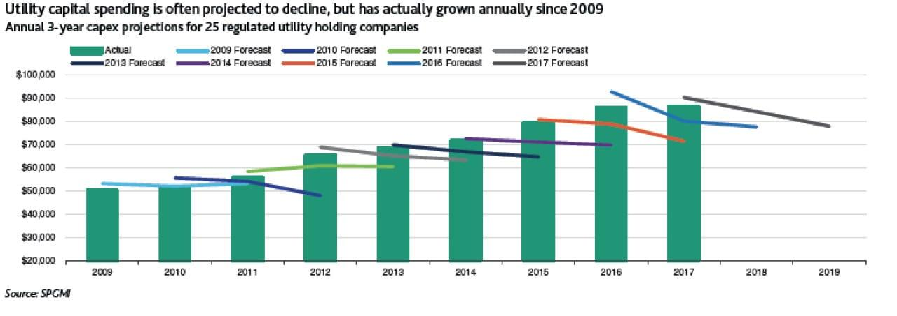

## Table of Contents

## What is a debt-to-equity ratio?

The debt-to-equity ratio is a financial measure that shows how a company uses debt compared to its own money (equity) to run its business. It is calculated by dividing a company's total debt by its total equity. This ratio helps people understand the balance between the money a company owes and the money it owns. A high debt-to-equity ratio means the company relies more on borrowed money, while a low ratio means it uses more of its own money.

This ratio is important for investors and lenders because it tells them about the financial health of a company. If a company has a high debt-to-equity ratio, it might be seen as risky because it has a lot of debt to pay back. On the other hand, a low ratio might show that the company is more stable and less risky. However, what is considered a good or bad ratio can vary depending on the industry and the company's specific situation.

## Why is the debt-to-equity ratio important in financial analysis?

The debt-to-equity ratio is important in financial analysis because it helps people see how a company is balancing the money it borrows with the money it owns. This ratio tells us if a company is using a lot of debt to grow or if it's mostly using its own money. Knowing this helps investors and lenders decide if a company is a good investment or if it's too risky. A high debt-to-equity ratio might mean the company could have trouble paying back its loans, which is risky. A low ratio might mean the company is more stable and safer for investment.

This ratio also helps compare companies within the same industry. Different industries have different norms for what's considered a healthy debt-to-equity ratio. For example, industries that need a lot of money to start, like manufacturing, might have higher ratios than service industries. By looking at the debt-to-equity ratios of similar companies, analysts can see which ones are managing their debt better. This comparison can guide decisions about where to invest or lend money, making the debt-to-equity ratio a key tool in financial analysis.

## How is the debt-to-equity ratio calculated?

The debt-to-equity ratio is calculated by dividing a company's total debt by its total equity. Total debt includes all the money the company owes, like loans and bonds. Total equity is the value of the company's assets minus its liabilities, which is basically the money that belongs to the company's owners or shareholders.

To find the total debt, you add up all the short-term and long-term debts from the company's balance sheet. Short-term debt is what the company needs to pay back within a year, and long-term debt is what it needs to pay back over a longer time. For total equity, you look at the shareholders' equity section on the balance sheet, which shows the net value of the company owned by shareholders. Once you have these two numbers, you divide the total debt by the total equity to get the debt-to-equity ratio.

## What is considered a healthy debt-to-equity ratio in the utilities sector?

In the utilities sector, a healthy debt-to-equity ratio is usually between 1 and 1.5. This means for every dollar of equity, the company has between one and one and a half dollars of debt. The utilities sector often needs a lot of money to build things like power plants and water systems, so it's normal for these companies to have more debt than companies in other industries.

Even though a ratio of 1 to 1.5 is seen as healthy, it can change depending on the specific company and what's happening in the economy. If interest rates are low, utilities might take on more debt because it's cheaper to borrow money. But if rates go up, they might try to keep their debt lower. So, while a ratio between 1 and 1.5 is a good starting point, it's always important to look at the bigger picture.

## How does the debt-to-equity ratio in the utilities sector compare to other sectors?

The debt-to-equity ratio in the utilities sector is often higher than in many other sectors. This is because utilities need a lot of money to build things like power plants and water systems, which they usually borrow. A healthy debt-to-equity ratio for utilities is typically between 1 and 1.5. This means for every dollar of their own money, they have between one and one and a half dollars of borrowed money. This is higher than in sectors like technology or retail, where companies might have ratios around 0.5 or lower because they don't need as much money to start up or run their businesses.

However, the debt-to-equity ratio can vary a lot across different industries. For example, in the real estate sector, a ratio of 2 or more might be common because buying and building properties is expensive. On the other hand, in the tech sector, companies often have lower ratios because they rely more on their own money or investors to grow. So, while a ratio of 1 to 1.5 is normal for utilities, it's important to compare it with what's typical in other sectors to understand if a company's debt level is healthy or not.

## What factors influence the debt-to-equity ratio in the utilities sector?

Several things can change the debt-to-equity ratio in the utilities sector. One big thing is how much money it costs to build things like power plants and water systems. These projects are expensive, so utilities often borrow a lot of money to pay for them. Another thing that can affect the ratio is the [interest rate](/wiki/interest-rate-trading-strategies). If interest rates are low, it's cheaper for utilities to borrow money, so they might take on more debt. But if rates go up, borrowing becomes more expensive, and they might try to keep their debt lower.

The economy also plays a role in the debt-to-equity ratio. When the economy is doing well, utilities might feel more confident about borrowing money because they think they'll make more money to pay it back. But if the economy is not doing well, they might be more careful and try to reduce their debt. Also, rules and regulations from the government can affect how much debt utilities can take on. If there are strict rules about how much debt is allowed, this can keep the debt-to-equity ratio lower.

## How have debt-to-equity ratios in the utilities sector changed over the past decade?

Over the past decade, the debt-to-equity ratios in the utilities sector have generally gone up a bit. This is because utilities need a lot of money to build things like power plants and water systems, and it's been cheaper for them to borrow money. Interest rates have been low for a long time, so utilities have taken on more debt to pay for their big projects. Also, when the economy was doing well, utilities felt more confident about borrowing money because they thought they could make enough money to pay it back.

But the debt-to-equity ratios haven't gone up a lot because there are still rules about how much debt utilities can have. Governments and regulators keep an eye on how much debt utilities take on to make sure they can pay it back and keep providing services. So, even though the ratios have increased, they are still mostly within the healthy range of 1 to 1.5. This shows that utilities are balancing the money they borrow with the money they own to keep their businesses running smoothly.

## What are the implications of a high debt-to-equity ratio for utilities companies?

When a utilities company has a high debt-to-equity ratio, it means they are borrowing a lot of money compared to how much money they own. This can be risky because if something goes wrong, like if interest rates go up or if they can't make enough money to pay back their loans, they could have trouble. A high ratio might make investors and lenders worried because it shows the company might be in a risky spot. If the company can't pay back its debts, it could face big problems, like not being able to keep running or even going bankrupt.

But a high debt-to-equity ratio isn't always bad for utilities companies. If they can borrow money at low interest rates, it might help them build important things like power plants and water systems. These projects can make the company more money in the long run, which can be good for everyone. The key is that the company needs to be able to handle its debt well and make sure it can pay it back. If they can do that, a high ratio might not be a big problem.

## Can a low debt-to-equity ratio be detrimental to utilities companies?

A low debt-to-equity ratio means a utilities company is not borrowing much money compared to the money it owns. This might seem good because it makes the company look less risky. But it can also be a problem. Utilities need a lot of money to build big projects like power plants and water systems. If they don't borrow enough, they might not have the money they need to grow and improve their services. This can make it hard for them to keep up with other companies that are borrowing money to expand.

Also, if a utilities company has a very low debt-to-equity ratio, it might mean they are not taking advantage of low interest rates. When interest rates are low, it's cheaper to borrow money. By not borrowing, the company could be missing out on chances to invest in new projects that could make more money in the future. So, while a low ratio can make a company look stable, it could also stop them from growing and being as successful as they could be.

## How do regulatory environments affect debt-to-equity ratios in the utilities sector?

Regulatory environments play a big role in how much debt utilities companies can take on. Governments and regulators set rules about how much debt is okay for utilities to have. These rules are there to make sure utilities can pay back their loans and keep providing important services like electricity and water. If the rules are strict, utilities might have to keep their debt-to-equity ratios lower, even if they want to borrow more money to build new projects. This can help keep the companies stable but might also limit how much they can grow.

On the other hand, if the regulatory environment is more relaxed, utilities might be able to take on more debt. This can be good because it lets them borrow money to build important things like power plants and water systems. But it can also be risky if they borrow too much and can't pay it back. So, the balance between rules and freedom can really affect how utilities manage their debt and what their debt-to-equity ratios look like.

## What strategies can utilities companies use to manage their debt-to-equity ratios?

Utilities companies can manage their debt-to-equity ratios by carefully planning how much money they borrow and how they use it. One way they can do this is by looking at their projects and deciding which ones are most important. If they have a project that will make a lot of money in the future, it might be worth borrowing more to pay for it. But if the project is risky, they might want to use their own money instead. They can also try to pay off some of their debt faster if they have extra money, which will lower their debt-to-equity ratio and make them look less risky to investors and lenders.

Another strategy is to keep an eye on interest rates. When interest rates are low, it's cheaper to borrow money, so utilities might want to take on more debt during those times. But if they think interest rates will go up soon, they might try to borrow less now and use more of their own money. They can also talk to regulators and try to understand the rules about how much debt they can have. By working with regulators, they can find a balance that lets them grow their business without taking on too much risk.

## How do investors use debt-to-equity ratios to assess the risk and value of utilities companies?

Investors look at the debt-to-equity ratio of utilities companies to see if they are risky or not. A high debt-to-equity ratio means the company is borrowing a lot of money compared to the money it owns. This can make the company seem risky because if they can't pay back their loans, they could have big problems. Investors might be worried about losing their money if the company gets into trouble. On the other hand, a low debt-to-equity ratio can make a company look safer because they are not borrowing as much. But if the ratio is too low, it might mean the company is not growing as fast as it could be, which can also be a problem for investors looking for growth.

The debt-to-equity ratio also helps investors figure out how much a utilities company is worth. If a company has a high ratio, it might be seen as less valuable because of the risk. But if they are using their debt well to build things like power plants that will make more money in the future, investors might still see it as a good investment. A company with a low ratio might be seen as more valuable because it's safer, but investors need to check if the company is using its money wisely to grow. So, investors use the debt-to-equity ratio along with other information to decide if a utilities company is a good investment or not.

## What is the Debt-to-Equity Ratio and How Can It Be Understood?

The debt-to-equity ratio (D/E ratio) is a key financial metric that assesses a company's financial leverage by comparing its total liabilities to its shareholder equity. The formula for calculating the D/E ratio is:

$$
\text{D/E Ratio} = \frac{\text{Total Liabilities}}{\text{Shareholder Equity}}
$$

A high D/E ratio often indicates that a company is aggressively using debt to finance its operations and growth. This can be a double-edged sword. On one hand, leveraging debt can amplify returns on investment, as companies utilize borrowed funds to expand operations or invest in new opportunities. On the other hand, excessive debt levels can pose significant risks if a company cannot meet its financial obligations, especially during economic downturns.

In the utilities sector, companies typically exhibit high D/E ratios. This is attributed to the capital-intensive nature of the industry, where substantial investments are required for infrastructure development, maintenance, and expansion. These investments often involve long-term projects with significant upfront costs, leading utilities companies to rely heavily on debt financing.

Investors and analysts pay particular attention to the D/E ratio as it provides insights into a company's financial structure and risk profile. A high ratio may suggest potential vulnerabilities, especially if interest rates rise or if the company's cash flow generation does not sufficiently cover debt servicing requirements. Conversely, a lower D/E ratio might imply a more conservative approach to financing, potentially offering greater financial stability.

The impact of the D/E ratio on operations within the utilities sector is multifaceted. It influences investor perceptions and can affect a company's cost of capital. Firms with higher leverage might encounter higher interest expenses, reducing profitability margins. Additionally, credit ratings agencies closely monitor these ratios, which can affect the company's ability to raise additional capital or refinance existing debt at favorable terms.

In conclusion, while the D/E ratio is a powerful tool for evaluating financial leverage, its implications must be carefully considered. It is essential to contextualize this ratio within the broader financial landscape of the utilities sector, taking into account other metrics and industry-specific factors that might influence overall financial performance and stability.

## References & Further Reading

[1]: Damodaran, A. (2001). ["Corporate Finance: Theory and Practice"](https://archive.org/details/corporatefinance0000damo_v8d8). Wiley.

[2]: Graham, B. (1949). ["The Intelligent Investor"](https://en.wikipedia.org/wiki/The_Intelligent_Investor). Harper & Row.

[3]: Bodie, Z., Kane, A., & Marcus, A. J. (2014). ["Investments"](https://www.mheducation.com/highered/product/Investments-Bodie.html). McGraw-Hill Education.

[4]: Koller, T., Goedhart, M., & Wessels, D. (2015). ["Valuation: Measuring and Managing the Value of Companies"](https://books.google.com/books/about/Valuation.html?id=fGXjDwAAQBAJ). Wiley.

[5]: Lopez de Prado, M. (2018). ["Advances in Financial Machine Learning"](https://www.amazon.com/Advances-Financial-Machine-Learning-Marcos/dp/1119482089). Wiley.

[6]: Chan, E. P. (2008). ["Quantitative Trading: How to Build Your Own Algorithmic Trading Business"](https://github.com/ftvision/quant_trading_echan_book). Wiley.

[7]: Alexander, C. (2001). ["Market Models: A Guide to Financial Data Analysis"](https://www.casact.org/sites/default/files/old/marketmodels.pdf). Wiley.

[8]: Jansen, S. (2020). ["Machine Learning for Algorithmic Trading: Predictive Models to Extract Signals from Market and Alternative Data for Systematic Trading Strategies with Python"](https://github.com/stefan-jansen/machine-learning-for-trading). Packt Publishing.

[9]: Bernanke, B. S. (1983). ["Non-Monetary Effects of the Financial Crisis in the Propagation of the Great Depression"](https://www.nber.org/papers/w1054). American Economic Review.