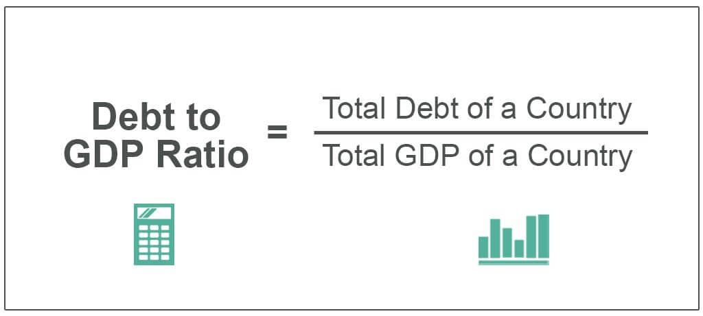

In today's rapidly evolving financial landscape, understanding economic indicators is crucial for investors and policymakers alike. These indicators offer insights into an economy's health and performance, guiding critical decisions and policies. Among these metrics, the Debt-to-GDP ratio stands out as one of the most vital indicators of a country's fiscal health. This ratio provides a snapshot of a nation's debt level in relation to its Gross Domestic Product (GDP), helping to assess the sustainability of its fiscal policies and debt obligations.

The Debt-to-GDP ratio is instrumental in fiscal analysis, serving as a yardstick for determining a country's financial stability and creditworthiness. A lower ratio suggests a country's economy produces enough output to service its debts, while a higher ratio might signal potential financial distress or an over-leveraged economy. As such, understanding and monitoring this ratio is essential for evaluating long-term economic viability and investment risks.



In this article, we will explore the importance of economic indicators, with a focus on the Debt-to-GDP ratio. We will also discuss the role of algorithmic trading in analyzing these indicators to inform investment decisions. Algorithmic trading, which involves the use of automated and high-frequency trading techniques, leverages economic data to enhance decision-making and execution efficiency. By incorporating traditional fiscal analysis with cutting-edge technology, market participants can gain a competitive edge. This integration of economic metrics with advanced trading algorithms presents a frontier of opportunity for institutional and retail investors, enabling them to better anticipate market trends and respond to economic changes swiftly and effectively.

## Table of Contents

## Understanding Economic Indicators

Economic indicators are quantitative statistical measures that provide insights into the economic performance and future forecasts of an economy. They are crucial tools utilized by policymakers, investors, and analysts to interpret and predict economic trends, thereby aiding in informed decision-making.

These indicators are broadly classified into three categories: leading, lagging, and coincident indicators. 

1. **Leading Indicators:** These indicators are designed to predict future economic activities. They typically change before the economy as a whole starts to follow a particular pattern or trend. For instance, stock market returns, which can signal future economic conditions, are considered a leading indicator. Other examples include new business startups and consumer sentiment indices. 

2. **Lagging Indicators:** These indicators reflect the historical performance of an economy, confirming long-term trends rather than predicting new ones. They change after the economy has already begun to follow a particular pattern. Unemployment rates are a classic example of a lagging indicator since they tend to decrease only after the economy has shown signs of improvement.

3. **Coincident Indicators:** These indicators move in tandem with the overall economy, reflecting the current state. Gross Domestic Product (GDP) and industrial production figures are examples of coincident indicators that provide a snapshot of the economic performance at any given point in time.

Key economic indicators include GDP growth rates, unemployment rates, inflation rates, and the Debt-to-GDP ratio. These measures are fundamental in assessing the health and trajectory of an economy:

- The **GDP growth rate** is a primary indicator of economic growth, showing the pace at which a nation's economy is expanding or contracting.
- **Unemployment rates** provide insights into labor market conditions and economic activity; high unemployment may indicate economic distress, whereas low unemployment suggests a robust economy.
- **Inflation rates** measure the rate at which the general level of prices for goods and services is rising and, subsequently, how purchasing power is eroding.
- The **Debt-to-GDP ratio** is a crucial measure used to assess a country's fiscal sustainability. It represents the ratio of a country's public debt to its gross domestic product. A formula to calculate this is:
$$
  \text{Debt-to-GDP Ratio} = \left( \frac{\text{Total National Debt}}{\text{GDP}} \right) \times 100

$$

Understanding these indicators enables investors and analysts to strategize effectively, as they can identify trends, forecast economic conditions, and make informed decisions about investments and policy adjustments. For instance, a rising inflation rate might prompt central banks to increase interest rates, affecting bond prices, while robust GDP growth could signify increased corporate earnings and lead to higher stock valuations. Therefore, economic indicators serve as the backbone for strategic planning and execution in the financial world.

## The Debt-to-GDP Ratio Explained

The Debt-to-GDP ratio is a quintessential parameter for quantifying a nation's fiscal health by comparing its total public debt to its gross domestic product (GDP). Mathematically, this ratio can be expressed as:

$$
\text{Debt-to-GDP Ratio} = \left( \frac{\text{Total Public Debt}}{\text{GDP}} \right) \times 100
$$

A high Debt-to-GDP ratio may signify a heightened level of economic risk, as it suggests that a country may be over-leveraged. This condition increases the probability of default, thereby reducing the country's creditworthiness in international financial markets. On the other hand, a low Debt-to-GDP ratio is often indicative of a country's ability to manage its debt sustainably, reflecting a stronger economic position relative to its debt obligations.

Investors rely heavily on the Debt-to-GDP ratio to evaluate a nation's fiscal stability before committing to purchase its bonds or other debt instruments. A favorable ratio frequently attracts investments, as it signals lower risk and enhances confidence in the country's economic management.

For policymakers, comprehending the intricacies of the Debt-to-GDP ratio is vital for crafting sound fiscal policies. It helps in making decisions regarding optimal levels of borrowing and devising strategies that ensure fiscal prudence. By maintaining an optimal ratio, governments can foster an environment conducive to sustainable economic growth and stability, enabling them to balance expenditure with revenue generation effectively.

## Fiscal Analysis and Decision Making

Fiscal analysis is the comprehensive evaluation of government revenue and expenditure in order to understand and influence a nation's economic performance. It serves as a pivotal tool for governments and policymakers to assess fiscal policies' impact and to design strategies that bolster economic growth and stability. One of the key components in fiscal analysis is the use of economic indicators, with the Debt-to-GDP ratio playing a central role. This ratio helps analysts understand a country's fiscal position by comparing national debt levels to economic output. A clear understanding of this ratio can inform decisions on borrowing, spending, and taxation.

Through fiscal analysis, financial analysts and policymakers can identify inefficiencies within government spending and revenue collection processes. This detailed examination allows for the optimization of budget allocations, ensuring that resources are effectively deployed to areas that need them most. For example, governments might adjust spending in critical sectors such as healthcare or infrastructure to increase their economic multiplier effect.

Additionally, fiscal analysis provides the tools necessary for forecasting future fiscal needs and challenges. By examining trends and potential future economic conditions, such as growth rates, inflation, and unemployment, analysts can create models that predict how current fiscal policies will impact the economy in the long term. These insights are instrumental in formulating policies that are both proactive and responsive to changing economic conditions.

Investors also rely heavily on fiscal analysis to make informed decisions. By understanding the fiscal policies and plans of a government, investors can gauge potential impacts on market stability and economic performance. For instance, if a government is likely to increase public spending, it may signal potential growth opportunities in certain sectors, prompting investors to adjust their portfolios to maximize returns or hedge against risks.

Here is an example of a simple Python function to calculate the Debt-to-GDP ratio, which can be a useful tool in fiscal analysis:

```python
def debt_to_gdp(debt, gdp):
    try:
        ratio = (debt / gdp) * 100
        return ratio
    except ZeroDivisionError:
        return "GDP cannot be zero."

# Example usage
national_debt = 2000000000  # Example debt in currency units
gross_domestic_product = 4000000000  # Example GDP in currency units

ratio = debt_to_gdp(national_debt, gross_domestic_product)
print(f"Debt-to-GDP Ratio: {ratio}%")
```

The process of fiscal analysis not only aids in policy formulation but also provides investors with valuable insights into a government's fiscal health, influencing decisions related to bond markets, currency valuations, and equity investments. By leveraging fiscal analysis, both policymakers and investors can ensure that economic strategies are well-aligned with overall economic objectives, leading to sustained economic growth and stability.

## Algorithmic Trading and Economic Indicators

Algorithmic trading utilizes sophisticated algorithms to execute trades at rapid speeds and in substantial volumes. These algorithms are designed to automate the trading process by making decisions based on predefined criteria. Economic indicators are indispensable in this field as they provide essential data to inform trading strategies. Traders develop complex algorithms that parse and interpret vast amounts of economic data to predict market trends and inform investment decisions.

One of the key aspects of [algorithmic trading](/wiki/algorithmic-trading) is the integration of economic indicators such as GDP growth, employment figures, and inflation rates. Algorithms analyze these indicators to anticipate market movements. For instance, improvements in GDP might signal a strengthening economy, prompting algorithms to increase exposure to equities. Conversely, rising unemployment figures could lead to a more cautious approach, with algorithms shifting investments to safer assets like bonds.

The incorporation of [artificial intelligence](/wiki/ai-artificial-intelligence) (AI) and [machine learning](/wiki/machine-learning) into algorithmic trading systems has significantly advanced the ability to forecast market behaviors. Machine learning models can detect complex patterns in historical data, enabling more accurate predictions. For example, regression models can be used to forecast future price movements based on various economic indicators:

```python
from sklearn.linear_model import LinearRegression
import numpy as np

# Sample data: economic indicators (X) and stock prices (y)
X = np.array([[2.1, 0.5, 1.2], [2.3, 0.6, 1.3], [2.5, 0.7, 1.4]]) # GDP growth, inflation, unemployment
y = np.array([110, 115, 120]) # Stock prices

# Create and train the model
model = LinearRegression()
model.fit(X, y)

# Predict future stock prices based on new economic data
new_data = np.array([[2.6, 0.8, 1.5]])
predicted_price = model.predict(new_data)
```

As economic data becomes increasingly accessible, algorithmic trading systems continually evolve. Enhanced data availability allows for more robust [backtesting](/wiki/backtesting) and fine-tuning of trading strategies. This adaptability ensures that algorithmic trading remains competitive in the dynamic market environment.

In summary, the role of economic indicators in algorithmic trading is pivotal. By leveraging advanced data analysis techniques and machine learning, traders can harness these indicators to make informed, rapid, and efficient trading decisions, maintaining an edge in the financially volatile global markets.

## Leveraging the Debt-to-GDP Ratio in Algorithmic Trading

Incorporating the Debt-to-GDP ratio into trading algorithms allows traders to make more nuanced investment decisions. This metric serves as a critical input for algorithmic models seeking to interpret fiscal health and respond dynamically to economic changes. By integrating this ratio into their algorithms, traders can better assess macroeconomic conditions and adjust their strategies in response to fiscal shifts.

Algorithms can be programmed to react to changes in the Debt-to-GDP ratio by employing machine learning techniques and historical data analysis. For instance, a Python-based algorithm might use the following workflow to influence trading decisions:

```python
import numpy as np
from sklearn.linear_model import LinearRegression

# Mock data: Debt-to-GDP ratio changes and corresponding bond yields
debt_gdp_changes = np.array([[1.5], [2.0], [-1.0], [0.5], [-2.5]])
bond_yields = np.array([3.0, 3.5, 2.5, 3.0, 2.0])

# Linear regression model
model = LinearRegression()
model.fit(debt_gdp_changes, bond_yields)

# Predict bond yield response to a new Debt-to-GDP change
new_change = np.array([[1.0]])
predicted_yield = model.predict(new_change)

print(f"Predicted Bond Yield response: {predicted_yield[0]}")
```

This simplistic model illustrates how changes in the Debt-to-GDP ratio influence bond yields, thus guiding buy or sell decisions.

A deteriorating Debt-to-GDP ratio often signals an increased risk of fiscal distress, potentially triggering sell signals for government bonds in favor of equities, which can offer higher returns in such environments. Conversely, an improving Debt-to-GDP ratio may enhance confidence in a country's fiscal responsibilities, making government securities more attractive due to perceived lower risk.

By leveraging the Debt-to-GDP ratio in algorithmic trading, investors can achieve improved portfolio performance and risk management. An algorithm, for instance, might set thresholds to automatically adjust asset allocations:

```python
def adjust_portfolio(debt_gdp_ratio, threshold=2.0):
    if debt_gdp_ratio > threshold:
        return "Increase Equities, Reduce Bonds"
    else:
        return "Increase Bonds, Reduce Equities"

current_ratio = 3.0
action = adjust_portfolio(current_ratio)
print("Portfolio Adjustment:", action)
```

Such algorithms facilitate timely responses to fiscal instability, allowing for informed strategic shifts. In essence, this approach enhances decision-making, offering traders a robust tool to navigate dynamic financial landscapes effectively. By integrating such economic indicators into trading systems, market participants stand to gain a qualitative edge in managing portfolios amid fluctuating economic conditions.

## Conclusion

The interaction between economic indicators, fiscal analysis, and algorithmic trading equips investors with potent tools to adeptly navigate the complexities of financial markets. A pivotal role is played by the Debt-to-GDP ratio, a key metric for assessing a country's fiscal health. By understanding this ratio, investors can make more informed and strategic investment decisions, evaluating the balance between national debt levels and economic output. As technological advancements continue to progress, the integration of these economic metrics into algorithmic trading systems is becoming increasingly sophisticated.

The growing ability to process and interpret vast volumes of economic data allows investors who utilize these advancements to anticipate market trends more accurately. Algorithmic trading, enriched by machine learning and artificial intelligence, can respond swiftly to economic changes, offering a competitive edge in a dynamic global economy. By capitalizing on these developments, investors are better positioned to mitigate risks and optimize returns.

Ultimately, the key to successful investing lies in staying informed and adaptable. In a global economy marked by [volatility](/wiki/volatility-trading-strategies) and rapid changes, the ability to quickly adjust strategies based on updated economic indicators and fiscal analyses ensures that investors are not only reactive but also proactive in their approach. This adaptability is essential for maintaining resilience and achieving long-term financial goals in the ever-evolving landscape of finance.

## References & Further Reading

[1]: Reinhart, C. M., & Rogoff, K. S. (2009). ["This Time is Different: Eight Centuries of Financial Folly."](https://www.nber.org/system/files/working_papers/w13882/w13882.pdf) Princeton University Press.

[2]: López de Prado, M. (2018). ["Advances in Financial Machine Learning."](https://www.amazon.com/Advances-Financial-Machine-Learning-Marcos/dp/1119482089) John Wiley & Sons.

[3]: Chan, E. P. (2009). ["Quantitative Trading: How to Build Your Own Algorithmic Trading Business."](https://github.com/ftvision/quant_trading_echan_book) John Wiley & Sons.

[4]: Aronson, D. R. (2006). ["Evidence-Based Technical Analysis: Applying the Scientific Method and Statistical Inference to Trading Signals."](https://www.amazon.com/Evidence-Based-Technical-Analysis-Scientific-Statistical/dp/0470008741) John Wiley & Sons.

[5]: Jansen, S. (2020). ["Machine Learning for Algorithmic Trading: Predictive models to extract signals from market and alternative data for systematic trading strategies with Python."](https://www.amazon.com/Machine-Learning-Algorithmic-Trading-alternative/dp/1839217715) Packt Publishing.

[6]: IMF Staff. (2022). ["Fiscal Monitor: Helping People Bounce Back."](https://www.imf.org/en/Publications/FM/Issues/2022/10/09/fiscal-monitor-october-22) International Monetary Fund.

[7]: Stock, J. H., & Watson, M. W. (2003). ["Forecasting Output and Inflation: The Role of Asset Prices."](https://www.princeton.edu/~mwatson/papers/Stock_Watson_JEL_2003.pdf) National Bureau of Economic Research.