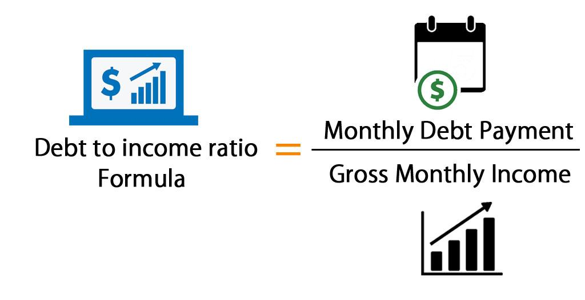

## Table of Contents

## What is the debt-to-income ratio (DTI)?

The debt-to-income ratio (DTI) is a number that shows how much of your monthly income goes towards paying debts. It is calculated by dividing your total monthly debt payments by your gross monthly income. This ratio is important because it helps lenders see if you can handle more debt. A lower DTI means you have more money left over after paying debts, which is good.

Lenders often use DTI to decide if they should give you a loan, like a mortgage or a car loan. Generally, a DTI of 36% or less is considered good. If your DTI is higher, it might be harder to get a loan because it shows you might struggle to make payments. Keeping your DTI low can help you get better loan terms and interest rates.

## Why is the debt-to-income ratio important?

The debt-to-income ratio is important because it shows how much of your money goes to paying debts each month. It helps lenders see if you can afford to take on more debt. If your DTI is low, it means you have more money left over after paying your debts, which is good. Lenders like to see a low DTI because it shows you are less likely to struggle with payments.

A low DTI can help you get better loan terms and interest rates. For example, if you want to buy a house or a car, a lender will look at your DTI to decide if they should give you a loan. If your DTI is high, it might be harder to get a loan because it shows you might have trouble making payments. Keeping your DTI low is a good way to stay financially healthy and make it easier to borrow money when you need it.

## How do you calculate the debt-to-income ratio?

To calculate your debt-to-income ratio, you first need to add up all your monthly debt payments. This includes things like your mortgage or rent, car payments, credit card payments, student loans, and any other regular debt payments you make each month. Once you have this total, you divide it by your gross monthly income. Gross income is the money you earn before taxes and other deductions are taken out.

The result of this division is your debt-to-income ratio, which is usually shown as a percentage. For example, if your total monthly debt payments are $1,500 and your gross monthly income is $5,000, you would divide $1,500 by $5,000 to get 0.30. Multiply this by 100 to turn it into a percentage, which gives you a DTI of 30%. A lower DTI means you have more money left over after paying your debts, which is a good sign to lenders that you can handle more debt if needed.

## What is considered a good debt-to-income ratio?

A good debt-to-income ratio is usually 36% or less. This means that less than 36% of your monthly income goes towards paying your debts. Lenders like to see a low DTI because it shows you have enough money left over after paying your debts. This makes it easier for you to get loans and better interest rates.

If your DTI is higher than 36%, it might be harder to get a loan. A high DTI shows lenders that you might struggle to make payments on a new loan. Keeping your DTI low can help you stay financially healthy and make it easier to borrow money when you need it.

## How does DTI affect loan approvals?

Your debt-to-income ratio, or DTI, is important when you apply for a loan. Lenders look at your DTI to see if you can afford to pay back the loan. A low DTI means you have more money left after paying your debts, which makes lenders feel good about giving you a loan. They think you are less likely to miss payments.

If your DTI is high, it can be harder to get a loan. A high DTI shows lenders that you might struggle to make payments on a new loan because you already spend a lot of your income on other debts. Keeping your DTI low can help you get better loan terms and interest rates, making it easier to borrow money when you need it.

## Can you explain the difference between front-end and back-end DTI?

The front-end DTI and back-end DTI are two ways to look at your debt-to-income ratio. The front-end DTI focuses only on your housing costs, like your mortgage or rent, property taxes, and insurance. Lenders use this to see if you can afford the home you want to buy. If your front-end DTI is too high, it might be hard to get a mortgage because it shows you might struggle to pay for your home.

The back-end DTI looks at all your debts, not just housing costs. This includes credit card payments, car loans, student loans, and any other regular debt payments. Lenders use the back-end DTI to get a full picture of your financial health. They want to see if you can handle all your debts, including a new loan. A lower back-end DTI means you have more money left over after paying all your debts, which is good for getting approved for loans.

## What types of debt are included in the DTI calculation?

The debt-to-income ratio includes all your regular monthly debt payments. This means things like your mortgage or rent, car payments, credit card payments, student loans, and any other loans you have to pay back each month. These are the debts that lenders look at to see if you can handle more borrowing.

Not everything you pay for each month is counted in your DTI. Things like utilities, groceries, and other living expenses are not included. Only the debts that you have to pay back, like loans and credit card payments, are part of your DTI. This helps lenders see how much of your income is already going towards paying off what you owe.

## How often should you check your debt-to-income ratio?

It's a good idea to check your debt-to-income ratio at least once a year. This helps you keep an eye on your financial health and see if you can handle more debt or if you need to cut back. If you're thinking about getting a new loan, like a mortgage or a car loan, you should check your DTI before you apply. This way, you can see if you're likely to get approved and if you need to pay off some debts first.

If your financial situation changes a lot, like if you get a new job, lose your job, or take on new debt, you should check your DTI more often. Big changes can affect how much money you have left after paying your debts. Keeping an eye on your DTI can help you make smart choices about borrowing money and staying financially healthy.

## What steps can be taken to improve a high DTI?

To improve a high debt-to-income ratio, start by paying down your debts. Focus on the debts with the highest interest rates first, like credit cards. This will save you money on interest and help you pay off your debts faster. You can also try to pay more than the minimum payment each month. This will reduce your total debt quicker and lower your DTI.

Another way to improve your DTI is to increase your income. You can do this by getting a second job, asking for a raise at work, or finding ways to earn extra money. More income means your DTI will go down because you're making more money compared to your debts. It's also a good idea not to take on new debt until your DTI is lower. This will help you keep your DTI from getting worse and make it easier to get approved for loans in the future.

## How does DTI impact mortgage applications specifically?

When you apply for a mortgage, your debt-to-income ratio (DTI) is very important. Lenders look at your DTI to see if you can afford the mortgage payments along with your other debts. A good DTI for a mortgage is usually 43% or less. This means that less than 43% of your monthly income goes to paying all your debts. If your DTI is higher than 43%, it might be harder to get a mortgage because it shows you might struggle to make payments.

If your DTI is too high, you can take steps to improve it. You can pay down your debts, especially the ones with high interest rates, to lower your DTI. You can also try to increase your income by getting a second job or asking for a raise at work. By lowering your DTI, you can make it easier to get approved for a mortgage and get better interest rates. Keeping your DTI low is a good way to stay financially healthy and make it easier to buy a home.

## What are the industry standards for DTI across different types of loans?

Different types of loans have different standards for debt-to-income ratio (DTI). For mortgages, a good DTI is usually 43% or less. This means that less than 43% of your monthly income goes to paying all your debts. If your DTI is higher than this, it might be harder to get a mortgage because lenders think you might struggle to make payments. Some mortgage programs, like those backed by the Federal Housing Administration (FHA), might allow a higher DTI, up to 50% in some cases, but a lower DTI is always better.

For other types of loans, like car loans or personal loans, the standards can vary. Lenders usually want to see a DTI of 36% or less for these loans. A lower DTI shows lenders that you have more money left over after paying your debts, which makes them more likely to approve your loan. If your DTI is too high, you might need to pay down some debts or find ways to increase your income before applying for these types of loans. Keeping your DTI low can help you get better loan terms and interest rates across all types of loans.

## How does DTI correlate with financial health and credit scores?

Your debt-to-income ratio (DTI) is important for your financial health. It shows how much of your money goes to paying debts each month. A low DTI means you have more money left over after paying your debts, which is good. This can help you save money, pay for things you need, and stay financially healthy. If your DTI is high, it can be hard to save money or pay for other things because most of your income goes to debt. Keeping your DTI low can help you stay in control of your money and avoid financial stress.

Your DTI also affects your credit score, but not directly. Lenders look at your DTI to see if you can handle more debt, but it's not part of your credit report. If your DTI is high and you struggle to make payments, this can hurt your credit score. Late payments or missing payments can lower your credit score. On the other hand, if you keep your DTI low and make all your payments on time, this can help keep your credit score high. A good credit score can help you get better interest rates and loan terms, which can make it easier to borrow money when you need it.

## What is the Formula and Calculation of the DTI Ratio?

The Debt-to-Income (DTI) ratio is a straightforward calculation that evaluates an individual's financial positioning by comparing their debt obligations to their income. The formula for calculating the DTI ratio is:

$$
\text{DTI Ratio} = \left(\frac{\text{Total Monthly Debt}}{\text{Total Gross Monthly Income}}\right) \times 100
$$

This formula requires two primary components: total monthly debt and total gross monthly income.

**Total Monthly Debt** includes all of an individual’s recurring monthly payments. These typically encompass:

- Mortgage payments
- Car loan obligations
- Credit card minimum payments
- Student loans
- Any other regular financial commitments

Accurately summing these amounts is essential to reflect the true financial burden an individual carries each month.

**Total Gross Monthly Income** accounts for all pre-tax income received monthly. This figure is crucial as it provides the base against which debt payments are compared.

To illustrate the calculation, consider the following hypothetical example:

Imagine a person with:
- A monthly mortgage payment of $1,200
- A car loan payment of $300
- Credit card payments totaling $250

These debts add up to a total monthly debt of $1,750. Suppose their total gross monthly income is $5,500. The DTI ratio calculation would be:

$$
\text{DTI Ratio} = \left(\frac{1,750}{5,500}\right) \times 100 \approx 31.82\%
$$

This resulting ratio of approximately 31.82% suggests a moderate level of debt relative to income, providing insights into financial health. Monitoring and understanding this calculation can aid individuals in assessing their financial status and making informed decisions about spending, borrowing, and investing. Regularly calculating one’s DTI ratio is a proactive step towards maintaining financial well-being.

## What is an example of DTI calculation?

Consider an example where an individual is managing several financial obligations: a monthly mortgage payment of $1,000, a car loan payment of $500, and credit card payments totaling $300. These commitments result in a total monthly debt obligation of $1,800. Suppose this individual has a gross monthly income of $6,000. To determine the Debt-to-Income (DTI) ratio, use the formula:

$$
\text{DTI Ratio} = \left(\frac{\text{Total Monthly Debt}}{\text{Total Gross Monthly Income}}\right) \times 100
$$

Substituting the relevant values into the formula, we have:

$$
\text{DTI Ratio} = \left(\frac{1,800}{6,000}\right) \times 100 = 30\%
$$

This calculation indicates a DTI ratio of 30%, suggesting a manageable level of debt relative to income. A DTI of 30% typically reflects a satisfactory financial standing, with room for further improvement to enhance financial opportunities, such as securing more favorable loan terms or increasing creditworthiness.

Improving the DTI ratio can be achieved through various strategies, such as reducing the monthly debt obligations or increasing the gross monthly income. Lowering the ratio can signal better financial health and potentially unlock more attractive financial opportunities. By consistently monitoring and adjusting financial habits, an individual can maintain or improve their DTI ratio, resulting in enhanced financial positioning.

## References & Further Reading

[1]: ["Consumer Financial Protection Bureau - Debt-to-Income Ratio"](https://www.consumerfinance.gov/ask-cfpb/what-is-a-debt-to-income-ratio-en-1791/) 

[2]: O'Neill, B., Sorhaindo, B., Xiao, J. J., & Garman, E. T. (2005). ["Financially Distressed Consumers: Their Financial Practices, Financial Well‐Being, and Health"](https://psycnet.apa.org/record/2006-11385-007). Journal of Consumer Affairs, 39(1), 148-172.

[3]: ["Algorithmic Trading: A Practitioner's Guide"](https://www.amazon.com/Algorithmic-Trading-Practitioners-Jeffrey-Bacidore/dp/0578715236) by Jeffrey Bacidore

[4]: ["The Intelligent Investor: The Definitive Book on Value Investing"](https://www.amazon.com/Intelligent-Investor-3rd-Ed/dp/0063356724) by Benjamin Graham

[5]: Deephouse, D. L. (2000). ["Media Reputation as a Strategic Resource: An Integration of Mass Communication and Resource-Based Theories"](https://journals.sagepub.com/doi/10.1177/014920630002600602). Journal of Management, 26(6), 1091-1112.