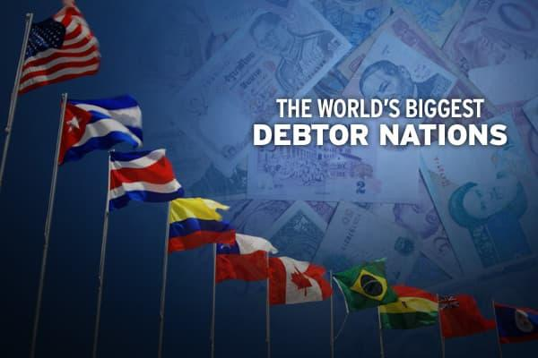

## Table of Contents

## What does the term 'Debtor Nation' mean?

A 'Debtor Nation' is a country that owes more money to other countries than it is owed. This happens when a country borrows more from foreign lenders than it lends out to others. It's like when a person has more loans than savings in the bank. Countries can become debtor nations because they need to borrow money to pay for things like imports, government spending, or to help their economy grow.

Being a debtor nation isn't always bad, but it can create problems. If a country owes a lot of money, it might have to pay back a lot in interest, which can be hard on the economy. It can also make the country's currency weaker compared to other countries. This means that goods from that country might become cheaper for foreigners to buy, but it also means that things from other countries become more expensive for people living in the debtor nation.

## How is a country classified as a debtor nation?

A country becomes a debtor nation when it owes more money to other countries than what it is owed. This happens when a country borrows a lot from other countries or international organizations. The amount of money a country owes is called its 'external debt'. If this external debt is bigger than the money other countries owe it, then the country is a debtor nation.

Being a debtor nation is figured out by looking at a country's balance of payments. This is like a big report that shows all the money coming in and going out of a country. If a country keeps borrowing more money than it is lending out, its balance of payments will show a bigger and bigger debt. When this debt gets too big, the country is called a debtor nation.

## What are the common causes of a country becoming a debtor nation?

A country can become a debtor nation if it spends more money than it earns. This often happens when a country imports a lot of goods from other countries but doesn't export enough of its own goods in return. If a country needs to buy things like oil, food, or technology from other places, it might need to borrow money to pay for these imports. Over time, if the country keeps borrowing more than it can pay back, it turns into a debtor nation.

Another reason a country might become a debtor nation is because of its government's spending. Sometimes, governments spend a lot of money on things like building roads, schools, or hospitals. If the government doesn't have enough money to pay for these projects, it might borrow from other countries or international banks. If the government keeps borrowing without paying back the loans, the country's debt can grow very large, making it a debtor nation.

## Can you explain the difference between a debtor nation and a creditor nation?

A debtor nation is a country that owes more money to other countries than what it is owed. This happens when a country borrows a lot of money from other places to buy things it needs or to spend on big projects. If a country keeps borrowing more than it can pay back, it ends up with a big debt. This can make it hard for the country to manage its money and can affect its economy.

On the other hand, a creditor nation is a country that lends more money to other countries than what it borrows. This means that other countries owe it more money than it owes to them. Being a creditor nation can be good because it means the country is in a strong financial position. It can lend money to other countries and earn interest on those loans, which can help its economy grow.

## What are the economic implications of being a debtor nation?

Being a debtor nation can have several economic challenges. When a country owes a lot of money to other countries, it has to pay back that money with interest. This can be tough because it means the country has less money to spend on important things like schools, hospitals, and roads. It can also make the country's currency weaker compared to other countries. This means that goods from that country might become cheaper for foreigners to buy, but it also means that things from other countries become more expensive for people living in the debtor nation.

On the other hand, being a debtor nation isn't always bad. Sometimes, borrowing money can help a country grow its economy. For example, if a country borrows money to build new factories or improve its roads, it might be able to produce more goods and sell them to other countries. This can help the country earn more money in the long run. However, it's important for the country to manage its debt carefully so that it doesn't end up owing more than it can handle.

## How does being a debtor nation affect a country's currency?

Being a debtor nation can make a country's currency weaker. When a country owes a lot of money to other countries, it might need to sell its currency to get the money it needs to pay back its debts. This can make the currency less valuable compared to other countries' money. When the currency is weaker, it means that goods from that country become cheaper for foreigners to buy, but it also means that things from other countries become more expensive for people living in the debtor nation.

However, a weaker currency isn't always bad. If a country's currency is weaker, it can make its exports cheaper and more attractive to other countries. This can help the country sell more goods abroad and earn more money. But if the currency stays weak for a long time, it can make it hard for the country to buy things it needs from other places, which can slow down its economy.

## What historical examples illustrate the concept of a debtor nation?

One historical example of a debtor nation is the United States in the 1980s. During this time, the U.S. was spending a lot of money on things like defense and importing goods from other countries. It was borrowing a lot of money from other countries, especially Japan and Germany, to pay for these things. By the end of the 1980s, the U.S. owed more money to other countries than what it was owed, making it a debtor nation. This led to a weaker U.S. dollar and made it harder for the country to manage its economy.

Another example is Argentina in the early 2000s. Argentina had been borrowing a lot of money from international lenders to help its economy grow. But it was not able to pay back these loans, and its debt kept growing. In 2001, Argentina defaulted on its debt, which means it couldn't pay back the money it owed. This caused a big economic crisis in the country, with many people losing their jobs and the value of the Argentine peso dropping a lot. Argentina's experience shows how being a debtor nation can lead to serious problems if a country can't manage its debt.

## What are the potential long-term consequences for a debtor nation?

When a country is a debtor nation for a long time, it can face some big problems. One big problem is that it has to keep paying interest on the money it borrowed. This means less money for important things like schools, hospitals, and roads. It can also make the country's money, or currency, weaker. When the currency is weak, it can make things from other countries more expensive for people living in the debtor nation. This can make life harder for people and can slow down the economy.

Another problem is that being a debtor nation can make it hard for the country to borrow more money in the future. If other countries or banks think the debtor nation might not be able to pay back its loans, they might not want to lend more money. This can make it even harder for the country to grow its economy. If the country can't find a way to manage its debt, it might even have to ask for help from international organizations, which can come with strict rules and conditions.

## How do debtor nations manage their international debt?

Debtor nations manage their international debt in different ways. One way is by making deals with the countries or banks they owe money to. They might ask for more time to pay back the money or ask to pay less interest. Sometimes, they can even get some of their debt forgiven, which means they don't have to pay it back at all. This can help them have more money to spend on important things like schools and hospitals.

Another way debtor nations manage their debt is by trying to earn more money. They can do this by selling more of their goods to other countries. If they can make their currency weaker, their goods become cheaper for foreigners to buy. This can help them earn more money to pay back their debts. But they have to be careful because a weak currency can also make things from other countries more expensive for their own people.

Sometimes, debtor nations need help from big international groups like the International Monetary Fund (IMF) or the World Bank. These groups can lend money to debtor nations, but they usually have strict rules. The debtor nation might have to make big changes to its economy, like cutting spending or raising taxes. These changes can be hard for people living in the country, but they can help the country manage its debt and start to grow again.

## What role do international financial institutions play in debtor nations?

International financial institutions like the International Monetary Fund (IMF) and the World Bank play a big role in helping debtor nations. They lend money to these countries to help them pay back their debts and keep their economies going. This money can be very important because it gives debtor nations a way to manage their debt without having to borrow from other countries or banks that might not want to lend to them.

But getting help from these institutions often comes with strict rules. The IMF and World Bank might tell a debtor nation to make big changes to its economy, like cutting spending on things like schools and hospitals, or raising taxes. These changes can be hard for people living in the country, but they are meant to help the country manage its debt better and start to grow again. It's like a doctor giving medicine that might not taste good but can help the patient get better.

## How can a debtor nation transition to a creditor nation?

A debtor nation can start to become a creditor nation by first working on paying back its debts. This means the country needs to earn more money than it spends. One way to do this is by selling more of its goods to other countries. If the country can make its currency weaker, its goods become cheaper for foreigners to buy, which can help it earn more money. The country can use this extra money to pay back its debts little by little. It's also important for the country to be careful with its spending and not borrow more money than it can handle.

Another way a debtor nation can become a creditor nation is by making smart investments. The country can use some of its money to help other countries grow their economies. This means lending money to other countries and earning interest on those loans. Over time, if the country lends out more money than it borrows, it can start to become a creditor nation. It's like turning the tables and becoming the one who helps other countries instead of always needing help. This change can take a long time and needs a lot of hard work, but it can help the country's economy become stronger and more stable.

## What are the current global trends regarding debtor nations?

Right now, there are many countries around the world that are debtor nations. This means they owe a lot of money to other countries or international banks. Some big debtor nations today include the United States, Japan, and many countries in Europe. These countries have been borrowing money to pay for things like imports, government spending, and to help their economies grow. But with so much debt, they have to be careful because paying back the money with interest can be hard on their economies.

There's also a trend where more and more developing countries are becoming debtor nations. Countries in Africa, Latin America, and parts of Asia are borrowing a lot of money to build things like roads, schools, and hospitals. This can help their economies grow, but it can also be risky. If these countries can't pay back their debts, it can cause big problems like economic crises and weak currencies. International organizations like the IMF and World Bank are trying to help these countries manage their debt, but it's a big challenge.

## References & Further Reading

[1]: Reinhart, C. M., & Rogoff, K. S. (2009). ["This Time is Different: Eight Centuries of Financial Folly."](https://www.nber.org/system/files/working_papers/w13882/w13882.pdf) Princeton University Press.

[2]: Lopez de Prado, M. (2018). ["Advances in Financial Machine Learning."](https://www.amazon.com/Advances-Financial-Machine-Learning-Marcos/dp/1119482089) Wiley.

[3]: Aronson, D. R. (2007). ["Evidence-Based Technical Analysis: Applying the Scientific Method and Statistical Inference to Trading Signals."](https://onlinelibrary.wiley.com/doi/book/10.1002/9781118268315) Wiley.

[4]: Hull, J. C. (2015). ["Options, Futures, and Other Derivatives."](https://www.semanticscholar.org/paper/Options%2C-Futures%2C-and-Other-Derivatives-Hull/89bdee500c8623864fc9eb7a471546aa713acc44) Pearson.

[5]: Jansen, S. (2020). ["Machine Learning for Algorithmic Trading: Second Edition."](https://www.amazon.com/Machine-Learning-Algorithmic-Trading-alternative/dp/1839217715) Packt Publishing.

[6]: Chan, E. (2013). ["Algorithmic Trading: Winning Strategies and Their Rationale."](https://github.com/ftvision/quant_trading_echan_book) Wiley.

[7]: Borio, C. (2014). ["The Financial Cycle and Macroeconomics: What Have We Learnt?"](https://www.sciencedirect.com/science/article/pii/S0378426613003063) BIS Working Papers, No. 395, Bank for International Settlements.

[8]: Basu, S., & Paine, S. R. (2018). ["Algorithmic Trading and Quantitative Strategies."](https://www.researchgate.net/publication/345319146_Algorithmic_Trading_and_Strategies) McGraw Hill.