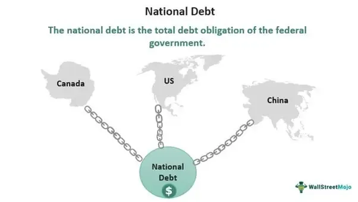

Understanding national debt and its implications on a country's economy is essential for grasping contemporary economic dynamics. National debt represents the total amount that a government owes to creditors, which can be a mixture of domestic and foreign entities. This debt accumulates over time due to budgetary deficits, where government expenditures exceed revenues, necessitating borrowing through the issuance of government securities like bonds.

In recent decades, the term "debtor nations" has been frequently used to describe countries with substantial national debt relative to their Gross Domestic Product (GDP). These nations face complex economic scenarios as their ability to invest in growth and welfare programs often gets hampered by high debt servicing requirements. Furthermore, a high debt-to-GDP ratio can raise concerns over a country's creditworthiness, impacting its access to capital markets and increasing borrowing costs.



In this article, we will examine both the constraints and opportunities presented by national debt and the designation of debtor nations. A particular focus will be given to modern financial technologies, with an emphasis on algorithmic trading. Algorithmic trading, which uses computer algorithms to execute trading strategies, has transformed financial markets by increasing efficiency and liquidity but has also introduced volatility and systemic risks.

We will explore how algorithmic trading could potentially mitigate some challenges faced by heavily indebted nations, such as optimizing borrowing strategies and enhancing market stability through improved pricing mechanisms. Conversely, we'll assess how it could exacerbate issues, possibly leading to increased market volatility or capital flight, which can be detrimental to a nation's economic stability.

This article intends to provide a comprehensive overview for economists, policymakers, and investors. By understanding the intricate relationship between national debt and algorithmic trading, stakeholders can make informed decisions and formulate strategies that leverage technology to improve economic outcomes, manage risks, and ultimately foster sustainable growth amidst these modern financial challenges.

## Table of Contents

## Understanding National Debt and Debtor Nations

National debt, often referred to as government debt or public debt, is the total amount of money that a government owes to creditors. This debt is accumulated through various mechanisms, primarily through the issuance of government securities such as bonds or treasury bills. When a government's expenditures exceed its revenues, it results in a budget deficit, which is typically financed by borrowing. The accumulation of these borrowings over time constitutes the national debt.

### Characteristics of Debtor Nations

Debtor nations are countries with significant national debt relative to their Gross Domestic Product (GDP). These nations borrow to finance their activities and investments, often because their domestic revenues are insufficient. Characteristics of debtor nations include high debt-to-GDP ratios, reliance on foreign investment, and susceptibility to external financial pressures. Examples of debtor nations vary over time but historically include countries like Greece, Japan, and Italy.

### Impact of High Debt-to-GDP Ratios

The debt-to-GDP ratio is a crucial indicator used to assess a country's fiscal health and its ability to repay debt. A high ratio suggests that a country might struggle to meet its debt obligations without resorting to additional borrowing or austerity measures. On a global scale, elevated debt-to-GDP ratios can lead to decreased investor confidence, affecting international lending rates and capital flows. It can also trigger broader economic instability if countries with a high ratio are significant participants in global trade and finance.

### Influence on Credit Rating and Borrowing Costs

A country's status as a debtor nation directly affects its credit rating, which is an assessment of creditworthiness assigned by rating agencies like Standard & Poor's, Moody's, and Fitch. A high level of national debt can lead to a downgrade of the credit rating, increasing the cost of borrowing as lenders demand higher interest rates to compensate for the perceived risk. This situation can create a vicious cycle—degraded credit ratings lead to higher borrowing costs, which further strain national budgets.

### Socio-Economic Repercussions

The socio-economic repercussions of substantial national debt are profound. Governments with large debt burdens may be forced to implement austerity measures, cutting public expenditure to regain fiscal stability. These measures often affect social programs, healthcare, and education, leading to public discontent and decreased quality of life for citizens. High national debt can also limit a country's ability to respond to economic crises, reducing the flexibility needed to implement necessary fiscal policies. Such constraints can impede long-term economic growth and development, impacting welfare and prosperity at the individual and national levels.

## Economics of National Debt Management

National debt management is a pivotal area of economic policy that involves various strategies and tools aimed at maintaining fiscal stability. Traditional methods employed by governments include austerity measures, borrowing, and strategies to foster economic growth. Austerity involves reducing public spending and increasing taxes to decrease budget deficits. Although effective in the short-run, austerity can lead to economic contraction and social unrest, as public welfare programs and investments are often curtailed.

Borrowing is another common strategy, allowing governments to finance expenditure without immediate tax increases. However, excessive borrowing may lead to a high debt-to-GDP ratio, challenging future fiscal policy choices and potentially raising borrowing costs. Economic growth strategies are focused on increasing output and, as a result, tax revenues, alleviating debt burdens over time. Yet, these strategies often require upfront investment and can be hampered by structural economic weaknesses.

Fiscal and monetary policies are critical in managing national debt. Fiscal policy involves government spending and tax decisions that directly affect national debt levels. Governments may opt to increase taxes or reduce spendings, such as subsidies or public wage bills, to manage debt. On the other hand, monetary policy, managed by a country's central bank, can influence debt management indirectly. By adjusting interest rates and controlling money supply, central banks can impact inflation and, therefore, the real value of debt. For example, in a low-interest-rate environment, borrowing costs decrease, which can make existing debt more manageable.

International financial institutions, such as the International Monetary Fund (IMF) and the World Bank, play a substantial role in aiding debtor nations through financial loans and policy advice. These institutions often attach conditions to their aid, promoting structural reforms aimed at long-term fiscal sustainability. While this guidance can lead to improved governance and macroeconomic stability, it often requires politically challenging adjustments and can result in reduced national policy autonomy.

Balancing short-term political decisions with long-term economic sustainability is a complex task for policymakers. Political leaders may prefer policies that provide immediate economic relief or popularity, such as tax cuts or increased spending, despite potential long-term fiscal risks. However, sustainable debt management necessitates a focus on long-term impacts and structural reforms, despite potential short-term unpopularity.

Historical case studies offer valuable insights into debt management strategies. For instance, Canada successfully reduced its debt in the 1990s through stringent fiscal discipline and public sector reforms, leading to a period of sustained economic growth and debt-reduction. Conversely, Greece's experience in the aftermath of the global financial crisis illustrates the consequences of delayed reforms and excessive borrowing, resulting in severe austerity measures and a protracted economic downturn.

These examples underscore the importance of timely and strategic economic policy decisions in debt management. Effective debt management requires a multidimensional approach, integrating fiscal discipline, growth-oriented policies, and international cooperation to maintain economic stability and prevent crises.

## The Evolution of Algorithmic Trading

Algorithmic trading, often referred to as algo trading, is a method of executing trades using automated, pre-programmed trading instructions accounting for variables such as time, price, and [volume](/wiki/volume-trading-strategy). The primary aim of [algorithmic trading](/wiki/algorithmic-trading) is to leverage the speed and efficiency of computers to execute large orders that would be impractical to achieve manually. This technology has revolutionized modern financial markets by enhancing [liquidity](/wiki/liquidity-risk-premium), reducing transaction costs, and minimizing human error.

**Basic Principles and Strategies**

Algorithmic trading operates on several core principles. At its foundation, it uses algorithms to identify opportunities for trade, typically based on quantitative models. Common strategies include:

1. **Trend Following**: Algorithms detect and follow market trends by analyzing historical data.

2. **Arbitrage**: The algorithm identifies price discrepancies between different markets to buy low and sell high.

3. **Market Making**: This involves placing simultaneous buy and sell orders to capture the bid-ask spread.

4. **Statistical Arbitrage**: Employs statistical methods to trade a portfolio of securities, aiming to exploit mean-reversion.

5. **Mean Reversion**: Assumes prices will revert to a mean value and involves buying undervalued and selling overvalued securities.

**Technologies Driving Algorithmic Trading**

The evolution of algorithmic trading is heavily reliant on advancements in technology, particularly:

- **Machine Learning and Artificial Intelligence**: These technologies allow for the creation of adaptive algorithms that learn from data, improving their trading strategies over time. Python libraries like TensorFlow and PyTorch facilitate the development of such models.

- **High-Frequency Trading (HFT)**: Characterized by executing a large number of orders at extremely high speeds, HFT requires cutting-edge hardware and networking solutions to minimize latency. 

```python
# Example of a simple moving average crossover strategy
import numpy as np
import pandas as pd

# Sample data for stock prices
data = {'Price': [120, 121, 122, 124, 123, 125, 126, 127, 128, 129]}
df = pd.DataFrame(data)

# Calculate two moving averages
short_window = 3
long_window = 5

df['Short_MA'] = df['Price'].rolling(window=short_window, min_periods=1).mean()
df['Long_MA'] = df['Price'].rolling(window=long_window, min_periods=1).mean()

df['Signal'] = np.where(df['Short_MA'] > df['Long_MA'], 1, 0)  # Buy signal
df['Position'] = df['Signal'].diff()  # Entry point

print(df)
```

**Beyond Equities: Bonds and Forex**

Initially popular in equity markets, algorithmic trading has broadened its impact to encompass bonds and foreign exchange ([forex](/wiki/forex-system)) markets. This expansion has facilitated improved pricing mechanisms, heightened market efficiency, and increased transparency beyond traditional stock exchanges.

**Regulatory Challenges and Ethical Considerations**

The rise of algorithmic trading presents significant regulatory challenges and ethical considerations. A primary concern is market manipulation, where entities might use algorithms to influence market prices unfairly. Furthermore, the occurrence of flash crashes — extremely rapid market sell-offs — raises questions about market stability. Regulators are tasked with developing frameworks that ensure fairness and stability while encouraging innovation. 

The ethical implications of employing algorithms in trading also raise questions about the extent of human oversight required to ensure these systems do not perpetuate biases or make decisions that could harm market participants.

In conclusion, while algorithmic trading continues to transform the financial landscape by offering increased efficiency and lower costs, it necessitates careful consideration of the accompanying regulatory and ethical challenges to ensure it serves the broader economic system responsibly.

## Interplay Between National Debt and Algorithmic Trading

Algorithmic trading, a key component of modern financial markets, significantly impacts a nation's debt markets by influencing the trading of government securities and bonds. Through advanced algorithms and high-frequency trading ([HFT](/wiki/high-frequency-trading-strategies)), it provides enhanced liquidity and efficiency, potentially reducing borrowing costs for debtor nations. By rapidly processing vast amounts of data and executing trades at speeds beyond human capability, algorithmic trading contributes to more competitive pricing of government bonds, which can either stabilize or destabilize debt markets, depending on various market conditions and constraints.

The role of algorithmic trading in managing and optimizing government securities lies in its ability to execute complex trading strategies that maximize returns and minimize risks. These algorithms utilize a variety of data inputs, from macroeconomic indicators to market sentiment analyses, optimizing portfolio allocation in real-time. An optimized portfolio can help stabilize government bond markets by ensuring a steady demand for securities, enhancing the government's ability to finance its debt at favorable terms.

Several case studies illustrate the tangible influence of algorithmic trading on national debt interest rates and investor confidence. For instance, during periods of market [volatility](/wiki/volatility-trading-strategies), algorithmic trading systems can quickly adjust to new information, alleviating panic by providing liquidity. Conversely, there have been instances where HFT exacerbated market distortions, leading to sharp spikes in volatility. For example, the "flash crash" of 2010, although primarily associated with equities, highlighted the systemic risks posed by algorithmic trading to financial stability, including bond markets.

The specific risks associated with high-frequency trading in bond markets for debtor nations include transient liquidity disruptions and increased volatility. HFT can lead to a concentration of trading activity, where only a few players dominate the market, potentially manipulating prices. Such scenarios could heighten the financial vulnerabilities of debtor nations by making their debt markets more susceptible to rapid capital outflows in reaction to economic shocks.

However, algorithmic trading presents nations with opportunities to leverage these technologies for improving financial positions and managing debt effectively. By integrating algorithmic trading platforms within national debt management frameworks, governments can achieve greater transparency and efficiency in bond issuance processes. This integration allows for real-time monitoring and adjustment of debt strategies in accordance with market dynamics, leading to more sustainable debt management practices.

Moreover, governments can collaborate with leading financial institutions to harness algorithmic innovations, neutralizing potential HFT risks while ensuring robust regulatory frameworks to maintain market integrity. Strategic deployment of algorithmic trading in debt markets necessitates effective oversight mechanisms to prevent abuse and ensure that it serves the broader economic objectives of stability and growth for debtor nations.

In conclusion, while algorithmic trading offers substantial benefits in optimizing and managing national debt, it also poses significant challenges that require diligent oversight and strategic implementation. By carefully integrating algorithmic solutions with traditional debt management strategies, nations can enhance their financial resilience and improve economic outcomes.

## Opportunities and Challenges Ahead

Algorithmic trading offers several opportunities for debtor nations striving for efficient debt management. One primary advantage is the capability to optimize the trading of government securities and bonds. Algorithms can analyze vast amounts of financial data to identify patterns and trends that human traders might overlook. This can lead to more effective timing in the buying and selling of government bonds, potentially reducing interest costs and increasing bond yield. For debtor nations, lower borrowing costs directly translate to reduced debt servicing burdens, facilitating more sustainable debt management practices.

Furthermore, algorithmic trading enables increased liquidity in national debt markets. High-frequency trading (HFT), a subset of algorithmic trading, can enhance market efficiency by narrowing the spread between bid and ask prices. This increased liquidity can attract more investors to a country's securities, improving demand and stabilizing the debt market. Enhanced liquidity is particularly beneficial in times of economic uncertainty, as it ensures continued access to capital markets for debtor nations.

Despite these opportunities, integrating algorithmic trading into national debt markets presents significant challenges. One major concern is the regulatory environment required to manage algorithmic trading's inherent risks, such as market manipulation and flash crashes. Effective regulation is crucial to mitigate these risks and build investor confidence. Regulators must establish clear guidelines and monitoring systems to oversee algorithmic trading activities, ensuring market integrity and stability. This process requires considerable resources and international collaboration, as algorithmic trading often transgresses national boundaries.

Technology is continuously advancing, offering innovations that could reshape the economic landscape for debtor nations. Machine learning and [artificial intelligence](/wiki/ai-artificial-intelligence) (AI) are increasingly being integrated into algorithmic trading systems, enabling more sophisticated analysis and decision-making capabilities. These technologies can anticipate market movements and adapt to changing conditions in real-time, enhancing trading efficiency. However, the rapid pace of technological advancement poses challenges, as it requires ongoing investment in infrastructure and expertise to stay competitive and secure in the digital economy.

Algorithmic trading's potential to influence global economic shifts cannot be underestimated. As it becomes more prevalent, traditional trading practices are being transformed, and new market dynamics emerge. This evolution necessitates strategic planning and international cooperation. Debtor nations must assess the potential impact of algorithmic trading on their debt management strategies and adapt accordingly. Collaboration with other countries and international financial institutions can help standardize best practices, share insights, and address common challenges.

In conclusion, algorithmic trading offers promising opportunities for debtor nations seeking to manage their national debt more efficiently. However, the successful integration and regulation of these technologies are vital to mitigating associated risks. By embracing technological advancements and fostering international cooperation, debtor nations can leverage algorithmic trading's benefits while ensuring economic stability and growth.

## Conclusion

National debt remains a critical issue for many countries, impacting their economic stability and growth potential. Understanding the dynamics of national debt and the status of debtor nations is essential for devising effective strategies for economic management. The intersection of national debt management and algorithmic trading presents both challenges and opportunities that deserve careful consideration.

Algorithmic trading has revolutionized financial markets by enabling rapid, data-driven decision-making processes that significantly affect debt markets. The integration of such advanced technologies into traditional economic systems exemplifies the broader interconnectedness between modern economic forces and technological advancements. The application of [machine learning](/wiki/machine-learning) and high-frequency trading in managing national debt offers the potential to optimize government securities and bonds, thereby influencing interest rates and investor confidence. However, these benefits come with associated risks, such as increased market volatility and the potential for systemic shocks, especially in bond markets for debtor nations.

As financial technologies continue to evolve, there is an urgent need for innovative approaches to national debt management. Policymakers, economists, and investors must weigh the potential advantages of algorithmic trading against its risks. Strategic planning and comprehensive regulations are crucial to ensure that the integration of these technologies supports economic stability and growth rather than undermines it. By fostering an environment that encourages responsible innovation, nations can better manage complex debt situations and leverage financial technologies effectively.

In conclusion, the future of national debt management will be increasingly shaped by algorithmic trading and other technological advances. Continuous research and adaptation are vital for debtor nations to harness the benefits while minimizing risks. As financial landscapes shift, collaborative efforts among international stakeholders will be essential to maintain stability and promote sustainable economic growth.

## References & Further Reading

[1]: Reinhart, C. M., & Rogoff, K. S. (2009). ["This Time is Different: Eight Centuries of Financial Folly."](https://www.nber.org/system/files/working_papers/w13882/w13882.pdf) Princeton University Press.

[2]: Lopez de Prado, M. (2018). ["Advances in Financial Machine Learning."](https://www.amazon.com/Advances-Financial-Machine-Learning-Marcos/dp/1119482089) Wiley.

[3]: Aronson, D. R. (2007). ["Evidence-Based Technical Analysis: Applying the Scientific Method and Statistical Inference to Trading Signals."](https://onlinelibrary.wiley.com/doi/book/10.1002/9781118268315) Wiley.

[4]: Hull, J. C. (2015). ["Options, Futures, and Other Derivatives."](https://www.semanticscholar.org/paper/Options%2C-Futures%2C-and-Other-Derivatives-Hull/89bdee500c8623864fc9eb7a471546aa713acc44) Pearson.

[5]: Jansen, S. (2020). ["Machine Learning for Algorithmic Trading: Second Edition."](https://www.amazon.com/Machine-Learning-Algorithmic-Trading-alternative/dp/1839217715) Packt Publishing.

[6]: Chan, E. (2013). ["Algorithmic Trading: Winning Strategies and Their Rationale."](https://github.com/ftvision/quant_trading_echan_book) Wiley.

[7]: Borio, C. (2014). ["The Financial Cycle and Macroeconomics: What Have We Learnt?"](https://www.sciencedirect.com/science/article/pii/S0378426613003063) BIS Working Papers, No. 395, Bank for International Settlements.

[8]: Basu, S., & Paine, S. R. (2018). ["Algorithmic Trading and Quantitative Strategies."](https://www.researchgate.net/publication/345319146_Algorithmic_Trading_and_Strategies) McGraw Hill.