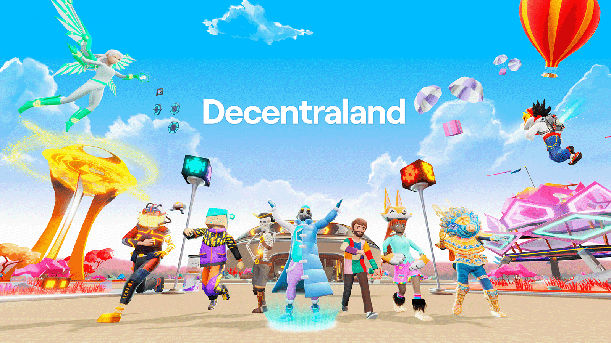

## Table of Contents

## What is Decentraland?

Decentraland is a virtual world on the internet where people can buy, sell, and build on pieces of land. It's like a big online game, but instead of just playing, you can own parts of the world. The land in Decentraland is made up of small squares called parcels, and each parcel can be bought using a special kind of money called cryptocurrency. Once you own a parcel, you can build anything you want on it, like houses, shops, or even games for others to play.

The world of Decentraland is run by a computer program called the blockchain, which keeps track of who owns what and makes sure everything is fair. This means there's no one big boss controlling the world; instead, it's controlled by the people who use it. In Decentraland, you can explore different places, meet other people, and even make money by creating things that others enjoy. It's a fun and creative place where the possibilities are endless.

## How does Decentraland work?

Decentraland is a virtual world that you can visit on the internet. It's like a big playground where you can walk around and see what others have built. Everything in Decentraland is made up of small pieces of land called parcels. You can buy these parcels using a special kind of money called cryptocurrency. Once you own a parcel, you can build anything you want on it, like a house, a shop, or even a game for others to play.

The world of Decentraland runs on a computer program called the blockchain. This program keeps track of who owns which parcels and makes sure everything is fair. There's no one person in charge of Decentraland; instead, it's controlled by everyone who uses it. This means that you can explore, meet other people, and even make money by creating things that others enjoy. It's a fun and creative place where you can do almost anything you can imagine.

## What can you do in Decentraland?

In Decentraland, you can explore a big virtual world where people from all over the world come to play and build things. You can walk around and visit different places, like shops, games, and art galleries. If you own a piece of land, you can build your own creations on it, like a house or a fun game for others to enjoy. You can also meet other people and chat with them, making new friends from different parts of the world.

Another fun thing you can do in Decentraland is to buy and sell things using special money called [cryptocurrency](/wiki/cryptocurrency). If you build something cool, other people might want to buy it from you, and you can earn more cryptocurrency. You can also go to events like concerts or parties that happen in the virtual world. There's always something new to see and do, making Decentraland a fun and exciting place to spend time.

## How do you get started with Decentraland?

To get started with Decentraland, you first need to visit their website and download the software, which is called a browser. Once you have the browser installed on your computer, you can open it and enter the virtual world of Decentraland. You'll start by creating an avatar, which is like a character that represents you in the world. You can choose how your avatar looks and customize it to make it unique.

Once you're in Decentraland, you can start exploring. You can walk around and visit different places, like shops or games that other people have built. If you want to own a piece of land, you'll need to buy it using cryptocurrency. You can get cryptocurrency from special websites called exchanges, where you can trade regular money for cryptocurrency. After you have some cryptocurrency, you can use it to buy land in Decentraland and start building your own creations.

## What is the native cryptocurrency of Decentraland and how is it used?

The native cryptocurrency of Decentraland is called MANA. It's a special kind of money that you can use only in Decentraland. MANA is used to buy land in the virtual world. Each piece of land, called a parcel, can be bought with MANA. Once you own a parcel, you can build anything you want on it, like a house or a game for others to play.

MANA can also be used to buy things from other people in Decentraland. If someone builds something cool, like a fun game or a nice piece of art, you can use MANA to buy it from them. This way, people can earn MANA by creating things that others enjoy. MANA makes it possible for everyone in Decentraland to trade and build together, making the virtual world a fun and creative place.

## How are land and assets owned in Decentraland?

In Decentraland, land and assets are owned by people who use a special kind of money called cryptocurrency. The land is divided into small squares called parcels, and you can buy these parcels using MANA, which is the cryptocurrency used in Decentraland. Once you buy a parcel, you own it, and you can build anything you want on it, like a house or a game. Ownership is recorded on a computer program called the blockchain, which keeps track of who owns what and makes sure everything is fair.

Assets in Decentraland can also be owned and traded. These assets can be anything from buildings and games to art and clothing for your avatar. If you create something cool, you can sell it to other people using MANA. When you buy or sell an asset, the ownership is also recorded on the blockchain, ensuring that everyone knows who owns what. This system of ownership makes Decentraland a place where you can truly own and trade virtual items, just like in the real world.

## What is the significance of the Decentraland DAO?

The Decentraland DAO, or Decentralized Autonomous Organization, is a special group that helps run Decentraland. It's made up of people who own land in Decentraland and they get to vote on important decisions about how the world should work. This means that everyone who owns land can have a say in things like new features or rules, making Decentraland a place where the community decides what happens.

The DAO is important because it makes Decentraland a fair place. Instead of one person or company being in charge, the DAO lets the people who use Decentraland make the decisions. This keeps the virtual world open and fun for everyone, and it helps make sure that changes to the world are good for the whole community.

## How does Decentraland ensure security and privacy for its users?

Decentraland uses a special computer program called the blockchain to keep everything safe and private. The blockchain is like a big, shared notebook that keeps track of who owns what in Decentraland. Because it's shared with many people, it's very hard for anyone to change or cheat the system. This means your land and things you own are safe because the blockchain makes sure no one can take them without your permission.

For privacy, Decentraland lets you decide how much information you want to share. You can choose to be anonymous, which means other people won't know who you are in real life. You can also set up your own rules for who can visit your land or see what you're doing. This way, you can enjoy the virtual world without worrying about your privacy being invaded.

## What are the technical requirements for running Decentraland?

To run Decentraland, you need a computer that can handle a lot of information. You'll need a good internet connection, and your computer should have at least 8GB of RAM. It's also important to have a graphics card that can handle 3D graphics well, like an NVIDIA GTX 1050 or better. If your computer is too old or slow, you might have trouble exploring the virtual world smoothly.

You also need to download the Decentraland browser, which is special software that lets you visit the virtual world. This browser needs some space on your computer, so make sure you have enough free storage. Once you have everything set up, you can start exploring, building, and having fun in Decentraland.

## How does Decentraland integrate with other blockchain technologies?

Decentraland uses a special kind of computer program called the Ethereum blockchain to keep everything safe and fair. This blockchain helps track who owns what in Decentraland, like pieces of land or things you can buy. It's like a big shared notebook that everyone can see, but no one can change without permission. By using Ethereum, Decentraland can connect with other things built on the same blockchain, making it easier for people to use their special money, called cryptocurrency, across different places.

Decentraland also works with other blockchain technologies to make the virtual world even better. For example, it uses a technology called InterPlanetary File System (IPFS) to store and share big files like pictures or videos. This helps keep the virtual world running smoothly and makes it easier for people to build and share things. By connecting with other blockchains, Decentraland can grow and offer new ways for people to enjoy the virtual world.

## What are the future developments planned for Decentraland?

Decentraland is always working on new things to make the virtual world better. One big plan is to make it easier for people to create and share things. They want to add new tools that help people build cool stuff, like houses or games, without needing to know a lot about computers. They also want to make it easier for people to find and visit interesting places in Decentraland, so they're working on better maps and ways to search for things.

Another important plan is to make Decentraland work better with other virtual worlds and games. They want to connect with other places so that you can use your special money, called cryptocurrency, in more places. They're also looking at new ways to use the blockchain to keep everything safe and fair. By doing these things, Decentraland hopes to make the virtual world a fun and exciting place for more people to enjoy.

## How does Decentraland compare to other virtual worlds or metaverse platforms?

Decentraland is special because it lets people own land and build things in a virtual world. Unlike other virtual worlds where a company owns everything, in Decentraland, you can buy land using special money called cryptocurrency. This means you truly own your piece of the virtual world and can build anything you want on it. Other platforms like Roblox or Minecraft let you create things too, but you don't own the land. In Decentraland, the world is run by the people who use it, not by one big company.

Another big difference is how Decentraland uses the blockchain to keep everything safe and fair. The blockchain is like a big shared notebook that keeps track of who owns what, and it's hard for anyone to cheat or change it. This makes Decentraland a secure place where you can trust that your things are safe. Other virtual worlds might not use the blockchain, so they might not be as secure or give you the same feeling of ownership. Decentraland also works with other blockchain technologies, which can make it easier to use your special money in different places.

## References & Further Reading

[1]: Franke, J., Härdle, W. K., & Hafner, C. M. (2019). ["Introduction to the Theory of Algorithms."](https://link.springer.com/book/10.1007/978-3-030-13751-9) In Statistics of Financial Markets. Springer.

[2]: Nakamoto, S. (2008). ["Bitcoin: A Peer-to-Peer Electronic Cash System."](https://nakamotoinstitute.org/library/bitcoin/) 

[3]: Swan, M. (2015). ["Blockchain: Blueprint for a New Economy."](https://dl.acm.org/doi/book/10.5555/3006358) O'Reilly Media.

[4]: Tapscott, D., & Tapscott, A. (2016). ["Blockchain Revolution: How the Technology Behind Bitcoin Is Changing Money, Business, and the World."](https://archive.org/details/blockchainrevolu0000taps) Penguin Random House.

[5]: Van Der Aalst, W. (2016). ["Process Mining: Data Science in Action."](https://link.springer.com/book/10.1007/978-3-662-49851-4) Springer.

[6]: Wood, G. (2014). ["Ethereum: A Secure Decentralized Generalized Transaction Ledger."](https://ethereum.github.io/yellowpaper/paper.pdf) Ethereum Project Yellow Paper.