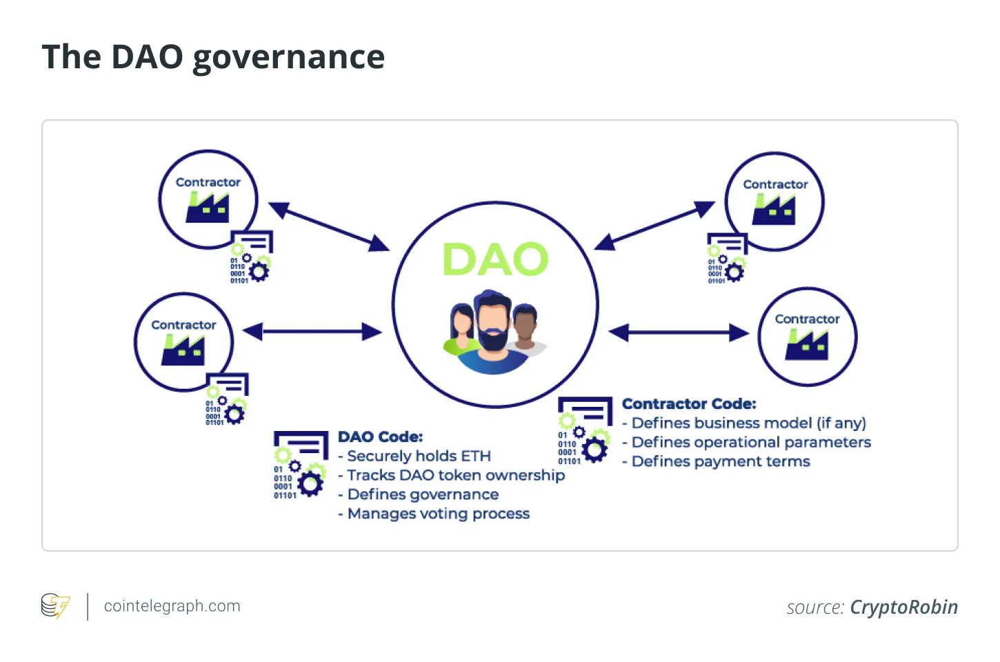

## Table of Contents

## What is a Decentralized Autonomous Organization (DAO)?

A Decentralized Autonomous Organization (DAO) is a type of organization that runs on the internet and is managed by computer code instead of people. It uses blockchain technology, like the one used by cryptocurrencies such as Bitcoin and Ethereum, to make decisions and manage its operations. This means that instead of having a boss or a board of directors, a DAO follows rules that are written into its code, which everyone can see and agree on.

In a DAO, members can vote on important decisions, like how to spend the organization's money or what projects to work on. These votes are recorded on the blockchain, making the process transparent and hard to change. This way, a DAO can operate without needing a central authority, making it more democratic and less prone to corruption. However, because it relies on technology, it can also face challenges like hacking and bugs in the code.

## How does a DAO differ from traditional organizations?

A DAO is different from traditional organizations because it doesn't have a boss or a central group making decisions. Instead, it uses computer code on the internet to run things. This code is on a blockchain, which is like a public record that anyone can see. In a traditional organization, people like managers or a board of directors make the rules and decisions. But in a DAO, everyone who is part of it can vote on what to do next, making it more like a big group project where everyone has a say.

Another big difference is how money and resources are managed. In a traditional organization, money is controlled by people at the top, like a CEO or finance team. They decide how to spend it. In a DAO, the money is controlled by the rules in the code, and members vote on how to use it. This can make things more fair and open, but it also means that if there's a problem with the code, it could affect the whole organization. Traditional organizations might be slower to change but can fix problems more easily because they have people in charge who can make quick decisions.

## What is the primary purpose of a DAO?

The main goal of a DAO is to let a group of people work together without needing a boss or a central office telling them what to do. Instead, a DAO uses special computer rules that everyone agrees on. These rules are written in code and stored on a blockchain, which is like a big public notebook that keeps track of everything. This way, everyone can see what's happening and can vote on big decisions, like how to spend money or what projects to work on.

Because a DAO doesn't have a central boss, it can be more fair and open. Everyone gets a say in what happens, and the rules are clear for everyone to see. But, it also means that if there's a problem with the code, it can be hard to fix because there's no one person in charge. Still, the main idea of a DAO is to let people work together in a way that's more democratic and less likely to be controlled by just a few people at the top.

## How are decisions made within a DAO?

In a DAO, decisions are made by the people who are part of it. Everyone gets to vote on big choices, like how to use the group's money or what projects to work on. These votes are done using the internet and are recorded on a blockchain, which is like a big public notebook that everyone can see. This way, the process is open and fair, and it's hard for anyone to cheat or change the votes.

The rules for making decisions are written in the DAO's code. This code is like a set of instructions that everyone agrees to follow. If someone wants to suggest a new idea or change something, they can make a proposal. Then, everyone in the DAO can vote on it. If most people agree, the proposal gets approved, and the DAO follows the new rule or starts the new project. This way, a DAO can keep running without needing a boss or a central group to make all the decisions.

## What are the key components of a DAO?

A DAO is made up of a few important parts that help it work smoothly. One key part is the smart contract, which is like a set of rules written in code. This code runs on a blockchain, a special kind of computer system that keeps everything safe and open for everyone to see. The smart contract decides how the DAO works, like how people can vote and how money is spent. Another important part is the members, who are the people that join the DAO. They get to vote on decisions and help the DAO do its job.

Another big part of a DAO is the way it makes decisions. Instead of a boss or a group of leaders, everyone in the DAO gets to vote on what to do next. These votes are recorded on the blockchain, so everyone can see them and make sure they're fair. This way of making choices is called governance, and it's what makes a DAO different from other kinds of groups. The last key part is the money or resources that the DAO uses. This is often a special kind of money called cryptocurrency, and it's managed by the rules in the smart contract. Members can vote on how to use this money, making sure it's spent in ways that everyone agrees on.

## Can you explain the role of smart contracts in DAOs?

Smart contracts are like special computer programs that help DAOs work. They are the rules written in code that everyone in the DAO agrees to follow. These rules decide how the DAO makes decisions, spends money, and does other important things. Because smart contracts run on a blockchain, they are safe and everyone can see what they're doing. This makes sure that no one can cheat or change the rules without everyone knowing.

In a DAO, smart contracts make sure that everything happens the way it's supposed to. For example, if someone wants to suggest a new idea, the smart contract will handle the voting process. It will count the votes and make sure that if most people agree, the idea gets approved. This way, the DAO can keep running smoothly without needing a boss or a central group to make decisions. Smart contracts are what make DAOs work without people being in charge, making everything more fair and open.

## What are some common challenges faced by DAOs?

One common challenge for DAOs is making sure everyone agrees on decisions. Because everyone gets to vote, it can be hard to get enough people to agree on what to do next. This can slow things down and make it tough to move forward. Also, if someone doesn't like a decision, they might leave the DAO, which can make it weaker.

Another big challenge is keeping the DAO safe from hackers. Since DAOs use the internet and special computer code, they can be targets for people who want to steal money or mess things up. If there's a problem with the code, it can cause big trouble for the whole DAO. Fixing these problems can be hard because there's no boss to make quick decisions.

Lastly, DAOs can struggle with managing money. Because the money is controlled by the code and everyone votes on how to use it, it can be hard to make sure it's spent wisely. If people vote to spend money on things that don't work out, it can hurt the DAO's ability to keep going. This makes it important for DAOs to have clear rules and good ways to make sure money is used well.

## How can someone participate in a DAO?

To join a DAO, you usually need to have some kind of cryptocurrency. Most DAOs have their own special money, called tokens, that you can buy or earn. Once you have these tokens, you can use them to vote on decisions and help the DAO do its work. You might need to connect your digital wallet, which is like a bank account for your cryptocurrency, to the DAO's website or app. This lets you join the group and start taking part in what's going on.

After you join, you can get involved by voting on ideas and projects. If you have a good idea, you can make a proposal and ask other members to vote on it. The more tokens you have, the more say you might get in the voting. It's also important to stay active and talk with other members, maybe through online chats or forums. This way, you can help the DAO grow and make sure it's doing things that everyone agrees on.

## What are some notable examples of DAOs and their purposes?

One well-known DAO is The DAO, which was created in 2016 to let people invest in projects together. It was meant to be a way for people to pool their money and vote on how to use it for different business ideas. Unfortunately, The DAO ran into big problems when hackers stole a lot of money, which showed how important it is to have safe code in DAOs. Even though it didn't work out, The DAO helped people learn a lot about how these kinds of groups can work and what can go wrong.

Another example is MakerDAO, which is all about managing a special kind of cryptocurrency called DAI. DAI is designed to stay the same value as the US dollar, no matter what's happening in the rest of the crypto world. MakerDAO lets people vote on how to keep DAI stable and how to use the money they collect from fees. It's a good example of how DAOs can help manage money in a way that's fair and open to everyone who joins.

A third example is Uniswap, a DAO that runs a big trading platform for different cryptocurrencies. Uniswap lets people trade their tokens without needing a middleman, and the DAO helps make sure everything runs smoothly. People who use Uniswap can vote on changes to the platform and how to use the money it makes. This shows how DAOs can help run big online services in a way that's controlled by the people who use them.

## How is governance structured in a DAO?

In a DAO, governance is all about how the group makes decisions. Instead of having a boss or a board of directors, everyone in the DAO gets to vote on what to do next. The rules for voting are written in a special computer code called a smart contract, which runs on a blockchain. This means that everyone can see the rules and how votes are counted, making the whole process fair and open. People in the DAO can suggest new ideas or changes by making proposals, and then everyone votes on them. If most people agree, the proposal gets approved, and the DAO follows the new rule or starts the new project.

Sometimes, the way voting works can be a bit tricky. In many DAOs, the more tokens someone has, the more say they get in the voting. This can be good because it means people who have put more into the DAO have a bigger say in what happens. But it can also be a problem if a few people with a lot of tokens end up controlling everything. To help with this, some DAOs have rules to make sure everyone's voice is heard, like giving everyone one vote no matter how many tokens they have. This way, the DAO can try to stay fair and make sure decisions are made in a way that works for everyone.

## What are the legal and regulatory considerations for DAOs?

DAOs face a lot of legal and regulatory challenges because they are new and don't fit well with old laws. Since DAOs don't have a boss or a central office, it's hard for governments to know who to talk to or who to hold responsible if something goes wrong. In some places, DAOs might be seen as a type of business or organization that needs to follow special rules, like paying taxes or registering with the government. But because DAOs are run by code on the internet, it's not always clear how these rules should apply.

Another big issue is how DAOs handle money. Many DAOs use cryptocurrencies, which are not always treated the same way as regular money by the law. This can cause problems with things like money laundering rules or laws about how investments are managed. Some countries are starting to make new rules just for DAOs, but it's still a bit of a mess. People who want to start or join a DAO need to be careful and might need to talk to a lawyer to make sure they're doing everything right.

## What future developments might we see in the DAO space?

In the future, we might see DAOs become easier to use and more common. Right now, joining a DAO can be tricky because you need to know about cryptocurrencies and how to use them. But as more people learn about DAOs, we might see apps and websites that make it simpler for anyone to join and take part. This could mean more people using DAOs for all sorts of things, like running online groups, managing money, or even starting new businesses together. As DAOs get more popular, they might also start working with traditional businesses and governments, helping to make things more fair and open.

Another big change could be better ways to keep DAOs safe and fair. Right now, DAOs can be at risk from hackers and problems with their code. But as technology gets better, we might see new tools that make DAOs safer and easier to fix if something goes wrong. Also, there could be new ways to make sure everyone's voice is heard, even if they don't have a lot of tokens. This could help DAOs stay fair and make sure decisions are made in a way that works for everyone. As more people learn about DAOs and how they can help, we might see them used in more and more places, making the world a bit more democratic and open.

## References & Further Reading

[1]: Nakamoto, S. (2008). ["Bitcoin: A Peer-to-Peer Electronic Cash System."](https://nakamotoinstitute.org/library/bitcoin/)

[2]: Tapscott, D., & Tapscott, A. (2016). ["Blockchain Revolution: How the Technology Behind Bitcoin and Other Cryptocurrencies is Changing the World."](https://dl.acm.org/doi/10.5555/3051781)

[3]: Buterin, V. (2014). ["A Next-Generation Smart Contract and Decentralized Application Platform."](https://ethereum.org/content/whitepaper/whitepaper-pdf/Ethereum_Whitepaper_-_Buterin_2014.pdf) Ethereum White Paper.

[4]: Szabo, N. (1997). ["The Idea of Smart Contracts."](https://nakamotoinstitute.org/library/the-idea-of-smart-contracts/)

[5]: Wright, A., & De Filippi, P. (2015). ["Decentralized Blockchain Technology and the Rise of Lex Cryptographia."](https://papers.ssrn.com/sol3/papers.cfm?abstract_id=2580664)