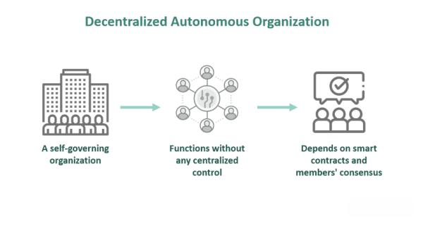

Blockchain technology has revolutionized the way organizations are structured, enabling the emergence of decentralized autonomous organizations (DAOs) that operate beyond the confines of traditional centralized entities. DAOs are an innovative organizational form that leverages the decentralized and immutable nature of blockchain to transform community organization, decision-making processes, and resource management. This new model emphasizes community-centric governance over hierarchical control, allowing for more democratic and transparent practices.

As DAOs proliferate, they are met with a unique set of opportunities and challenges in governance and management. The decentralized nature allows DAOs to operate globally without a central authority, offering potential for enhanced participation and democratized decision-making. However, this also brings about challenges such as security vulnerabilities and potential inefficiencies due to slower consensus processes.

Moreover, the integration of DAOs with emerging technologies, such as algorithmic trading, illustrates the potential for optimizing investment strategies and treasury management within decentralized frameworks. By utilizing algorithms to automate trading strategies, DAOs can enhance liquidity management and align financial operations with community-defined objectives, potentially increasing their financial efficiency.

Nonetheless, the growth and impact of DAOs are contingent on addressing these challenges, improving governance models, and finding effective ways to integrate with existing financial systems. As DAOs continue to evolve, the intersection with algorithmic trading stands as a promising area for fostering innovation and enhancing the capabilities of decentralized finance mechanisms.

## Table of Contents

## Understanding Blockchain Governance and DAOs

Blockchain governance encompasses the systems and protocols that outline the operation of decentralized networks. Central to this concept is the idea of distributed decision-making, which allows various stakeholders to participate in the governance processes without the need for centralized authority. This decentralized framework aims to enhance transparency, reduce corruption, and ensure that the network evolves in a manner that reflects the collective interests of its users.

Decentralized Autonomous Organizations (DAOs) serve as a pioneering model of this decentralized governance, leveraging blockchain technology to facilitate autonomous operation and decision-making. Unlike traditional organizations, DAOs are characterized by their lack of a central leadership structure. Instead, they operate based on rules encoded as smart contracts on a blockchain. These smart contracts define the organization's operations and automate processes such as voting and fund allocation, reflecting a shift from hierarchical models to those that are community-centric and participatory.

The core attributes of DAOs are decentralization, autonomy, and the utilization of smart contracts. Decentralization ensures that no single entity can control the organization, promoting fairness and equality among members. Autonomy enables DAOs to operate with minimal human intervention, relying on pre-defined rules and conditions. The integration of smart contracts facilitates transparency and efficiency, as actions are automatically executed when certain conditions are met.

Despite their innovative potential, DAOs face significant challenges. Security is a principal concern; vulnerabilities in smart contract code can lead to catastrophic financial losses, as exemplified by historical events such as The DAO hack in 2016. This incident, where approximately $60 million worth of Ether was siphoned due to a flaw in the smart contract, underscored the necessity for meticulous security audits and robust code development practices.

Another challenge faced by DAOs is the pace of decision-making. While decentralization ensures participatory governance, it can also slow down processes because consensus must often be reached among a large and diverse group of stakeholders. This can hinder timely decision-making, especially in fast-paced markets or when rapid responses are required.

In conclusion, blockchain governance and DAOs represent a transformative approach to organizational governance, offering increased transparency and democratic participation. However, to fully realize their potential, it is essential to address the underlying security and efficiency challenges that these decentralized structures face. As blockchain technology continues to evolve, so too will the frameworks and practices that support these novel governance models.

## The Role of Smart Contracts in DAOs

Smart contracts are integral to the functioning of Decentralized Autonomous Organizations (DAOs), serving as the backbone for automating processes. These are self-executing contracts whose terms and conditions are embedded within lines of code. They operate on blockchain networks, ensuring that transactions and operations within a DAO are carried out transparently and efficiently, without the need for intermediaries. This automation centralizes operations around objectivity, eliminating manual errors and enhancing trust among participants.

A smart contract automatically executes the terms of an agreement when predetermined conditions are met. For instance, a DAO may use a smart contract to distribute funds to a project once a certain community voting threshold is achieved. This process is completed autonomously, mitigating delays and the potential influence of human bias. The Ethereum blockchain is a popular platform for deploying smart contracts, leveraging its Turing-complete programming language, Solidity, to allow for complex logic and functionalities.

Reliability is fundamental to the effective operation of smart contracts within DAOs. The code must be rigorously tested and audited to ensure there are no vulnerabilities, as any flaw can be exploited. For instance, the infamous "The DAO" hack in 2016 exploited a recursive call vulnerability to drain $50 million worth of Ether. This event underscored the importance of examining code for security deficiencies in the development lifecycle of smart contracts.

Moreover, the decentralized nature of smart contracts aligns with the DAO ethos by providing a mechanism for enforcing rules without a centralized controlling body. This paradigm shift toward programmable contracts enhances neutrality and reduces execution risk. However, it also places emphasis on the design and testing competencies of developers to prevent unforeseen exploits.

Addressing potential weaknesses often involves an array of approaches such as formal verification, where smart contract code is mathematically proven to meet specified correctness properties. Additionally, employing security audits and adopting best development practices are crucial to mitigating risks.

In conclusion, while smart contracts drive efficiency and trustless operation in DAOs, their reliability is paramount. The potential for significant financial losses due to vulnerabilities necessitates a focus on security and rigorous testing. As technological solutions to these challenges evolve, smart contracts will continue to play a transformative role in enabling decentralized governance through DAOs.

## Benefits and Challenges of Blockchain Governance

Blockchain governance offers various benefits and challenges as it reshapes the traditional frameworks of decision-making and oversight in decentralized ecosystems. One of the primary advantages of blockchain governance is transparency. With blockchain's immutable ledger, every transaction and decision is recorded and visible to all participants, which can significantly reduce corruption and fraudulent activities. This transparency also helps in building trust among stakeholders, as they have a clear view of operations and decision-making processes.

Another significant benefit is democratized decision-making. Unlike traditional centralized organizations where decision power is concentrated at the top, blockchain governance allows for more distributed and participatory decision-making processes. Stakeholders, often represented by token holders, can have a say in the direction and decisions of the organization. This democratization can lead to decisions that are more reflective of the community's desires and can encourage diverse viewpoints in the decision-making process.

Enhanced participation is also facilitated by blockchain governance structures. Voting processes can be carried out efficiently, securely, and with ease, encouraging more stakeholders to actively participate. This can lead to higher engagement levels within the community, fostering a sense of ownership and responsibility among participants.

Despite these advantages, blockchain governance is not without its challenges. One significant challenge is the technical complexity involved. Designing and implementing governance models in a decentralized context requires sophisticated technical knowledge and expertise, which can be a barrier for many organizations. Furthermore, smart contracts, which are often used to automate decision-making processes, are susceptible to bugs and vulnerabilities. Any flaw in the code can lead to significant financial and operational setbacks.

Regulatory uncertainty is another challenge facing blockchain governance. As global regulatory landscapes are still evolving, navigating compliance and legal aspects in different jurisdictions can be daunting. This uncertainty can lead to reluctance among participants to fully engage with blockchain-based systems due to the fear of legal repercussions or sudden changes in regulatory frameworks.

Additionally, there is the potential for inefficient decision-making processes. While democratization is a benefit, it can also lead to slower decision-making, especially when consensus is hard to achieve. In some cases, the process may be slowed down by the need to reach a large number of stakeholders, causing delays and impacting the effectiveness of the organization's operations.

In conclusion, blockchain governance holds great promise for creating more equitable and transparent organizational frameworks. However, stakeholders must navigate significant technical and regulatory challenges to fully realize its potential. As the framework continues to evolve, striking a balance between the benefits and addressing the inherent challenges will be crucial for the successful integration of blockchain governance in various sectors.

## Integration of DAOs with Algorithmic Trading

Algorithmic trading, a significant component of automated digital finance, utilizes advanced algorithms to execute trading strategies with precision and speed. With decentralized finance (DeFi) gaining ground, the integration of [algorithmic trading](/wiki/algorithmic-trading) into Decentralized Autonomous Organizations (DAOs) has emerged as a compelling development. This integration offers DAOs the ability to optimize investment decisions and manage treasuries effectively.

DAOs, which operate based on community-driven governance and decision-making, stand to benefit significantly from algorithmic trading. By embedding algorithmic strategies into their operational frameworks, DAOs can automate and enhance their financial activities. This automation ensures that trading decisions align closely with predefined community goals and strategies, allowing for an efficient implementation of investment plans. For instance, a DAO could utilize an algorithm to automatically rebalance its portfolio based on market fluctuations, ensuring optimal asset allocation that reflects current market conditions and the DAO's objectives.

Moreover, the integration enhances [liquidity](/wiki/liquidity-risk-premium) management. DAOs often manage a pool of funds contributed by their members, which need to be allocated and utilized efficiently. Algorithmic trading can optimize liquidity by ensuring that funds are readily available for strategic investments or withdrawals, helping maintain the economic health of the DAO. For instance, an algorithm might trigger automated trading activities to balance liquidity needs against potential returns, ensuring a dynamic and responsive treasury management system.

The synergies between DAOs and algorithmic trading extend to strategic alignment with community goals. Algorithms can be designed to [factor](/wiki/factor-investing) in community votes or proposals directly into trading decisions. For example, if a DAO's members vote to focus on environmentally sustainable investments, the algorithm could automatically prioritize such assets in trading activities. This not only democratizes financial decision-making but also ensures that trading activities are consistent with the values and directives of the DAO's members.

However, integrating algorithmic trading into DAOs is not without challenges. The complexity of developing and maintaining algorithmic systems requires technical expertise, and ensuring these algorithms operate securely within the decentralized framework of DAOs demands robust cybersecurity measures. Additionally, transparency and accountability in algorithmic trading are vital to maintain trust among DAO members, necessitating clear communication and auditability of trading activities and outcomes.

In summary, the convergence of DAOs and algorithmic trading presents a promising vehicle for enhancing financial governance within the DeFi ecosystem. By leveraging technology, DAOs can achieve greater efficiency in their financial operations, aligning closely with strategic community goals while navigating the complexities inherent in autonomous and decentralized decision-making.

## Real-World Examples of DAOs in Action

Decentralized Autonomous Organizations (DAOs) have emerged as a novel form of governance that leverages blockchain technology to enable decentralized decision-making and operations. Two notable examples that highlight both the potential and the challenges of DAOs are The DAO and ConstitutionDAO.

### The DAO

The DAO was one of the earliest and most significant experiments in the decentralized governance ecosystem. Launched in April 2016 on the Ethereum blockchain, it aimed to create a venture capital fund that was directed by the community of token holders. Individuals could buy DAO tokens and have a say in investment decisions proportional to their holdings. The intent was to disintermediate traditional venture capitalists by creating a decentralized investment platform.

However, despite its innovative model, The DAO faced significant challenges. The most glaring was a vulnerability in its smart contract code, which was exploited in June 2016. Approximately $60 million worth of Ether was siphoned off in an attack due to a recursive call exploit, which led to Ethereum's controversial hard fork to retrieve the stolen funds. This incident underscored the critical importance of rigorous smart contract security audits. Additionally, it highlighted the risks associated with placing too much autonomy in code without sufficient oversight or recourse mechanisms.

### ConstitutionDAO

ConstitutionDAO was another notable initiative that garnered attention in late 2021. This DAO formed with the singular objective of purchasing an original copy of the United States Constitution at a Sotheby’s auction. Unlike The DAO, ConstitutionDAO was a short-lived project focused on a singular event. Within a week, the DAO raised over $47 million in Ethereum contributions from approximately 17,000 participants.

Despite amassing significant funds, ConstitutionDAO encountered legal and logistical obstacles. The legal frameworks surrounding collective ownership of physical goods by a decentralized organization were murky, leading to uncertainty about how ownership and custody would be managed had they succeeded. Ultimately, ConstitutionDAO lost the auction, and the funds were returned to contributors, minus transaction fees. This endeavor highlighted the strengths and weaknesses of DAOs. On the one hand, it demonstrated how quickly a decentralized group could mobilize resources and community support. On the other hand, it revealed the challenges of deploying pooled resources in traditional market contexts and the regulatory and operational complexities involved.

### Lessons Learned

From these examples, several lessons emerge for future DAOs. Firstly, emphasis on smart contract security cannot be overstated. The DAO hack serves as a reminder that vulnerabilities can have catastrophic financial and reputational consequences. Secondly, DAOs operating in spaces that intersect with traditional legal and market systems, such as ConstitutionDAO, must navigate existing regulatory frameworks carefully to avoid unforeseen legal complications. Additionally, while the flexibility and rapid mobilization of resources are notable strengths of DAOs, they require clear governance structures and robust communication channels to ensure coherence in decision-making and effective execution. 

In summary, while DAOs like The DAO and ConstitutionDAO illustrate the transformative potential of decentralized governance frameworks, they also underscore the necessity for stringent security measures, legal clarity, and operational efficiency to achieve sustainable success.

## The Future of DAOs and Blockchain Governance

The future landscape of Decentralized Autonomous Organizations (DAOs) and blockchain governance is poised for significant transformation through the integration with traditional financial systems and the expansion into broader applications. This evolution promises to bring maturity and increased efficiency to decentralized governance models.

DAOs are expected to gradually become more intertwined with established financial systems. This integration will enable more robust interactions between decentralized and centralized financial platforms, potentially leading to innovative financial products and services. Such a convergence requires advancements in governance models that efficiently manage stakeholder interactions and resource allocations while upholding the principles of transparency and decentralization.

To support these advancements, enhancements in security protocols are crucial. DAOs operate in environments susceptible to cyber threats and require robust measures to protect against vulnerabilities. Improved security algorithms, advanced encryption techniques, and protocols designed to prevent malicious activities are expected to play an integral role in fortifying DAOs against potential breaches.

Legal frameworks will also evolve, providing the regulatory clarity necessary for DAOs to operate within international jurisdictions. As DAOs gain mainstream attention, governments and regulatory bodies will likely develop guidelines to address issues such as liability, compliance, and taxation. Establishing clear legal standings will encourage more entities to adopt DAO structures, facilitating the integration with traditional financial ecosystems.

Scalability remains a critical factor for the widespread adoption of DAOs. Current blockchain platforms face limitations in transaction throughput and energy consumption. Future developments may focus on layer two solutions, sharding, and other technological innovations to enhance the scalability of blockchain networks. These advancements will ensure that DAOs can handle an increased number of participants and transactions efficiently.

Mainstream adoption of DAOs will depend on their usability and accessibility to non-technical users. Intuitive interfaces, user-friendly governance tools, and clear educational resources will encourage participation from a broader audience, fostering community engagement and diversity of thought within DAOs.

In summary, the advancement of DAOs and blockchain governance involves a multifaceted approach that includes technological innovation, regulatory adjustments, and user engagement strategies. By addressing these aspects, DAOs will continue to evolve, potentially reshaping not only financial systems but also various sectors reliant on collective decision-making and resource management.

## Conclusion

Blockchain governance and decentralized autonomous organizations (DAOs) offer a revolutionary approach to organizational management and decision-making. Unlike traditional structures characterized by centralized authority, these systems emphasize decentralization, transparency, and community involvement. The shift is marked by the use of blockchain technology, which underpins the secure and immutable nature of DAOs, and smart contracts that facilitate automated and trustless transactions.

Despite the promise of these innovative structures, several challenges persist. Technical barriers, such as scalability issues in blockchain networks, remain significant. Additionally, the regulatory landscape is still evolving, posing uncertainties for participants in various jurisdictions. The inherent complexity of decentralized systems can also lead to inefficiencies and slower decision-making processes; yet, these are areas of active development and improvement.

The potential for decentralized governance models to foster more inclusive and participatory engagements is driving continued innovation. As these technologies mature, the integration of DAOs with traditional financial systems and other sectors could unlock further opportunities. This necessitates a collaborative effort among stakeholders, including developers, policymakers, and community members, to address existing challenges.

In conclusion, the evolution of blockchain governance and DAOs signifies a fundamental change in organizational dynamics. With ongoing advancements and strategic collaborations, there is a strong potential to harness these systems for more democratic and efficient governance models. As stakeholders navigate these complexities together, the capabilities and applications of blockchain-based governance are poised for substantial growth and impact.

## References & Further Reading

[1]: Nakamoto, S. (2008). ["Bitcoin: A Peer-to-Peer Electronic Cash System."](https://nakamotoinstitute.org/library/bitcoin/)

[2]: Tapscott, D., & Tapscott, A. (2016). ["Blockchain Revolution: How the Technology Behind Bitcoin and Other Cryptocurrencies is Changing the World."](https://dl.acm.org/doi/10.5555/3051781)

[3]: Buterin, V. (2014). ["A Next-Generation Smart Contract and Decentralized Application Platform."](https://ethereum.org/content/whitepaper/whitepaper-pdf/Ethereum_Whitepaper_-_Buterin_2014.pdf) Ethereum White Paper.

[4]: Szabo, N. (1997). ["The Idea of Smart Contracts."](https://nakamotoinstitute.org/library/the-idea-of-smart-contracts/)

[5]: Wright, A., & De Filippi, P. (2015). ["Decentralized Blockchain Technology and the Rise of Lex Cryptographia."](https://papers.ssrn.com/sol3/papers.cfm?abstract_id=2580664)