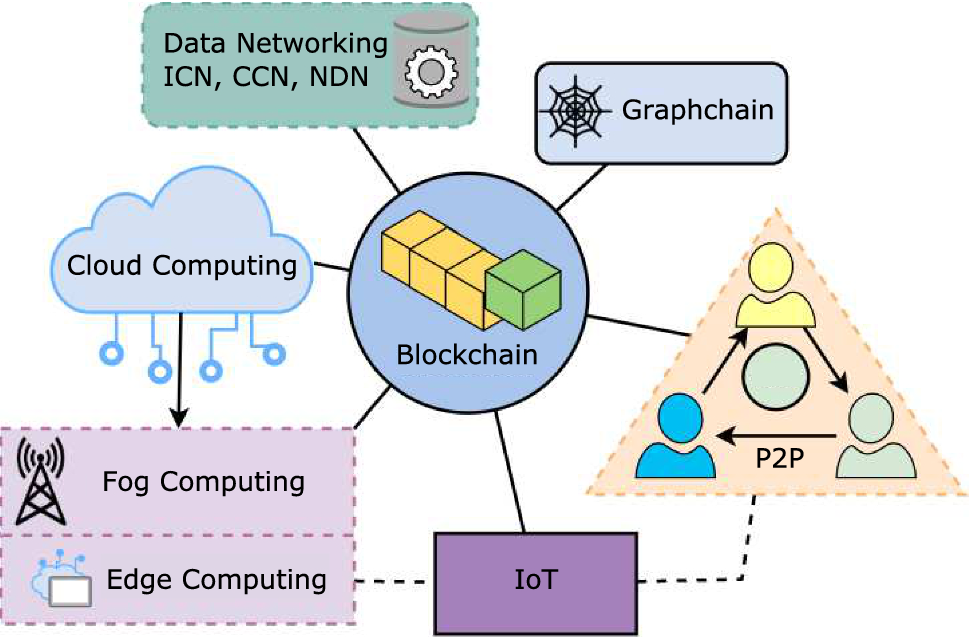

## Table of Contents

## What is a decentralized blockchain-based internet?

A decentralized blockchain-based internet is a new way of using the internet where information is not controlled by a few big companies. Instead, it uses a technology called blockchain, which is like a digital record book that everyone can see and add to, but no one person or company owns it. This makes the internet more open and fair because it's harder for anyone to change or control the information without everyone knowing.

In this kind of internet, people can share information directly with each other without needing to go through big websites or services. This can make things like sending money or sharing files much safer and private. Because the information is spread out across many computers, it's also harder for the system to be shut down or hacked. This could change how we use the internet, making it more about what people want and less about what big companies decide.

## How does a decentralized internet differ from the traditional internet?

A decentralized internet is different from the traditional internet because it doesn't have big companies controlling everything. In the traditional internet, companies like Google, Facebook, and Amazon have a lot of power over what we see and do online. They can decide what information is shown, how it's shown, and even who can see it. But in a decentralized internet, no single group or person is in charge. Instead, everyone who uses the internet helps to keep it running and safe. This means that the information is more open and fair, and it's harder for anyone to change things without others knowing.

Another big difference is how information is stored and shared. On the traditional internet, information usually goes through big servers owned by companies. If these servers have problems, the information can be hard to access. In a decentralized internet, information is spread out across many computers all over the world. This makes it much harder for the whole system to break down because there's no one main place that can fail. It also means that people can share information directly with each other, without needing to go through big companies. This can make things like sending money or sharing files much safer and more private.

## What are the key components of a blockchain-based internet?

A blockchain-based internet has a few important parts that make it work. One big part is the blockchain itself, which is like a special digital notebook that keeps track of everything that happens on the internet. It's shared across many computers, so no one person or company owns it. This makes it very hard for anyone to change the information without everyone knowing. Another part is smart contracts, which are like digital agreements that automatically do things when certain rules are met. They help people do things like share money or files without needing a big company to help.

Another key part is the use of tokens or cryptocurrencies, which are like digital money that people use to pay for things on this new internet. These tokens help keep the system running smoothly because people can earn them by helping to keep the network safe and working well. The last part is the way that people connect to this internet, often through special apps or browsers that let them use the blockchain-based services. These apps help people find and use the information and services on the blockchain, making it easier for everyone to join in and use this new kind of internet.

## What are the benefits of using a decentralized internet?

Using a decentralized internet can make things more fair and open. On the regular internet, big companies decide what we see and do. But on a decentralized internet, everyone helps to keep it running and safe. This means that no one person or company can control everything. It's harder for anyone to change or hide information without others knowing. This can make the internet a better place for everyone because it's more about what people want and less about what companies decide.

Another big benefit is that a decentralized internet can be safer and more private. On the regular internet, information goes through big servers that can be hacked or shut down. But on a decentralized internet, information is spread out across many computers all over the world. This makes it much harder for the whole system to break down or be hacked. People can also share things like money or files directly with each other, without needing to go through big companies. This can keep personal information more private and secure.

## What are the potential drawbacks or challenges of a decentralized internet?

One big challenge of a decentralized internet is that it can be harder to use. Right now, the regular internet is easy to use because big companies make apps and websites that are simple and work well. But a decentralized internet might need special apps or browsers that can be tricky to set up and use. This could mean that not everyone will want to switch to the new internet, especially if they're used to the way things work now. Plus, if something goes wrong, there's no big company to call for help, which can make fixing problems harder.

Another challenge is that it might be slower. On the regular internet, big servers can handle a lot of information quickly. But on a decentralized internet, the information is spread out across many computers, which can make things slower. This could be a problem for things like watching videos or playing games online, where speed is important. Also, because no one is in charge, it can be hard to make big changes or improvements to the system. Everyone has to agree, which can take a long time and make it hard to keep the internet running smoothly.

## How does blockchain technology facilitate a decentralized internet?

Blockchain technology helps make the internet decentralized by acting like a shared digital notebook that everyone can see and add to, but no one owns. This notebook keeps track of everything that happens on the internet, like who sent what to whom. Because the notebook is spread out across many computers, it's hard for anyone to change or control the information without everyone knowing. This makes the internet more open and fair because it's not controlled by big companies.

Another way blockchain helps is through smart contracts, which are like digital agreements that automatically do things when certain rules are met. These contracts let people share things like money or files directly with each other, without needing a big company to help. This can make the internet safer and more private because personal information doesn't have to go through big servers that can be hacked. By using blockchain, the internet can be more about what people want and less about what companies decide.

## What are some existing projects or platforms that are building a decentralized internet?

One project working on a decentralized internet is called IPFS, which stands for InterPlanetary File System. IPFS lets people share files directly with each other without needing big servers. Instead of storing files in one place, IPFS spreads them out across many computers. This makes it harder for the system to break down and helps keep information safe and private. People can use IPFS to share all kinds of files, like videos, pictures, and documents, in a way that's more open and fair.

Another platform is Ethereum, which is known for its blockchain technology. Ethereum lets people create and use smart contracts, which are like digital agreements that automatically do things when certain rules are met. These contracts help people share money or other things without needing a big company to help. Ethereum also has its own digital money called Ether, which people use to pay for things on the platform. By using Ethereum, people can build new kinds of apps and services that work on a decentralized internet, making it more about what people want and less about what companies decide.

A third project is Brave, a web browser that focuses on privacy and security. Brave uses blockchain technology to help people browse the internet in a more private way. It also has its own digital money called Basic Attention Tokens (BAT), which people can earn by watching ads and then use to support their favorite websites or content creators. Brave is working to make the internet more decentralized by giving people more control over their data and how they use the internet.

## How can users access and utilize a decentralized internet?

To access and use a decentralized internet, users need special apps or browsers that work with decentralized systems. For example, they can use the Brave browser, which is built to protect privacy and uses blockchain technology. Another option is to use IPFS, which lets people share files directly with each other without big servers. These apps and browsers help users connect to the decentralized internet and use its services, like sharing files or sending money directly to others.

Once connected, users can do many things on a decentralized internet that are different from the regular internet. They can use smart contracts on platforms like Ethereum to make digital agreements that automatically do things when certain rules are met. This can be useful for sharing money or other things without needing a big company to help. Users can also earn and use digital money like Ether or Basic Attention Tokens (BAT) to pay for things on the decentralized internet. This new way of using the internet can be more open and fair, giving people more control over their information and how they use the internet.

## What role do cryptocurrencies play in a decentralized internet ecosystem?

Cryptocurrencies are like digital money that people use to pay for things on a decentralized internet. They help keep the system running smoothly because people can earn them by helping to keep the network safe and working well. For example, on platforms like Ethereum, people use Ether to pay for using smart contracts, which are like digital agreements that automatically do things when certain rules are met. This makes it easier for people to share money or files directly with each other without needing a big company to help.

In a decentralized internet, cryptocurrencies also help make things more fair and open. Instead of big companies deciding what we see and do, people can use cryptocurrencies to support the services and content they like. For example, with the Brave browser, users can earn Basic Attention Tokens (BAT) by watching ads and then use those tokens to support their favorite websites or content creators. This way, the internet can be more about what people want and less about what companies decide, making it a better place for everyone.

## What are the security and privacy implications of using a decentralized internet?

Using a decentralized internet can make things safer and more private. On the regular internet, big companies keep our information on big servers that can be hacked or shut down. But on a decentralized internet, information is spread out across many computers all over the world. This makes it much harder for hackers to get all the information at once because there's no one main place to attack. Also, people can share things like money or files directly with each other without going through big companies, which can keep personal information more private.

However, there are some challenges to staying safe and private on a decentralized internet. Because no one is in charge, it can be harder to fix problems or stop bad things from happening. If something goes wrong, there's no big company to call for help, so users need to be more careful and know how to keep their information safe. Also, using special apps or browsers to connect to the decentralized internet can be tricky, and if they're not set up right, they might not be as safe as they could be. So, while a decentralized internet can offer better security and privacy, users need to be smart and careful to make the most of it.

## How might a decentralized internet impact current internet governance and regulations?

A decentralized internet could change how the internet is governed and regulated. Right now, governments and big companies set rules for the internet. They decide what is allowed and how to keep things safe. But with a decentralized internet, no one person or group is in charge. This means that making and enforcing rules could be harder because everyone has to agree. It might make the internet more open and fair, but it could also make it harder to stop bad things from happening.

Another impact could be on how laws are made and followed. On the regular internet, laws are easier to make and enforce because there are big companies that can follow them. But on a decentralized internet, information is spread out across many computers all over the world. This makes it harder for any one country to control what happens. It could lead to new kinds of laws and ways of working together between countries to keep the internet safe and fair for everyone.

## What future developments can we expect in the evolution of a decentralized internet?

In the future, we might see more and more people using a decentralized internet. As more special apps and browsers are made, it could become easier for everyone to join in. These new tools might make it simpler to share files, send money, and do other things without needing big companies to help. This could make the internet more open and fair because it would be harder for anyone to control what we see and do. Also, new kinds of digital money might be created to help pay for things on this new internet, making it even easier for people to use and support the services they like.

Another thing we might see is better ways to keep the decentralized internet safe and private. As more people use it, there could be new ways to stop hackers and keep personal information safe. This might mean new kinds of smart contracts and other tools that help people share things directly with each other without going through big servers. Governments and groups might also come up with new ways to work together to make rules and keep the internet fair for everyone. This could make the decentralized internet a better place for everyone to use and enjoy.

## References & Further Reading

[1]: "Mastering Bitcoin: Unlocking Digital Cryptocurrencies" by Andreas M. Antonopoulos. (https://www.goodreads.com/book/show/21820378-mastering-bitcoin)

[2]: Nakamoto, S. (2008). ["Bitcoin: A Peer-to-Peer Electronic Cash System."](https://nakamotoinstitute.org/library/bitcoin/)

[3]: Tapscott, D., & Tapscott, A. (2016). ["Blockchain Revolution: How the Technology Behind Bitcoin is Changing Money, Business, and the World."](https://dl.acm.org/doi/10.5555/3051781)

[4]: Buterin, V. (2014). ["A Next-Generation Smart Contract and Decentralized Application Platform."](https://ethereum.org/content/whitepaper/whitepaper-pdf/Ethereum_Whitepaper_-_Buterin_2014.pdf)

[5]: Mougayar, W. (2016). ["The Business Blockchain: Promise, Practice, and Application of the Next Internet Technology."](https://books.google.com/books/about/The_Business_Blockchain.html?id=CEsPDAAAQBAJ)

[6]: Narayanan, A., Bonneau, J., Felten, E., Miller, A., and Goldfeder, S. (2016). ["Bitcoin and Cryptocurrency Technologies: A Comprehensive Introduction."](https://press.princeton.edu/books/hardcover/9780691171692/bitcoin-and-cryptocurrency-technologies)

[7]: Swan, M. (2015). ["Blockchain: Blueprint for a New Economy."](https://dl.acm.org/doi/book/10.5555/3006358)

[8]: Schär, F. (2021). ["Decentralized Finance: On Blockchain- and Smart Contract-based Financial Markets."](https://www.stlouisfed.org/publications/review/2021/02/05/decentralized-finance-on-blockchain-and-smart-contract-based-financial-markets) The Journal of Finance.

[9]: Yermack, D. (2013). ["Is Bitcoin a Real Currency? An Economic Appraisal."](https://www.nber.org/papers/w19747) National Bureau of Economic Research.

[10]: Peters, G.W., Panayi, E. (2016). ["Understanding Modern Banking Ledgers through Blockchain Technologies: Future of Transaction Processing and Smart Contracts on the Internet of Money."](https://link.springer.com/chapter/10.1007/978-3-319-42448-4_13) In Banking Beyond Banks and Money (pp. 239-278). Springer.