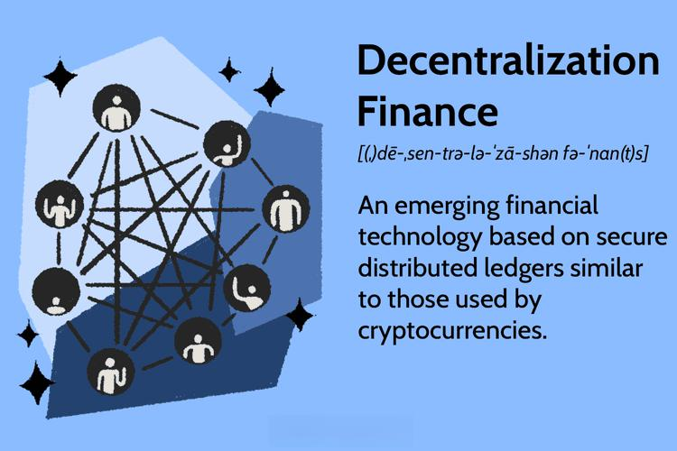

The financial landscape is undergoing a profound transformation driven by blockchain technology, decentralized finance (DeFi), and algorithmic trading. These innovations are not just buzzwords but pillars supporting the future of financial markets. Understanding them is not merely an academic exercise but a necessity for anyone interested in the trajectory of global finance. Blockchain technology, known for its features of immutability, decentralization, and transparency, lays the foundation for this new era. It supports a range of financial applications that promise increased security and reduced fraud, alongside significant reductions in transaction costs.

Decentralized finance is a paradigmatic shift from traditional financial systems, offering financial services without intermediaries. By operating on blockchain networks like Ethereum, DeFi platforms foster a system of open finance, democratizing financial access and promoting global financial inclusion. The advent of these platforms is reshaping how lending, borrowing, and even yield farming are conducted, fundamentally altering market dynamics and access.

Meanwhile, algorithmic trading leverages the power of advanced algorithms to optimize trading strategies in both traditional and decentralized finance markets. This method enhances trading efficiency by executing decisions at speeds and accuracies beyond human capabilities, reducing emotional bias significantly. 

Together, these technologies represent a shift towards a more inclusive, efficient, and secure financial ecosystem. They hold the potential not only to improve market access and reduce costs but also to usher in a new era where financial services are more reliable and equitable. This article will elucidate these concepts further, highlighting how they are collectively redefining the landscape of finance and exploring their profound implications for the future.

## Table of Contents

## What is Blockchain Finance?

Blockchain finance refers to the application of blockchain technology within the financial services sector, promising a new era characterized by secure, transparent, and efficient financial transactions. At its core, blockchain technology is a distributed ledger system that allows data to be recorded and shared across multiple nodes in a network, ensuring no single entity has control over the entire database. This innovative approach paves the way for a decentralized financial ecosystem that operates transparently and reduces reliance on traditional intermediaries.

**Key Features of Blockchain Finance**

1. **Immutability**: One of the defining characteristics of blockchain technology is the immutability of its data entries. Once data is recorded on a blockchain, it cannot be altered or deleted, providing a permanent and tamper-evident record. This feature is crucial in preventing fraud and maintaining the integrity of financial transactions.

2. **Decentralization**: Traditional financial systems often rely on central authorities or intermediaries to facilitate transactions. In contrast, blockchain finance operates in a decentralized manner, with no single point of control. This decentralization reduces the risk of systemic failures and empowers individuals by granting them greater control over their financial assets.

3. **Trustless Operations**: Blockchain utilizes cryptographic techniques to establish trust less transactions, meaning that parties can transact directly without the need for intermediaries. Smart contracts—self-executing contracts with the terms of the agreement directly written into code—automate and enforce contractual agreements, further enhancing trust in financial transactions.

**Benefits of Blockchain Finance**

The adoption of blockchain finance brings numerous advantages. First and foremost, it offers significant reductions in fraud and transaction costs. By eliminating the need for intermediaries and streamlining processes through automation, blockchain can lower fees and enhance the efficiency of financial operations. Additionally, the transparency of blockchain technology fosters greater accountability, as all participants can view and verify transactions in real-time.

Another critical benefit of blockchain finance is its potential to facilitate global financial inclusion. Traditional banking systems often exclude individuals in underbanked regions due to geographical, regulatory, or economic barriers. Blockchain can bridge this gap by providing unbanked populations with access to financial services through digital wallets and peer-to-peer lending platforms, thus democratizing finance on a global scale.

In conclusion, blockchain finance represents a paradigm shift in the way financial services are conceptualized and delivered. By harnessing the technology's key features—immutability, decentralization, and trustless operations—blockchain finance is poised to reduce costs, enhance security, and improve financial accessibility worldwide.

## Understanding Decentralized Finance (DeFi)

Decentralized Finance (DeFi) represents a transformative shift in how financial services are structured and accessed. Built on blockchain technology, DeFi eliminates the need for central financial intermediaries such as banks and brokerages. Instead, it uses smart contracts on blockchain platforms like Ethereum to facilitate financial transactions. This open finance model allows users to engage in financial activities without relying on traditional institutions, promoting increased transparency and security.

One of the pivotal aspects of DeFi is its reliance on blockchain platforms like Ethereum. Ethereum provides a robust infrastructure for developing and executing smart contracts, which are self-executing contracts with the terms of the agreement directly written into code. These smart contracts automate processes like lending, borrowing, and trading, minimizing human intervention and errors. For instance, platforms such as Aave and Compound offer decentralized lending and borrowing where users can earn interest by providing [liquidity](/wiki/liquidity-risk-premium) or borrow assets against collateral without the need for credit checks.

DeFi applications extend beyond simple transactions. Yield farming, an innovative DeFi concept, allows users to earn returns on their crypto assets by providing liquidity to decentralized exchanges or protocols. By participating in yield farming, users can earn interest, additional tokens, or other incentives, often with returns significantly higher than those offered by traditional banking savings accounts.

The impact of DeFi on democratizing financial access is profound. In regions with limited access to traditional banking infrastructure, DeFi offers an alternative that is inclusive and accessible globally with only an internet connection. This opens financial services to millions who are unbanked or underbanked, fostering financial inclusion and empowerment.

When compared to traditional financial systems, DeFi presents several advantages. Traditional systems are often hindered by geographical and regulatory barriers, slow processing times, and central points of failure. DeFi, on the other hand, offers global and instantaneous service, resilience against failures due to its decentralized nature, and enhanced privacy and control over personal financial information. However, DeFi also faces challenges such as security vulnerabilities in smart contracts and regulatory uncertainties that could impact its expansion and integration with existing financial ecosystems. 

In conclusion, DeFi stands as a promising frontier in financial technology, offering an alternative to traditional financial systems through decentralization and automation. As the ecosystem continues to grow, it may pave the way for more integrated and innovative financial services worldwide.

## Algorithmic Trading in Decentralized Finance

Algorithmic trading leverages computer algorithms to automate and optimize trading strategies in financial markets, and its integration with decentralized finance (DeFi) creates new opportunities and challenges. In DeFi markets, algorithms are designed to function within blockchain-based platforms, trading cryptocurrencies and digital assets without the need for centralized exchanges. This approach allows for efficient, transparent, and scalable trading processes.

Algorithms deployed in DeFi markets execute trades based on a pre-defined set of rules and parameters, such as price, timing, and [volume](/wiki/volume-trading-strategy), which are programmed into the system. These algorithms can quickly adapt to evolving market conditions, offering several advantages over traditional trading methods. Speed and precision are among the most significant benefits, enabling traders to capitalize on brief windows of opportunity. Unlike human traders, these algorithms are devoid of emotional biases, reducing the risk of impulsive decision-making.

Implementing [algorithmic trading](/wiki/algorithmic-trading) in decentralized environments, however, poses unique challenges. One of the primary difficulties is the volatile nature of DeFi markets, which can lead to unexpected outcomes if the algorithms are not carefully calibrated. Additionally, the decentralized nature of these platforms may introduce latency issues that affect the execution speed of transactions. Security is another concern, as smart contracts and algorithms are susceptible to coding vulnerabilities and exploitation by malicious actors.

Looking to the future, we can anticipate several trends and technological advancements shaping algorithmic trading within DeFi. The integration of [machine learning](/wiki/machine-learning) and [artificial intelligence](/wiki/ai-artificial-intelligence) promises to enhance the adaptability and decision-making capabilities of trading algorithms. Moreover, the development of more sophisticated smart contracts will enable greater flexibility and automation in trading strategies. Cross-chain interoperability could also play a pivotal role, allowing algorithms to operate across multiple blockchain platforms and access a broader range of financial instruments. As the landscape evolves, it will be crucial for developers and traders to stay informed and adapt their strategies accordingly.

## Benefits and Risks of DeFi and Algo Trading

Decentralized Finance (DeFi) and algorithmic trading are ushering in a new era of financial transactions characterized by low fees, heightened transparency, and unprecedented global access. These advancements offer numerous benefits while also presenting unique risks that must be carefully managed.

### Benefits of DeFi and Algo Trading

**Redefining Financial Transactions:** One of the primary benefits of DeFi is the significant reduction in transaction fees. Traditional financial systems often involve intermediaries that charge substantial fees for services such as transfers, investments, and currency exchanges. DeFi platforms leverage blockchain technology to facilitate peer-to-peer transactions, which minimizes costs and allows for almost instant settlement.

**Transparency and Global Access:** Blockchain technology inherently provides transparency as all transactions are recorded on a public ledger. This transparency reduces the possibility of fraud and makes it easier for users to track their financial activities. Moreover, DeFi enables global access to financial services, particularly benefiting unbanked populations who previously had limited access to banking facilities.

**Improved Security and Efficiency through Smart Contracts:** Smart contracts are self-executing contracts with the terms directly written into code. They enhance security by automating processes that reduce human error and corruption. Additionally, they increase efficiency by allowing transactions to occur automatically once predefined conditions are met, thus eliminating the need for manual intervention. For instance, a smart contract can automatically execute a loan payment when the borrower has sufficient funds.

### Risks of DeFi and Algo Trading

**Smart Contract Vulnerabilities:** Despite their advantages, smart contracts are not immune to security risks. Coding errors or exploits in smart contracts have led to significant financial losses in the past. Since smart contracts operate autonomously, any vulnerabilities can be exploited by malicious actors, potentially resulting in irrevocable damage.

**Regulatory Challenges:** The decentralized nature of DeFi poses regulatory challenges, as it often operates outside the jurisdiction of traditional financial regulations. This lack of oversight can attract illicit activities and poses a challenge to establishing global standards. Governments and regulatory bodies are continually grappling with how to supervise these decentralized systems effectively without stifacing innovation.

**Volatility and Complexity:** DeFi investments are often characterized by high volatility, which can lead to significant financial risk for investors. This volatility is exacerbated by the complexity of the financial instruments in DeFi, such as yield farming and liquidity pools, which may be difficult for the average investor to fully understand.

### Balancing Innovation and Risk Management

The rapid development of DeFi and algorithmic trading necessitates a balanced approach to innovation and risk management. Investors and developers must prioritize robust security measures and diligently audit smart contracts to mitigate vulnerabilities. Regulatory frameworks should evolve to provide clarity and protection without hindering technological progress.

Further, educating investors about the complexities and risks associated with DeFi investments is crucial. This includes understanding the dynamics of liquidity provision, the implications of token governance, and the risks inherent in collateralized borrowing.

In conclusion, as DeFi and algorithmic trading continue to transform the financial landscape, stakeholders must work collaboratively to harness their benefits while proactively managing associated risks. This will ensure sustainable growth and adoption of these pioneering technologies in the financial sector.

## The Future of Finance: A Blockchain Perspective

Emerging technologies like blockchain are poised to redefine financial services by enhancing efficiency, security, and accessibility. Blockchain technology, characterized by its decentralized and immutable nature, removes the need for intermediaries and provides a tamper-proof transaction record. This fundamental change allows for more direct and efficient financial operations, reducing costs and increasing transparency.

One significant development is the potential integration of Decentralized Finance (DeFi) with traditional financial systems. DeFi offers a new form of financial services that are open, permissionless, and borderless, potentially providing services to unbanked populations worldwide. Integrating DeFi with traditional banking can lead to hybrid models that leverage the strengths of both systems, such as increased accessibility of financial products and enhanced user trust through transparency.

Key to this integration is the role of governance and interoperability within these financial ecosystems. Effective governance models ensure that DeFi platforms are secure, resilient, and can operate without centralized control. Interoperability facilitates seamless interaction between different blockchain networks and traditional systems, ensuring fluidity of assets and information. Protocols like Cosmos and Polkadot are pioneering interoperability solutions, enabling different blockchains to communicate and share information in a decentralized manner.

Regulatory developments are anticipated to play a crucial role in shaping the future of blockchain finance. Regulatory bodies around the world are increasingly paying attention to the rise of cryptocurrencies and DeFi platforms. While regulations may bring about standards that safeguard investors and encourage trust, they could also limit innovation if not carefully crafted. It is essential for policymakers to strike a balance that protects consumers while not stifling innovation. Some countries are already developing frameworks specifically for blockchain and DeFi, which may set precedents for global regulatory trends.

The future of decentralized finance is not only about integration and regulation but also about sustainability and scalability. Technologies that reduce energy consumption in blockchain processes, like proof-of-stake (PoS) consensus mechanisms, are paving the way for more environmentally friendly operations. Additionally, layer 2 solutions are being developed to address scalability issues, ensuring that blockchain networks can handle a growing number of transactions without compromising speed or security. These advancements are critical as DeFi platforms continue to scale and gain wider adoption.

In conclusion, while blockchain's impact on finance presents significant opportunities, stakeholders must address the accompanying challenges. By focusing on integration, governance, regulation, sustainability, and scalability, the financial services of the future can indeed become more inclusive, efficient, and secure.

## Conclusion

Blockchain, Decentralized Finance (DeFi), and algorithmic trading are positioned at the forefront of financial transformation. These technologies collectively have the potential to reshape global financial systems, offering increased efficiency, transparency, and accessibility. However, with great innovation comes significant challenges that must be understood to harness their full potential.

Blockchain technology underpins these advancements, providing a secure, immutable, and decentralized ledger for transactions. Its potential to eliminate intermediaries and reduce costs is substantial, yet it introduces challenges such as regulatory hurdles and the need for public trust in digital assets. As blockchain technology continues to evolve, its role in redefining financial services is expected to expand further.

DeFi, operating on blockchain platforms, exemplifies how finance can be democratized by removing traditional intermediaries. As it matures, DeFi is anticipated to offer higher efficiency and enhanced security, although it must address smart contract vulnerabilities and regulatory challenges. The growing ecosystem of DeFi applications indicates a transformative shift, promising to make financial services more inclusive and accessible.

Algorithmic trading offers significant advantages, such as enhanced speed, precision, and reduced emotional bias in trading decisions. However, implementing these algorithms in decentralized environments presents unique challenges, including liquidity issues and technology limitations. As these platforms develop, the integration of advanced algorithms will likely lead to more sophisticated and profitable trading strategies.

Given the rapid pace of these technological advancements, staying informed about emerging financial technologies is crucial for both industry professionals and investors. A proactive approach to understanding these innovations can provide significant strategic advantages and prevent potential pitfalls associated with their adoption.

In conclusion, the intersection of blockchain, DeFi, and algorithmic trading is a pivotal point in the ongoing evolution of the financial sector. As these technologies continue to develop, they promise to redefine financial systems on a global scale. It is essential for stakeholders to explore these innovations actively and consider their future implications on the financial world, ensuring that they are prepared to adapt and thrive in this new landscape.

## FAQs

### FAQs

**What is DeFi and how does it work?**

Decentralized Finance, or DeFi, functions as an array of financial services utilizing blockchain technology without relying on centralized financial intermediaries like banks. DeFi platforms are primarily built on blockchain networks, such as Ethereum, which facilitate the creation of smart contracts. These smart contracts are self-executing agreements with terms directly embedded in code, enabling developers to build diverse financial services, including lending, borrowing, and trading, in a decentralized manner. By eliminating the need for intermediaries, DeFi enhances transparency and accessibility, allowing anyone with an internet connection to participate in financial transactions.

**How is blockchain technology transforming finance?**

Blockchain technology transforms finance by introducing a decentralized, immutable, and transparent ledger system. This transformation reduces the reliance on traditional financial institutions for verifying transactions, thus cutting down on transaction costs and enhancing security. Blockchain's distributed nature ensures that data is spread across a network of nodes, making it more resistant to fraud and hacks. The technology also supports faster settlement times for transactions, providing the potential for real-time financial services. Moreover, blockchain enables broader financial inclusion by allowing access to financial services for people without access to traditional banking infrastructure.

**What are the key benefits of algorithmic trading?**

Algorithmic trading, or algo trading, utilizes computer algorithms to execute trades based on pre-defined criteria at speeds and frequencies beyond human capability. The key benefits include:

1. **Speed:** Algorithms can process market data and execute orders faster than human traders.
2. **Precision:** Algorithms operate with high accuracy, reducing the risk of manual trading errors.
3. **Reduced Emotional Bias:** As trading decisions are made based on logic and data, algo trading minimizes the impact of human emotions.
4. **Backtesting:** Traders can test the effectiveness of their strategies using historical data before applying them in live markets.
5. **Accessibility:** Retail investors gain access to advanced trading strategies that were once reserved for institutional players.

**What risks should investors be aware of in DeFi?**

Investors in DeFi should be conscious of several risks, including:

1. **Smart Contract Vulnerabilities:** Errors in smart contracts can lead to exploits and loss of funds.
2. **Regulatory Uncertainty:** As DeFi operates outside traditional regulatory frameworks, future regulatory actions could impact platforms negatively.
3. **Market Volatility:** The value of DeFi assets can be highly volatile, leading to potential financial losses.
4. **Liquidity Risks:** DeFi platforms may face inadequate liquidity, affecting the ability to execute large orders without impacting prices.
5. **Interoperability Concerns:** As DeFi projects are often built on different blockchains, the lack of interoperability can pose functional constraints.

**How will regulatory changes affect the future of DeFi?**

Regulatory changes could have a significant impact on DeFi's development. Increased regulation may lead to enhanced security and trust in the sector, making it more appealing to institutional investors. However, stringent regulations could also stifle innovation, limit participation, and increase operational costs for DeFi projects. The future of DeFi will likely depend on finding a balance between maintaining its decentralized nature and adhering to regulatory requirements designed to protect investors. Collaboration between developers, regulators, and stakeholders will be crucial to shaping a sustainable regulatory environment conducive to innovation and growth.

## References & Further Reading

[1]: Antonopoulos, A. M., & Wood, G. (2018). ["Mastering Ethereum: Building Smart Contracts and DApps."](https://www.amazon.com/Mastering-Ethereum-Building-Smart-Contracts/dp/1491971940) O'Reilly Media.

[2]: Tapscott, D., & Tapscott, A. (2016). ["Blockchain Revolution: How the Technology Behind Bitcoin is Changing Money, Business, and the World."](https://dl.acm.org/doi/10.5555/3051781) Penguin Random House.

[3]: Harvey, C. R., Ramachandran, A., & Santoro, J. (2021). ["DeFi and the Future of Finance."](https://papers.ssrn.com/sol3/papers.cfm?abstract_id=3711777) Wiley Finance Series.

[4]: Schär, F. (2021). ["Decentralized Finance: On Blockchain- and Smart Contract-Based Financial Markets."](https://www.stlouisfed.org/publications/review/2021/02/05/decentralized-finance-on-blockchain-and-smart-contract-based-financial-markets) Federal Reserve Bank of St. Louis Review, Second Quarter.

[5]: Narayanan, A., Bonneau, J., Felten, E., Miller, A., & Goldfeder, S. (2016). ["Bitcoin and Cryptocurrency Technologies: A Comprehensive Introduction."](https://press.princeton.edu/books/hardcover/9780691171692/bitcoin-and-cryptocurrency-technologies) Princeton University Press.