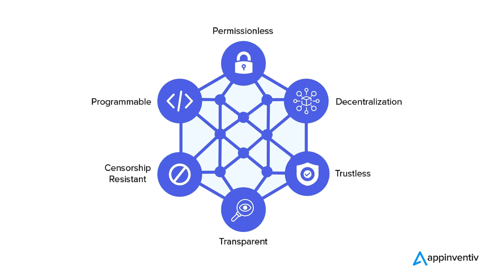

## Table of Contents

## What is Decentralized Finance (DeFi)?

Decentralized Finance, or DeFi, is a way to do financial activities like borrowing, lending, and trading without traditional banks or other middlemen. It uses blockchain technology, which is a special kind of computer system that keeps track of everything securely and openly. People can use DeFi services from anywhere in the world as long as they have an internet connection.

In DeFi, you can do things like earn interest on your money, take out loans, or trade different types of digital money. All of these activities happen through apps that run on the blockchain, which means they are not controlled by any single company or person. This can make financial services more accessible and fair for everyone, but it also comes with risks because it's still a new and changing area.

## How does DeFi differ from traditional finance?

DeFi and traditional finance are different in how they work and who controls them. In traditional finance, banks and other big companies are in charge. They keep your money, give you loans, and decide what services you can use. Everything is managed by these central organizations, and they follow rules set by governments. This can be good because it's often safe and easy to use, but it can also be slow and limited to certain people or places.

On the other hand, DeFi uses blockchain technology, which is like a big, open computer system that anyone can use. Instead of banks, DeFi services are run by computer programs called smart contracts. These programs automatically do things like lend money or trade assets without needing a middleman. This means DeFi can be faster, cheaper, and available to anyone with an internet connection. But it can also be riskier because it's less controlled and still new.

Overall, traditional finance is more established and regulated, while DeFi is more open and innovative. Both have their own benefits and challenges, and they're trying to solve different problems in the world of money.

## What are the key components of DeFi?

The key components of DeFi include blockchain technology, smart contracts, and decentralized applications (dApps). Blockchain is like a digital ledger that keeps track of all transactions in a safe and open way. It's what makes DeFi possible because it allows people to send and receive money without a bank. Smart contracts are special programs that run on the blockchain. They automatically do things like lend money or trade assets based on certain rules, without needing a middleman. Decentralized applications, or dApps, are the apps that people use to access DeFi services. They let you do things like borrow, lend, or trade digital money directly from your computer or phone.

Another important part of DeFi is the use of cryptocurrencies, which are digital forms of money used in these systems. These can include well-known ones like Ethereum, which is often used to power DeFi platforms, as well as other tokens that might represent different assets or services. Liquidity pools are also crucial in DeFi. They are like big pots of money that people can add to or take from, and they help make sure there's always enough money available for people to use. Together, these components create a financial system that's open to anyone with an internet connection, but it's also new and can be risky.

## What are some popular DeFi applications?

Some popular DeFi applications include Uniswap, Aave, and Compound. Uniswap is like a big marketplace where people can trade different types of digital money without a middleman. It's really popular because it's easy to use and anyone can join. Aave lets you borrow or lend digital money, and it's special because you can decide how you want to use your money. For example, you can borrow money without selling your other digital assets. Compound is another app where you can lend or borrow money, and it's known for its simple design and how it automatically adjusts interest rates based on supply and demand.

These apps are all built on the Ethereum blockchain, which means they use smart contracts to work. Smart contracts are like special computer programs that do things automatically based on rules everyone can see. This makes everything more open and fair. People like these DeFi apps because they can use them from anywhere in the world and don't need to go through a bank or other big company. But, because DeFi is still new, it can be risky, and you need to be careful with your money.

## How do DeFi platforms ensure security and trust?

DeFi platforms use blockchain technology to keep things safe and build trust. Blockchain is like a big, open book where everyone can see all the transactions. This makes it hard for anyone to cheat or steal because everything is out in the open. Also, DeFi platforms use something called cryptography, which is like a special code that keeps your information safe. This helps make sure that only you can control your money and that no one else can get to it.

Another way DeFi platforms keep things safe is by using smart contracts. Smart contracts are like automatic rules that everyone can see and agree on. They do things like lend or trade money without needing a middleman. Because these rules are open for everyone to check, it helps build trust. But, even though these systems are designed to be safe, they can still have problems. Sometimes, there might be mistakes in the code or people might find new ways to trick the system. So, it's important for users to be careful and do their own research before using DeFi platforms.

## What is the role of smart contracts in DeFi?

Smart contracts are really important in DeFi. They are like special computer programs that run on the blockchain. In DeFi, smart contracts do things like lending money, trading digital assets, or making sure deals happen the way they're supposed to, all without needing a middleman like a bank. They work automatically based on rules that everyone can see, which makes everything more fair and open. For example, if you want to borrow money on a DeFi platform, a smart contract can handle the whole process, from checking if you have enough to borrow, to setting the interest rate, to making sure you pay back the loan.

Because smart contracts are open for everyone to check, they help build trust in DeFi. People can see exactly how the contracts work and know that they will do what they're supposed to do. This is different from traditional finance, where you might have to trust a bank or a company to handle your money the right way. But, even though smart contracts are designed to be safe, they can still have problems. Sometimes, there might be mistakes in the code, or people might find new ways to trick the system. So, it's important for users to be careful and do their own research before using DeFi platforms that rely on smart contracts.

## How can someone start using DeFi services?

To start using DeFi services, you'll need a few things. First, you need a digital wallet that works with the blockchain you want to use, like Ethereum. Popular choices include MetaMask or Trust Wallet. You can download these apps on your phone or computer. Once you have a wallet, you'll need to get some cryptocurrency, usually Ethereum (ETH), to pay for transactions on the blockchain. You can buy ETH from a crypto exchange and then send it to your wallet.

After setting up your wallet and getting some ETH, you can start exploring DeFi platforms. Go to the website of a DeFi app like Uniswap or Aave, and connect your wallet to the platform. This usually involves clicking a button that says "Connect Wallet" and following the prompts. Once connected, you can start using the DeFi services, like trading digital money on Uniswap or lending and borrowing on Aave. Just remember to do your research and be careful because DeFi can be risky.

## What are the risks associated with DeFi?

Using DeFi can be risky. One big risk is that the smart contracts might have mistakes or bugs in them. These mistakes can be used by hackers to steal money or mess things up. Because DeFi is still new, these problems can happen more often than in traditional finance. Another risk is that the prices of cryptocurrencies can go up and down a lot. If you're using DeFi with these digital currencies, you might lose money if their value drops suddenly.

Another risk is that DeFi is not as regulated as traditional finance. This means there's less protection if something goes wrong. If you lose money, it might be hard to get it back because there's no central authority to help you. Also, because everything in DeFi happens online, there's always a chance that someone could steal your private keys or hack into your digital wallet. So, it's important to be very careful and keep your information safe.

Overall, while DeFi offers exciting new ways to use money, it's important to understand these risks. Always do your research and only use money you can afford to lose. If you're careful and take the right steps, you can enjoy the benefits of DeFi while staying safe.

## How is DeFi regulated, if at all?

DeFi is not regulated much right now. It's different from traditional finance, where banks and other big companies have to follow strict rules set by governments. DeFi works on blockchains, which are open systems that anyone can use. This makes it hard for governments to control or regulate DeFi platforms directly. Some countries are starting to think about how to handle DeFi, but so far, there are no clear rules that everyone follows.

Because DeFi is not regulated like traditional finance, it can be riskier. If something goes wrong, like a hack or a mistake in a smart contract, there's no central authority to help you get your money back. This means users need to be very careful and do their own research before using DeFi services. As DeFi grows, it's likely that more countries will start to create rules to make it safer and more fair for everyone.

## What are the scalability challenges faced by DeFi?

DeFi faces big challenges when it comes to handling a lot of people using it at the same time. This is called scalability. Right now, many DeFi platforms are built on the Ethereum blockchain, which can get slow and expensive when too many people are using it. When lots of people want to do things like trade or borrow money, it can take a long time for their transactions to go through, and they might have to pay high fees. This can make DeFi less useful for everyday people who need quick and cheap services.

To fix these problems, people are working on new ways to make DeFi faster and cheaper. Some ideas include using other blockchains that can handle more transactions, like Solana or Polygon. Another idea is to use something called "layer 2" solutions, which are like extra layers on top of the main blockchain that help speed things up. These new technologies could make DeFi more scalable, but they are still being tested and improved. So, while DeFi has a lot of potential, it still needs to overcome these scalability challenges to be used by more people.

## How does DeFi impact financial inclusion?

DeFi can help more people use financial services, especially those who can't easily get to a bank. With DeFi, anyone with an internet connection can borrow, lend, or trade money without needing a bank account. This is really helpful for people in places where there are no banks nearby or where the rules make it hard to get a bank account. By making financial services open to everyone, DeFi can help people save money, start businesses, or just manage their money better.

However, there are also challenges with DeFi when it comes to including everyone. Because DeFi is new and can be complicated, it might be hard for some people to understand how to use it safely. Also, since DeFi often uses cryptocurrencies, the prices can go up and down a lot, which can be risky for people who don't have much money to start with. So, while DeFi has the potential to make financial services more inclusive, it needs to become easier to use and less risky for everyone to really help.

## What are the future trends and potential developments in DeFi?

The future of DeFi looks exciting with a lot of new ideas and improvements on the way. One big trend is making DeFi easier to use. Right now, it can be hard for new people to understand how to use DeFi safely. In the future, we might see apps that are simpler and more user-friendly, so more people can join in. Another trend is making DeFi faster and cheaper. New technologies like layer 2 solutions and other blockchains like Solana or Polygon are being used to help DeFi handle more people at the same time without slowing down or getting too expensive.

Another important development is better security. Right now, DeFi can be risky because of mistakes in smart contracts or hackers. In the future, we might see better ways to check and test smart contracts to make them safer. Also, there could be more ways to protect users if something goes wrong, like insurance for DeFi. Finally, as more people use DeFi, governments might start making rules to keep it fair and safe. This could help more people trust and use DeFi, but it also means DeFi might have to change to fit these new rules.

## References & Further Reading

[1]: Antonopoulos, A. M., & Wood, G. (2018). ["Mastering Ethereum: Building Smart Contracts and DApps."](https://www.amazon.com/Mastering-Ethereum-Building-Smart-Contracts/dp/1491971940) O'Reilly Media.

[2]: Tapscott, D., & Tapscott, A. (2016). ["Blockchain Revolution: How the Technology Behind Bitcoin is Changing Money, Business, and the World."](https://dl.acm.org/doi/10.5555/3051781) Penguin Random House.

[3]: Harvey, C. R., Ramachandran, A., & Santoro, J. (2021). ["DeFi and the Future of Finance."](https://papers.ssrn.com/sol3/papers.cfm?abstract_id=3711777) Wiley Finance Series.

[4]: Schär, F. (2021). ["Decentralized Finance: On Blockchain- and Smart Contract-Based Financial Markets."](https://www.stlouisfed.org/publications/review/2021/02/05/decentralized-finance-on-blockchain-and-smart-contract-based-financial-markets) Federal Reserve Bank of St. Louis Review, Second Quarter.

[5]: Narayanan, A., Bonneau, J., Felten, E., Miller, A., & Goldfeder, S. (2016). ["Bitcoin and Cryptocurrency Technologies: A Comprehensive Introduction."](https://press.princeton.edu/books/hardcover/9780691171692/bitcoin-and-cryptocurrency-technologies) Princeton University Press.