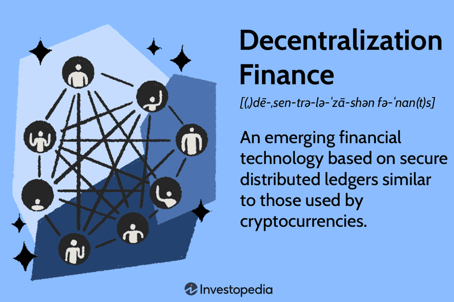

## Table of Contents

## What is Decentralized Finance (DeFi)?

Decentralized Finance, or DeFi, is a type of financial service that works on the internet without a central authority like a bank. Instead, it uses blockchain technology, which is like a digital record book that everyone can see and agree on. This means people can lend, borrow, or trade money directly with each other, all over the internet. DeFi aims to make financial services more open and available to everyone, no matter where they live or how much money they have.

One big idea behind DeFi is that it can help people who don't have easy access to traditional banks. For example, someone in a remote area might not have a bank nearby, but they can use DeFi on their phone to save or borrow money. However, DeFi can be tricky because it's new and still figuring things out. There are risks, like losing money if something goes wrong with the technology or if there's a security problem. So, while DeFi has a lot of potential to change how we handle money, it's important to be careful and learn about it before jumping in.

## How does DeFi differ from traditional finance?

DeFi, or Decentralized Finance, and traditional finance work differently in how they handle money and services. Traditional finance uses banks and other big companies to manage money. These banks control your account, decide who can borrow money, and set the rules for how you can use their services. On the other hand, DeFi uses blockchain technology, which is like a big, shared notebook that everyone can see and agree on. This means you don't need a bank to hold your money or approve your loans. Instead, you can do these things directly with other people on the internet.

Another big difference is who can use these services. Traditional finance often has strict rules about who can open an account or get a loan. You might need to live in a certain place, have a good credit score, or meet other requirements. DeFi tries to be more open to everyone. As long as you have an internet connection, you can use DeFi services from anywhere in the world. This can be really helpful for people who don't have easy access to banks. However, DeFi is still new and can be risky, so it's important to learn about it before you start using it.

## What are the basic components of DeFi trading models?

DeFi trading models are made up of a few key parts that help them work without banks. One important part is smart contracts, which are like automatic agreements written in computer code. When certain conditions are met, the smart contract does what it's supposed to do without anyone needing to step in. For example, if you want to trade one type of cryptocurrency for another, the smart contract can make the trade happen automatically.

Another part of DeFi trading models is decentralized exchanges (DEXs). These are places on the internet where you can trade cryptocurrencies directly with other people, without a middleman like a bank or a traditional exchange. DEXs use the blockchain to keep track of all the trades, so everyone can see what's happening and trust that the trades are fair. This makes trading more open and available to anyone with an internet connection.

Liquidity pools are also a big part of DeFi trading. These are like shared pools of money that people can add to or take from. When you want to trade on a DEX, you might use a liquidity pool to make the trade happen. People who add money to these pools can earn rewards, which encourages more people to join in and keep the trading going smoothly. Together, these parts help make DeFi trading work in a way that's different from traditional finance.

## What are the most common DeFi trading platforms?

Some of the most common DeFi trading platforms are Uniswap, SushiSwap, and PancakeSwap. Uniswap is one of the biggest and most popular decentralized exchanges. It lets you trade different cryptocurrencies directly with other people, without needing a bank or a traditional exchange. SushiSwap is similar to Uniswap but also offers extra features like staking, where you can earn rewards for holding onto certain cryptocurrencies. PancakeSwap is another popular platform, but it's built on a different blockchain called Binance Smart Chain, which can be cheaper and faster to use than other blockchains.

These platforms work by using smart contracts and liquidity pools. Smart contracts are like automatic agreements that make trades happen without anyone needing to step in. Liquidity pools are shared pools of money that people can add to or take from to make trades happen. When you use these platforms, you're trading directly with other people on the internet, and the blockchain keeps track of everything to make sure it's fair and open. While DeFi trading can be exciting and open up new opportunities, it's also important to be careful because it's still new and can be risky.

## How do Automated Market Makers (AMMs) work in DeFi?

Automated Market Makers (AMMs) are a key part of DeFi trading platforms like Uniswap and SushiSwap. They work by using pools of money called liquidity pools. Instead of trading with another person directly, you trade with these pools. When you want to trade one cryptocurrency for another, the AMM uses a special formula to figure out how much you should get. This formula is usually based on how much of each cryptocurrency is in the pool. So, if you want to trade your Ethereum for some DAI, the AMM will look at the pool and use the formula to decide how much DAI you get for your Ethereum.

The cool thing about AMMs is that anyone can add money to these liquidity pools and become a liquidity provider. When you add money to a pool, you help make it easier for other people to trade. In return, you can earn rewards from the fees that traders pay. This encourages more people to join in and keep the pools full of money, which makes trading smoother for everyone. However, being a liquidity provider can also be risky because the value of the cryptocurrencies in the pool can go up and down, and you might end up with less money than you started with. So, it's important to understand these risks before you decide to add money to a liquidity pool.

## What is liquidity provision in DeFi and how does it benefit traders?

Liquidity provision in DeFi means people add their money to shared pools, called liquidity pools, on trading platforms like Uniswap or SushiSwap. These pools are used by other people who want to trade one cryptocurrency for another. When someone adds their money to a pool, they become a liquidity provider. This helps make sure there's enough money in the pool for trades to happen smoothly. In return, liquidity providers earn rewards from the fees that traders pay when they make trades. This encourages more people to add their money to the pools, which helps keep the trading platform working well.

Traders benefit from liquidity provision because it makes trading easier and faster. When there's a lot of money in the liquidity pools, traders can quickly swap one cryptocurrency for another without waiting for someone else to trade with them. This means they can get the best price available at that moment. Plus, having more money in the pools can help keep the prices stable, so traders don't have to worry as much about big price swings when they're making trades. Overall, liquidity provision helps create a better trading experience for everyone using DeFi platforms.

## What are the risks associated with DeFi trading?

DeFi trading can be exciting, but it also comes with some risks that you should know about. One big risk is smart contract risk. Smart contracts are like automatic agreements that make trades happen without anyone needing to step in. But if there's a mistake in the code, hackers might find a way to steal money from the platform. This has happened before, and people have lost a lot of money because of it. So, it's important to check the smart contracts carefully before you start trading on a DeFi platform.

Another risk is called impermanent loss. This can happen if you're a liquidity provider and you add your money to a liquidity pool. If the price of the cryptocurrencies in the pool changes a lot, you might end up with less money than you started with when you take your money out. This is different from just holding onto your cryptocurrencies, where the value might go up or down but you know exactly what you have. Impermanent loss can be confusing and risky, so it's something to think about before you decide to be a liquidity provider.

Lastly, there's the risk of high volatility. The prices of cryptocurrencies can go up and down a lot, sometimes very quickly. This means you could make or lose a lot of money in a short time. It's different from traditional markets, where prices usually don't change as much. Because DeFi is still new and not as regulated, it can be even more unpredictable. So, it's important to be ready for big price swings and only trade with money you can afford to lose.

## How can one manage and mitigate risks in DeFi trading?

To manage and mitigate risks in DeFi trading, it's important to do your homework first. Before you start trading, take the time to learn about the platform you're using. Look into the smart contracts and make sure they've been checked by experts to be safe. Also, read up on the team behind the platform and see if they have a good track record. It's a good idea to start small, too. Only use money you can afford to lose, so if something goes wrong, it won't hurt you too much. This way, you can get a feel for how DeFi trading works without putting too much at risk.

Another way to reduce risks is to diversify. Instead of putting all your money into one type of cryptocurrency or one liquidity pool, spread it out across different ones. This can help protect you from big losses if one of them doesn't do well. Also, keep an eye on the market and be ready to pull your money out if things start to look risky. Using stop-loss orders can help you do this automatically. And remember, the world of DeFi is always changing, so stay updated on new developments and be ready to adjust your strategies as needed. By being careful and staying informed, you can enjoy the benefits of DeFi trading while keeping the risks under control.

## What advanced strategies can be used in DeFi trading?

One advanced strategy in DeFi trading is yield farming. This means you put your money into different DeFi platforms to earn the highest rewards possible. You might move your money from one platform to another to chase the best returns. It's like shopping around for the best deals, but with your cryptocurrencies. Yield farming can be exciting because you can earn a lot, but it's also risky. The rewards can change quickly, and you might lose money if the value of the cryptocurrencies you're using goes down. So, it's important to keep a close eye on the market and be ready to change your strategy if needed.

Another strategy is using leverage in DeFi trading. This means you borrow money to trade with more than you actually have. It can help you make bigger profits if your trades go well, but it can also lead to bigger losses if they don't. For example, if you think the price of a cryptocurrency will go up, you can borrow money to buy more of it. If the price does go up, you can pay back the loan and keep the extra money as profit. But if the price goes down, you might owe more money than you can pay back. Using leverage can be tricky, so it's important to understand the risks and only use it if you're comfortable with the possibility of losing more than you started with.

## How does yield farming work and what are its implications?

Yield farming is like planting money in different DeFi platforms to grow more money. You put your cryptocurrencies into special pools or lending programs, and in return, you get rewards. These rewards can be in the form of more cryptocurrencies, which you can then use to earn even more rewards by moving them to other platforms. It's a bit like shopping around for the best deals, but with your money. People who do yield farming are always looking for the highest returns, which means they might move their money around a lot to chase the best opportunities.

However, yield farming can be risky. The rewards can change quickly, and the value of the cryptocurrencies you're using can go up and down a lot. If the value goes down, you might end up with less money than you started with. Also, some platforms might not be safe, and you could lose your money if something goes wrong with their smart contracts. So, while yield farming can help you earn a lot of money, it's important to be careful and understand the risks. Always do your research and only use money you can afford to lose.

## What is the role of smart contracts in DeFi trading models?

Smart contracts are like automatic agreements that help DeFi trading happen without banks or other middlemen. They are written in computer code and run on the blockchain, which is like a big, shared notebook that everyone can see. When certain conditions are met, the smart contract does what it's supposed to do, like making a trade or sending money. This means you can trade cryptocurrencies directly with other people on the internet, and the smart contract makes sure everything happens fairly and automatically.

The role of smart contracts in DeFi is really important because they make trading more open and available to everyone. As long as you have an internet connection, you can use DeFi platforms to trade, lend, or borrow money. But, there's a risk with smart contracts too. If there's a mistake in the code, hackers might find a way to steal money from the platform. So, it's important to check the smart contracts carefully before you start trading on a DeFi platform to make sure they are safe.

## How are DeFi trading models evolving with new technologies and regulations?

DeFi trading models are changing a lot because of new technologies and rules. One big change is the use of layer 2 solutions, which make trading faster and cheaper. These solutions work on top of the main blockchain, like Ethereum, and help speed things up. Another new technology is cross-chain interoperability, which lets different blockchains talk to each other. This means you can trade cryptocurrencies from different blockchains more easily. Also, new tools like decentralized oracles are helping DeFi platforms get more accurate information from the real world, which makes trading safer and more reliable.

Regulations are also playing a big role in how DeFi trading models are evolving. Governments and financial watchdogs are starting to pay more attention to DeFi because it's growing so fast. They want to make sure it's safe and fair for everyone. Some places are making new rules to protect people who use DeFi platforms, while others are trying to figure out how to fit DeFi into their existing laws. As these rules change, DeFi platforms might need to adjust how they work to follow them. This could mean more checks and balances to make sure everything is above board, but it could also make DeFi more trusted and widely used.

## What are the key factors for creating sustainable DeFi ecosystems in terms of revenue and growth?

Supra is at the forefront of developing sustainable revenue models in decentralized finance (DeFi) by leveraging automation. Automation reduces manual intervention, enhances efficiency, and optimizes the allocation of resources across the ecosystem. This section examines the mechanisms of auto-liquidations and auto-arbitrage within the Supra ecosystem, and the pivotal role of network-owned liquidity in promoting financial growth.

Auto-liquidations represent a critical process in DeFi, ensuring that borrowed assets are sufficiently collateralized. Supra utilizes automated systems to monitor collateral levels continuously, executing liquidations when the collateral falls below a predetermined threshold. This threshold can be represented as:

$$
\text{Collateral Ratio} = \frac{\text{Collateral Value}}{\text{Debt Value}}
$$

When this ratio dips below a critical level, the system automatically initiates liquidation procedures, thus maintaining the overall health and stability of the lending and borrowing platform.

Similarly, auto-arbitrage plays a crucial role in eliminating inefficiencies within and across different DeFi platforms. By using sophisticated algorithms to detect price discrepancies, Supra's systems automatically execute trades to take advantage of these variations. This not only stabilizes prices across the network but also generates revenue by capitalizing on market inefficiencies. Python can be used to implement a simple version of such automated trading strategies, where a program continuously monitors asset prices across exchanges and executes trades when profitable discrepancies are found:

```python
def detect_arbitrage_opportunity(prices):
    for asset, exchanges in prices.items():
        for i, (exchange1, price1) in enumerate(exchanges.items()):
            for exchange2, price2 in list(exchanges.items())[i+1:]:
                if price1 > price2:
                    yield (asset, exchange1, exchange2, price1, price2)

def execute_trades(arbitrage_opportunities):
    for asset, exchange1, exchange2, price1, price2 in arbitrage_opportunities:
        print(f"Buy {asset} on {exchange2} at {price2} and sell on {exchange1} at {price1}")

prices_data = {
    "ETH": {"ExchangeA": 2100, "ExchangeB": 2050},
    "BTC": {"ExchangeA": 35000, "ExchangeB": 34900}
}

opportunities = detect_arbitrage_opportunity(prices_data)
execute_trades(opportunities)
```

Network-owned liquidity is another cornerstone of Supra's strategy to foster sustainable growth. It involves the protocol itself holding liquidity, as opposed to relying solely on external liquidity providers. This approach stabilizes liquidity availability and reduces dependency on speculative capital, thereby ensuring a more resilient and efficient market. Network-owned liquidity can effectively mitigate risks associated with liquidity shortages by ensuring there is always a baseline availability of assets to fulfill trades and facilitate seamless financial operations.

By harnessing these automated systems and strategies, Supra not only enhances the efficiency of DeFi operations but also creates a more robust framework for generating sustainable revenue. This innovation in managing liquidity and automating crucial financial processes marks a significant advancement in the quest for a sustainable and scalable DeFi ecosystem.

## References & Further Reading

[1]: Schär, F., & Berentsen, A. (2020). ["Decentralized Finance: On Blockchain- and Smart Contract-Based Financial Markets."](https://papers.ssrn.com/sol3/papers.cfm?abstract_id=3843844) CFA Institute Research Foundation.

[2]: Dixon, M. F. (2020). ["Financial Markets and Trading comprehensively explains contemporary financial markets and trading."](https://link.springer.com/article/10.1007/s11408-021-00389-1) Chapman and Hall/CRC Press.

[3]: Antonopoulos, A. M., & Wood, G. (2018). ["Mastering Ethereum: Building Smart Contracts and DApps."](https://www.amazon.com/Mastering-Ethereum-Building-Smart-Contracts/dp/1491971940) O'Reilly Media.

[4]: Buterin, V. (2014). ["A Next-Generation Smart Contract and Decentralized Application Platform."](https://ethereum.org/content/whitepaper/whitepaper-pdf/Ethereum_Whitepaper_-_Buterin_2014.pdf) Ethereum White Paper.

[5]: Narayanan, A., Bonneau, J., Felten, E., Miller, A., & Goldfeder, S. (2016). ["Bitcoin and Cryptocurrency Technologies: A Comprehensive Introduction."](https://press.princeton.edu/books/hardcover/9780691171692/bitcoin-and-cryptocurrency-technologies) Princeton University Press. 

[6]: Dune Analytics. ["A visual analysis of Decentralized Finance (DeFi) developments."](https://dune.com/home) Dune Analytics Platform.

[7]: Schueffel, P. (2021). ["Taming the Wild West: Regulatory Implications of Decentralized Finance."](https://www.semanticscholar.org/paper/Taming-the-Beast:-A-Scientific-Definition-of-Schueffel/eac0800f2ab182ecdca3ff48b31f9146f26f5c62) Swiss Institute for Management & Organization. 

[8]: Werbach, K. (2018). ["The Blockchain and the New Architecture of Trust."](https://direct.mit.edu/books/book/4168/The-Blockchain-and-the-New-Architecture-of-Trust) MIT Press.