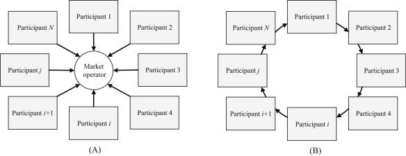

## Table of Contents

## What is a decentralized market?

A decentralized market is a type of market where there is no single authority or central place controlling it. Instead, it works through a network of people and computers all over the world. They all follow the same set of rules, but no one person or group is in charge. This can make the market more open and fair because everyone has a say in how things work.

In a decentralized market, buying and selling happens directly between people, often using technology like blockchain. This means that instead of going through a bank or a big company, people can trade with each other directly. This can make things faster and cheaper, but it also means that people need to be more careful and understand the risks, because there's no big company to help if something goes wrong.

## How does a decentralized market differ from a traditional market?

A decentralized market is different from a traditional market because it doesn't have a central authority controlling everything. In a traditional market, like a stock exchange or a supermarket, there's usually a big company or government in charge. They make the rules, keep things running smoothly, and help solve problems if something goes wrong. But in a decentralized market, the power is spread out among all the people using it. Everyone follows the same rules, but no one person or group is in control.

Another big difference is how buying and selling happens. In a traditional market, you usually go through a middleman like a bank or a store. They take a cut of the money to help make the trade happen. In a decentralized market, people trade directly with each other, often using technology like blockchain. This can make things cheaper and faster because there's no middleman, but it also means people need to be more careful. Without a big company to help, they have to take more responsibility for their own trades and understand the risks involved.

## What are the main benefits of using decentralized markets?

One of the main benefits of using decentralized markets is that they can be more open and fair. Since no single person or group is in charge, everyone has a say in how things work. This can help prevent one big company from making all the rules and taking a big cut of the money. Instead, people can trade directly with each other, which often means lower costs and faster transactions. 

Another benefit is that decentralized markets can be more secure and private. They often use technology like blockchain, which keeps a record of all transactions in a way that's hard to change or hack. This can make people feel safer when they're trading, because they know their information is protected. Plus, since there's no central authority, people can have more control over their own money and personal data, which is important for privacy.

## Can you explain the role of blockchain in decentralized markets?

Blockchain plays a big role in decentralized markets by helping people trade directly with each other without a middleman. It's like a special kind of record book that keeps track of all the trades that happen. Every time someone buys or sells something, it gets written down in the blockchain. This record is shared with everyone in the market, so everyone can see what's happening. Because the record is shared and hard to change, it makes the market more fair and secure. People can trust that their trades are safe and that no one can cheat the system.

Another important thing about blockchain is that it helps keep people's information private. When you make a trade on a blockchain, you don't have to give your name or other personal details. Instead, you use a special code, called a "public key," to make the trade. This way, you can buy and sell things without sharing your private information with a big company or anyone else. This makes decentralized markets not only more secure but also more private, which is something a lot of people care about.

## What are some common examples of decentralized markets?

One common example of a decentralized market is cryptocurrency exchanges like Bitcoin and Ethereum. These markets allow people to trade digital money directly with each other, without needing a bank or a big company to help. All the trades are recorded on a blockchain, which keeps everything fair and secure. People like using these markets because they can be faster and cheaper than traditional banks, and they can keep their money more private.

Another example is decentralized finance, or DeFi, platforms. These platforms let people do things like borrow money, lend money, or trade without going through a traditional bank. Everything happens on a blockchain, so people can trust that their money is safe and that no one can change the rules without everyone agreeing. DeFi is popular because it gives people more control over their money and lets them do things that might be hard or expensive with a regular bank.

Peer-to-peer marketplaces like OpenBazaar are also examples of decentralized markets. These platforms let people buy and sell things directly with each other, without a big company in the middle. Everything is recorded on a blockchain, which keeps the market fair and secure. People like using these marketplaces because they can be cheaper and more private than traditional online shopping sites.

## How do transactions occur in a decentralized market?

In a decentralized market, transactions happen directly between people without a middleman like a bank or a big company. When someone wants to buy or sell something, they use a special kind of computer network called a blockchain. The blockchain keeps a record of every trade that happens, and everyone in the market can see this record. To make a trade, people use special codes called "public keys" and "private keys." The public key is like your address, and the private key is like your secret password. When you want to make a trade, you use these keys to send and receive things like money or goods.

Once the trade is made, it gets written down in the blockchain. This record is shared with everyone in the market, so everyone can see that the trade happened and that it's fair. Because the blockchain is hard to change or hack, people can trust that their trades are safe. This way, people can buy and sell things without worrying about a big company taking a cut of their money or changing the rules. It makes trading faster, cheaper, and more private.

## What are the risks and challenges associated with decentralized markets?

One of the main risks of using decentralized markets is that they can be more complicated and harder to understand than traditional markets. Since there's no big company in charge, people need to take more responsibility for their own trades. This means they have to learn how to use new technologies like blockchain and understand how to keep their money safe. If someone makes a mistake, like losing their private key, they might lose their money and no one can help them get it back. Also, because there's no central authority, it can be harder to solve problems if something goes wrong, like if someone tries to cheat or if there's a technical issue.

Another challenge is that decentralized markets can be less stable and more risky than traditional markets. The value of things like cryptocurrencies can go up and down a lot, which can be scary for people who are used to more stable markets. There's also a risk of scams and fraud, because without a big company to watch over things, it's easier for bad people to try to trick others. People need to be very careful and do a lot of research before they start trading in a decentralized market. Even though these markets can be faster and cheaper, the risks can be higher, and it's important for people to understand what they're getting into.

## How can one participate in a decentralized market?

To participate in a decentralized market, you first need to choose which market you want to join, like a cryptocurrency exchange or a DeFi platform. Once you've picked a market, you'll need to set up a digital wallet. This wallet is like a special bank account that you can use to keep your money safe and make trades. You'll need to create a public key, which is like your address, and a private key, which is like your secret password. It's really important to keep your private key safe, because if you lose it, you might lose your money and no one can help you get it back.

After you've set up your wallet, you can start trading. To buy or sell something, you'll use your public and private keys to make the trade on the blockchain. The blockchain keeps a record of every trade, so everyone can see that it's fair and secure. You can trade things like cryptocurrencies, lend or borrow money, or buy and sell goods directly with other people. Just remember to be careful and do your research, because decentralized markets can be more risky than traditional markets. But if you understand how they work, you can enjoy faster and cheaper trades, and keep your money more private.

## What regulatory issues surround decentralized markets?

Decentralized markets face a lot of regulatory issues because they don't have a central authority like a big company or government in charge. This makes it hard for governments to control and watch over these markets. They worry about things like fraud, money laundering, and protecting people from losing their money. Since these markets use technologies like blockchain, which can be hard to understand, it's a challenge for regulators to make rules that keep things safe without stopping the good things about decentralized markets.

Governments around the world are trying to figure out how to regulate decentralized markets. Some countries are making new laws to help protect people and stop bad things from happening. But because these markets work across borders, it's tricky to make rules that everyone agrees on. People who use decentralized markets need to keep an eye on the rules in their country and be ready for changes, because what's okay today might not be okay tomorrow.

## How do decentralized markets impact global trade and economics?

Decentralized markets can change how people buy and sell things all over the world. They let people trade directly with each other, without needing a big company or bank in the middle. This can make trading faster and cheaper, because there's no middleman taking a cut of the money. It also means that people from different countries can trade more easily, because they don't have to worry about different rules and fees from banks. This can help more people get involved in global trade and make it easier for small businesses to sell their things to people far away.

But decentralized markets also bring new challenges to global trade and economics. Because they're not controlled by any one country or group, it's hard for governments to make rules that keep things safe and fair. This can make it harder to stop bad things like fraud and money laundering. Also, the value of things like cryptocurrencies can go up and down a lot, which can make trading riskier. Even though decentralized markets can help more people trade and save money, they can also make the world economy less stable if people aren't careful.

## What future developments can we expect in decentralized markets?

In the future, we can expect decentralized markets to become even more popular and easier to use. As more people learn about how they work, and as the technology gets better, it will be simpler for anyone to join in and start trading. We might see new tools and apps that make it easier to buy and sell things, lend and borrow money, or do other kinds of trades without a big company in the middle. This could help more people around the world get involved in global trade and save money on fees.

But there will also be challenges. Governments will keep trying to make new rules to keep things safe and stop bad things from happening. This might mean that some countries will be slower to accept decentralized markets, while others might be quicker to let people use them. The value of things like cryptocurrencies could still go up and down a lot, which means people will need to be careful. Even with these challenges, if people learn how to use decentralized markets safely, they could change the way we trade and do business all over the world.

## How can businesses leverage decentralized markets for growth?

Businesses can use decentralized markets to grow by reaching more customers and saving money. Since these markets let people trade directly with each other without a middleman, businesses can sell their things to people all over the world without worrying about different rules and fees from banks. This can help small businesses grow bigger, because they can sell to more people and keep more of the money they make. Plus, using technologies like blockchain can make trading faster and cheaper, which means businesses can spend less time and money on making deals and more time on growing their business.

But businesses also need to be careful when using decentralized markets. They have to learn how to use new technologies and understand the risks, like the value of cryptocurrencies going up and down a lot. They also need to keep an eye on the rules in different countries, because what's okay in one place might not be okay in another. If businesses can figure out how to use decentralized markets safely, they can grow faster and reach more people, but they have to be ready for the challenges that come with it.

## References & Further Reading

[1]: Bergstra, J., Bardenet, R., Bengio, Y., & Kégl, B. (2011). ["Algorithms for Hyper-Parameter Optimization."](https://proceedings.neurips.cc/paper/2011/file/86e8f7ab32cfd12577bc2619bc635690-Paper.pdf) Advances in Neural Information Processing Systems 24.

[2]: ["Advances in Financial Machine Learning"](https://www.amazon.com/Advances-Financial-Machine-Learning-Marcos/dp/1119482089) by Marcos Lopez de Prado

[3]: Nakamoto, S. (2008). ["Bitcoin: A Peer-to-Peer Electronic Cash System."](https://nakamotoinstitute.org/library/bitcoin/)

[4]: Narayanan, A., Bonneau, J., Felten, E., Miller, A., & Goldfeder, S. (2016). ["Bitcoin and Cryptocurrency Technologies: A Comprehensive Introduction"](https://press.princeton.edu/books/hardcover/9780691171692/bitcoin-and-cryptocurrency-technologies)

[5]: ["Evidence-Based Technical Analysis: Applying the Scientific Method and Statistical Inference to Trading Signals"](https://www.amazon.com/Evidence-Based-Technical-Analysis-Scientific-Statistical/dp/0470008741) by David Aronson

[6]: ["Machine Learning for Algorithmic Trading"](https://github.com/stefan-jansen/machine-learning-for-trading) by Stefan Jansen

[7]: ["Quantitative Trading: How to Build Your Own Algorithmic Trading Business"](https://github.com/LucindaYa/quant-resources/blob/master/Quantitative%20Trading%20How%20to%20Build%20Your%20Own%20Algorithmic%20Trading%20Business.pdf) by Ernest P. Chan