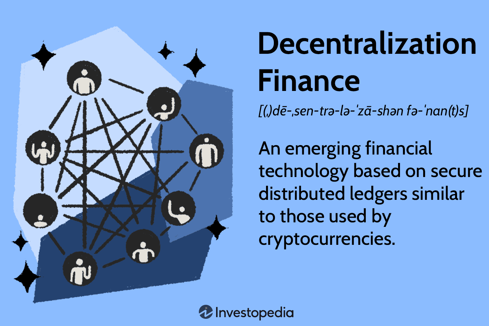

Economic systems serve as the foundation for the distribution and allocation of resources within a society. These systems determine how goods and services are produced, distributed, and consumed, influencing the economic well-being of individuals and communities. Traditional centralized markets have been the norm for centuries, where centralized exchanges or institutions typically mediate transactions between parties. This system has allowed for the establishment of regulatory frameworks, standardization, and centralized control, which help maintain market stability and trust.

However, recent technological advancements have given rise to decentralized markets. Unlike traditional markets, decentralized markets leverage technology to enable direct transactions between buyers and sellers, bypassing centralized exchanges. This shift has been largely propelled by the advent of digital technologies such as blockchain, which provide the infrastructure necessary for secure, transparent, and efficient peer-to-peer transactions.



Decentralized markets challenge the fundamental structure of conventional economic systems by redistributing control and authority from centralized entities to individual participants. This transformation is characterized by increased transparency, reduced transaction costs, and a democratization of access to market opportunities. Additionally, the emergence of cryptocurrencies and blockchain-based platforms illustrates the potential for decentralized models to reshape financial systems globally.

This article explores the intersection of economic systems, decentralized markets, market decentralization, and the pivotal role of algorithmic trading in this evolving landscape. We aim to provide a comprehensive understanding of how these elements interact and reshape contemporary trading practices. By examining these aspects, we seek to illuminate the profound changes that are occurring and the implications they hold for the future of global markets. As these developments continue to unfold, they present both opportunities and challenges for market participants, necessitating adaptability and a forward-looking perspective.

## Table of Contents

## Understanding Decentralized Markets

Decentralized markets represent a paradigm shift in how trading is conducted, moving away from traditional centralized exchanges to systems where participants can trade directly with each other. This transformation is driven by advancements in digital technologies facilitating real-time transactions and broadening market access.

A quintessential example of decentralized markets is the foreign exchange (Forex) market, the world's largest decentralized market by trading volume. Forex operates on a global scale, where currencies are traded directly between participants via computer networks, rather than a centralized exchange. This structure promotes increased liquidity and allows participants from different regions to engage in trading round the clock.

Another prominent example is the rise of blockchain-based systems, with cryptocurrencies like Bitcoin and Ethereum leading the charge. Unlike traditional markets, blockchain technology enables peer-to-peer exchanges, recording every transaction on a decentralized ledger distributed across various nodes. This transparency ensures that bid/ask prices are available in real-time and that there is a public and immutable record of all transactions, minimizing chances of fraud and manipulation.

The operational mechanics of decentralized markets heavily rely on digital infrastructure to ensure seamless execution. For instance, smart contracts—self-executing contracts with the terms of the agreement directly written into code—facilitate transactions on blockchain networks. These contracts automatically execute and enforce the terms of a trade when pre-specified conditions are met, thus eliminating the need for intermediaries and reducing transaction costs significantly.

Participants in decentralized markets enjoy several benefits. Transparency is enhanced as all transaction details are publicly accessible, fostering trust among traders. Transaction costs are often lower due to the elimination of intermediaries required in traditional trading. Moreover, individuals gain access to a wider array of market opportunities and assets that may not be available through conventional means. This democratization of access opens up financial markets to a broader audience, encouraging greater participation and competition. 

In summary, decentralized markets leverage digital technologies to redefine trading dynamics, promoting direct transactions that enhance transparency, reduce costs, and expand market opportunities for participants worldwide.

## Economic Systems and Market Decentralization

Market decentralization represents a fundamental shift from traditional economic systems that have long relied on centralized control mechanisms. In conventional settings, economic activities are often orchestrated by a central authority, such as a government or a dominant market player, which dictates the distribution and allocation of resources. This centralized approach can lead to inefficiencies, as decisions are made at higher levels without direct insight into the granular market conditions.

Decentralized systems, in contrast, distribute control among participants, which fosters an environment of innovation and efficiency. This distribution empowers individual market entities to make autonomous decisions based on real-time data and localized knowledge, leading to more adaptive and responsive systems. The emergence of decentralized financial models, such as those seen in blockchain and [cryptocurrency](/wiki/cryptocurrency) markets, exemplifies the transformative impact of economic decentralization on global markets.

A decentralized market inherently promotes a more participatory form of economic interaction. By removing intermediaries, participants can transact directly with one another, thus reducing transaction costs and increasing transparency. For example, peer-to-peer cryptocurrency exchanges allow users to buy and sell assets without the need for a traditional centralized exchange, providing participants with greater control over their transactions.

The rise of decentralized finance (DeFi) models further highlights the consequences of economic decentralization. DeFi platforms leverage blockchain technology to offer financial services such as lending, borrowing, and trading without the need for conventional banks or financial institutions. This shift challenges traditional economic paradigms by diminishing the influence of central bodies, promoting competition, and paving the way for novel financial instruments and services that cater to a global audience.

Furthermore, decentralized systems facilitate innovation by enabling modular financial products that can interoperate seamlessly. This interoperability accelerates the development of complex services by allowing developers to build on existing protocols, creating a rich ecosystem of interconnected financial applications.

However, as decentralized markets grow, they also introduce new challenges and considerations for economic systems. For instance, the lack of centralized oversight can make it difficult to address issues such as data integrity, security concerns, and accountability in case of disputes. These challenges necessitate advancements in regulatory frameworks to ensure that the benefits of decentralization are fully realized while safeguarding market participants.

In summary, market decentralization empowers participants by distributing control and authority across the market landscape, fostering innovation and increasing efficiency. The proliferation of decentralized financial models serves as a testament to the profound impact of these changes. As such, understanding and adapting to this shift is essential for individuals and institutions aiming to engage successfully in contemporary global markets.

## The Role of Algorithmic Trading

Algorithmic trading leverages computer algorithms to execute trades based on a set of pre-defined instructions, often encompassing various parameters such as timing, price, and [volume](/wiki/volume-trading-strategy). This method effectively removes human emotion from trading decisions, which can sometimes lead to irrational or impulsive actions in traditional trading environments. By allowing trades to be conducted at speeds and frequencies that are manual traders are unable to match, [algorithmic trading](/wiki/algorithmic-trading) facilitates high-frequency trading ([HFT](/wiki/high-frequency-trading-strategies)) operations. 

These algorithms can be programmed to identify and exploit fleeting [arbitrage](/wiki/arbitrage) opportunities, where price differentials exist between different markets or platforms. Such opportunities are particularly prevalent in decentralized markets, where the absence of a centralized exchange can lead to price discrepancies. By swiftly executing trades across multiple platforms, algorithmic trading helps reduce arbitrage opportunities and improves market efficiency by aligning prices more uniformly across exchanges.

Additionally, the automation of trades inherent in algorithmic trading makes it compatible with the rapid and ever-changing environment of decentralized markets. Decentralized trading often involves a vast array of assets spread over numerous platforms. The capacity of algorithms to swiftly process large volumes of data enables them to react instantaneously to market shifts, ensuring that trades are executed under optimal conditions. This capability not only enhances the [liquidity](/wiki/liquidity-risk-premium) and transparency of the market but also alleviates bottleneck issues that might arise in a decentralized framework.

The advantages of algorithmic trading extend beyond efficiency improvements. By executing trades based on complex mathematical models and extensive historical data analysis, algorithmic trading strategies can be rigorously tested and optimized for various market conditions. For instance, Python, a popular programming language in financial analytics, can be employed to backtest trading algorithms. Here's a simple example of how a moving average crossover strategy might be implemented:

```python
import pandas as pd
import numpy as np

# Assume 'data' is a DataFrame containing historical price data
data['SMA_50'] = data['Close'].rolling(window=50).mean()
data['SMA_200'] = data['Close'].rolling(window=200).mean()

# Generate buy/sell signals
data['Signal'] = np.where(data['SMA_50'] > data['SMA_200'], 1, 0)
data['Position'] = data['Signal'].diff()

# Print the data with signals
print(data[['Close', 'SMA_50', 'SMA_200', 'Signal', 'Position']])
```

This Python code calculates the 50-day and 200-day simple moving averages (SMA) on historical price data to generate buy and sell signals based on SMA crossovers, demonstrating how algorithmic trading leverages technical indicators.

By removing the human component from trading decisions, algorithmic trading minimizes the psychological biases often associated with trading, enhancing decision accuracy, and consistency. Its integration within decentralized markets underscores a shift towards more systematic, data-driven trading methodologies that are reshaping modern financial markets.

## Advantages and Challenges of Decentralized and Algorithmic Trading

Decentralized and algorithmic trading are reshaping the landscape of financial markets by introducing several advantages and challenges. One of the primary benefits of decentralized trading is the reduced risk of centralized failure. In traditional centralized markets, a single point of failure can lead to significant disruptions in trading activities. Decentralized markets, in contrast, distribute control across participants, thereby minimizing the impact of localized failures on the overall market ecosystem.

Improved liquidity is another significant advantage. Decentralized markets facilitate continuous trading by connecting a global pool of buyers and sellers, which enhances market liquidity. This increased liquidity ensures smoother transactions and potentially more stable pricing due to the higher number of participants. For algorithmic trading, the implementation of pre-defined rules to execute high-frequency trades results in more efficient market functioning by tapping into rapid liquidity shifts.

Enhanced market transparency is also a notable benefit. In decentralized systems, the use of blockchain and other transparent record-keeping technologies ensures that all transactions are publicly recorded and can be verified by any participant. This transparency builds trust among market participants, allowing for more informed decision-making and potentially reducing the likelihood of fraudulent activities.

However, these advantages do not come without challenges. Regulatory oversight presents a primary challenge, as decentralized markets often operate across multiple jurisdictions, complicating the enforcement of existing financial regulations. This lack of uniform regulation can lead to vulnerabilities such as market manipulations. For instance, the rapid speed and high volume characteristic of algorithmic trading present opportunities for exploiting price discrepancies, potentially leading to unfair market practices.

Smart contract risks are another challenge. While smart contracts automate transactions based on coded rules, bugs or security vulnerabilities in the code can lead to unintended outcomes or exploitation by malicious actors. It is crucial to ensure the robustness of these contracts to prevent significant financial losses.

Additionally, decentralized markets based on blockchain technology face operational challenges concerning gas fees and transaction times. Gas fees, which are payments made by users to compensate for the computing energy required to process and validate transactions, can be volatile and increase the cost of trading. Furthermore, while blockchain technology provides a secure and transparent method of transaction recording, it can suffer from slower transaction times compared to traditional centralized systems. This delay can be detrimental in fast-moving markets where the ability to execute trades promptly is crucial.

In conclusion, while decentralized and algorithmic trading offer transformative advantages by improving market resilience, liquidity, and transparency, they also face substantial challenges. Addressing these challenges requires a careful balance of technological innovation with regulatory measures and risk management practices.

## Future Trends and Implications

The integration of Artificial Intelligence (AI) into algorithmic trading systems is poised to significantly enhance the efficiency and precision of decision-making processes. AI technologies, particularly [machine learning](/wiki/machine-learning) and [deep learning](/wiki/deep-learning) models, can process vast amounts of market data to identify patterns and predict market movements with higher accuracy than traditional methods. This capability enables traders to make more informed decisions and execute trades with optimized timing and strategy. Furthermore, the use of AI can facilitate complex arbitrage strategies and risk management tactics, minimizing potential losses and maximizing returns.

Simultaneously, the continued development of blockchain technologies is likely to lead to an increased prevalence of decentralized markets. Blockchain’s capabilities, such as immutability, transparency, and trustless transactions, offer a strong foundation for expanding decentralized markets. As smart contracts become more sophisticated, they can further simplify and secure trading operations, reducing reliance on intermediaries and lowering transaction costs. This development is expected to democratize access to a variety of financial instruments, providing broader participatory opportunities across global markets.

As these technological advancements progress, regulatory frameworks are anticipated to undergo substantial changes to address the unique challenges posed by decentralized markets and AI-driven trade systems. Regulatory bodies globally are expected to implement policies that balance innovation with investor protection and market integrity. Ensuring compliance while fostering technological growth will be key to establishing a sustainable decentralized market environment. This evolution is likely to have profound implications for market participants, influencing their strategies and operational models in the quest for competitive advantage.

## Conclusion

Economic systems are being transformed by the advent of decentralized markets and algorithmic trading, which have introduced novel methods for resource distribution and enhanced trading efficiency. The move away from centralized exchanges signifies a paradigm shift in how transactions are conducted, emphasizing transparency and direct interaction between market participants. This transformation is not merely a technological evolution; it is reshaping the fundamental structures of market economies, offering participants new opportunities to engage with global markets in innovative ways.

Understanding these changes is crucial for market participants, as decentralized and algorithmic trading present unique opportunities for capitalizing on rapid market shifts and optimizing trade execution. The integration of algorithmic trading methodologies facilitates high-frequency trading, enabling more precise and timely market engagement. Participants equipped with a comprehensive understanding of these mechanisms are better positioned to harness their potential, navigating the complexities of modern markets with greater agility.

As these trends continue to evolve, they will significantly shape the future landscape of trading and investment. The ongoing development of blockchain technologies and the increasing use of [artificial intelligence](/wiki/ai-artificial-intelligence) in trading algorithms suggest a future where markets are more interconnected and efficient. However, this evolution also demands careful consideration of regulatory frameworks and potential market risks, ensuring that the benefits of these advancements are realized while mitigating potential drawbacks. As such, participants must remain vigilant and adaptable, ready to embrace the opportunities and challenges presented by this new era of trading.

## References & Further Reading

[1]: Bergstra, J., Bardenet, R., Bengio, Y., & Kégl, B. (2011). ["Algorithms for Hyper-Parameter Optimization."](https://proceedings.neurips.cc/paper/2011/file/86e8f7ab32cfd12577bc2619bc635690-Paper.pdf) Advances in Neural Information Processing Systems 24.

[2]: ["Advances in Financial Machine Learning"](https://www.amazon.com/Advances-Financial-Machine-Learning-Marcos/dp/1119482089) by Marcos Lopez de Prado

[3]: Nakamoto, S. (2008). ["Bitcoin: A Peer-to-Peer Electronic Cash System."](https://nakamotoinstitute.org/library/bitcoin/)

[4]: Narayanan, A., Bonneau, J., Felten, E., Miller, A., & Goldfeder, S. (2016). ["Bitcoin and Cryptocurrency Technologies: A Comprehensive Introduction"](https://press.princeton.edu/books/hardcover/9780691171692/bitcoin-and-cryptocurrency-technologies)

[5]: ["Evidence-Based Technical Analysis: Applying the Scientific Method and Statistical Inference to Trading Signals"](https://www.amazon.com/Evidence-Based-Technical-Analysis-Scientific-Statistical/dp/0470008741) by David Aronson

[6]: ["Machine Learning for Algorithmic Trading"](https://github.com/stefan-jansen/machine-learning-for-trading) by Stefan Jansen

[7]: ["Quantitative Trading: How to Build Your Own Algorithmic Trading Business"](https://github.com/LucindaYa/quant-resources/blob/master/Quantitative%20Trading%20How%20to%20Build%20Your%20Own%20Algorithmic%20Trading%20Business.pdf) by Ernest P. Chan