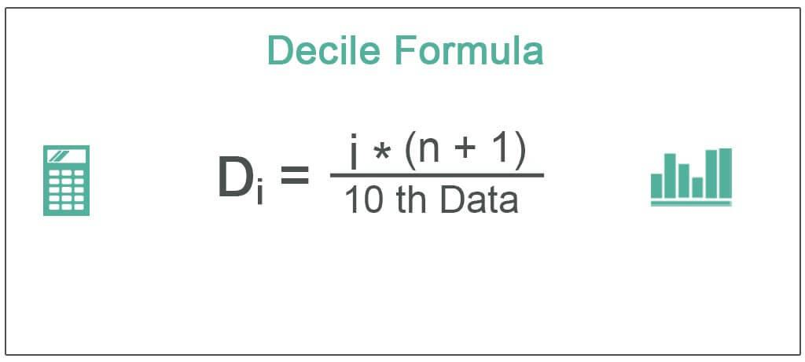

In the rapidly evolving world of trading, the integration of statistical methods and technology is transforming how financial markets operate. Two prominent elements in this transformation are the use of deciles and algorithmic trading. While deciles serve as a statistical tool that segments data into ten equal parts, facilitating a deeper and more structured analysis, algorithmic trading leverages computational algorithms to execute trades automatically based on defined strategies. These strategies are often designed to exploit specific market inefficiencies or conditions.

Deciles play a crucial role in organizing large datasets by dividing them into manageable groups, which helps analysts discern patterns, benchmarks, and anomalies with greater clarity. This segmentation is particularly useful in finance for evaluating performance metrics, assessing risk, and understanding income distributions. On the other hand, algorithmic trading enhances decision-making by automating the trading process, enabling rapid execution and minimizing human error. Algorithms can be programmed to process a vast array of data and make informed decisions within milliseconds.



This article aims to explore the intersection of deciles and algorithmic trading by focusing on how deciles can be calculated and applied within trading strategies. The objective is to equip traders and analysts with the knowledge to use deciles in refining their trading strategies, thereby improving accuracy and outcomes. Through practical examples, the article will demonstrate how efficiently leveraging deciles can lead to more informed trading and strategy development within the dynamic trading landscape.

## Table of Contents

## Understanding Deciles

A decile is a statistical measure that divides a data set into ten parts, each representing an equal portion of the overall data. This segmentation enables analysts to categorize data for more detailed analysis. In finance, deciles are particularly valuable for assessing performance benchmarks, analyzing income distribution, and other applications that require understanding how data is spread across a spectrum.

Deciles function as a tool in descriptive statistics, organizing a data set from highest to lowest values, or vice versa. This categorization helps in identifying patterns and outliers within the data. For example, the highest decile would contain the top 10% of the data values, providing insight into the upper segment of the dataset, while the lowest decile captures the bottom 10%, highlighting the lower tail of the distribution.

To further illustrate, partitioning a financial dataset into deciles allows analysts to observe which investment funds perform within the top decile, marking them as top performers. Conversely, the lowest decile might indicate underperforming assets. These categorizations can guide investment decisions by highlighting outperforming and underperforming segments, aiding in risk assessment and strategic planning.

The decile calculation is straightforward: First, the data should be arranged in ascending order. Then, the positions of each decile can be determined using formulas, such as:

$$
D_j = j \times \frac{(N + 1)}{10}
$$

where $D_j$ is the $j$-th decile, $j$ is the decile number (ranging from 1 to 9), and $N$ is the total number of observations. If the position is not an integer, interpolation may be necessary to find the precise value within the data set that divides it at that point.

By employing deciles, analysts not only categorize but also gain insight into the distribution and variability of the data, ultimately facilitating more informed decision-making based on statistical representation.

## How to Calculate Deciles

Calculating deciles is a statistical process that requires organizing data in increasing order. The formula for identifying the position of a decile is given by:

$$
D_j = \frac{j \times (N + 1)}{10}
$$

where $D_j$ represents the position of the j-th decile, $j$ is the decile number (ranging from 1 to 9), and $N$ is the total number of observations in the dataset.

After calculating the position, interpolation is often necessary if the resulting value is not an integer. Interpolation is used to estimate the value corresponding to the non-integer position within the dataset. This ensures the precise identification of the data point below which a certain percentage of observations fall.

For illustrative purposes, consider a dataset arranged in ascending order. To find the first decile ($D_1$) for a dataset with 100 entries, substitute into the formula: 

$$
D_1 = \frac{1 \times (100 + 1)}{10} = 10.1
$$

The 10.1th position requires interpolation between the 10th and 11th ranks in the dataset. If the 10th value is 15 and the 11th value is 20, the interpolated value for the first decile can be calculated as:

$$
D_1 = 15 + 0.1 \times (20 - 15) = 15.5
$$

This process provides a detailed method to accurately determine deciles, aiding in statistical analysis by segmenting the data into decile groups for in-depth insights.

## Decile Example in Finance

Deciles serve as a valuable tool in the financial industry, particularly for evaluating and ranking the performance of mutual funds. By organizing mutual funds into deciles, analysts can easily discern which funds are at the top of their class and which are lagging. For instance, if a mutual fund is positioned in the 9th decile, it indicates that its performance is among the top 10% compared to its peers. This ranking system streamlines the process of pinpointing high-potential investments as well as recognizing underperforming funds.

An application of deciles in finance is the categorization of mutual funds based on various performance metrics, such as returns or risk-adjusted returns. This structured approach allows investors to make more informed decisions by identifying funds that consistently perform well or those that exhibit significant [volatility](/wiki/volatility-trading-strategies).

Furthermore, government agencies utilize deciles in assessing income distribution, which sheds light on economic disparities within a population. By analyzing income data through deciles, agencies can identify inequality patterns, as well as track changes over time. This type of analysis aids in the development of policies aimed at reducing economic disparities and promoting fair income distribution.

In Python, calculating deciles for mutual fund returns could involve sorting the return data and using a simple calculation to find the decile thresholds:

```python
import numpy as np

# Sample data representing mutual fund returns
returns = [5.2, 3.4, 6.7, 8.1, 2.7, 9.2, 4.3, 7.4, 1.6, 5.9]

# Sort the data
sorted_returns = np.sort(returns)

# Calculate decile positions
decile_positions = [(i * (len(sorted_returns) + 1)) / 10 for i in range(1, 10)]

# Find decile values using interpolation if necessary
deciles = [np.percentile(sorted_returns, 10 * i) for i in range(1, 10)]

print("Decile Values:", deciles)
```

This script sorts a list of returns and calculates the decile values, allowing analysts to categorize mutual funds accordingly. This type of analysis enables investors and analysts to make strategic decisions based on statistically segmented data.

## Incorporating Deciles in Algorithmic Trading

In [algorithmic trading](/wiki/algorithmic-trading), deciles can be a crucial component in developing strategies by providing insights into the distribution of data. A decile-based approach enables traders to structure their automated strategies by considering the historical performance of financial instruments in a granular manner. For instance, traders might leverage decile rankings to make informed decisions regarding whether to buy, hold, or sell stocks. By focusing on stocks that fall within the highest decile of recent returns, algorithms can be programmed to initiate buy orders only for those showing exceptional performance, thereby capitalizing on potential positive trends.

This approach extends beyond just trading decisions; deciles are also beneficial in risk management. By evaluating which decile a particular stock or asset class falls into, traders can gauge volatility levels and adjust their risk management protocols accordingly. For example, stocks in the lowest decile could represent higher risk due to their poor past performance, prompting algorithms to either avoid such stocks or apply tighter stop-loss strategies.

To effectively implement deciles in algorithmic trading, traders must ensure the reliability and consistency of their data inputs. This entails the regular updating of datasets to reflect the most current market conditions, allowing for accurate decile calculations. The decile position for each data point is computed by first sorting the data in ascending order and then applying the formula:

$$
D_j = j \times \frac{(N + 1)}{10}
$$

where $D_j$ is the value of the j-th decile, $j$ is the decile number, and $N$ is the number of observations in the dataset. If the computed position is not an integer, interpolation is required to ascertain the specific data value corresponding to the decile.

The integration of deciles into algorithmic frameworks requires fine-tuned coding to ensure calculations are carried out efficiently and in real-time. A simple Python implementation for calculating deciles might look like this:

```python
def calculate_decile(data, j):
    data_sorted = sorted(data)
    N = len(data_sorted)
    position = j * (N + 1) / 10
    if position.is_integer():
        return data_sorted[int(position) - 1]
    lower = data_sorted[int(position) - 1]
    upper = data_sorted[int(position)]
    return lower + (upper - lower) * (position % 1)
```

Thus, through careful implementation of decile analysis in trading algorithms, traders can better navigate the complexities of financial markets, making strategies more robust and performance-oriented.

## Example of Deciles in Algorithmic Trading

In a practical scenario of algorithmic trading employing deciles, the focus shifts to identifying high-performing stocks for automated trades. The algorithm classifies stocks into deciles based on their historical annual returns, specifically targeting the top decile. This approach ensures that only stocks within the top 10% in terms of performance are considered for trading, thereby seeking to optimize investment returns.

The algorithm begins by processing historical stock return data, sorting it in ascending order, and calculating deciles using the formula: 

$$
D_j = j \times \frac{(N + 1)}{10}
$$

where $D_j$ represents the decile position, $j$ is the decile number (in this case focusing on the 10th), and $N$ is the total number of data points. Once the returns are sorted and deciles calculated, the algorithm identifies stocks ranked within the top decile.

By concentrating on the top decile, the trading strategy aims to capture stocks with strong historical performance, often indicative of positive [momentum](/wiki/momentum) or potential for future gains. Such a focus allows the strategy to maximize returns by concentrating capital on the stocks statistically likely to outperform others.

During [backtesting](/wiki/backtesting), this decile-focused strategy is compared against a baseline trading strategy that does not employ decile analysis. The results often showcase enhanced profitability, as the algorithm efficiently narrows the stock selection to those with proven historical success, thereby reducing exposure to low-performing stocks.

Here's a simplified Python example illustrating how an algorithm might compute deciles and select the top-performing stocks for trading:

```python
import numpy as np
import pandas as pd

# Sample data: stock returns
data = {
    'Stock': ['A', 'B', 'C', 'D', 'E'],
    'AnnualReturn': [0.12, 0.08, 0.10, 0.15, 0.07]
}

df = pd.DataFrame(data)

# Sort data by AnnualReturn
df_sorted = df.sort_values(by='AnnualReturn', ascending=False)

# Calculate deciles
df_sorted['Decile'] = pd.qcut(df_sorted['AnnualReturn'], 10, labels=False) + 1

# Select top decile stocks
top_decile_stocks = df_sorted[df_sorted['Decile'] == df_sorted['Decile'].max()]

print("Top Decile Stocks for Trading:")
print(top_decile_stocks)
```

In this example, the algorithm sorts stocks by their annual returns, calculates deciles, and selects those in the top decile for potential trading. This technique refines trading algorithms, allowing them to target statistically significant market segments, thus potentially increasing profitability while managing risks effectively.

## Conclusion

Deciles and algorithmic trading are essential tools for traders and analysts aiming to improve decision-making processes. By categorizing data into segments such as deciles, analysts achieve a higher level of precision in data analysis, which can be integrated into trading algorithms. These algorithms, incorporating decile analysis, often yield deeper insights into market dynamics and enhance performance metrics by systematically identifying key trends and outliers.

As trading systems evolve, leveraging decile calculations within algorithmic strategies allows for more meticulous and informed trading decisions. Deciles help segment the data in such a way that traders can focus their algorithms on statistically significant market segments, leading to optimized trade decisions. As seen in practice, algorithms that integrate decile analysis focus on top-performing segments of data, resulting in better-targeted trades and optimized returns in historical backtests.

Moreover, as trading technology advances, employing statistical methods like deciles is becoming crucial for shaping future automated trading paradigms. This integration not only enhances the strategic foundation of trading systems but also fosters innovation in how data is utilized for algorithmic development. Consequently, deciles, when effectively incorporated into algorithmic frameworks, stand as a cornerstone for sophisticated trading strategies, driving the efficacy and strategic depth of modern trading systems.

## References & Further Reading

[1]: Bergstra, J., Bardenet, R., Bengio, Y., & Kégl, B. (2011). ["Algorithms for Hyper-Parameter Optimization."](https://dl.acm.org/doi/10.5555/2986459.2986743) Advances in Neural Information Processing Systems 24.

[2]: ["Advances in Financial Machine Learning"](https://www.amazon.com/Advances-Financial-Machine-Learning-Marcos/dp/1119482089) by Marcos Lopez de Prado

[3]: ["Evidence-Based Technical Analysis: Applying the Scientific Method and Statistical Inference to Trading Signals"](https://www.amazon.com/Evidence-Based-Technical-Analysis-Scientific-Statistical/dp/0470008741) by David Aronson

[4]: ["Machine Learning for Algorithmic Trading"](https://github.com/stefan-jansen/machine-learning-for-trading) by Stefan Jansen

[5]: ["Quantitative Trading: How to Build Your Own Algorithmic Trading Business"](https://www.amazon.com/Quantitative-Trading-Build-Algorithmic-Business/dp/1119800064) by Ernest P. Chan

[6]: Cremers, K. J. M., & Petajisto, A. (2009). ["How Active Is Your Fund Manager? A New Measure That Predicts Performance."](https://papers.ssrn.com/sol3/papers.cfm?abstract_id=891719) The Review of Financial Studies, 22(9), 3329–3365.

[7]: Gatev, E., Goetzmann, W. N., & Rouwenhorst, K. G. (2006). ["Pairs Trading: Performance of a Relative Value Arbitrage Rule."](http://www-stat.wharton.upenn.edu/~steele/Courses/434/434Context/PairsTrading/PairsTradingGGR.pdf) The Review of Financial Studies, 19(3), 797–827.