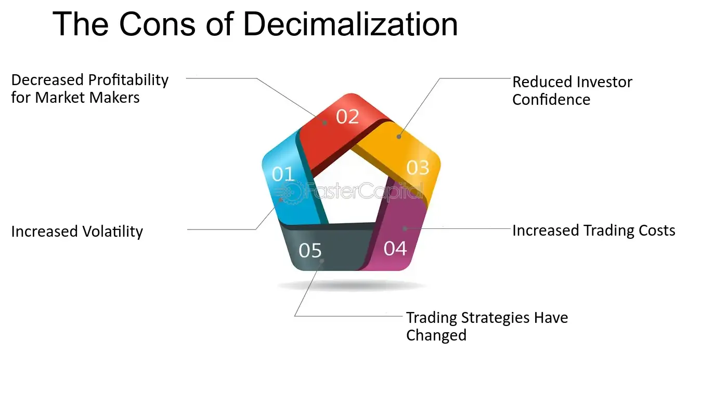

## Table of Contents

## What is decimal trading?

Decimal trading is a way of buying and selling stocks, options, and other financial products using prices that include cents, instead of just whole dollars. Before decimal trading started, stock prices were usually in fractions, like 1/8 or 1/16 of a dollar. This made it hard to understand and calculate prices. But with decimal trading, prices are easier to read and work with because they use decimals, like $25.50 or $50.75.

Decimal trading began in the United States in 2001, and it made a big difference in how trading works. It helped make the smallest price change, called a "tick," smaller, which means traders can be more precise with their buying and selling. This change also made the market more fair and open because everyone can see the same prices and make better choices.

## How does decimal trading differ from fractional trading?

Decimal trading and fractional trading are two different ways to show the price of stocks and other financial products. In fractional trading, prices are shown in fractions of a dollar, like 1/8 or 1/16. This can be confusing because you have to do math to figure out the exact price in dollars and cents. For example, if a stock is priced at 48 1/4, that means it costs $48.25. On the other hand, decimal trading uses prices in dollars and cents, like $48.25. This makes it much easier to understand and work with prices because you don't need to convert fractions.

The switch from fractional to decimal trading happened in the United States in 2001. This change made a big difference in how trading works. With decimal trading, the smallest price change, called a "tick," became smaller. This means traders can be more precise when they buy and sell. It also made the market more fair and open because everyone can see the same prices and make better choices. Overall, decimal trading has made trading simpler and more efficient for everyone involved.

## What are the basic mechanisms of decimal trading?

Decimal trading means buying and selling stocks and other financial products using prices in dollars and cents, like $25.50. This is different from the old way, called fractional trading, where prices were in fractions, like 1/8 of a dollar. Decimal trading makes prices easier to understand because you don't have to do math to figure out the exact price. For example, if a stock is priced at $48.25, you know right away it costs forty-eight dollars and twenty-five cents.

In decimal trading, the smallest price change is called a "tick." With decimals, ticks are usually one cent, which is smaller than the ticks in fractional trading. This lets traders be more precise when they buy and sell. Decimal trading also makes the market more fair and open. Everyone can see the same prices, so it's easier to make good choices. Since the United States started using decimal trading in 2001, trading has become simpler and more efficient for everyone.

## What are the advantages of decimal trading for beginners?

Decimal trading makes it easier for beginners to understand how much stocks and other financial products cost. Instead of dealing with confusing fractions like 1/8 or 1/16 of a dollar, prices are shown in dollars and cents, like $25.50. This means you don't have to do extra math to figure out the price. For example, if a stock is priced at $48.25, you know right away it costs forty-eight dollars and twenty-five cents. This makes trading less complicated and more straightforward for someone just starting out.

Another advantage for beginners is that decimal trading makes the smallest price change, called a "tick," smaller. In decimal trading, a tick is usually just one cent. This lets you be more precise when you buy and sell. It also makes the market more fair and open because everyone can see the same prices. This helps beginners make better choices without feeling overwhelmed. Since decimal trading started in the United States in 2001, it has made trading simpler and more efficient for everyone, especially those new to the market.

## How does decimal pricing affect market liquidity?

Decimal pricing helps make the market more liquid, which means it's easier for people to buy and sell stocks. Before decimal pricing, stock prices were in fractions, like 1/8 or 1/16 of a dollar. This made the smallest price change, called a "tick," bigger. With decimal pricing, the tick size became smaller, usually just one cent. This smaller tick size lets traders be more precise when they buy and sell, which can lead to more trading and better prices.

More trading means more people are buying and selling, which is good for market [liquidity](/wiki/liquidity-risk-premium). When the market is more liquid, it's easier for you to find someone to trade with. This can help keep prices steady and make the market more fair for everyone. Since decimal pricing started in the United States in 2001, it has made trading easier and helped improve how well the market works for everyone.

## What role do decimal increments play in trading strategies?

Decimal increments make a big difference in trading strategies because they let traders be more precise. Before, when prices were in fractions, the smallest price change, called a "tick," was bigger. Now, with decimal pricing, a tick is usually just one cent. This smaller tick size means traders can make smaller, more exact moves when they buy and sell. For example, if a stock is priced at $50.00, a trader can decide to buy at $50.01 or sell at $49.99, making their strategy more fine-tuned.

This precision can help traders take advantage of small price changes and make their trading strategies more effective. Traders can use these small increments to set up tighter stop-loss orders, which help limit losses, or take-profit orders, which help lock in gains. This can lead to more trading and better prices, making the market more liquid. Overall, decimal increments give traders more control and flexibility, helping them create and [carry](/wiki/carry-trading) out their strategies in a more detailed way.

## How has the transition to decimal trading impacted market volatility?

The move to decimal trading has had a mixed effect on market [volatility](/wiki/volatility-trading-strategies). Before decimal trading, prices were in fractions, and the smallest price change, called a "tick," was bigger. This made it harder for prices to change quickly because the steps between prices were larger. With decimal trading, the tick size got smaller, usually to one cent. This means prices can move more easily and quickly, which can lead to more volatility. Traders can now react to small changes in the market faster, which might make prices go up and down more often.

However, the impact on volatility isn't just about smaller tick sizes. Decimal trading has also made the market more liquid, meaning more people are buying and selling. More trading can help keep prices steady because there are always people ready to trade. This can actually reduce volatility because the market is more stable with more traders. So while decimal trading can make prices move more quickly, the increased liquidity can help balance things out, leading to a more stable market overall.

## What are the technological requirements for implementing decimal trading systems?

To use decimal trading systems, you need technology that can handle prices in dollars and cents instead of fractions. This means the trading platforms and software need to be updated to show and work with decimal prices. Computers and servers need to be fast and reliable to deal with the smaller price changes, called ticks, which are usually just one cent. This is important because more trades can happen when prices change by small amounts, so the system needs to keep up.

Also, the trading systems need to be able to handle a lot more data because there are more trades happening with decimal pricing. This means they need more storage and better ways to process information quickly. Security is important too, to keep the trading system safe from hackers and other problems. Overall, moving to decimal trading needs technology that can handle small price changes, lots of data, and keep everything secure and working smoothly.

## How do regulatory bodies oversee decimal trading practices?

Regulatory bodies keep an eye on decimal trading to make sure it's fair and follows the rules. They do this by checking that the prices shown are correct and that everyone can see them. They also make sure that the trading systems are working well and that no one is cheating or doing anything wrong. This helps keep the market honest and safe for everyone.

Regulators also set rules about how decimal trading should work. They decide things like how small the price changes can be and what information traders need to share. By doing this, they help make sure that the market stays stable and that people can trust it. This is important because it helps everyone feel confident when they buy and sell stocks.

## What advanced strategies can be employed in decimal trading environments?

In decimal trading environments, one advanced strategy is called [scalping](/wiki/gamma-scalping). This means traders try to make small profits from tiny price changes. Because decimal trading lets prices move in smaller steps, like one cent, scalpers can buy and sell quickly to take advantage of these small moves. They might use special tools like charts and computer programs to see these small price changes and make fast trades. This strategy needs a lot of focus and quick thinking, but it can add up to big gains over time.

Another strategy is using limit orders more effectively. With decimal trading, traders can set their buy and sell prices very precisely. For example, if a stock is at $50.00, a trader can set a limit order to buy at $49.99 or sell at $50.01. This helps them get better prices and control their trades better. Traders can also use these small price changes to set up tighter stop-loss orders, which help limit losses, and take-profit orders, which help lock in gains. This makes their trading more accurate and can lead to better results.

## How does decimal trading influence high-frequency trading algorithms?

Decimal trading has made a big difference for high-frequency trading algorithms. These algorithms are computer programs that buy and sell stocks very quickly, often in just a few seconds. With decimal trading, the smallest price change, called a "tick," is usually just one cent. This means the algorithms can make trades based on very small price changes. They can buy at $50.00 and sell at $50.01, making tiny profits from these small moves. This lets high-frequency trading algorithms work faster and more often, which can lead to more trading and better prices.

However, decimal trading also makes the market more competitive for these algorithms. Because prices can change by such small amounts, there are more chances for other traders to jump in and make trades. This means high-frequency trading algorithms need to be very fast and smart to stay ahead. They use special tools and computer programs to see these small price changes and make quick decisions. Overall, decimal trading has made high-frequency trading more precise and active, but it also means these algorithms have to work harder to be successful.

## What future trends are expected in decimal trading mechanisms?

In the future, decimal trading is likely to become even more precise and fast. Technology is always getting better, so trading systems will be able to handle even smaller price changes than just one cent. This could mean more trading and better prices for everyone. Also, more people might start using computers and special programs to trade. These programs can look at a lot of information very quickly and make smart trades. This could make the market even more active and help people make better choices when they buy and sell.

Another trend might be more rules and checks to make sure decimal trading stays fair and safe. As trading gets faster and more complicated, regulators will want to make sure no one is cheating or making the market unstable. They might use new tools to watch trading more closely and make sure everyone follows the rules. This could help keep the market honest and make people feel more confident about trading. Overall, decimal trading will probably keep changing and improving, making it easier and safer for everyone to trade.

## What is Understanding Decimal Trading?

Decimal trading is a pricing system for securities where stock prices are expressed in decimal form rather than fractions. Prior to the implementation of decimal trading, stocks in the United States were traditionally quoted in fractions based on eighths or sixteenths of a dollar. This system was not only cumbersome, but it also made price comparisons and computations more challenging for traders and investors.

The transition to decimal trading was fully realized across U.S. stock exchanges in 2001. This shift to a base-10 system was primarily aimed at simplifying the trading process, making it more intuitive and accessible. Decimalization allows for smaller increments in stock price movements, specifically one cent ($0.01), compared to the previous increments of $0.125 or $0.0625 in a fractional system. This smaller minimum price change is known as the "tick size."

One of the significant outcomes of decimalization has been the creation of tighter spreads. The spread is the difference between the bid (buy) and ask (sell) price of a stock. A smaller tick size results in narrower spreads, which translates to reduced trading costs for investors. The immediate visibility of price changes and tighter spreads provide a clearer insight into market conditions, allowing more precise trading decisions.

For example, consider a stock formerly quoted at 25 1/8 dollars under the fractional system, which corresponds to $25.125 in decimal form. With decimal trading, this stock can now be quoted at any point between, such as $25.13 or $25.12, allowing for finer adjustments in pricing. 

To illustrate with a simple formula, the spread $S$ can be represented as:

$$
S = A - B
$$

where $A$ is the ask price and $B$ is the bid price. With decimalization, both $A$ and $B$ can be quoted at cent-level granularity, reducing $S$ and thus decreasing the cost to buy and sell stocks.

In conclusion, the adoption of decimal trading has enhanced market efficiency by standardizing price quotes, minimizing trading costs, and improving price discovery. This system lays the groundwork for modern trading environments characterized by immediate and transparent market activities.

## References & Further Reading

[1]: NASDAQ. (2001). ["The Impact of Decimalization on Trading Costs"](https://www.sec.gov/news/testimony/052401tslu.htm).

[2]: Malkiel, B. G. (2003). ["The Efficient Market Hypothesis and Its Critics"](https://www.princeton.edu/~ceps/workingpapers/91malkiel.pdf). The Journal of Economic Perspectives, 17(1), 59-82.

[3]: Hasbrouck, J., Saar, G. (2013). ["Low-latency trading"](https://www.sciencedirect.com/science/article/abs/pii/S1386418113000165). The Review of Financial Studies, 26(9), 2683-2719.

[4]: ["Algorithmic Trading and DMA: An Introduction to Direct Access Trading Strategies"](https://www.amazon.com/Algorithmic-Trading-DMA-introduction-strategies/dp/0956399207) by Barry Johnson

[5]: Harris, L. (1997). ["Decimalization: A Review and Analysis of the Issue."](https://www.semanticscholar.org/paper/Decimalization%3A-A-Review-of-the-Arguments-and-Harris/7e55279415ae4d11f701ff93bbe5585205faeb48) Working Paper, Marshall School of Business, University of Southern California.