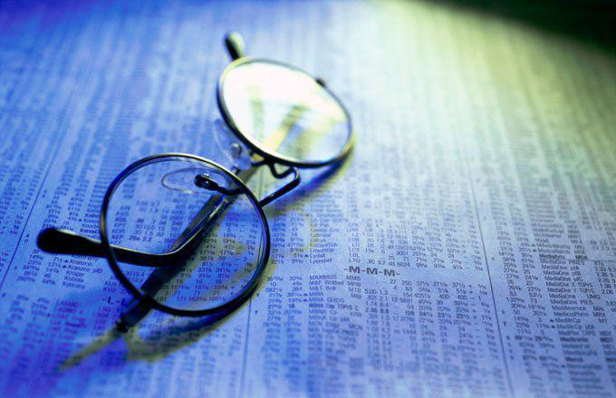

The integration of decimal trading and algorithmic trading has transformed the trading landscape, setting a new standard for efficiency and precision. Decimal trading, a system where stock prices are quoted in decimal format rather than fractions, was fully implemented in U.S. stock exchanges by 2001. This change simplified trading by providing a more straightforward and transparent view of market prices, allowing for tighter bid-ask spreads and more granular pricing. Meanwhile, algorithmic trading uses computer programs to automate and optimize trading decisions, leveraging the ability to process vast volumes of data at speeds unattainable by human traders. These algorithms facilitate various strategies, from trend-following and statistical arbitrage to high-frequency trading, capitalizing on the opportunities brought about by decimalization.

By functioning together, decimal trading and algorithmic trading introduce significant advantages such as reduced trading costs and enhanced market liquidity. However, they also present challenges, including increased market volatility and the need for sophisticated risk management strategies. This article will examine how these mechanisms operate and assess their benefits and potential drawbacks, providing insights into their profound impact on modern financial markets.



## Table of Contents

## Understanding Decimal Trading

Decimal trading is a pricing system for securities where stock prices are expressed in decimal form rather than fractions. Prior to the implementation of decimal trading, stocks in the United States were traditionally quoted in fractions based on eighths or sixteenths of a dollar. This system was not only cumbersome, but it also made price comparisons and computations more challenging for traders and investors.

The transition to decimal trading was fully realized across U.S. stock exchanges in 2001. This shift to a base-10 system was primarily aimed at simplifying the trading process, making it more intuitive and accessible. Decimalization allows for smaller increments in stock price movements, specifically one cent ($0.01), compared to the previous increments of $0.125 or $0.0625 in a fractional system. This smaller minimum price change is known as the "tick size."

One of the significant outcomes of decimalization has been the creation of tighter spreads. The spread is the difference between the bid (buy) and ask (sell) price of a stock. A smaller tick size results in narrower spreads, which translates to reduced trading costs for investors. The immediate visibility of price changes and tighter spreads provide a clearer insight into market conditions, allowing more precise trading decisions.

For example, consider a stock formerly quoted at 25 1/8 dollars under the fractional system, which corresponds to $25.125 in decimal form. With decimal trading, this stock can now be quoted at any point between, such as $25.13 or $25.12, allowing for finer adjustments in pricing. 

To illustrate with a simple formula, the spread $S$ can be represented as:

$$
S = A - B
$$

where $A$ is the ask price and $B$ is the bid price. With decimalization, both $A$ and $B$ can be quoted at cent-level granularity, reducing $S$ and thus decreasing the cost to buy and sell stocks.

In conclusion, the adoption of decimal trading has enhanced market efficiency by standardizing price quotes, minimizing trading costs, and improving price discovery. This system lays the groundwork for modern trading environments characterized by immediate and transparent market activities.

## Benefits and Mechanics of Decimal Trading

Decimal trading has transformed how market participants engage with stock markets by simplifying stock price quotes. Before the advent of decimal trading on major U.S. exchanges in 2001, stock prices were typically quoted in fractions, often in increments of 1/16th of a dollar. This fractional system made it cumbersome for traders, particularly retail investors, to quickly and accurately interpret market prices.

When stock prices are quoted in decimals, such as $10.25 instead of 10 1/4, the quotes become inherently easier to understand. This clarity is beneficial for all investors, enabling real-time comparisons and swifter decision-making. The format's simplicity fosters a more inclusive environment, encouraging participation from individuals who may hesitate or struggle with fractional understanding.

The transition from fractions to decimals has also significantly impacted the trading environment by reducing the minimum price increment, known as the 'tick size'. With fractional pricing, the smallest increment was often larger, impacting the bid-ask spread—the difference between the price to buy and the price to sell a security. A larger tick size implied wider spreads, which could increase trading costs due to the price difference between buying and selling a stock. This was especially evident during periods of high trading [volume](/wiki/volume-trading-strategy) or market fluctuation.

Decimalization introduced smaller tick sizes, allowing for tighter spreads. Tighter spreads imply that the cost difference between purchasing and selling a stock is minimized, potentially reducing costs for investors. As the spreads narrow, the pricing becomes more competitive, often benefiting all trading parties through reduced transaction costs.

An example to illustrate this: consider a stock priced at $50. With fractional pricing, if the closest bid-ask spread is 1/16th, the spread would be approximately $0.0625. In a decimal system, the spread could be as low as $0.01, enhancing the price's precision and potentially lowering the expense per trade. 

Moreover, decimal pricing allows for more granular pricing structures. Traders can bid or offer stocks in smaller increments than before, potentially increasing market fluidity. This granularity can be illustrated by a Python script that calculates potential savings from a reduced tick size:

```python
def calculate_savings(fraction_price, decimal_price, shares):
    fraction_cost = shares * fraction_price
    decimal_cost = shares * decimal_price
    return fraction_cost - decimal_cost

# Example usage for a $50 stock with 1/16 fraction vs. $0.01 decimal spread for 1000 shares
savings = calculate_savings(0.0625, 0.01, 1000)
print(f"Savings per trade: ${savings:.2f}")
```

The Python code demonstrates how reduced ticks can lead to tangible savings on trading costs, benefiting seasoned traders and retail investors alike. By allowing more detailed price adjustments, the market can better reflect supply and demand dynamics, thus improving overall market efficiency. Through simplified quotes, tighter spreads, and granular pricing, decimal trading continues to shape modern financial markets, enabling a more dynamic and cost-effective trading environment.

## Algorithmic Trading: An Overview

Algorithmic trading refers to the use of computer algorithms to automate the trading process, transforming how financial markets operate. It harnesses the power of sophisticated mathematical models and complex algorithms to analyze market data and execute trades at speeds that far surpass human capability. This technology-driven approach is characterized by its ability to process vast quantities of data and generate trading decisions in milliseconds, which is crucial in fast-moving markets.

At its core, [algorithmic trading](/wiki/algorithmic-trading) involves three key components: data input, algorithm analysis, and trade execution. The process begins with data input, where the algorithm collects and processes large volumes of real-time and historical market data. This data can include price quotes, trading volumes, macroeconomic indicators, and news events, among others. Advanced algorithms leverage [machine learning](/wiki/machine-learning) techniques to enhance the predictive power of their models, continually refining their strategies based on new data.

Once the data is gathered, the next phase is algorithm analysis. Here, the algorithm applies various quantitative models and statistical methods to identify potential trading opportunities. This analysis may involve identifying trends, price patterns, or [arbitrage](/wiki/arbitrage) opportunities by evaluating the collected data against pre-defined criteria. For example, a moving average crossover strategy might trigger a buy signal when a short-term moving average crosses above a long-term moving average.

Finally, trade execution is the culmination of the process, where the algorithm generates buy or sell orders based on its analysis. This execution is achieved with minimal latency, crucial for capitalizing on minute price changes and maintaining the competitiveness of the trading strategy. High-frequency trading ([HFT](/wiki/high-frequency-trading-strategies)) is a subset of algorithmic trading that focuses on such rapid trade execution, often conducting thousands of trades within seconds.

Algorithmic trading has become a cornerstone of modern financial markets, enabling institutions to handle voluminous trading activity with greater precision and efficiency. Its reliance on technology and data underscores the importance of robust IT infrastructure and access to high-quality data feeds. As financial markets continue to evolve, algorithmic trading stands poised to play an increasingly central role, driven by advancements in computational power and data analytics.

## Types of Algorithmic Trading Strategies

Algorithmic trading strategies encompass various approaches, each utilizing computational algorithms to optimize trading decisions in financial markets. Among these, trend-following, mean reversion, and [statistical arbitrage](/wiki/statistical-arbitrage) are three widely used strategies that leverage different market phenomena.

Trend-following algorithms aim to capitalize on the [momentum](/wiki/momentum) driving price movements in financial markets. These algorithms detect emerging trends by analyzing historical price data, typically using technical indicators such as moving averages or the relative strength index (RSI). A common method is the moving average crossover, where a short-term moving average crossing above a long-term moving average generates a buy signal, and vice versa for a sell signal. The underlying assumption is that once a trend begins, it is likely to persist for some time. Consequently, these strategies help traders profit from sustained price directionality, whether upward or downward.

Mean reversion strategies, by contrast, are predicated on the belief that asset prices will eventually revert to their historical averages or intrinsic values. This approach seeks to identify overbought or oversold conditions, where prices are likely to correct towards a mean. Statistical tools like Bollinger Bands or the Z-score can help identify such conditions. The Z-score, calculated as $Z = \frac{X - \mu}{\sigma}$, where $X$ is the asset price, $\mu$ is the mean, and $\sigma$ is the standard deviation, assists in determining how far the current price deviates from its mean in terms of standard deviation units. Traders may buy underpriced assets likely to increase or sell overpriced assets expected to decrease, thereby profiting from the anticipated reversion.

Statistical arbitrage involves identifying and exploiting price discrepancies between correlated or similar financial instruments. This strategy relies on sophisticated statistical models and high-frequency data analysis to find short-term mispricings. For instance, in pairs trading, an algorithm continuously monitors two historically correlated assets. When the price divergence between them exceeds a pre-defined threshold, the algorithm triggers trades to short the overvalued asset and long the undervalued asset, assuming their historical price relationship will eventually restore. The profits are captured when the price spread returns to its historical mean.

Each of these algorithmic trading strategies requires rigorous quantitative analysis and robust computational infrastructure. Moreover, they necessitate careful risk management to address market changes and unexpected [volatility](/wiki/volatility-trading-strategies). With advancements in computing power and data availability, these strategies continue to evolve, offering traders refined techniques to harness market opportunities.

## The Intersection of Decimal and Algorithmic Trading

Decimal trading and algorithmic trading, when intersected, create a synergistic effect that enhances the functionality and precision of modern trading systems. Decimal trading, by quoting stock prices in decimals rather than fractions, provides traders with more data points. This finer granularity of price information is particularly beneficial for algorithmic trading systems, which rely on precise data to execute trades effectively.

Algorithmic trading systems leverage the increased data precision offered by decimal trading to exploit finer price movements. This capability is instrumental in high-frequency trading (HFT), a subset of algorithmic trading that capitalizes on small price changes in fractions of a second. The availability of more granular pricing, as facilitated by decimal trading, allows algorithms to detect and act on these minute price variations, leading to increased trading opportunities and improved profit potential.

Moreover, the intersection of decimal and algorithmic trading reduces market friction. Market friction refers to the transaction costs and market inefficiencies that hinder the smooth execution of trades. By enabling more precise pricing, decimal trading helps reduce bid-ask spreads, which in turn minimizes costs associated with each transaction. Algorithms can execute trades with greater efficiency and at lower costs, enhancing [liquidity](/wiki/liquidity-risk-premium) in the markets.

The finer granularity of decimal pricing also aids in the calibration of algorithmic models. Developers can input more detailed price data into their algorithms, allowing for more accurate predictions and refined trading strategies. This precision helps in optimizing algorithm parameters and improves the integration of advanced techniques such as machine learning and [artificial intelligence](/wiki/ai-artificial-intelligence) in trading systems.

To illustrate, consider a simple example where an algorithm is designed to capitalize on arbitrage opportunities. With decimal pricing, the algorithm might detect a pricing anomaly between two similar stocks quoted at $100.05 and $100.06 respectively. Even a one-cent difference can be leveraged for profit if transacted at high frequencies, a capability enriched by decimalization.

In conclusion, the integration of decimal and algorithmic trading has transformed trading dynamics. The precision of decimal pricing combined with the speed and efficiency of algorithmic systems offers significant advantages, including expanded trading opportunities, reduced market friction, and enhanced strategic modeling. These systems continue to evolve, pushing the boundaries of what's possible in financial markets.

## Challenges and Considerations

Decimal and algorithmic trading systems have reshaped financial markets, enhancing efficiency and precision. However, they also introduce complexities that demand attention. A prominent challenge is the resulting market volatility. Decimal trading, by reducing the minimum price increment, allows for tighter spreads, but can consequently lead to higher volatility as small price changes can trigger substantial trading volumes. Algorithmic trading magnifies this effect, as algorithms respond instantly to these minute changes, potentially creating rapid and volatile market shifts. 

Addressing such volatility necessitates robust risk management frameworks. Traders and financial institutions must employ advanced analytical models to predict and cushion against potential market disruptions. This includes stress testing portfolios under various market conditions and leveraging Value at Risk (VaR) models to anticipate the extent of possible losses in extreme situations. 

Another critical consideration is the susceptibility to technical failures. The reliance on technology in algorithmic trading means systems must be resilient against hardware and software malfunctions. Infrastructure must be regularly updated and maintained, incorporating redundancy systems and fail-safes to minimize the impact of technical glitches on trading operations. 

Moreover, algorithmic and decimal trading systems must adhere to stringent financial regulations. Compliance with these rules often requires significant resources and ongoing adjustments to adapt to the evolving legal landscape. Algorithms must be programmed to automatically comply with trading regulations, which can be challenging given the complex and dynamic nature of global financial markets. 

To mitigate potential risks, it's vital for traders to backtest and simulate their trading strategies. Backtesting involves applying a trading strategy to historical market data to evaluate its effectiveness. This allows traders to identify weaknesses and optimize their algorithms before actual deployment. An example in Python might involve using the `pandas` library to analyze financial data, leveraging historical pricing to gauge the strategy’s performance:

```python
import pandas as pd

# Load historical data
data = pd.read_csv('historical_stock_prices.csv')

# Define strategy: Simple Moving Average (SMA) crossover
data['SMA50'] = data['Close'].rolling(window=50).mean()
data['SMA200'] = data['Close'].rolling(window=200).mean()

# Generate signals
data['Signal'] = 0
data['Signal'] = np.where(data['SMA50'] > data['SMA200'], 1, 0)

# Backtest
data['Position'] = data['Signal'].shift(1)
data['Strategy_Returns'] = data['Position'] * data['Close'].pct_change()

# Calculate cumulative returns
data['Cumulative_Returns'] = (1 + data['Strategy_Returns']).cumprod()

# Display results
print(data[['Date', 'Cumulative_Returns']].tail())
```

These simulations provide insights into the strategy's potential profitability and limitations, enabling traders to refine their approach and improve their risk management tactics. By embracing these strategies and considerations, traders can better navigate the complexities of a technologically advanced trading environment.

## Conclusion

Decimal and algorithmic trading have significantly impacted market dynamics by introducing unprecedented speed, efficiency, and precision to trading processes. Decimal trading, by simplifying stock price quotes, has enhanced the granularity of price movements, allowing for more accurate pricing and reduced costs. Algorithmic trading, on the other hand, leverages advanced computer algorithms to execute trades at speeds unattainable by human traders, processing vast amounts of data to make informed trading decisions.

As technology continues to advance, both decimal and algorithmic trading systems are expected to undergo further evolution. Emerging technologies such as machine learning and artificial intelligence could integrate with algorithmic models, extracting deeper insights from market data and improving predictive accuracy. Enhanced computational power and data storage capabilities may further optimize trading algorithms, leading to more sophisticated and adaptive trading strategies.

For traders to remain competitive in this rapidly evolving landscape, continuous education and adaptation are crucial. Understanding the interplay between decimal and algorithmic trading is essential for capitalizing on their advantages while effectively managing associated risks. Traders are encouraged to stay informed of technological advancements, regularly update their trading strategies, and rigorously backtest new approaches to ensure robustness and compliance with financial regulations. Through ongoing learning and strategic flexibility, traders can harness the full potential of these transformative trading mechanisms.

## References & Further Reading

[1]: NASDAQ. (2001). ["The Impact of Decimalization on Trading Costs"](https://www.sec.gov/news/testimony/052401tslu.htm).

[2]: Malkiel, B. G. (2003). ["The Efficient Market Hypothesis and Its Critics"](https://www.princeton.edu/~ceps/workingpapers/91malkiel.pdf). The Journal of Economic Perspectives, 17(1), 59-82.

[3]: Hasbrouck, J., Saar, G. (2013). ["Low-latency trading"](https://www.sciencedirect.com/science/article/abs/pii/S1386418113000165). The Review of Financial Studies, 26(9), 2683-2719.

[4]: ["Algorithmic Trading and DMA: An Introduction to Direct Access Trading Strategies"](https://www.amazon.com/Algorithmic-Trading-DMA-introduction-strategies/dp/0956399207) by Barry Johnson

[5]: Harris, L. (1997). ["Decimalization: A Review and Analysis of the Issue."](https://www.semanticscholar.org/paper/Decimalization%3A-A-Review-of-the-Arguments-and-Harris/7e55279415ae4d11f701ff93bbe5585205faeb48) Working Paper, Marshall School of Business, University of Southern California.