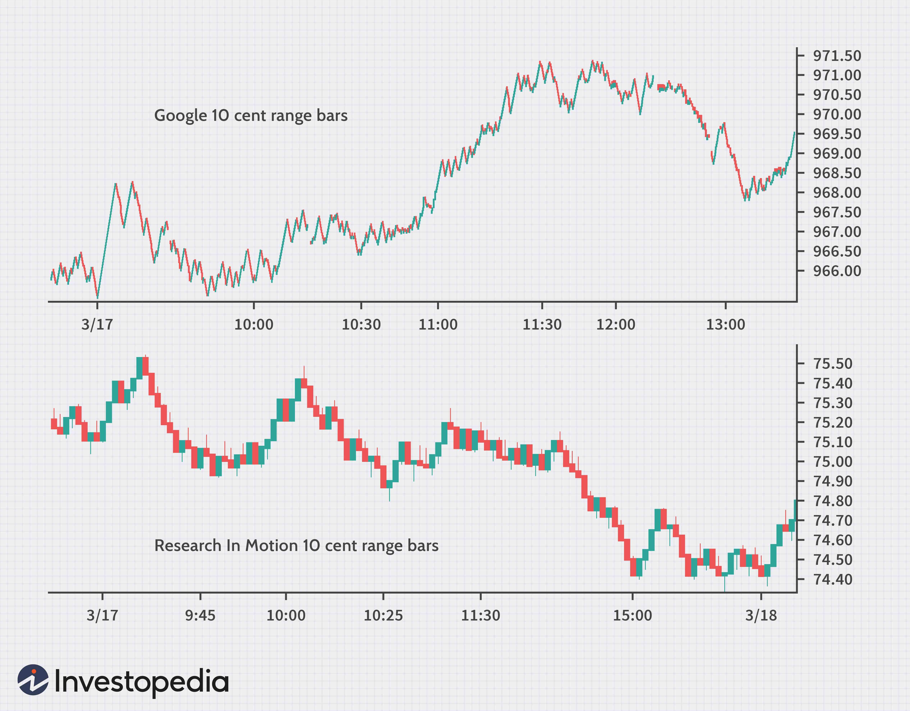

Decimalization refers to the shift from using fractional pricing, such as 1/8 or 1/16 of a dollar, to decimal pricing, commonly priced to the nearest cent, in the stock market. This significant transformation was fully implemented in the United States in 2001. By switching to decimal pricing, securities could be priced more precisely, reflecting their true market value and allowing for smaller price changes. The change simplified trading operations, enabling more straightforward calculations required during stock transactions.

The adoption of decimalization has considerably reshaped trading dynamics by enhancing market efficiency and lowering transaction costs. This efficiency stems from the reduction in bid-ask spreads due to more precisely quantified price increments, resulting in lower costs for entering and exiting market positions. Furthermore, the transition to decimal pricing has had a profound impact on trading behavior, particularly influencing the rise and evolution of algorithmic trading. 



Algorithmic trading, which involves using automation and complex algorithms to execute trades at high speeds and frequencies, found new opportunities with decimalization. The finer granularity in pricing facilitated by decimalization enabled algorithms to detect and exploit minute price discrepancies in the market, paving the way for strategies focused on speed and precision, such as high-frequency trading.

This article will explore the multifaceted impacts of decimalization on the stock market, particularly emphasizing how it has influenced algorithmic trading practices and contributed to the transformation of modern trading strategies.

## Table of Contents

## Historical Context of Stock Pricing

Before the adoption of decimalization in 2001, U.S. stock prices were traditionally quoted using fractions, such as 1/8 or 1/16 of a dollar. This fractional system has its roots in the historical practice of trading using the Spanish dollar, which was divided into eight parts. While this system was functional for many years, it often led to confusion among investors and presented several inefficiencies. Calculating share prices, bid-ask spreads, and trade values using fractions was not as straightforward as using decimals, sometimes resulting in increased calculation errors and difficulties in price comparison.

The transition to decimal pricing represented a significant shift towards standardization and simplification in the financial markets. Decimalization allowed for trading in increments as small as one cent ($0.01), in contrast to the fractional increments, which could be as large as 12.5 cents with a 1/8 fraction. This shift not only facilitated easier mental arithmetic and computerized calculations but also aligned U.S. stock markets with global practices, as most international markets were already utilizing decimal systems.

The U.S. Securities and Exchange Commission (SEC) initiated decimalization primarily to enhance clarity and competitiveness within the financial markets. By allowing for smaller price increments, decimalization aimed to reduce bid-ask spreads, thus lowering transaction costs for investors. This change was expected to increase the appeal of U.S. markets to global investors and enhance the overall efficiency of market operations. Consequently, the transition to decimal pricing marked a pivotal moment in financial history, setting the stage for future developments in trading technology and market strategies.

## Effects of Decimalization on Stock Market Efficiency

Decimalization has significantly impacted stock market efficiency, primarily through the reduction of bid-ask spreads, which marks the difference between the highest price a buyer is willing to pay for a security and the lowest price a seller is willing to accept. Prior to decimalization, stocks were quoted in fractions that typically led to wider spreads. By switching to a decimal system, these spreads narrowed, thereby reducing the cost of trading. This made trading more economical, particularly benefiting retail investors who saw reduced transaction costs.

Increased market [liquidity](/wiki/liquidity-risk-premium) is another benefit resulting from decimalization. Smaller price increments, as opposed to the larger ones inherent in fractional pricing, facilitate more rapid transactions. This improvement enables traders to execute orders at prices closer to their desired levels, thus enhancing liquidity. As a result, the ability to enter and [exit](/wiki/exit-strategy) positions with minimal price impact is greatly improved, making the market more dynamic and responsive to trading activities.

Moreover, decimalization improved transparency in pricing. Transparency is crucial because it provides investors with a clearer and more precise view of the market. Previously, fractional pricing obscured the true cost and valuation of stocks. With decimal pricing, investors can more accurately forecast market trends and make informed decisions based on precise price data. 

Overall, the shift to decimalization streamlined trading operations by reducing costs, improving liquidity, and increasing clarity for investors, thereby playing a pivotal role in modernizing the financial markets and enhancing their global competitiveness.

## Impact on Algorithmic Trading

Decimalization has had a significant impact on [algorithmic trading](/wiki/algorithmic-trading) by enabling finer price increments, which are essential for the precise execution of trading strategies. The transition from fractional to decimal pricing reduced the minimum price movement to $0.01, as opposed to the previous increments of 1/8th or 1/16th of a dollar. This has crucially facilitated algorithmic and high-frequency trading ([HFT](/wiki/high-frequency-trading-strategies)) strategies, which thrive on exploiting minute price changes that occur in milliseconds.

With the ability to transact at narrower price points, algorithmic traders have benefited from enhanced opportunities for [arbitrage](/wiki/arbitrage), a strategy that aims to profit from discrepancies in asset prices across different markets or time frames. For instance, consider a stock trading at $10.125 under the fractional system, dropping to $10.12 with decimalization. An algorithm can identify and act on this $0.005 price difference across venues almost instantaneously, providing the potential for profit.

Moreover, decimalization has accelerated the evolution of complex trading algorithms that leverage increased market granularity. These algorithms are designed to analyze vast datasets in real time, making them adept at detecting and acting on small, rapid price movements. As the market transformed post-decimalization, algorithms have become more sophisticated, incorporating [machine learning](/wiki/machine-learning) techniques and predictive analytics to anticipate short-term price movements with a higher degree of accuracy.

Python has become a popular language for developing such algorithms, with libraries like `pandas` and `NumPy` facilitating complex data manipulation and analysis. Here's a simple example demonstrating how one might simulate detecting a small arbitrage opportunity:

```python
import numpy as np
import pandas as pd

# Simulate price data for a stock over a short time period
np.random.seed(0)
prices = np.random.normal(loc=100, scale=0.05, size=1000)

# Create a DataFrame
df = pd.DataFrame(prices, columns=['Price'])

# Detect small price movements for potential arbitrage
threshold = 0.01  # Define a minimum price movement for action
df['Change'] = df['Price'].diff()
arbitrage_opportunities = df.loc[df['Change'].abs() > threshold]

print(arbitrage_opportunities.head())
```

The allowance for smaller price movements has ultimately democratized market access, enabling both large institutional investors and smaller retail traders to participate more efficiently. As algorithmic trading continues to evolve, the precision and speed offered by decimal pricing remain a foundational element of this dynamic landscape.

## Pros of Decimalization in Algo Trading

Decimalization has significantly influenced algorithmic trading by providing several advantages that enhance trading strategies and execution. One of the main benefits is the increased market transparency. With prices quoted in decimals rather than fractions, traders can discern more precise price points, leading to a better understanding of market dynamics. This transparency enables traders to make informed decisions, resulting in more efficient and effective trading strategies [1].

Reduced trading costs are another notable advantage of decimalization. The shift from fractional pricing to decimal pricing has narrowed bid-ask spreads, lowering the cost of executing trades. This reduction is particularly beneficial for algorithmic trading systems, which often rely on executing large volumes of trades at minimal cost. Lower transaction costs can lead to higher profitability, as algorithms can exploit smaller price movements more effectively without incurring prohibitive expenses.

Algorithmic trading systems benefit from the ability to execute trades with greater precision. Decimal pricing allows these systems to identify and act upon minor price variations, optimizing execution and enhancing profitability potential. Traders can implement strategies that capitalize on minuscule price shifts, enabling them to exploit arbitrage opportunities and market inefficiencies with increased accuracy.

Market efficiency, supported by decimalization, benefits both retail and institutional traders. Finer price increments allow for a more continuous representation of supply and demand, ensuring that prices reflect the true market value of securities. This improved efficiency leads to a more competitive market environment whereby participants can achieve better pricing and more favorable trade execution.

In summary, decimalization has fortified algorithmic trading by increasing transparency, lowering costs, and enhancing execution precision, ultimately strengthening market efficiency for a broad range of market participants.

$$
\text{Bid-Ask Spread (Fractional)} > \text{Bid-Ask Spread (Decimalized)}
$$

The transition from fractional to decimal pricing has not only revolutionized trading strategies but has also reinforced the robustness of market mechanisms.

---

[1] Song, H. (2004). The impact of decimalization on market quality: An empirical investigation of changes in liquidity, volatility, and price efficiency. *Journal of Financial Markets*.

## Cons and Challenges of Decimalization

The transition to decimal pricing in the U.S. stock markets, while enhancing accessibility and efficiency, introduced several challenges, particularly affecting traditional market structures and participants. One significant issue has been the narrowing of bid-ask spreads, which adversely affected the profitability of traditional market makers. These participants, who facilitated transactions by quoting both buy and sell prices for securities, traditionally profited from larger spreads. With decimalization reducing the minimum tick size to $0.01, their margins were compressed, forcing many to reassess their participation or adopt alternative strategies to maintain profitability.

Another critical challenge linked to decimalization is its potential contribution to increased market [volatility](/wiki/volatility-trading-strategies), primarily due to the rise of high-frequency trading (HFT). Decimal pricing enabled traders to quote prices in much finer increments, facilitating the rapid execution and cancellation of trades—characteristics synonymous with HFT. Critics argue that this has sometimes led to amplified market movements and volatility, as HFT firms execute large volumes of trades at accelerated speeds based on minuscule price differences.

Concerns also extend to the effects of decimalization on the overall market structure and liquidity provision. The finer pricing increments have led to a more fragmented [order book](/wiki/order-book-trading-strategies), with liquidity dispersed across numerous small price points. This [dispersion](/wiki/dispersion-trading) can sometimes result in the appearance of a less deep market, where liquidity is abundant but scattered, potentially affecting significant trades' execution and price stability. Furthermore, the diminished role of traditional market makers, replaced by technologically sophisticated trading firms, has raised questions about the robustness and resilience of liquidity during times of market stress.

The move to decimalization, while beneficial in many ways, necessitates a nuanced understanding of its impact on market dynamics, pushing the financial ecosystem to continuously adapt to these evolving challenges.

## Technology and Future Trends in Algo Trading

Technological advancements are crucial to the continuous evolution of algorithmic trading, particularly when considering the implementation of decimalization in markets. This shift has allowed algorithmic strategies to respond with greater precision to market fluctuations. An integral component of this evolution is the increasing use of [artificial intelligence](/wiki/ai-artificial-intelligence) (AI) and machine learning (ML). These technologies enable advanced data analysis, helping traders generate and execute strategies that maximize the potential benefits of decimal pricing.

AI and ML algorithms can process vast amounts of market data swiftly. They identify patterns and predict future market moves more accurately than traditional methodologies. For instance, AI-powered algorithms can parse historical data, breaking it down into patterns that help forecast future price movements within decimalized price structures. This predictive capability becomes increasingly important as the time scale for trading shrinks from seconds to milliseconds or even microseconds. 

Machine learning models, such as [reinforcement learning](/wiki/reinforcement-learning) or supervised learning techniques, can be employed to optimize trading strategies. These models adapt over time, learning from past performance to improve future trading decisions. For instance, a simple implementation in Python would involve the use of libraries such as `scikit-learn` or `TensorFlow` to build predictive models from historical price data. Here is a basic example of a supervised learning model using `scikit-learn`:

```python
from sklearn.model_selection import train_test_split
from sklearn.ensemble import RandomForestRegressor
import numpy as np

# Assume X is a matrix of historical price data and y is the target variable (future price movement)
X_train, X_test, y_train, y_test = train_test_split(X, y, test_size=0.2, random_state=42)

model = RandomForestRegressor(n_estimators=100, max_depth=10, random_state=42)
model.fit(X_train, y_train)

y_pred = model.predict(X_test)
```

Further evolution in AI and ML could see the development of more autonomous and intelligent trading platforms. These could dynamically adjust their strategies almost instantaneously in response to sudden market developments, taking full advantage of the granularity provided by decimalization.

Beyond the growing complexity of algorithms, technological advancements in computation and data transmission are also vital. High-speed data networks and advanced computational systems allow for the reduction of latency, which is paramount for the execution of trades based on fleeting price differences in a decimalized market.

In sum, the relentless progress of technology, particularly through AI and machine learning, is poised to continually transform algorithmic trading strategies. This ongoing innovation promises to further integrate and exploit the granularity afforded by decimal pricing, driving the development of more efficient, adaptive, and profitable trading strategies.

## Conclusion

Decimalization has left an indelible mark on the stock market, primarily by enhancing competitiveness and increasing market efficiency. By transitioning from fractional to decimal pricing, the market has seen a significant improvement in clarity and precision, which has facilitated informed decision-making for investors. This precision has enabled finer price adjustments, effectively narrowing bid-ask spreads, reducing transaction costs, and providing a more granular view of market dynamics.

Furthermore, decimalization has played a crucial role in reshaping the landscape of algorithmic trading. The ability to exploit smaller price increments has not only advanced the profitability of algorithmic strategies but has also accelerated the adoption and evolution of these practices. The shift towards high-frequency trading, empowered by decimalization, has underlined the importance of speed and precision in modern trading strategies. This change has undeniably transformed trading norms, urging traders to deploy sophisticated algorithms capable of executing trades in milliseconds. Additionally, the increased transparency and reduced volatility brought forth by decimalization have provided a robust platform for both retail and institutional traders to thrive.

As financial markets continue to evolve, the understanding of decimalization's impact is pivotal for anticipating future strategic advancements. While market dynamics continue to be influenced by technological innovations, including artificial intelligence and machine learning, the foundational change brought by decimalization remains relevant. This evolution signifies an ongoing trend towards enhanced efficiency and the possibility of further innovations in trading strategies. By illuminating past transformations, decimalization provides a framework for decoding future developments in stock market behaviors and strategic trading practices.

## References & Further Reading

[1]: Song, H. (2004). ["The impact of decimalization on market quality: An empirical investigation of changes in liquidity, volatility, and price efficiency."](https://en.wikipedia.org/wiki/2004_in_music) Journal of Financial Markets.

[2]: ["Decimalization’s Impact on Market Quality"](https://papers.ssrn.com/sol3/papers.cfm?abstract_id=1014) by the U.S. Securities and Exchange Commission (SEC).

[3]: Bessembinder, H. (2003). ["Trade Execution Costs and Market Quality after Decimalization."](https://www.cambridge.org/core/journals/journal-of-financial-and-quantitative-analysis/article/abs/trade-execution-costs-and-market-quality-after-decimalization/8C0BB13EB1CF7788AF00D5377E856E0B) Review of Financial Studies.

[4]: Harris, L. (1999). ["Trading in Pennies: A Survey of the Issues."](https://www.semanticscholar.org/paper/Trading-In-Pennies-%3A-A-Survey-of-the-Issues-Harris-Harris/06cc896a7b96002abcee5b3cea5148570707b08d) University of Southern California, Marshall School of Business.

[5]: ["Advances in Financial Machine Learning"](https://www.amazon.com/Advances-Financial-Machine-Learning-Marcos/dp/1119482089) by Marcos Lopez de Prado.