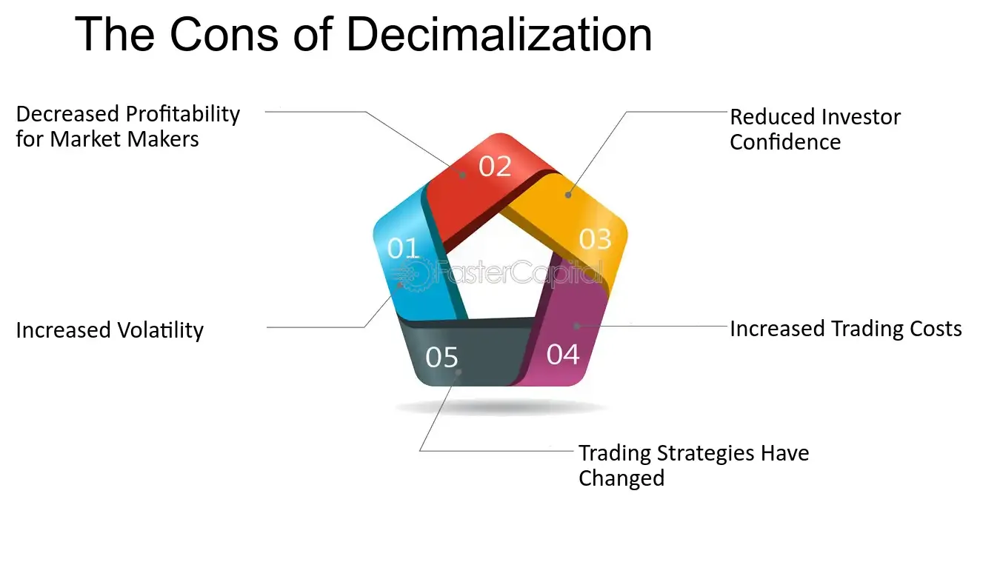

## Table of Contents

## What is decimalization in the context of stock prices?

Decimalization in the context of stock prices means changing the way stock prices are shown and traded from fractions to decimals. Before decimalization, stock prices were quoted in fractions, like 1/8 or 1/16 of a dollar. This system was confusing and made trading less accurate. In the year 2000, the U.S. stock market switched to decimal pricing, where prices are shown in dollars and cents, like $25.50.

This change made trading easier and more precise. With decimals, the smallest price change, or tick size, became one cent instead of the smallest fraction, which was 1/16 of a dollar. This allowed for more accurate pricing and helped increase competition among traders. Overall, decimalization made the stock market more efficient and accessible for everyone.

## When did decimalization of stock prices occur in the United States?

Decimalization of stock prices in the United States happened in the year 2000. Before this change, stock prices were shown in fractions, like 1/8 or 1/16 of a dollar. This old way of showing prices was hard to understand and not very accurate.

In 2000, the U.S. stock market switched to using decimals. This meant prices were now shown in dollars and cents, like $25.50. This change made trading easier and more precise. It helped everyone understand stock prices better and made the market work more smoothly.

## How did decimalization change the way stock prices are quoted?

Before decimalization, stock prices were shown in fractions, like 1/8 or 1/16 of a dollar. This made things confusing because it was hard to understand small price changes. Imagine trying to figure out how much 1/16 of a dollar is! This old way of showing prices made trading less accurate and harder for everyone.

In the year 2000, the U.S. stock market changed to using decimals. Now, stock prices are shown in dollars and cents, like $25.50. This makes it much easier to see small changes in price. For example, if a stock goes from $25.50 to $25.51, it's clear that the price went up by one cent. Decimalization made trading simpler, more accurate, and easier for everyone to understand.

## What was the primary motivation behind decimalizing stock prices?

The main reason for changing stock prices from fractions to decimals was to make trading easier and more accurate. Before 2000, stock prices were shown in fractions like 1/8 or 1/16 of a dollar. This was confusing and hard to understand, especially for small price changes. By switching to decimals, prices could be shown in dollars and cents, like $25.50. This made it much simpler for everyone to see and understand price changes.

Another big reason was to make the stock market more efficient. With decimals, the smallest price change, or tick size, became one cent instead of the smallest fraction, which was 1/16 of a dollar. This allowed for more precise pricing and increased competition among traders. Overall, decimalization helped make the stock market work better and be more accessible to everyone.

## How did decimalization affect the bid-ask spread?

Decimalization made the bid-ask spread smaller. The bid-ask spread is the difference between the highest price someone is willing to pay for a stock (the bid) and the lowest price someone is willing to sell it for (the ask). Before decimalization, when stock prices were shown in fractions, the smallest change in price was 1/16 of a dollar. This meant the bid-ask spread was usually bigger because it couldn't be smaller than 1/16 of a dollar.

After switching to decimals, the smallest price change became one cent. This allowed the bid-ask spread to be much smaller, sometimes even just one cent. Smaller bid-ask spreads made trading cheaper and more efficient. Traders could buy and sell stocks at prices that were closer together, which saved them money and made the market more competitive.

## What impact did decimalization have on market liquidity?

Decimalization made the stock market more liquid. Liquidity means how easily you can buy or sell a stock without affecting its price too much. Before decimalization, when stock prices were shown in fractions, it was harder to trade because the smallest price change was 1/16 of a dollar. This made the bid-ask spread bigger, which could make it harder to buy or sell stocks quickly.

After switching to decimals, the smallest price change became one cent. This made the bid-ask spread smaller, which helped increase market [liquidity](/wiki/liquidity-risk-premium). With smaller spreads, traders could buy and sell stocks more easily and at prices that were closer together. This meant more people could trade stocks without worrying about big price changes, making the market more active and efficient.

## How did decimalization influence trading volumes?

Decimalization made trading volumes go up. Before 2000, stock prices were shown in fractions, like 1/8 or 1/16 of a dollar. This made trading harder because the smallest price change was big, and it was confusing. When the U.S. stock market switched to decimals, prices were shown in dollars and cents, like $25.50. This change made it easier for everyone to understand and trade stocks.

With decimals, the smallest price change became one cent. This made the difference between buying and selling prices, called the bid-ask spread, smaller. Smaller spreads meant people could trade more often without worrying about big price changes. As a result, more people started trading, and the total number of trades, or trading [volume](/wiki/volume-trading-strategy), increased. Decimalization made the stock market more active and easier to use for everyone.

## What were the challenges faced during the transition to decimalization?

When the U.S. stock market switched from fractions to decimals in 2000, there were some big challenges. One big problem was that everyone had to learn a new way of showing prices. Before, they used fractions like 1/8 or 1/16 of a dollar, which was hard to understand. Now, they had to use dollars and cents, like $25.50. This meant that all the computers and systems used for trading had to be changed to handle the new decimal prices. It was a lot of work to update everything and make sure it all worked right.

Another challenge was that some people worried about how the change would affect their jobs. For example, floor traders, who worked on the trading floor of the stock exchange, were used to the old way of doing things. They were worried that with decimal prices, their jobs might change or even go away. It took time for everyone to get used to the new system and understand how it would work. But in the end, decimalization made trading easier and helped the stock market work better for everyone.

## How did decimalization affect the strategies of market makers?

Decimalization changed how market makers did their jobs. Before, when stock prices were in fractions, market makers could make more money because the smallest price change was big, like 1/16 of a dollar. This meant they could set a bigger difference between the price they bought stocks for and the price they sold them at. But when prices switched to decimals, the smallest price change became just one cent. This made the difference between buying and selling prices, called the bid-ask spread, much smaller. Market makers had to find new ways to make money because they couldn't make as much from the spread anymore.

To deal with smaller spreads, market makers started using more computers and technology. They used special computer programs to trade faster and in bigger amounts. This helped them make money in other ways, like by trading more often or by taking advantage of tiny price changes. It was a big change, but it made the market more competitive and efficient. Market makers had to be quick and smart to keep up with the new way of doing things.

## What are the long-term effects of decimalization on the stock market?

Decimalization changed the stock market in big ways over time. It made trading easier and more accurate by switching from confusing fractions to simple dollars and cents. This meant people could see small changes in stock prices more clearly. As a result, more people started trading, and the total number of trades went up. This made the market more active and lively. Also, decimalization made the difference between buying and selling prices smaller, which saved traders money and made the market work better for everyone.

Another long-term effect was that the stock market became more competitive. Market makers, who help with buying and selling stocks, had to find new ways to make money because they couldn't make as much from the difference between buying and selling prices anymore. They started using more computers and technology to trade faster and smarter. This helped keep the market moving smoothly and made it easier for everyone to trade. Overall, decimalization made the stock market more efficient, easier to use, and more accessible to people from all walks of life.

## How has decimalization influenced high-frequency trading?

Decimalization made high-frequency trading more common. Before decimalization, stock prices were in fractions, like 1/8 or 1/16 of a dollar. This made it hard to trade quickly because the smallest price change was big. When prices switched to decimals, the smallest change became just one cent. This meant traders could buy and sell stocks much faster because they could see tiny price changes easily. High-frequency trading uses computers to trade very quickly, and decimalization made this possible.

Decimalization also made the difference between buying and selling prices smaller. This smaller difference, called the bid-ask spread, meant high-frequency traders could make money from tiny price changes. They used special computer programs to trade a lot of stocks in a very short time. This helped them make profits even when the price changes were small. Overall, decimalization helped high-frequency trading grow and become a big part of the stock market.

## What are the global differences in the adoption and impact of decimalization?

Different countries around the world adopted decimalization at different times and in different ways. In the United States, decimalization happened in 2000, changing stock prices from fractions to decimals. This made trading easier and more accurate. In Europe, many countries made the switch earlier, with some starting as early as the 1990s. For example, the United Kingdom began using decimals for stock prices in 1997. Each country had to update their trading systems and help traders learn the new way of doing things, which took time and effort.

The impact of decimalization has been similar in many places, but there are some differences. In the U.S., decimalization made the bid-ask spread smaller, which helped increase trading volumes and made the market more liquid. This also led to the growth of high-frequency trading. In Europe, the effects were similar, but some countries saw less of an increase in trading volumes because they already had more advanced trading systems. Overall, decimalization made stock markets around the world more efficient and easier to use, but the exact impact depended on when and how each country made the change.

## What are the pros of decimalization in algo trading?

Decimalization has significantly influenced [algorithmic trading](/wiki/algorithmic-trading) by providing several advantages that enhance trading strategies and execution. One of the main benefits is the increased market transparency. With prices quoted in decimals rather than fractions, traders can discern more precise price points, leading to a better understanding of market dynamics. This transparency enables traders to make informed decisions, resulting in more efficient and effective trading strategies [1].

Reduced trading costs are another notable advantage of decimalization. The shift from fractional pricing to decimal pricing has narrowed bid-ask spreads, lowering the cost of executing trades. This reduction is particularly beneficial for algorithmic trading systems, which often rely on executing large volumes of trades at minimal cost. Lower transaction costs can lead to higher profitability, as algorithms can exploit smaller price movements more effectively without incurring prohibitive expenses.

Algorithmic trading systems benefit from the ability to execute trades with greater precision. Decimal pricing allows these systems to identify and act upon minor price variations, optimizing execution and enhancing profitability potential. Traders can implement strategies that capitalize on minuscule price shifts, enabling them to exploit [arbitrage](/wiki/arbitrage) opportunities and market inefficiencies with increased accuracy.

Market efficiency, supported by decimalization, benefits both retail and institutional traders. Finer price increments allow for a more continuous representation of supply and demand, ensuring that prices reflect the true market value of securities. This improved efficiency leads to a more competitive market environment whereby participants can achieve better pricing and more favorable trade execution.

In summary, decimalization has fortified algorithmic trading by increasing transparency, lowering costs, and enhancing execution precision, ultimately strengthening market efficiency for a broad range of market participants.

$$
\text{Bid-Ask Spread (Fractional)} > \text{Bid-Ask Spread (Decimalized)}
$$

The transition from fractional to decimal pricing has not only revolutionized trading strategies but has also reinforced the robustness of market mechanisms.

---

[1] Song, H. (2004). The impact of decimalization on market quality: An empirical investigation of changes in liquidity, volatility, and price efficiency. *Journal of Financial Markets*.

## References & Further Reading

[1]: Song, H. (2004). ["The impact of decimalization on market quality: An empirical investigation of changes in liquidity, volatility, and price efficiency."](https://en.wikipedia.org/wiki/2004_in_music) Journal of Financial Markets.

[2]: ["Decimalization’s Impact on Market Quality"](https://papers.ssrn.com/sol3/papers.cfm?abstract_id=1014) by the U.S. Securities and Exchange Commission (SEC).

[3]: Bessembinder, H. (2003). ["Trade Execution Costs and Market Quality after Decimalization."](https://www.cambridge.org/core/journals/journal-of-financial-and-quantitative-analysis/article/abs/trade-execution-costs-and-market-quality-after-decimalization/8C0BB13EB1CF7788AF00D5377E856E0B) Review of Financial Studies.

[4]: Harris, L. (1999). ["Trading in Pennies: A Survey of the Issues."](https://www.semanticscholar.org/paper/Trading-In-Pennies-%3A-A-Survey-of-the-Issues-Harris-Harris/06cc896a7b96002abcee5b3cea5148570707b08d) University of Southern California, Marshall School of Business.

[5]: ["Advances in Financial Machine Learning"](https://www.amazon.com/Advances-Financial-Machine-Learning-Marcos/dp/1119482089) by Marcos Lopez de Prado.