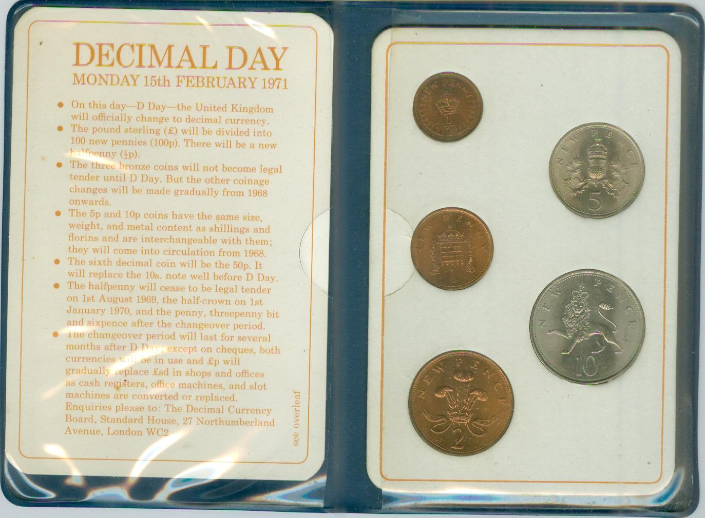

## Table of Contents

## What is decimalization?

Decimalization is when prices are changed from fractions to decimals. It's like switching from using parts of a whole number, like 1/4 or 1/2, to using numbers with a decimal point, like 0.25 or 0.50. This change makes it easier to understand and work with prices.

In the stock market, decimalization happened in the United States in 2001. Before that, stock prices were quoted in fractions, like 32nds or 64ths. After decimalization, they started using cents, which made trading simpler and more precise. This change helped both traders and regular people understand stock prices better.

## Why is decimalization important in financial markets?

Decimalization is important in financial markets because it makes prices easier to understand and work with. Before decimalization, prices were shown as fractions, like 1/8 or 1/16 of a dollar. This could be confusing and hard to calculate quickly. But with decimals, prices are shown in cents, like $0.125 or $0.0625. This change makes it simpler for everyone, from big investors to regular people, to see and understand how much stocks or other investments cost.

This change also helps make trading smoother and more efficient. With decimals, prices can be set more precisely, down to the penny. This means that buying and selling can happen more quickly and accurately. It also helps reduce the costs of trading because the smaller price increments allow for more competitive bidding. Overall, decimalization has made financial markets more accessible and easier to navigate for everyone involved.

## Can you provide a brief history of decimalization?

Decimalization started a long time ago. People have used decimals for thousands of years. The ancient Chinese used a form of decimal system around 2000 BC. In Europe, decimals became more common in the 1500s and 1600s. A Scottish mathematician named John Napier helped make decimals popular in the 1600s. By the 1700s, decimals were used a lot in Europe for math and money.

In the United States, decimalization became important in the stock market in 2001. Before that, stock prices were shown as fractions, like 1/8 or 1/16 of a dollar. This made things confusing. In 2001, the U.S. switched to showing prices in cents, like $0.125 or $0.0625. This made trading easier and more accurate. Now, decimalization is used all over the world in financial markets to make prices clear and simple for everyone.

## How did decimalization impact stock prices and trading?

Decimalization made a big difference in how stock prices are shown and how trading works. Before 2001, stock prices were shown in fractions, like 1/8 or 1/16 of a dollar. This could make it hard to quickly understand how much a stock cost. But after decimalization, prices started being shown in cents, like $0.125 or $0.0625. This change made it easier for everyone to see and understand stock prices. It also made trading more accurate because prices could be set more precisely, down to the penny.

This change also helped make trading smoother and faster. With decimal prices, people could buy and sell stocks more quickly and with less confusion. It also made trading cheaper because the smaller price steps allowed for more competition. This meant that the cost of trading went down, which was good for both big investors and regular people. Overall, decimalization made the stock market easier to use and understand, helping everyone involved.

## What were the key events leading to the implementation of decimalization in the U.S.?

The move to decimalization in the U.S. started with a lot of talk and study. In the 1990s, people in the stock market started to see that using fractions for prices was old-fashioned and confusing. They wanted to make things simpler and more accurate. The U.S. Securities and Exchange Commission (SEC) began looking into how to change this. They worked with stock exchanges and other groups to figure out the best way to switch to decimals. By the late 1990s, everyone agreed that decimalization was a good idea.

The big change happened in 2001. On January 29, 2001, the SEC made a rule that all stock prices had to be shown in decimals, not fractions. This was a big deal because it meant that from that day on, prices would be easier to understand and work with. The stock exchanges got ready for this change and made sure everything would go smoothly. After the switch, trading became faster and more accurate, and it helped everyone in the market.

## How does decimalization affect market liquidity?

Decimalization makes the market more liquid. Liquidity means how easy it is to buy and sell things in the market without changing the price too much. Before decimalization, prices were in fractions, like 1/8 or 1/16 of a dollar. This made it hard to set prices exactly right, and it was harder to buy and sell quickly. But with decimal prices, traders can set prices down to the penny. This means they can be more precise and make more trades. More trades make the market more liquid because there are always people buying and selling.

This change also helped make the spread between buying and selling prices smaller. The spread is the difference between the highest price someone is willing to pay and the lowest price someone is willing to sell. When prices are in decimals, this spread can be very small, sometimes just a penny. Smaller spreads mean it's cheaper to trade, so more people want to trade. More trading means more [liquidity](/wiki/liquidity-risk-premium). So, decimalization made the market easier to use and helped more people buy and sell, making it more liquid overall.

## What are the differences between decimalization and other pricing systems like fractions?

Decimalization and fractions are two different ways to show prices. With decimalization, prices are shown using numbers with a decimal point, like 0.25 or 0.50. This makes it easy to understand and work with prices because we're used to using decimals in everyday life. On the other hand, fractions use parts of a whole number, like 1/4 or 1/2. In the stock market, before decimalization, prices were often shown in fractions like 1/8 or 1/16 of a dollar. This could be confusing and hard to calculate quickly.

Decimalization makes trading easier and more accurate. With decimals, you can set prices to the penny, which means you can be very precise. This precision helps traders buy and sell more easily and quickly. Fractions, however, can only be set to certain steps, like 1/8 or 1/16, which makes it harder to find the exact price you want. Decimalization also helps make the difference between buying and selling prices smaller, which makes trading cheaper and more liquid. So, decimalization is a big improvement over using fractions for pricing in the financial markets.

## What challenges did markets face during the transition to decimalization?

When markets switched to decimalization, they faced a few challenges. One big challenge was getting everyone used to the new way of showing prices. People had to learn to think in cents instead of fractions, like 1/8 or 1/16 of a dollar. This was hard because many traders and investors were used to the old system. It took time for everyone to get comfortable with the new decimal prices.

Another challenge was making sure the computer systems could handle the change. Stock exchanges and trading platforms had to update their software to work with decimal prices. This was a big job because any mistakes could cause problems in trading. It was important to make sure everything worked smoothly so that buying and selling could happen without any hiccups. Overall, the transition needed careful planning and a lot of work to make sure it went well.

## How have trading strategies evolved post-decimalization?

After decimalization, trading strategies changed a lot. Before, when prices were in fractions, traders had to deal with bigger price steps. This made it harder to be precise with their trades. But with decimals, traders can set prices to the penny. This means they can be more exact and make more trades. They can also use smaller price changes to their advantage, which helps them make more money. Traders started using computers more to make quick trades and take advantage of the small price differences.

Decimalization also made the market more competitive. With smaller price steps, traders can offer better prices to buy or sell stocks. This led to new strategies like high-frequency trading, where computers make a lot of trades very quickly. Traders also started using more data and math to find the best times to buy and sell. Overall, decimalization made trading faster, more precise, and more competitive, which changed how traders work and think about the market.

## What role did technology play in the successful implementation of decimalization?

Technology was super important for making decimalization work well. Before decimalization, prices were shown in fractions, and computers had to be changed to handle prices in cents instead. This was a big job because all the trading systems needed to be updated. Stock exchanges and other groups had to work hard to make sure their computers could show and work with decimal prices correctly. Without good technology, the switch to decimals would have been a lot harder and might have caused problems in trading.

After decimalization, technology kept helping traders in new ways. With prices in decimals, computers could make trades faster and more accurately. This led to new ways of trading, like high-frequency trading, where computers make lots of trades very quickly. Technology also helped traders use more data and math to make better decisions about when to buy and sell. So, technology was key in both making the switch to decimals smooth and in helping traders do their jobs better after the change.

## How do different countries approach decimalization and what are the global impacts?

Different countries have approached decimalization in their own ways, but the overall goal has been the same: to make prices easier to understand and work with. In the United States, decimalization in the stock market happened in 2001, moving from fractions to cents. Other countries, like Canada and Australia, also made similar changes around the same time. Some countries, like Japan, had already been using decimals for a long time. Each country had to update its trading systems and help people get used to the new way of showing prices. The approach varied, but the result was a more efficient and clear pricing system across the board.

Globally, decimalization has made financial markets more connected and easier to use. With prices shown in decimals, traders from different countries can understand and trade with each other more easily. This has helped make the world's financial markets more liquid, meaning it's easier to buy and sell things without big price changes. Decimalization has also led to more competition and lower trading costs, which is good for everyone. Overall, it has made the global financial system simpler and more efficient, helping people from different countries work together better.

## What future developments or reforms might affect decimalization practices?

In the future, new technology might change how we use decimalization. As computers get even better and faster, they could help make trading even more precise. This might mean we can use even smaller price steps than pennies, like fractions of a cent. This could make trading even more competitive and help traders make more money. Also, new rules from governments or financial groups might change how decimalization works. They might want to make prices even easier to understand or make trading even cheaper.

Another thing that could affect decimalization is how people around the world use money. If more countries start using digital currencies, like cryptocurrencies, this could change how we show prices. Digital currencies often use very small units, like Satoshis for Bitcoin, which are much smaller than a penny. This might mean that decimalization needs to change to work with these new kinds of money. Overall, as technology and money keep changing, decimalization might need to change too to stay useful and easy to use.

## References & Further Reading

[1]: Harris, L. (2003). ["Trading and Exchanges: Market Microstructure for Practitioners"](https://www.amazon.com/Trading-Exchanges-Market-Microstructure-Practitioners/dp/0195144708). Oxford University Press.

[2]: Biais, B., Glosten, L., & Spatt, C. (2005). ["Market Microstructure: A Survey of Microfoundations, Empirical Results, and Policy Implications"](https://www.sciencedirect.com/science/article/abs/pii/S1386418104000382). The Journal of Finance, 60(4), 1655–1705.

[3]: O'Hara, M. (1997). ["Market Microstructure Theory"](https://www.amazon.com/Market-Microstructure-Theory-Maureen-OHara/dp/0631207619). Blackwell.

[4]: Hendershott, T., & Moulton, P.C. (2011). ["Automation, Speed, and Stock Market Quality: The NYSE’s Hybrid"](https://www.sciencedirect.com/science/article/pii/S138641811100005X). The Journal of Finance, 66(1), 635-646.

[5]: Bessembinder, H. & Maxwell, W. (2008). ["Transparency and the Corporate Bond Market"](https://www.aeaweb.org/articles?id=10.1257/jep.22.2.217). The Journal of Economic Perspectives, 22(2), 217-234. 

[6]: Hasbrouck, J. & Saar, G. (2013). ["Low latency trading"](https://www.sciencedirect.com/science/article/abs/pii/S1386418113000165). The Review of Financial Studies, 26(8), 1743-1785.