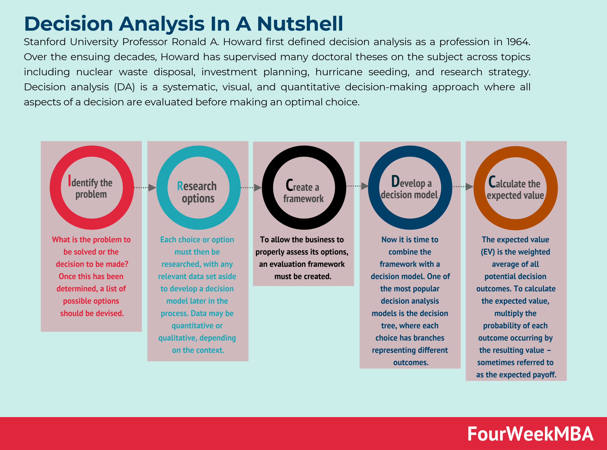

## Table of Contents

## What is decision analysis and why is it important?

Decision analysis is a way to help people make better choices when they have to decide between different options. It uses a step-by-step process to break down the decision into smaller parts, like figuring out what you want to achieve, what choices you have, and what might happen as a result of each choice. By looking at all these pieces together, decision analysis helps you see which option is likely to give you the best outcome.

This method is important because it makes decision-making clearer and more organized. Instead of just guessing or going with your gut feeling, decision analysis gives you a structured way to think through your choices. This can be really helpful in both personal life and at work, especially when the decisions are big and important, like choosing a career path or making business plans. By using decision analysis, you can feel more confident that you're making the best choice possible.

## How does decision analysis differ from other decision-making processes?

Decision analysis is different from other decision-making processes because it uses a structured and systematic approach. While many decision-making methods might rely on intuition or simple pros-and-cons lists, decision analysis breaks the decision down into smaller, manageable parts. It involves clearly defining the problem, identifying all possible options, and assessing the potential outcomes of each option based on probabilities and values. This detailed process helps to remove bias and emotion from the decision, making it more objective and rational.

In contrast, other decision-making processes might be less formal and more reliant on quick judgments or feelings. For example, a gut-feeling approach might lead someone to choose an option based on what feels right at the moment, without considering all the possible outcomes or their probabilities. Similarly, a pros-and-cons list can be helpful, but it often doesn't account for the likelihood of different outcomes or the varying importance of each [factor](/wiki/factor-investing). Decision analysis, on the other hand, uses tools like decision trees and expected value calculations to weigh options more accurately, making it a more thorough and reliable method for making important decisions.

## What are the basic steps involved in conducting a decision analysis?

Conducting a decision analysis starts with clearly defining the problem you need to solve. This means figuring out what you want to achieve with your decision. Next, you list all the possible choices you have. It's important to be thorough and include all options, even ones that might not seem great at first. After that, you need to think about what could happen as a result of each choice. This involves imagining different outcomes and figuring out how likely each one is to happen.

Once you have your choices and possible outcomes laid out, the next step is to assign values to these outcomes. This means deciding how good or bad each result would be for you. You might use a scale or numbers to show how much you value each outcome. Then, you combine the likelihood of each outcome happening with its value to find the expected value of each choice. This helps you see which option gives you the best overall result. Finally, you choose the option with the highest expected value, but it's also important to think about other factors like risks or how you feel about the decision.

This process might sound complicated, but it helps break down big decisions into smaller, easier steps. By following these steps, you can make more informed choices and feel more confident about your decisions. Decision analysis is especially useful for important or complex decisions where you want to be as sure as possible that you're making the best choice.

## Can you provide a simple example of decision analysis in everyday life?

Imagine you're trying to decide whether to take an umbrella with you when you leave the house. You check the weather forecast and see there's a 30% chance of rain. If it rains and you don't have an umbrella, you'll get wet and feel uncomfortable, which you rate as a bad outcome, worth -10 points. If it doesn't rain, not carrying an umbrella is no big deal, so that's a neutral outcome, worth 0 points. On the other hand, if it rains and you have an umbrella, you stay dry and feel good about being prepared, which you rate as a good outcome, worth +5 points. If it doesn't rain and you [carry](/wiki/carry-trading) an umbrella, it's a bit of a hassle but not too bad, so that's a slightly negative outcome, worth -2 points.

Using decision analysis, you figure out the expected value of each choice. If you don't take the umbrella, there's a 30% chance of getting wet (-10 points) and a 70% chance of staying dry (0 points). So, the expected value is (0.30 * -10) + (0.70 * 0) = -3 points. If you take the umbrella, there's a 30% chance of staying dry (+5 points) and a 70% chance of carrying it unnecessarily (-2 points). So, the expected value is (0.30 * +5) + (0.70 * -2) = +1.5 - 1.4 = +0.1 points. Based on this, taking the umbrella gives you a slightly better outcome, so that's what you decide to do.

## What are some common decision analysis tools and techniques?

Decision analysis uses different tools and techniques to help people make choices. One common tool is the decision tree, which is like a map of your decision. It shows all your options as branches and the possible outcomes as more branches. You can write down the chances of each outcome happening and how good or bad each one is. This helps you see which path gives you the best overall result. Another tool is the payoff matrix, which is a table where you list your choices on one side and the possible results on the other. You fill in the table with numbers to show how much you value each outcome. This makes it easier to compare your choices and pick the best one.

Another technique is sensitivity analysis, which helps you see how changes in your guesses might affect your decision. For example, if you're not sure about the chance of rain, you can change that number and see if it changes which choice is best. This helps you understand how sure you need to be about your information. Expected value calculations are also important. You multiply the chance of each outcome by how much you value it, then add up all those numbers for each choice. The choice with the highest total is usually the best one. These tools and techniques make decision analysis a powerful way to make smart choices.

## How can decision analysis be applied in business settings?

In business, decision analysis can help leaders make better choices by breaking down big decisions into smaller parts. For example, if a company is deciding whether to launch a new product, decision analysis can help them figure out all the options, like different features or prices for the product. They can then think about what might happen if they choose each option, like how much money they might make or lose, and how likely each outcome is. By using tools like decision trees and expected value calculations, the company can see which option is likely to give them the best result. This makes it easier to choose the best way to launch the new product.

Decision analysis is also useful for managing risks in business. Companies often have to make decisions when they're not sure what will happen in the future, like whether to invest in new technology or enter a new market. By using decision analysis, they can look at different scenarios and figure out how likely each one is to happen. They can then decide how much risk they're willing to take and choose the option that balances the potential rewards with the risks. This helps businesses make smarter decisions and feel more confident about their choices, even when the future is uncertain.

## What is the role of decision trees in decision analysis?

Decision trees are a big help in decision analysis because they make it easy to see all your choices and what might happen next. Imagine a tree where each branch shows a different choice you can make. As you follow the branches, you see different outcomes that could happen because of your choice. You can write down how likely each outcome is to happen and how good or bad it would be for you. This helps you see the whole decision like a map, making it easier to pick the best path.

In a business setting, decision trees can be really useful. For example, if a company is thinking about launching a new product, they can use a decision tree to look at different options, like what features to include or what price to set. Each branch of the tree can show what might happen if they choose a certain option, like how much money they might make or lose. By looking at the whole tree, the company can see which option is likely to give them the best result. This makes big business decisions feel simpler and more manageable.

## How does uncertainty and risk factor into decision analysis?

Uncertainty and risk are big parts of decision analysis because they help you understand what might happen in the future. When you're making a decision, you often don't know exactly what will happen. For example, if you're deciding whether to start a new business, you might not be sure how much money you'll make or if people will like your product. Decision analysis helps you think about these uncertainties by letting you guess how likely different outcomes are. You can use tools like decision trees to show all the possible outcomes and how likely each one is to happen. This helps you see the whole picture and make a smarter choice, even when you're not sure about everything.

Risk is about how much you could lose if things don't go the way you hope. In decision analysis, you think about the risks of each choice and decide if you're okay with them. For example, if you're thinking about investing in a new project, you might see that there's a chance you could lose a lot of money. By looking at the risks and the possible rewards, you can figure out if the chance of a big reward is worth the risk of a big loss. Decision analysis helps you weigh these risks and rewards so you can choose the option that gives you the best chance of a good outcome, while also being comfortable with the risks involved.

## Can you explain how multi-criteria decision analysis works?

Multi-criteria decision analysis is a way to make choices when you have to think about more than one thing at the same time. Imagine you're buying a new phone. You might care about the price, the battery life, and the camera quality. Multi-criteria decision analysis helps you look at all these things together. You start by listing all the things that matter to you, called criteria. Then, you figure out how important each criterion is to you. For example, maybe the camera is more important to you than the price. You can give each criterion a score to show how much it matters.

Next, you look at all your options and see how well each one does on each criterion. You might rate each phone on a scale for price, battery life, and camera quality. Then, you combine these ratings with the importance scores you gave to each criterion. This helps you see which phone does the best overall, considering everything you care about. Multi-criteria decision analysis is really helpful when you have a lot of different things to think about, and it makes it easier to choose the best option for you.

## What are some advanced methods used in decision analysis for complex scenarios?

When decisions get really complicated, people use advanced methods in decision analysis to help figure things out. One of these methods is called Monte Carlo simulation. This is like playing out a decision many times with a computer to see what might happen. You put in all the different things that could affect your decision, like how much something might cost or how long it might take, and the computer tries out different combinations of these things. This helps you see all the possible outcomes and how likely they are to happen. It's especially useful when you're not sure about a lot of details and want to understand the risks better.

Another advanced method is called Bayesian analysis. This method helps you update your guesses as you learn more information. Imagine you're trying to decide if a new marketing plan will work. You start with what you already know, like how well past plans have done. As you get new information, like early feedback from customers, you can use Bayesian analysis to change your guesses about how well the plan will work. This helps you make better decisions over time because you're always using the most up-to-date information. Both of these methods help you deal with the uncertainty and complexity that come with big decisions.

## How can decision analysis be integrated with data analytics and machine learning?

Decision analysis can be made even better by using data analytics and [machine learning](/wiki/machine-learning). Data analytics helps by giving you lots of information about what has happened in the past. For example, if you're deciding whether to open a new store, you can use data analytics to look at how well other stores have done in similar places. This helps you make better guesses about what might happen with your new store. Machine learning can take this a step further by finding patterns in the data that you might not see on your own. It can help you predict what will happen in the future based on what has happened before. By using these tools, decision analysis becomes more accurate and helps you make smarter choices.

Integrating decision analysis with data analytics and machine learning also helps you deal with uncertainty better. For example, machine learning can help you figure out how likely different outcomes are to happen. This is really useful in decision analysis because it helps you see which choice is likely to give you the best result. Also, as you get new data, you can use machine learning to update your guesses and make your decisions even better over time. By combining decision analysis with these powerful tools, you can make decisions that are based on a lot of information and are more likely to lead to good outcomes.

## What are the current trends and future directions in the field of decision analysis?

The field of decision analysis is always changing, and some of the current trends are about using more data and technology to make decisions. One big trend is the use of big data and machine learning. These tools help people look at a lot of information quickly and find patterns that they might not see otherwise. This makes decision analysis more accurate because it uses real data to help predict what might happen in the future. Another trend is the use of more advanced simulations, like Monte Carlo simulations, which let people play out different scenarios many times to see what might happen. This is really helpful for making decisions when there's a lot of uncertainty.

Looking ahead, the future of decision analysis seems to be about making it even easier to use and more powerful. One direction is to make decision analysis tools more user-friendly so that more people can use them, not just experts. This could mean using simpler software or apps that help people make decisions in everyday life. Another future direction is to keep improving how decision analysis works with other fields, like [artificial intelligence](/wiki/ai-artificial-intelligence) and behavioral science. By combining these areas, decision analysis can become even better at understanding how people make choices and helping them make better ones. This could lead to smarter decisions in everything from business to personal life.

## What are the key concepts and tools of decision analysis?

Decision analysis in [algorithmic trading](/wiki/algorithmic-trading) employs several key concepts and tools that enhance traders' capabilities to evaluate options, uncertainties, and outcomes. These tools aid in the structured decision-making process, allowing for improved strategies and risk management.

### Decision Nodes and Trees

Decision nodes and trees are pivotal in providing a structured visual representation of possible decisions and their associated outcomes. A decision tree consists of three types of nodes: decision nodes, chance nodes, and end nodes. Decision nodes (typically represented by squares) symbolize points where decisions need to be made. Chance nodes (circles) represent points of uncertainty where different outcomes can occur, each with a specific probability, and end nodes (triangles or leaf nodes) denote final outcomes of a decision path.

For instance, consider a trader deciding the best time to enter a market. Using a decision tree, the trader can map out potential market state changes and corresponding payoffs or losses. This graphical representation simplifies complex decision processes by summarizing available options and potential consequences, which enhances clarity and strategy formulation.

### Probabilities and Outcomes

Probabilities play a central role in decision analysis by quantifying the likelihood of various outcomes. In algorithmic trading, probabilities are used to estimate market behaviors and potential returns or losses. Calculating these probabilities involves statistical methods and historical data analysis, often resulting in probability distributions that inform decision-making under uncertainty.

For example, one might compute the expected monetary value (EMV) of different trading strategies. EMV is calculated as:

$$
\text{EMV} = \sum (P_i \cdot V_i)
$$

Where $P_i$ is the probability of an outcome $i$, and $V_i$ is the value (profit or loss) of that outcome. By comparing EMVs of various strategies, traders can make informed decisions that maximize potential returns.

### Utility and Preferences

Utility and preferences pertain to the subjective satisfaction or value a trader derives from different outcomes. This concept is essential because it recognizes that traders have diverse risk appetites and objectives. Utility functions are often used to represent these preferences mathematically, capturing the trade-offs between risk and reward.

A common utility function used in trading is the exponential utility function, which is defined as:

$$
U(x) = 1 - e^{-ax}
$$

Where $U(x)$ is the utility of a monetary gain or loss $x$, and $a$ is the risk aversion coefficient. The shape of the utility function reflects the trader's risk tolerance: a higher value of $a$ indicates higher risk aversion.

By incorporating utility and preferences, traders align their decision-making processes with their personal or institutional goals, ensuring that strategies not only aim for profitability but also conform to acceptable risk levels.

In summary, decision nodes and trees offer a clear visual path through complex decision landscapes, probabilities provide quantitative assessments of potential market scenarios, and utility functions capture individual risk preferences, all of which are integral to effective decision analysis in algorithmic trading.

## What are some real-world examples from case studies?

### Case Study 1: Hedge Fund Utilization of Decision Trees

Decision trees have proven particularly effective in assisting hedge funds to navigate complex trading environments. A decision tree is a schematic model used to decide on the best [course](/wiki/best-algorithmic-trading-courses) of action amid numerous potential scenarios. The approach provides a structured framework for evaluating the impact of each decision path, thereby optimizing trading strategies.

Consider a hypothetical [hedge fund](/wiki/hedge-fund-trading-strategies) that integrates decision trees into its trading algorithm to refine its strategic options. Suppose the fund is analyzing potential investment opportunities across diverse asset classes. The decision tree model is leveraged to map out potential market movements based on historical data and expert forecasts. Each node in the tree represents a decision point, with branches signifying possible market responses or subsequent decisions. By assigning probabilities and expected returns to various outcomes, the decision tree aids the hedge fund in quantifying risk and potential returns systematically.

For instance, let the expected return of a decision path be calculated as follows:

$$
E(R) = \sum_{i=1}^{n} P_i \cdot R_i
$$

where $E(R)$ is the expected return, $P_i$ the probability of outcome $i$, and $R_i$ the return associated with outcome $i$. The fund uses this formula to evaluate paths within the decision tree, allowing it to choose strategies with highest expected returns adjusted for risk. Over time, this approach may enhance returns by selecting strategies that align with market dynamics, thereby improving the fund's predictive accuracy and profitability.

### Case Study 2: Algorithmic Firm's Application of Sensitivity Analysis

An algorithmic trading firm benefits from incorporating sensitivity analysis to bolster algorithm resilience amid volatile market conditions. Sensitivity analysis examines how the uncertainty in the output of a model can be apportioned to different sources of uncertainty in its inputs. This proves invaluable in algorithmic trading because it helps understand how various factors affect algorithmic decisions and overall performance.

Imagine an algorithmic firm that employs a model to trade based on economic indicators like interest rates and foreign exchange rates. The model uses sensitivity analysis to predict how changes in these indicators could impact trading outcomes. By systematically adjusting input parameters and observing changes in the model's predictions, the firm identifies the indicators to which their algorithms are most sensitive. 

For instance, consider an algorithm $\mathcal{A}$ that produces a profit function $P(x, y, z)$, where $x$, $y$, $z$ are economic indicators. Sensitivity can be examined through partial derivatives:

$$
\frac{\partial P}{\partial x}, \quad \frac{\partial P}{\partial y}, \quad \frac{\partial P}{\partial z}
$$

These derivatives help determine which indicators most significantly influence $P$. Subsequently, the firm can apply this insight to prioritize monitoring of those indicators and tweak algorithms accordingly to reduce adverse effects during volatile periods. This practice not only enhances the robustness of trading strategies but also mitigates risk by preparing for potential market disruptions.

Both case studies illustrate how decision analysis methodologies—such as decision trees and sensitivity analysis—empower trading entities to refine strategies and augment trading performance in complex market landscapes.

## References & Further Reading

[1]: Bergstra, J., Bardenet, R., Bengio, Y., & Kégl, B. (2011). ["Algorithms for Hyper-Parameter Optimization."](https://dl.acm.org/doi/10.5555/2986459.2986743) Advances in Neural Information Processing Systems 24.

[2]: ["Advances in Financial Machine Learning"](https://www.amazon.com/Advances-Financial-Machine-Learning-Marcos/dp/1119482089) by Marcos Lopez de Prado

[3]: ["Evidence-Based Technical Analysis: Applying the Scientific Method and Statistical Inference to Trading Signals"](https://www.amazon.com/Evidence-Based-Technical-Analysis-Scientific-Statistical/dp/0470008741) by David Aronson

[4]: ["Machine Learning for Algorithmic Trading"](https://github.com/stefan-jansen/machine-learning-for-trading) by Stefan Jansen

[5]: ["Quantitative Trading: How to Build Your Own Algorithmic Trading Business"](https://github.com/LucindaYa/quant-resources/blob/master/Quantitative%20Trading%20How%20to%20Build%20Your%20Own%20Algorithmic%20Trading%20Business.pdf) by Ernest P. Chan