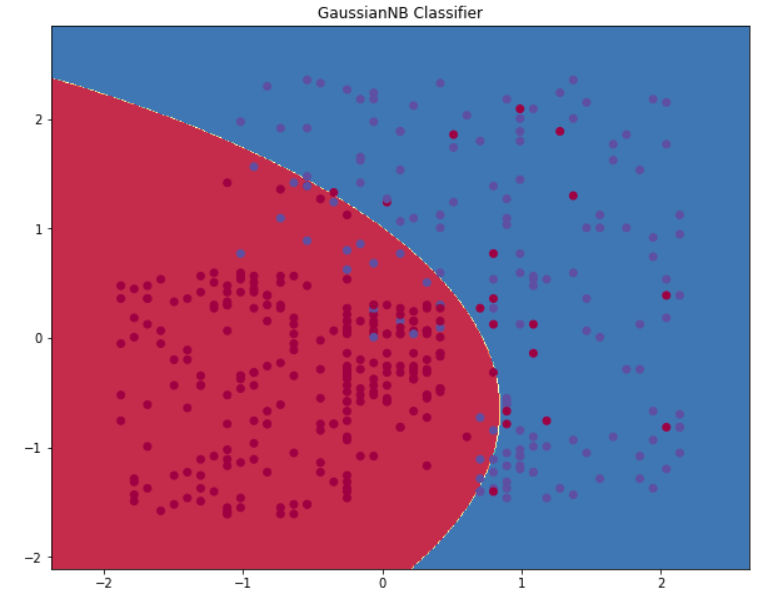

## Table of Contents

## What is a decision boundary in machine learning?

A decision boundary in machine learning is a line or surface that separates different classes or categories in a dataset. Imagine you have a bunch of red and blue dots on a piece of paper. The decision boundary would be the line you draw to separate the red dots from the blue dots. In more complex scenarios, this boundary might not be a straight line but could be a curve or even a hypersurface in higher dimensions.

For example, in a simple classification problem where you're trying to distinguish between apples and oranges based on their weight and color, the decision boundary could be a line that separates the two types of fruit on a graph. If the data is more complex, the decision boundary might be a more intricate shape. Mathematically, for a linear classifier like logistic regression, the decision boundary can be represented as $$ w_1x_1 + w_2x_2 + b = 0 $$, where $$ w_1 $$ and $$ w_2 $$ are weights, $$ x_1 $$ and $$ x_2 $$ are features, and $$ b $$ is the bias term. This equation helps the model decide which side of the boundary a new data point belongs to.

## How does a decision boundary help in classification tasks?

A decision boundary helps in classification tasks by acting like a dividing line that sorts different types of data into groups. Imagine you're sorting apples and oranges. You could draw a line on a piece of paper to separate the apples from the oranges based on their features, like weight and color. In machine learning, the decision boundary does the same thing but with more data points and possibly more complex shapes. When a new piece of data comes in, the model uses the decision boundary to decide which group it belongs to, making classification easier and more accurate.

For example, in a simple case, if you're using a linear classifier like logistic regression, the decision boundary might look like a straight line. This line can be described by the equation $$ w_1x_1 + w_2x_2 + b = 0 $$, where $$ w_1 $$ and $$ w_2 $$ are weights, $$ x_1 $$ and $$ x_2 $$ are features, and $$ b $$ is the bias term. When a new data point comes in, the model plugs its features into this equation. If the result is positive, the data point goes on one side of the line; if negative, it goes on the other side. This helps the model make quick and clear decisions about which category the new data belongs to.

## Can you explain the concept of decision boundary using a simple example?

Imagine you're trying to separate red apples from green apples based on their weight and color. You can plot each apple on a graph, with the x-axis representing weight and the y-axis representing color. If you draw a line on this graph that separates the red apples from the green apples, that line is called the decision boundary. This line helps you quickly decide if a new apple is red or green just by seeing where it falls on the graph.

In [machine learning](/wiki/machine-learning), this decision boundary can be more complex than a straight line. For example, if you're using a linear classifier like logistic regression, the decision boundary might be described by the equation $$ w_1x_1 + w_2x_2 + b = 0 $$, where $$ w_1 $$ and $$ w_2 $$ are weights, $$ x_1 $$ and $$ x_2 $$ are the features (like weight and color), and $$ b $$ is the bias term. When a new apple's weight and color are plugged into this equation, if the result is positive, the apple goes on one side of the line (let's say the red side), and if it's negative, it goes on the other side (the green side). This helps the computer sort new apples quickly and accurately.

## What are the different types of decision boundaries in machine learning?

In machine learning, decision boundaries can be linear or non-linear. A linear decision boundary is a straight line or a flat plane that separates different classes of data. For example, if you're using logistic regression to classify data into two categories, the decision boundary could be represented by the equation $$ w_1x_1 + w_2x_2 + b = 0 $$, where $$ w_1 $$ and $$ w_2 $$ are weights, $$ x_1 $$ and $$ x_2 $$ are features, and $$ b $$ is the bias term. This equation creates a straight line on a graph that divides the data into two groups.

Non-linear decision boundaries are more complex and can take the shape of curves or even more intricate surfaces. These are often used when the data cannot be separated by a straight line. For instance, support vector machines (SVMs) with a non-linear kernel can create decision boundaries that are curved or even circular. These boundaries help to classify data that has a more complex pattern. For example, if you're trying to separate data points that form a circle, a non-linear decision boundary might look like $$ (x_1 - a)^2 + (x_2 - b)^2 = r^2 $$, where $$ a $$ and $$ b $$ are the center coordinates and $$ r $$ is the radius of the circle.

## How do linear decision boundaries differ from non-linear ones?

Linear decision boundaries are like straight lines or flat planes that divide data into different groups. Imagine you have red and blue dots on a piece of paper, and you draw a straight line to separate them. This line is a linear decision boundary. In math, it can be shown by an equation like $$ w_1x_1 + w_2x_2 + b = 0 $$, where $$ w_1 $$ and $$ w_2 $$ are numbers that tell how important each feature is, $$ x_1 $$ and $$ x_2 $$ are the features of the data, and $$ b $$ is a number that shifts the line. Linear decision boundaries are simple and work well when the data can be easily split by a straight line.

Non-linear decision boundaries are more like curves or wavy lines that can twist and turn to separate data that can't be split by a straight line. If you have data points that form a circle, a non-linear decision boundary might look like $$ (x_1 - a)^2 + (x_2 - b)^2 = r^2 $$, where $$ a $$ and $$ b $$ are the center of the circle and $$ r $$ is how big the circle is. These boundaries are used when the data has a more complicated pattern. They help to make better guesses about which group new data points belong to, even when the data is messy or spread out in weird ways.

## What role do decision boundaries play in logistic regression?

In logistic regression, the decision boundary is like a line or a flat surface that helps to split the data into different groups. Imagine you have a bunch of red and blue dots on a piece of paper. The decision boundary would be the straight line you draw to separate the red dots from the blue dots. In math, this line can be shown by the equation $$ w_1x_1 + w_2x_2 + b = 0 $$, where $$ w_1 $$ and $$ w_2 $$ are numbers that tell how important each feature is, $$ x_1 $$ and $$ x_2 $$ are the features of the data, and $$ b $$ is a number that shifts the line. When a new piece of data comes in, logistic regression uses this line to decide if the new data should be red or blue.

This decision boundary is key because it helps logistic regression make clear and quick decisions. When the model sees a new piece of data, it plugs the data's features into the equation. If the result is positive, the data goes on one side of the line (let's say the red side), and if it's negative, it goes on the other side (the blue side). This way, logistic regression can sort new data points accurately and efficiently, even if the data is a bit messy or spread out.

## How can decision boundaries be visualized in two-dimensional space?

In two-dimensional space, a decision boundary can be thought of as a line that separates different groups of data points. Imagine you have a graph where the x-axis shows one feature of the data, like weight, and the y-axis shows another feature, like color. If you're trying to separate red apples from green apples, you can draw a straight line on this graph to divide the red apples from the green ones. This line is the decision boundary, and it helps you decide which group a new apple belongs to based on where it falls on the graph.

For example, if you're using logistic regression, the decision boundary might be described by the equation $$ w_1x_1 + w_2x_2 + b = 0 $$. Here, $$ w_1 $$ and $$ w_2 $$ are numbers that tell how important each feature is, $$ x_1 $$ and $$ x_2 $$ are the features like weight and color, and $$ b $$ is a number that shifts the line. When a new apple's weight and color are plugged into this equation, if the result is positive, the apple goes on one side of the line (let's say the red side), and if it's negative, it goes on the other side (the green side). This way, the decision boundary helps the computer sort new apples quickly and accurately.

## What challenges are encountered when dealing with high-dimensional data in terms of decision boundaries?

When dealing with high-dimensional data, visualizing and understanding decision boundaries becomes much harder. In two dimensions, you can draw a line to separate different groups of data. But in high-dimensional space, the decision boundary might be a complex shape like a hypersurface that's hard to picture or describe. This makes it tough to see how well the model is separating the data and where it might be making mistakes.

Another challenge is the curse of dimensionality. As the number of features increases, the [volume](/wiki/volume-trading-strategy) of the space grows exponentially, which means data points can become very spread out. This can make it hard for the model to find a clear decision boundary because there's not enough data to cover all the space. For example, if you're using logistic regression in high-dimensional space, the decision boundary equation $$ w_1x_1 + w_2x_2 + ... + w_nx_n + b = 0 $$ becomes more complex, and small changes in the weights can lead to big changes in where the boundary falls.

## How do support vector machines (SVMs) optimize decision boundaries?

Support vector machines (SVMs) optimize decision boundaries by finding the best line or surface that separates different groups of data with the widest possible gap, called the margin. Imagine you're drawing a line to separate red and blue dots on a piece of paper. SVMs try to draw the line that keeps the red and blue dots as far away from the line as possible. This helps make the decision boundary more reliable because it's less likely to misclassify new data points that fall near the boundary. The math behind this involves finding the weights $$ w $$ and the bias $$ b $$ in the equation $$ w_1x_1 + w_2x_2 + ... + w_nx_n + b = 0 $$ that maximize this margin.

When the data can't be separated by a straight line, SVMs use something called a kernel trick. This lets them create more complex decision boundaries like curves or circles without actually moving into a higher-dimensional space. For example, if you're trying to separate data points that form a circle, SVMs might use a kernel to create a decision boundary that looks like $$ (x_1 - a)^2 + (x_2 - b)^2 = r^2 $$. This trick helps SVMs handle messy or spread-out data better than other methods, making them a powerful tool for classification tasks.

## What is the impact of overfitting on decision boundaries?

Overfitting happens when a model learns too much from the training data, including the noise and random errors. This makes the decision boundary very wiggly and complex, trying to fit every little detail of the training data. Imagine drawing a line to separate red and blue dots. An overfitted model might twist and turn the line to touch almost every dot, instead of drawing a simpler line that separates the groups more generally. This can lead to a decision boundary that looks like $$ w_1x_1 + w_2x_2 + ... + w_nx_n + b = 0 $$ with very high values for the weights $$ w $$, making the boundary overly sensitive to small changes in the data.

When an overfitted model tries to classify new data, it can make a lot of mistakes because it's too focused on the specific patterns in the training data. The wiggly decision boundary might classify new points incorrectly because it's not good at generalizing to data it hasn't seen before. For example, if you're using a model to sort apples and oranges, an overfitted model might get confused by a new apple that's a bit heavier or lighter than the ones it trained on, putting it on the wrong side of the decision boundary. This is why it's important to find a balance, making sure the decision boundary is complex enough to capture the true patterns in the data, but not so complex that it captures the noise too.

## How can techniques like regularization affect the shape of decision boundaries?

Regularization is like a way to keep a model from getting too complicated. Imagine you're drawing a line to separate red and blue dots on a piece of paper. Without regularization, the line might twist and turn a lot to fit every single dot perfectly, which can lead to overfitting. But with regularization, the model is encouraged to draw a simpler line that still separates the dots well but doesn't get too wiggly. This is done by adding a penalty to the model's weights, making it harder for the model to use very high values for the weights. In math, this can be shown by adding a term like $$ \lambda \sum_{i=1}^{n} w_i^2 $$ to the model's cost function, where $$ \lambda $$ is a number that controls how strong the penalty is and $$ w_i $$ are the weights.

By using regularization, the decision boundary becomes smoother and more general, which helps the model work better with new data it hasn't seen before. For example, if you're using logistic regression, the decision boundary might be described by the equation $$ w_1x_1 + w_2x_2 + b = 0 $$. With regularization, the weights $$ w_1 $$ and $$ w_2 $$ are kept smaller, making the line less sensitive to small changes in the data. This means the model is less likely to get confused by new apples or oranges that are a bit different from the ones it trained on, leading to better and more reliable classification.

## What advanced methods exist for optimizing decision boundaries in complex datasets?

One advanced method for optimizing decision boundaries in complex datasets is using ensemble methods like Random Forests or Gradient Boosting. Imagine you have a bunch of different models, each trying to draw a line to separate red and blue dots. Instead of relying on just one model, ensemble methods combine the decisions of many models to make a better decision boundary. This can help handle complex patterns in the data that a single model might miss. For example, a Random Forest creates many decision trees, and each tree votes on where the boundary should be. The final decision boundary is smoother and more accurate because it's based on the combined wisdom of all the trees.

Another method is using [deep learning](/wiki/deep-learning), specifically neural networks. Neural networks can learn very complex decision boundaries by stacking layers of simple functions. Think of it like building a decision boundary from lots of small pieces. Each layer in the [neural network](/wiki/neural-network) can learn to recognize different parts of the pattern in the data, and together they can create a boundary that's curved or even has multiple parts. For example, in a neural network, the decision boundary might be described by a complicated function like $$ f(x_1, x_2) = \sigma(W_2 \cdot \sigma(W_1 \cdot [x_1, x_2]^T + b_1) + b_2) $$, where $$ \sigma $$ is an activation function, $$ W_1 $$ and $$ W_2 $$ are weight matrices, and $$ b_1 $$ and $$ b_2 $$ are bias vectors. This allows neural networks to handle data with many features or non-linear relationships between them.

Lastly, techniques like kernel methods, such as Support Vector Machines (SVMs) with non-linear kernels, can also optimize decision boundaries for complex datasets. SVMs try to find the best line or surface to separate the data, but when the data can't be split by a straight line, they use a trick called the kernel trick. This trick lets SVMs create more complex decision boundaries like curves or circles without actually moving into a higher-dimensional space. For example, if you're trying to separate data points that form a circle, an SVM might use a kernel to create a decision boundary that looks like $$ (x_1 - a)^2 + (x_2 - b)^2 = r^2 $$. This helps SVMs handle messy or spread-out data better than other methods, making them a powerful tool for classification tasks.