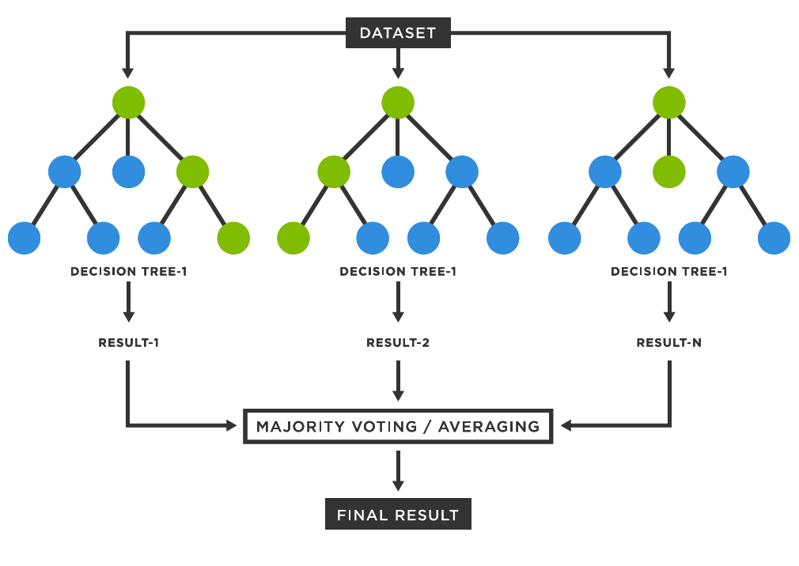

## Table of Contents

## What is a Decision Forest in machine learning?

A Decision Forest in machine learning is a type of ensemble learning method that combines multiple decision trees to make more accurate predictions. Imagine a decision tree as a flowchart where each branch represents a decision based on different features of the data. By themselves, decision trees can be prone to overfitting, meaning they might perform well on the training data but not as well on new, unseen data. A Decision Forest helps overcome this by creating many decision trees and then averaging their predictions, which generally leads to better and more stable results.

In a Decision Forest, each tree is trained on a random subset of the data and a random subset of the features. This randomness helps to ensure that the trees are diverse and not correlated with each other. When making a prediction, the forest takes the output from all the trees and combines them. For classification tasks, this might mean taking a majority vote among the trees. For regression tasks, it could involve averaging the predictions from all the trees. This approach not only improves the accuracy but also makes the model more robust against overfitting.

To illustrate, if you have a dataset about whether people will buy a product based on their age, income, and location, a single decision tree might focus too much on age and miss important patterns in income or location. A Decision Forest would create many trees, each looking at different combinations of these factors, and then combine their insights to make a more informed prediction about buying behavior. This method is widely used in various applications, from predicting customer behavior to diagnosing diseases, because of its effectiveness and flexibility.

## How does a Decision Forest differ from a single Decision Tree?

A Decision Forest is different from a single Decision Tree mainly because it uses many trees instead of just one. Think of a single Decision Tree as a flowchart that makes decisions based on different features of your data. It can be good at making predictions, but sometimes it can focus too much on certain details and not see the bigger picture. This is called overfitting, and it can make the tree perform poorly on new data. A Decision Forest, on the other hand, creates lots of these trees, each looking at different parts of the data. By combining the predictions from all these trees, the forest can make more accurate and reliable predictions.

The way a Decision Forest works is by training each tree on a random piece of the data and a random set of features. This randomness helps make sure that the trees are different from each other and not all making the same mistakes. When it's time to make a prediction, the forest takes a vote from all the trees. For example, if you're trying to predict whether someone will buy a product, each tree in the forest will give its guess, and the forest will go with the most popular answer. This method makes the model more robust and less likely to overfit, which is why Decision Forests are often used in real-world applications where accuracy and reliability are important.

## What are the main components of a Decision Forest?

A Decision Forest is made up of many decision trees working together. Each tree in the forest is like a small decision maker that looks at different pieces of the data. When you build a Decision Forest, you start by [picking](/wiki/asset-class-picking) random parts of your data and random features to train each tree. This randomness helps make sure that each tree is a bit different from the others, which is important for getting good results. By having lots of trees, the forest can see the problem from many different angles and make better predictions.

When it's time to use the Decision Forest to make a prediction, it takes the guesses from all the trees and combines them. For example, if you're trying to guess whether someone will buy a product, each tree will give its own guess, and the forest will take a vote. If most of the trees say "yes," then the forest will predict "yes." This way of combining many small guesses into one big guess helps the forest be more accurate and reliable than just using one tree. It's like getting advice from a group of experts instead of just one person.

## How is a Decision Forest constructed?

Building a Decision Forest starts with taking your data and splitting it into many smaller pieces. Each piece of data is used to train a different tree in the forest. When training each tree, you also pick a random set of features to look at. This randomness is important because it makes sure that each tree sees the data a bit differently. Imagine you're trying to guess if someone will buy a product. One tree might look at their age and income, while another tree might look at their location and how often they shop. By doing this, you end up with a forest full of trees, each with its own unique view of the data.

Once all the trees are trained, the Decision Forest is ready to make predictions. When you want to predict something, like whether someone will buy a product, each tree in the forest makes its own guess. The forest then combines all these guesses. For example, if most of the trees say "yes," the forest will predict "yes." This way of combining many small guesses into one big guess helps the forest be more accurate and reliable than just using one tree. It's like getting advice from a group of experts instead of just one person.

## What are the advantages of using a Decision Forest over other machine learning models?

One big advantage of using a Decision Forest over other [machine learning](/wiki/machine-learning) models is that it's really good at handling complex data. Decision Forests can look at many different parts of your data at the same time. This means they can find patterns that other models might miss. For example, if you're trying to predict if someone will buy a product, a Decision Forest can consider things like their age, income, and shopping habits all together. This makes the predictions more accurate because the forest sees the big picture.

Another advantage is that Decision Forests are less likely to overfit. Overfitting happens when a model learns too much from the training data and doesn't work well on new data. Because a Decision Forest uses many trees, each looking at different pieces of the data, it's less likely to make this mistake. The forest takes a vote from all the trees, so even if one tree is off, the others can help correct it. This makes Decision Forests more reliable and better at making predictions on new data.

Lastly, Decision Forests are easy to understand and explain. Each tree in the forest is like a simple flowchart that makes decisions based on your data. This makes it easier to see why the forest made a certain prediction. For example, if a Decision Forest predicts that someone won't buy a product, you can look at the trees and see that it's because they have a low income and rarely shop. This transparency can be really helpful, especially in fields like medicine or finance where you need to explain your predictions to others.

## Can you explain the concept of bagging in the context of Decision Forests?

Bagging, short for Bootstrap Aggregating, is a way to make Decision Forests work better. When you build a Decision Forest, you don't use all your data to train each tree. Instead, you take random samples of your data, and each tree gets its own sample. This means that each tree in the forest sees a different piece of the data. By doing this, you make sure that the trees are different from each other. It's like having a group of friends who each see a different part of a puzzle. When they come together, they can put the pieces together better because they have different information.

When it's time to make a prediction, the Decision Forest uses bagging to combine the guesses from all the trees. If you're trying to guess if someone will buy a product, each tree will give its own answer based on its piece of the data. The forest then takes a vote. If most of the trees say "yes," the forest will predict "yes." This way of combining many small guesses into one big guess helps the forest be more accurate and reliable. Bagging makes the forest stronger by using the power of many trees working together.

## How does feature importance work in Decision Forests?

Feature importance in Decision Forests tells you which pieces of information are most helpful for making good guesses. Imagine you're trying to predict if someone will buy a product. You might look at things like their age, income, and how often they shop. A Decision Forest can tell you that income is more important than age for making this prediction. It does this by looking at how much each piece of information helps to split the data into different groups. The more a feature helps to make good splits, the more important it is.

The way a Decision Forest figures out feature importance is by checking how much each tree uses each feature to make decisions. If a lot of trees use income to make their guesses, then income is probably very important. The forest then adds up these scores from all the trees to get an overall importance score for each feature. This helps you understand which pieces of information are driving the forest's predictions, making it easier to explain why the forest makes certain guesses.

## What are some common algorithms used to create Decision Forests?

One common algorithm for creating Decision Forests is Random Forests. Random Forests work by building lots of decision trees, each using a random piece of your data and a random set of features. This randomness helps make sure that each tree is a bit different from the others. When you want to make a prediction, like guessing if someone will buy a product, each tree gives its own answer. The Random Forest then takes a vote from all the trees. If most trees say "yes," the forest predicts "yes." This way, Random Forests can make more accurate and reliable guesses than just using one tree.

Another popular algorithm is Gradient Boosting Machines (GBM). GBMs build decision trees one at a time, and each new tree tries to fix the mistakes made by the previous ones. This means that each tree learns from the errors of the last tree, making the whole forest better at predicting over time. For example, if the first tree guesses wrong about someone buying a product, the next tree will focus on that mistake and try to get it right. By the end, the GBM combines all the trees to make a final prediction. This step-by-step improvement can lead to very accurate results, though it might take longer to train than a Random Forest.

A third algorithm worth mentioning is Extremely Randomized Trees (Extra Trees). Extra Trees are similar to Random Forests but go a step further with randomness. Not only do they use random pieces of data and random features, but they also choose random split points when building each tree. This extra randomness can sometimes make the forest even less likely to overfit, meaning it works better on new data. Like Random Forests, Extra Trees take a vote from all the trees to make a final prediction. While they might not always be as accurate as GBMs, they can be faster to train and still very effective.

## How can overfitting be prevented when using Decision Forests?

Overfitting in Decision Forests can be prevented by making sure that each tree in the forest is different from the others. One way to do this is by using something called bagging. Bagging means taking random pieces of your data and using them to train each tree. This randomness helps make sure that the trees don't all see the same information, so they don't all make the same mistakes. Another way to prevent overfitting is by limiting the size of each tree. If you stop growing the trees too early, they won't get too detailed and start to overfit the data.

Another important way to prevent overfitting is by controlling the number of features each tree can look at. If you only let each tree use a few features at a time, it can't get too focused on any one part of the data. This is called feature randomness, and it helps make sure that the forest sees the big picture instead of getting stuck on small details. By combining these methods, you can build a Decision Forest that is good at making predictions without overfitting to the training data.

## What are the hyperparameters that can be tuned in a Decision Forest model?

When you're working with a Decision Forest model, there are several hyperparameters you can adjust to make it work better. One important hyperparameter is the number of trees in the forest. If you have more trees, the forest can make more accurate predictions, but it might take longer to train. Another hyperparameter is the maximum depth of each tree. By setting a limit on how deep the trees can grow, you can prevent the model from overfitting to the training data. You can also control the minimum number of samples needed to split a node or to be at a leaf node, which helps keep the trees from getting too detailed.

Another set of hyperparameters involves how the trees are built. You can adjust the number of features each tree is allowed to consider when making a split. This is called feature randomness, and it helps make sure that the trees are different from each other. You can also change the way the trees vote on the final prediction. For example, in a Random Forest, you might use a simple majority vote, but in a Gradient Boosting Machine, you might weight the votes of later trees more heavily. By tuning these hyperparameters, you can find the best settings for your specific problem and data.

## How do Decision Forests handle missing data and categorical variables?

Decision Forests have smart ways to deal with missing data. When a tree in the forest needs to make a decision but finds that a piece of information is missing, it can still work. The tree looks at similar pieces of data that have that information and decides based on them. This is called imputation. It's like guessing what the missing piece might be by looking at other similar pieces. This way, the forest can keep making good guesses even when some information is missing.

For categorical variables, Decision Forests handle them easily. Categorical variables are things like colors or types, not numbers. When building the trees, the forest can split the data based on these categories. For example, if you're trying to predict if someone will buy a product and you have a category like "location," the tree can split the data into different locations. This helps the forest see patterns in the data based on these categories. By doing this, the forest can use both numbers and categories to make its predictions.

## What are some advanced techniques for optimizing the performance of Decision Forests?

One advanced technique for optimizing the performance of Decision Forests is through hyperparameter tuning. This involves adjusting settings like the number of trees, the maximum depth of each tree, and the number of features each tree can consider when making a split. By trying different combinations of these settings, you can find the best ones for your specific problem. For example, you might use a method called grid search, where you test many different combinations of hyperparameters to see which one gives the best results. Another method is random search, where you randomly pick combinations of hyperparameters to try. Both methods can help you find the best settings to make your Decision Forest more accurate.

Another technique is to use ensemble methods beyond just bagging. For instance, you can combine Decision Forests with other types of models, like neural networks or support vector machines, to create a more powerful ensemble. This is called stacking, where the predictions from different models are used as inputs to a final model that makes the ultimate prediction. Stacking can improve performance because it combines the strengths of different types of models. Additionally, you can use techniques like feature engineering to create new features from your existing data, which can help the Decision Forest see patterns it might have missed before. By combining these advanced techniques, you can make your Decision Forest even better at making predictions.