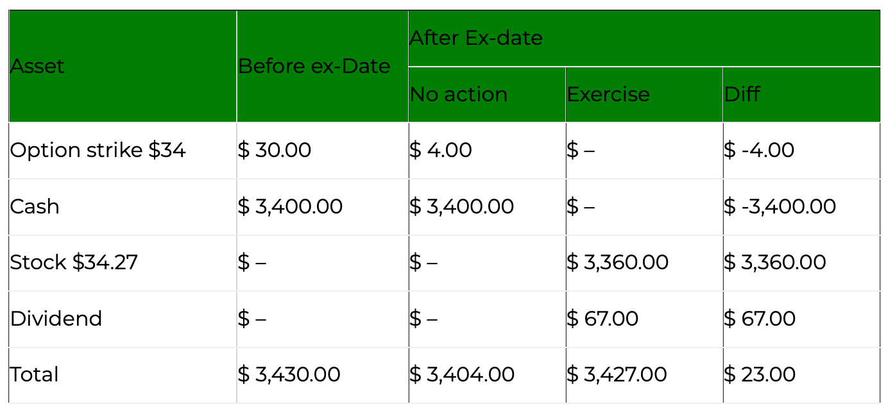

## Table of Contents

## What is options trading?

Options trading is a way to buy and sell contracts that give you the right, but not the obligation, to buy or sell an asset at a specific price before a certain date. These assets can be stocks, commodities, or even currencies. When you trade options, you're betting on whether the price of the asset will go up or down. If you think the price will go up, you can buy a call option. If you think the price will go down, you can buy a put option.

Options can be used for different reasons. Some people use them to make money by guessing the direction of the market. Others use them to protect their investments. For example, if you own a stock and you're worried the price might drop, you can buy a put option to sell the stock at a set price, even if the market price falls lower. This can help limit your losses. Options trading can be risky, so it's important to understand how it works before you start.

## What does it mean to 'hold' an option?

When you 'hold' an option, it means you own the option contract and have the right to use it before it expires. This right lets you buy or sell the asset that the option is based on, like a stock, at a specific price. You can hold onto the option until the expiration date, or you can sell it to someone else before it expires.

Holding an option can be useful if you think the price of the asset will move in a way that benefits you. For example, if you have a call option and the stock price goes up, you can use the option to buy the stock at a lower price than it's currently trading at. Or, if you have a put option and the stock price goes down, you can sell the stock at a higher price than the market. Just remember, if you don't use the option or sell it before it expires, it becomes worthless.

## What does it mean to 'exercise' an option?

When you 'exercise' an option, it means you are using the right that the option gives you. If you have a call option, exercising it means you are buying the stock at the price set in the option contract. If you have a put option, exercising it means you are selling the stock at the price set in the option contract. You would usually exercise an option if it's a good deal for you, like if the stock price is better than what you can get in the market.

Exercising an option is not something you have to do. You can choose to let the option expire if it's not in your favor. But if you do decide to exercise, you need to do it before the option's expiration date. Once you exercise, you'll either own the stock (if it's a call option) or you'll have sold the stock (if it's a put option), and the option contract will be gone.

## What are the basic factors to consider when deciding whether to hold or exercise an option?

When deciding whether to hold or exercise an option, one important [factor](/wiki/factor-investing) is the current price of the stock compared to the strike price of the option. If you have a call option and the stock price is higher than the strike price, it might be a good time to exercise because you can buy the stock at a lower price than what it's trading at. If you have a put option and the stock price is lower than the strike price, exercising could be beneficial because you can sell the stock at a higher price than the market. However, if the stock price isn't favorable, you might want to hold the option and wait to see if the price moves in your favor before the option expires.

Another factor to consider is the time left until the option expires. If there's still a lot of time left, you might choose to hold the option because there's a chance the stock price could move in your favor. Holding gives you more time to make a decision. But if the option is about to expire and the stock price isn't good for you, you might need to decide quickly whether to exercise or let it expire worthless. Also, think about the costs involved, like any fees for exercising the option, and how that might affect your decision.

## How do time value and intrinsic value affect the decision to hold or exercise?

When deciding whether to hold or exercise an option, you need to think about the time value and the intrinsic value of the option. The intrinsic value is the difference between the stock's current price and the strike price of the option. If you have a call option and the stock price is higher than the strike price, the intrinsic value is positive, and exercising the option could make sense because you can buy the stock at a lower price. But if you have a put option and the stock price is lower than the strike price, the intrinsic value is positive, and you might want to exercise to sell the stock at a higher price. If the intrinsic value is zero or negative, it might be better to hold the option and wait for the stock price to move in your favor.

The time value of an option is the extra value it has because there's still time left before it expires. The more time left, the higher the time value, because there's more chance for the stock price to move in your favor. If there's a lot of time left on your option, you might want to hold it instead of exercising, even if the intrinsic value is positive. This gives you the chance to wait and see if the stock price gets even better. But if the option is about to expire and the time value is low, you need to decide quickly whether to exercise based on the intrinsic value, because soon the option will only be worth its intrinsic value, and then it will expire worthless if you don't use it.

## What role does the option's expiration date play in the decision-making process?

The option's expiration date is really important when you're deciding whether to hold or exercise an option. It's the last day you can use the option, so it affects how much time you have left to make your decision. If the expiration date is far away, you might want to hold the option because there's still a lot of time for the stock price to move in your favor. This gives you more flexibility and the chance to wait for a better price.

But if the expiration date is coming up soon, you need to think carefully about what to do. If the stock price is good for you right now, you might want to exercise the option before it's too late. If the stock price isn't good, you might decide to let the option expire worthless, because there's not much time left for the price to change. So, the expiration date helps you figure out how urgent your decision is and whether you should act now or wait.

## How can market volatility influence the choice between holding and exercising an option?

Market [volatility](/wiki/volatility-trading-strategies) means how much the stock price goes up and down. If the market is very volatile, the stock price can change a lot in a short time. When this happens, you might want to hold your option instead of exercising it right away. Holding the option gives you the chance to wait and see if the stock price moves in a way that's even better for you. If you think the price might keep changing a lot, holding could be a good choice because you might get a better deal later.

On the other hand, if the market is very volatile and the stock price is already good for your option, you might want to exercise it quickly. This is because the price could change a lot and go against you if you wait too long. If you have a call option and the stock price is high, exercising it now means you can buy the stock at a lower price before it drops. If you have a put option and the stock price is low, exercising it now means you can sell the stock at a higher price before it goes up. So, market volatility can make you want to hold if you think the price might get better, or exercise if you want to lock in a good price before it changes.

## What are the tax implications of holding versus exercising an option?

When you hold an option, you don't have to pay taxes right away. You only pay taxes when you sell the option or it expires. If you sell the option for more than you paid for it, you'll have to pay capital gains tax on the profit. The tax rate depends on how long you held the option. If you held it for less than a year, it's a short-term capital gain, and you'll pay your regular income tax rate. If you held it for more than a year, it's a long-term capital gain, and the tax rate is usually lower.

If you exercise an option, the tax situation can be different. When you exercise a call option and buy the stock, you don't pay taxes right away on the difference between the stock's market price and the strike price. But if you later sell the stock for a profit, you'll pay capital gains tax on that profit. The tax rate will depend on how long you held the stock after exercising the option. If you exercise a put option and sell the stock, you might have to pay taxes on any profit you made from the sale, depending on how long you held the stock. It's important to talk to a tax professional to understand all the details because tax rules can be complicated.

## How does the underlying asset's price movement impact the decision to hold or exercise?

When you're thinking about whether to hold or exercise an option, the price of the stock or whatever the option is based on is really important. If you have a call option and the stock price is higher than the price set in the option, you might want to exercise it. This is because you can buy the stock at a lower price than what it's trading at right now. But if the stock price is lower than the price in your call option, it might be better to hold onto it and wait for the price to go up. The same goes for a put option. If the stock price is lower than the price in your put option, exercising it could be a good idea because you can sell the stock at a higher price than the market. But if the stock price is higher, you might want to hold and wait for it to drop.

The movement of the stock price also matters because it can change quickly. If the stock price is moving a lot, you might want to hold your option to see if it gets even better for you. But if the price is already good and you think it might not stay that way, you might want to exercise the option to lock in a good deal. For example, if you have a call option and the stock price jumps up a lot, you might want to exercise it right away to buy the stock at a lower price before it drops again. Or if you have a put option and the stock price drops a lot, you might want to exercise it to sell the stock at a higher price before it goes back up. So, watching how the stock price moves can help you decide whether to hold or exercise your option.

## What advanced strategies can be employed when deciding between holding and exercising?

When deciding between holding and exercising an option, advanced traders might use a strategy called "rolling." Rolling means you close your current option position and open a new one with a different expiration date or strike price. If you think the stock price will keep moving in your favor but your current option is about to expire, you might roll it to a later date to give yourself more time. Or if the stock price has moved a lot, you might roll to a different strike price to keep the option profitable. Rolling can help you keep your position active and potentially make more money, but it also means you'll have to pay more in fees and commissions.

Another strategy is using options to create a "straddle" or "strangle." A straddle involves buying a call and a put option at the same strike price and expiration date. A strangle is similar, but the call and put have different strike prices. These strategies can help you make money no matter which way the stock price moves, as long as it moves a lot. If the stock price goes up a lot, you can exercise or sell the call option for a profit. If it goes down a lot, you can exercise or sell the put option. By holding these options, you're betting on big price swings, and you'll decide to exercise or sell based on how the stock price moves. These strategies can be riskier and more complex, so they're usually used by experienced traders.

## How do institutional investors typically approach the decision to hold or exercise options?

Institutional investors, like big companies or funds that manage a lot of money, usually have a plan when they decide whether to hold or exercise an option. They look at things like the stock's price, how much time is left before the option expires, and what's happening in the market. If they think the stock price might get even better, they might choose to hold the option and wait. But if the stock price is already good for them and they want to lock in that profit, they might exercise the option. They also think about how exercising the option might affect the stock price and their other investments, because their actions can move the market.

Sometimes, institutional investors use advanced strategies like rolling their options. This means they might close their current option and open a new one with a different expiration date or strike price. They do this to keep their position active and possibly make more money. They also might use options to create strategies like straddles or strangles, which let them make money no matter which way the stock price moves, as long as it moves a lot. These strategies can be more complicated, but institutional investors have the resources and experience to use them effectively.

## What are some common mistakes to avoid when deciding whether to hold or exercise an option?

One common mistake people make when deciding whether to hold or exercise an option is not paying attention to the time left until the option expires. If you wait too long and the option is about to expire, you might miss out on a good chance to make money. If the stock price is good for you and the option is about to expire, you should think about exercising it instead of holding it. Another mistake is not understanding the stock's price compared to the option's strike price. If the stock price is better than the strike price, exercising the option could be a good idea, but if you don't realize this, you might hold the option too long and lose out on the profit.

Another mistake is not thinking about how the stock price might change in the future. If the stock price is moving a lot, you might want to hold the option to see if it gets even better, but if you think the good price won't last, you should exercise it quickly. Also, people sometimes forget about the costs of exercising an option, like fees and commissions. These costs can eat into your profits, so you need to think about them when deciding whether to hold or exercise. It's important to keep these things in mind to make the best decision with your options.

## What are the key options trading strategies?

Options trading provides investors with multiple strategies to navigate market dynamics effectively. Understanding key strategies such as buying calls, buying puts, and employing covered calls and protective puts is essential for maximizing potential gains and managing risks.

**Buying Calls**

Purchasing call options is a core strategy for investors who anticipate an increase in the price of an underlying asset. A call option gives the holder the right, but not the obligation, to buy the underlying asset at a predetermined strike price before the option expires. This strategy is particularly attractive due to its leverage; investors can control a large position with a relatively small capital outlay. 

The payoff for a call option can be expressed as:

$$
\text{Payoff} = \max(0, S_T - K) - C
$$

where $S_T$ is the price of the underlying asset at expiration, $K$ is the strike price, and $C$ is the cost of the call option (premium). When the market price of the asset exceeds the strike price, the holder can exercise the option to realize a profit.

**Buying Puts**

Conversely, buying put options is a strategy used when an investor expects the price of an underlying asset to fall. A put option gives the holder the right to sell the asset at a specified strike price. This strategy benefits from price declines while limiting downside risk to the premium paid for the put.

The payoff for a put option is calculated as:

$$
\text{Payoff} = \max(0, K - S_T) - P
$$

where $P$ is the put option premium. This strategy allows investors to hedge their portfolios against potential losses in declining markets.

**Covered Calls and Protective Puts**

Integrating options with stock ownership can further enhance investment strategies. A covered call involves holding a long position in an asset while selling call options on the same asset. This approach generates additional income from option premiums and is beneficial when investors expect minimal price movements. However, the upside potential is limited if the asset's price rises significantly, as the sold call may be exercised.

A protective put strategy combines owning a stock with purchasing a put option on the same asset. This strategy provides downside protection by limiting losses if the asset's value declines below the strike price of the put option. It acts similarly to insurance on the stock, securing against adverse price movement while allowing for upside potential.

**Example:**

Here is a simple Python code snippet to calculate the payoff of a call and put option:

```python
def call_option_payoff(stock_price, strike_price, premium):
    return max(0, stock_price - strike_price) - premium

def put_option_payoff(stock_price, strike_price, premium):
    return max(0, strike_price - stock_price) - premium

# Example usage
stock_price_at_expiration = 150
call_strike_price = 145
put_strike_price = 155
call_premium = 5
put_premium = 7

call_payoff = call_option_payoff(stock_price_at_expiration, call_strike_price, call_premium)
put_payoff = put_option_payoff(stock_price_at_expiration, put_strike_price, put_premium)

print(f"Call Option Payoff: {call_payoff}")
print(f"Put Option Payoff: {put_payoff}")
```

These strategies highlight the flexibility of options trading, enabling investors to tailor their tactics based on market expectations and individual risk profiles. By integrating these strategies effectively, investors can enhance their potential for profitability while managing risk in their portfolios.

 to Algorithmic Trading

Algorithmic trading, commonly known as algo trading, utilizes computer algorithms to execute trading orders with high speed and accuracy based on predetermined criteria. This technological advancement streamlines the process of trading by enabling orders to be placed in milliseconds or quicker, which is significantly faster than humanly possible. Algorithms are programmed to assess various market factors such as price, timing, and [volume](/wiki/volume-trading-strategy), ensuring that trades are executed under optimal conditions.

One of the key advantages of [algorithmic trading](/wiki/algorithmic-trading) is its ability to minimize emotional biases that often affect human traders. By relying on data-driven insights, algo trading facilitates more rational and objective decision-making processes. This enhances the overall efficiency and effectiveness of trading strategies, leading to potentially higher profitability.

In options trading, algo trading is particularly beneficial due to the complexity and speed required in managing options strategies. Options trading often involves multi-leg strategies, which include executing different types of options (such as calls and puts) simultaneously. The precision and rapid execution afforded by algorithms are critical in optimizing these strategies, which are not feasible through manual trading.

Algo trading involves various types of strategies such as market-making, trend-following, and [arbitrage](/wiki/arbitrage), which can be customized based on specific trading goals. The core of these strategies lies in identifying and exploiting market patterns using sophisticated quantitative models. For instance, a simple example of a trading algorithm in Python might involve setting buy and sell thresholds based on moving averages:

```python
def trading_decision(prices, short_window=40, long_window=100):
    signals = pd.DataFrame(index=prices.index)
    signals['price'] = prices
    signals['short_mavg'] = prices.rolling(window=short_window, min_periods=1).mean()
    signals['long_mavg'] = prices.rolling(window=long_window, min_periods=1).mean()

    signals['signal'] = 0.0
    signals['signal'][short_window:] = np.where(signals['short_mavg'][short_window:] > signals['long_mavg'][short_window:], 1.0, -1.0)
    signals['positions'] = signals['signal'].diff()

    return signals
```

In the example above, the algorithm generates buy and sell signals based on short-term and long-term moving averages of the price data. When the short-term average crosses above the long-term average, a buy signal is generated, and a sell signal is triggered when the opposite occurs.

The integration of algorithmic trading in options markets has also facilitated the development of high-frequency trading ([HFT](/wiki/high-frequency-trading-strategies)), where transactions are enacted in fractions of a second to capitalize on small price discrepancies. The ability to swiftly adapt to changing market conditions while implementing complex options strategies is a significant contribution of algorithmic trading, optimizing performance and reducing the risk of human error.

## References & Further Reading

[1]: Black, F., & Scholes, M. (1973). ["The Pricing of Options and Corporate Liabilities,"](https://www.cs.princeton.edu/courses/archive/fall09/cos323/papers/black_scholes73.pdf) Journal of Political Economy, 81(3), 637-654.

[2]: Hull, J. C. (2012). ["Options, Futures, and Other Derivatives,"](https://www.semanticscholar.org/paper/Options%2C-Futures%2C-and-Other-Derivatives-Hull/89bdee500c8623864fc9eb7a471546aa713acc44) Pearson, 8th Edition.

[3]: Hasbrouck, J. (2007). ["Empirical Market Microstructure: The Institutions, Economics, and Econometrics of Securities Trading,"](https://archive.org/details/empiricalmarketm0000hasb) Oxford University Press.

[4]: Aldridge, I. (2009). ["High-Frequency Trading: A Practical Guide to Algorithmic Strategies and Trading Systems,"](https://books.google.com/books/about/High_Frequency_Trading.html?id=8QpIsVUMhmEC) Wiley Trading.

[5]: Narang, M. (2013). ["Inside the Black Box: A Simple Guide to Quantitative and High-Frequency Trading,"](https://books.google.com/books/about/Inside_the_Black_Box.html?id=aYA0LnecyTgC) Wiley Finance.