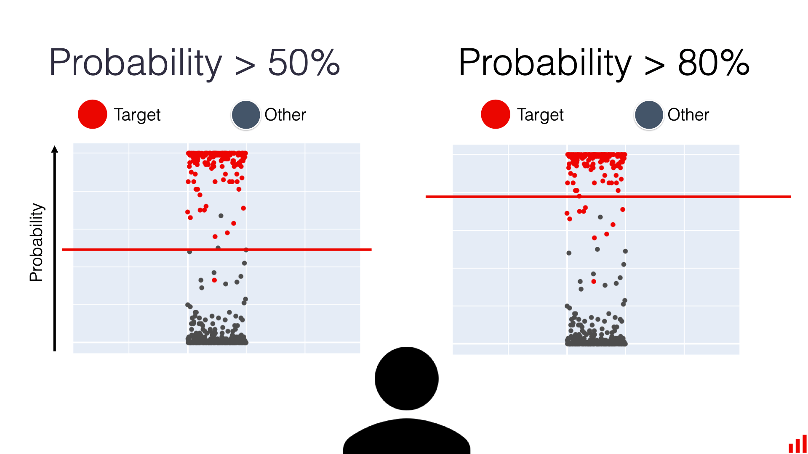

## Table of Contents

## What is a decision threshold in machine learning?

In machine learning, a decision threshold is a specific value used to make a final prediction from a model's output. When a model calculates a probability or a score, the decision threshold helps decide whether to classify an instance into one category or another. For example, in a binary classification problem, if the model outputs a probability of an event happening, the decision threshold determines the cutoff point: if the probability is above the threshold, the model predicts the event will happen; if it's below, it predicts the event won't happen.

Choosing the right decision threshold is important because it affects the balance between different types of errors the model might make. If the threshold is set too high, the model might miss many true positives (false negatives), while setting it too low might lead to many false positives. The optimal threshold often depends on the specific needs of the application and the relative costs of different types of errors. For instance, in medical diagnosis, it might be more critical to minimize false negatives, so the threshold might be set lower to catch more true cases, even at the risk of more false positives.

## How does a decision threshold affect classification models?

A decision threshold is like a line that a classification model uses to decide which group something belongs to. Imagine you're trying to guess if an email is spam or not. Your model gives each email a score, and if that score is higher than the decision threshold, you say it's spam. If it's lower, you say it's not spam. By changing where you draw this line, you can change how your model works. If you make the threshold higher, your model will be more careful about calling something spam, but it might miss some spam emails. If you lower the threshold, your model will catch more spam, but it might also call some good emails spam by mistake.

The choice of the decision threshold can really change how well your model works. For example, in a medical test for a disease, you want to make sure you don't miss anyone who is sick. So, you might set the threshold lower to catch more cases, even if it means more healthy people get tested further. This is about finding the right balance between catching all the sick people (true positives) and not worrying too many healthy people (false positives). The best threshold depends on what's more important in your situation, like whether it's worse to miss a sick person or to worry a healthy one.

## Why is the default decision threshold usually set at 0.5?

The default decision threshold of 0.5 is commonly used because it's a simple and fair starting point for many classification problems. When a model gives a probability, 0.5 is right in the middle, so it's like flipping a coin. If the model says there's more than a 50% chance of something happening, we go with that prediction. This works well when the costs of being wrong in either direction are about the same. For example, if you're predicting whether it will rain or not, and being wrong about rain is just as bad as being wrong about no rain, 0.5 makes sense.

However, the 0.5 threshold isn't always the best choice. In real life, the cost of making different kinds of mistakes can be very different. For instance, if you're trying to detect a serious disease, missing a sick person (false negative) is much worse than telling a healthy person they might be sick (false positive). In these cases, you might want to lower the threshold to catch more cases, even if it means more false alarms. The key is to think about what's more important in your situation and adjust the threshold to match those needs.

## What are the implications of changing the decision threshold?

Changing the decision threshold in a classification model can really change how it works. If you make the threshold higher, the model will be more careful about saying "yes" to something. For example, if you're trying to spot spam emails, a higher threshold means fewer emails will be marked as spam. This might be good if you don't want to miss any important emails, but it also means some spam might slip through. On the other hand, if you lower the threshold, the model will be more likely to say "yes." In the spam email case, more emails will be marked as spam, which is great for catching more spam, but it might also flag some good emails as spam by mistake.

The choice of the decision threshold depends a lot on what's more important in your situation. If missing a "yes" case is really bad, like missing a sick person in a medical test, you might want to lower the threshold. This way, you catch more cases, even if it means more false alarms. But if saying "yes" when it should be "no" is more of a problem, like wrongly stopping a credit card transaction, you might want to raise the threshold. It's all about finding the right balance between catching what you need to catch and not making too many mistakes.

## How can adjusting the decision threshold impact model performance metrics like accuracy, precision, and recall?

Adjusting the decision threshold can have a big impact on how well a model performs, especially when looking at metrics like accuracy, precision, and recall. Accuracy measures how often the model gets the right answer overall. If you change the threshold, you might see the accuracy go up or down. For example, if you raise the threshold, the model might become more accurate if it was making too many false positives before. But if you lower the threshold, accuracy might drop if the model starts making too many false negatives. The key is finding the right balance so the model gets as many answers right as possible.

Precision and recall are also affected by the decision threshold, but in different ways. Precision is about how many of the "yes" predictions are actually correct. If you raise the threshold, precision usually goes up because the model is more careful about saying "yes," so it makes fewer false positives. But this might also mean it misses some true positives, which brings us to recall. Recall is about how many of the actual "yes" cases the model catches. Lowering the threshold usually increases recall because the model is more likely to say "yes," catching more true positives, but it might also increase false positives, which can lower precision. So, when you adjust the threshold, you're always trading off between precision and recall, trying to find the sweet spot for your specific needs.

## What is the relationship between the decision threshold and the ROC curve?

The ROC (Receiver Operating Characteristic) curve is a way to see how well a classification model works at different decision thresholds. It shows the relationship between the true positive rate (sensitivity) and the false positive rate (1 - specificity) as you change the threshold. Imagine you're trying to predict if it will rain or not. If you set the threshold really low, your model will predict rain a lot, catching most of the times it actually does rain (high true positive rate), but it will also predict rain when it doesn't (high false positive rate). If you set the threshold high, the model will be more cautious, missing some rain predictions (low true positive rate) but also making fewer wrong predictions about rain (low false positive rate). The ROC curve plots these rates for every possible threshold, giving you a clear picture of how the model's performance changes.

To understand how the decision threshold affects the ROC curve, think about how each point on the curve represents a different threshold. The curve starts at the bottom left, where the threshold is set so high that the model never predicts the positive class (0% true positive rate, 0% false positive rate). As you lower the threshold, you move up and to the right on the curve, increasing both the true positive rate and the false positive rate. The ideal model would have a curve that hugs the top left corner of the graph, showing high true positives with low false positives at all thresholds. The area under the ROC curve (AUC) is a common metric used to summarize the model's performance across all possible thresholds. A higher AUC means the model is generally better at distinguishing between the positive and negative classes, no matter where you set the threshold.

## How do you determine the optimal decision threshold for a specific problem?

Finding the best decision threshold for a specific problem depends on what's most important for that situation. You need to think about the costs of making different kinds of mistakes. For example, if you're trying to predict if someone has a disease, missing a sick person (false negative) might be much worse than telling a healthy person they might be sick (false positive). In this case, you might want to lower the threshold to catch more cases, even if it means more false alarms. On the other hand, if you're checking credit card transactions for fraud, wrongly stopping a legitimate transaction (false positive) might be more annoying than missing a small fraudulent one (false negative). Here, you might want to raise the threshold to be more careful about saying "yes" to fraud.

To find the optimal threshold, you can use tools like the ROC curve and the precision-recall curve. The ROC curve shows how the true positive rate and false positive rate change as you adjust the threshold. The area under the ROC curve (AUC) gives you a sense of how well the model can tell the difference between positive and negative cases. But the ROC curve alone doesn't tell you the best threshold; it just shows you the trade-offs. You might also look at the precision-recall curve, which shows how the precision (how many of the "yes" predictions are correct) and recall (how many of the actual "yes" cases you catch) change with the threshold. By looking at these curves and thinking about the costs of different errors, you can pick a threshold that works best for your specific needs.

## Can you explain the use of cost-sensitive learning in setting decision thresholds?

Cost-sensitive learning is a way to think about the costs of making different kinds of mistakes when you're setting the decision threshold for a model. Imagine you're trying to predict if an email is spam or not. If you mark a good email as spam (false positive), it might be annoying, but if you miss a spam email (false negative), it could be more harmful because you might miss important information. Cost-sensitive learning helps you set the threshold so that the model makes fewer of the more costly mistakes. By figuring out how much each type of mistake costs, you can adjust the threshold to minimize the overall cost, rather than just trying to get the most correct answers.

To use cost-sensitive learning, you need to know the costs of false positives and false negatives for your specific problem. Let's say the cost of a false positive is $$C_{FP}$$ and the cost of a false negative is $$C_{FN}$$. You can then calculate the total cost of misclassification and find the threshold that minimizes it. For example, if $$C_{FN}$$ is much higher than $$C_{FP}$$, you might want to lower the threshold to catch more positive cases, even if it means more false positives. This way, you're not just looking at how accurate the model is, but how the mistakes it makes affect you. By considering these costs, you can make a smarter choice about where to set the threshold.

## What are some common techniques for selecting the best decision threshold in imbalanced datasets?

When dealing with imbalanced datasets, where one class has a lot more examples than the other, choosing the right decision threshold is really important. In these cases, the usual 0.5 threshold might not work well because the model might be biased towards the majority class. One way to pick a better threshold is by looking at the ROC curve. The ROC curve shows how the true positive rate and false positive rate change as you adjust the threshold. By finding the point on the curve that's closest to the top left corner, you can choose a threshold that balances catching as many of the minority class examples as possible (high true positive rate) without making too many mistakes on the majority class (low false positive rate).

Another technique is to use the precision-recall curve, which is especially useful for imbalanced datasets. The precision-recall curve shows how the precision (how many of the "yes" predictions are correct) and recall (how many of the actual "yes" cases you catch) change with the threshold. You can pick a threshold that gives you a good balance between precision and recall, depending on what's more important for your problem. For example, if missing a positive case is very costly, you might choose a threshold that maximizes recall, even if it means lower precision. By considering these curves and the specific needs of your problem, you can find a threshold that works better for imbalanced data.

## How does the decision threshold influence the trade-off between false positives and false negatives?

The decision threshold in a classification model is like a line that decides when to say "yes" or "no." When you change where you draw this line, it changes how many mistakes the model makes. If you move the threshold up, the model will be more careful about saying "yes," so it will make fewer false positives. A false positive is when the model says "yes" but it should be "no." But being more careful might also mean the model misses some true positives, which are the times it should say "yes" but doesn't. These are called false negatives. So, raising the threshold means fewer false positives but more false negatives.

On the other hand, if you lower the threshold, the model will be more likely to say "yes." This means it will catch more true positives, which is good if missing a "yes" case is really bad. But it also means the model will make more false positives, which can be annoying or even harmful depending on what you're predicting. So, lowering the threshold means more false positives but fewer false negatives. The key is to find the right balance for your specific situation. If missing a "yes" case is more costly than a false positive, you might want to lower the threshold. But if a false positive is more of a problem, you might want to raise it.

## What advanced methods exist for dynamically adjusting decision thresholds based on real-time data?

One advanced method for dynamically adjusting decision thresholds based on real-time data is adaptive thresholding. This approach involves continuously monitoring the performance of the model and adjusting the threshold in response to changes in the data. For example, if the model starts to see more false positives, the threshold can be raised to be more cautious. This can be done using algorithms that track the model's performance metrics like precision and recall over time and adjust the threshold to maintain a desired balance between them. Adaptive thresholding is particularly useful in environments where the data distribution changes frequently, such as fraud detection systems where new types of fraud might emerge.

Another method is using reinforcement learning to dynamically adjust the decision threshold. In this approach, the model learns to optimize the threshold based on feedback from the environment. The model might start with an initial threshold and then, over time, adjust it to minimize a cost function that considers the costs of false positives and false negatives. For instance, if the cost of a false negative is high, the model might learn to lower the threshold to catch more positive cases. This method can be more complex to implement but can be very effective in scenarios where the optimal threshold is not static and needs to adapt to changing conditions.

## How can multi-class classification problems be approached with decision thresholds?

In multi-class classification problems, where you're trying to sort things into more than two groups, using decision thresholds can be a bit trickier than in binary classification. Instead of just one threshold, you might need to use multiple thresholds or a different approach altogether. One common way is to use a "one-vs-rest" strategy. Here, you train a separate binary classifier for each class, where that class is treated as the positive case and all other classes are treated as the negative case. For each of these classifiers, you can set a decision threshold. If an item's score from a classifier is above its threshold, it's considered to belong to that class. The final prediction is usually the class with the highest score above its threshold.

Another approach is to use "one-vs-one" classifiers, where you train a binary classifier for every pair of classes. For example, if you have three classes A, B, and C, you would train classifiers for A vs B, A vs C, and B vs C. Each of these classifiers can have its own decision threshold. The final prediction can be made by a voting system, where the class that wins the most pairwise comparisons is chosen. In both approaches, adjusting the thresholds can help balance the trade-offs between different types of errors, much like in binary classification. The key is to find the right thresholds that minimize the overall misclassification cost for your specific problem.