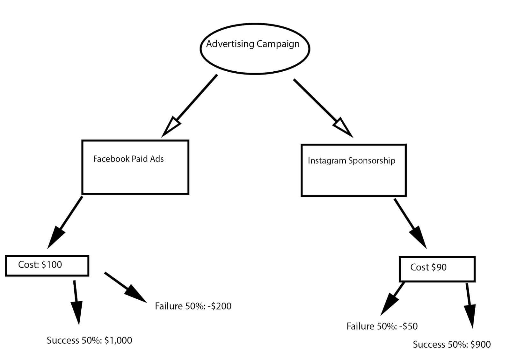

## Table of Contents

## What is a decision tree?

A decision tree is a simple way to make choices by breaking them down into smaller, easier steps. It looks like a tree turned sideways, with branches that represent different choices and outcomes. You start at the tree's trunk, which is your first decision, and then follow the branches to see what happens next. Each branch leads to another decision or a final result, helping you see all the possible paths and their consequences.

Decision trees are useful in many areas, like business, medicine, and even daily life. For example, a doctor might use a decision tree to decide on the best treatment for a patient by considering different symptoms and test results. In business, a company might use a decision tree to figure out whether to launch a new product by looking at costs, potential profits, and market conditions. By laying out all the options clearly, decision trees help people make better, more informed decisions.

## How does a decision tree work?

A decision tree works by breaking down a big decision into smaller, easier choices. You start at the beginning of the tree, which is like the trunk, and this is where you make your first decision. From there, the tree splits into branches, each branch showing a different choice you can make. You follow the branch that matches your choice, and it leads you to another decision or to an outcome. You keep going down the tree, making choices at each split, until you reach the end of a branch, which is a final result or outcome.

For example, imagine you're deciding whether to go on a picnic. The first decision might be to check the weather. If the weather is good, one branch leads to deciding what food to bring. If it's bad, another branch leads to deciding whether to postpone or have an indoor picnic. Each choice you make guides you to the next step, showing you all the possible paths and what might happen at the end of each one. This way, a decision tree helps you see all your options clearly and understand the consequences of each choice, making it easier to decide what to do.

## What are the main components of a decision tree?

A decision tree has three main parts: nodes, branches, and leaves. Nodes are like stops on the tree where you make a choice. The first node, called the root node, is where you start and make your first decision. As you go down the tree, you come to more nodes, called internal nodes, where you keep making choices. Branches are the lines that connect the nodes. They show the different choices you can make at each node. For example, if you're deciding whether to go outside, one branch might lead to "yes" and another to "no."

Leaves are the end points of the tree, where you reach a final result or outcome. They're also called terminal nodes. When you follow the branches and make choices at each node, you eventually get to a leaf, which tells you what happens based on the choices you made. So, a decision tree helps you see all the possible paths and outcomes by breaking down a big decision into smaller steps, using nodes for choices, branches to show the different options, and leaves to show the final results.

## What types of decision trees exist?

There are two main types of decision trees: classification trees and regression trees. Classification trees are used when you want to sort things into different groups. For example, a doctor might use a classification tree to decide if a patient has a certain disease or not. The tree helps by looking at different symptoms and test results, and then it puts the patient into a group, like "has the disease" or "does not have the disease."

Regression trees, on the other hand, are used when you want to predict a number or a value. For example, a business might use a regression tree to guess how much money they will make from selling a new product. The tree looks at different factors, like the price of the product and how many people might buy it, and then it gives a number that predicts the sales.

Both types of decision trees work by breaking down a big problem into smaller, easier choices. They help you see all the possible paths and outcomes, making it easier to make a decision or prediction.

## What are the advantages of using decision trees?

Decision trees are easy to understand and use. They show all the choices and outcomes in a simple picture, like a tree turned sideways. This makes it easy for anyone to see what might happen if they choose one thing over another. Because they're so clear, decision trees are great for explaining decisions to other people. They can help everyone understand why a certain choice was made and what the results might be.

Another advantage of decision trees is that they can handle all sorts of data. They work well with numbers, words, and even missing information. This makes them very useful in many different situations, like in business, medicine, and everyday life. Decision trees also help you see which choices are most important and which ones don't matter as much. This can save time and make the decision-making process easier and more focused.

## What are the limitations or disadvantages of decision trees?

Decision trees can be too simple sometimes. They might miss important details and make wrong guesses if the data is too complicated or if there are a lot of choices to consider. This is called overfitting, where the tree fits the data it has too closely and doesn't work well with new data. Another problem is that small changes in the data can make the tree look very different. This means the tree might not be reliable if the data changes a bit.

Another disadvantage is that decision trees can grow very big and hard to understand if there are a lot of choices and outcomes. This can make it difficult to use them in real life, especially when you need to explain the decision to others. Also, decision trees might not be the best choice for predicting things that change over time, like stock prices, because they look at one moment and don't consider how things might change in the future.

## How do you build a decision tree?

Building a decision tree starts with choosing the first question or decision to ask. This is called the root node, and it's the trunk of the tree. You pick this question based on what's most important for your decision. For example, if you're deciding on a picnic, you might start with, "Is the weather good?" You then split the data into different groups based on the answer to this question. If the weather is good, you follow one branch, and if it's bad, you follow another.

As you go down the tree, you keep asking more questions at each split, or node. These questions help you divide the data into smaller and smaller groups until you reach the end of a branch, which is called a leaf. Each leaf shows a final outcome or decision. You keep building the tree by choosing the next best question to ask at each node, making sure it helps you make the best split in the data. This process continues until you can't split the data any further or until you reach a point where you're happy with the outcomes at the leaves.

Building a decision tree can be done by hand, but it's often easier and more accurate to use a computer program. These programs use special math to figure out the best questions to ask at each node, making sure the tree is as helpful and accurate as possible. Once the tree is built, you can use it to make decisions by starting at the root node and following the branches based on your answers to the questions, until you reach a leaf that tells you what to do.

## What algorithms are commonly used to construct decision trees?

There are two main algorithms used to build decision trees: ID3 and CART. ID3, which stands for Iterative Dichotomiser 3, is used for making classification trees. It works by choosing the best question to ask at each step based on something called entropy, which measures how mixed up the data is. ID3 tries to find the question that splits the data into the neatest groups, making it easier to decide what to do next. It keeps doing this until it can't split the data any more or until it reaches a set limit.

CART, or Classification And Regression Tree, is another popular algorithm. It can make both classification and regression trees, which means it can sort things into groups or predict numbers. CART uses a different way to choose the best question, called the Gini index, which looks at how often the data might be wrongly sorted. Like ID3, CART keeps splitting the data into smaller groups until it can't go any further or until it reaches a set limit. Both algorithms help build decision trees that are useful for making choices and predictions.

## How can decision trees be used for classification and regression tasks?

Decision trees are used for classification tasks when you want to sort things into different groups. Imagine you're a doctor trying to figure out if a patient has a certain disease. You start with the first question, like "Does the patient have a fever?" Based on the answer, you go down one branch of the tree if the answer is "yes" and another if it's "no." You keep asking more questions at each step, like "Does the patient have a rash?" until you reach the end of a branch, which tells you if the patient has the disease or not. This helps you make a clear decision by looking at different symptoms and test results.

For regression tasks, decision trees are used when you want to predict a number or a value. Let's say you're a business owner trying to guess how much money you'll make from selling a new product. You start with a question like "What is the price of the product?" Depending on the answer, you follow one branch of the tree. Then you ask another question, like "How many people might buy it?" and keep going until you reach the end of a branch, which gives you a number that predicts your sales. This way, decision trees help you break down the problem into smaller steps and make a good guess about the outcome.

## What is pruning in decision trees and why is it important?

Pruning in decision trees is like trimming a real tree to make it smaller and healthier. In decision trees, pruning means cutting off some of the branches that aren't needed. This helps to make the tree simpler and easier to use. Sometimes, a decision tree can grow too big and complicated, especially if it tries to fit every little detail in the data. Pruning helps to remove these extra parts, making the tree more straightforward and easier to understand.

Pruning is important because it stops the tree from overfitting. Overfitting happens when the tree fits the data it has too closely and doesn't work well with new data. By pruning, you make the tree more general and better at making good decisions with new information. This makes the decision tree more reliable and useful in real life, helping you make better choices without getting lost in too many details.

## How can overfitting be prevented in decision trees?

Overfitting in decision trees can be prevented by using a technique called pruning. Pruning means cutting off parts of the tree that aren't needed, making it simpler and easier to use. When a decision tree grows too big, it might try to fit every little detail in the data, which can make it less useful for new situations. By pruning the tree, you remove these extra parts, helping the tree to be more general and better at making good decisions with new information.

Another way to prevent overfitting is by setting limits on how the tree grows. You can do this by deciding how deep the tree can go or how many branches it can have. This stops the tree from getting too complicated and helps it focus on the most important choices. By keeping the tree simple, you make sure it works well not just with the data you have, but also with new data you might see in the future.

## What are some advanced techniques for optimizing decision tree performance?

One advanced technique for optimizing decision tree performance is using ensemble methods like Random Forests and Boosting. Random Forests work by making lots of decision trees and then combining their results to make a better guess. Each tree in a Random Forest looks at different parts of the data, which helps to avoid overfitting and makes the final decision more reliable. Boosting, on the other hand, builds trees one after another, with each new tree trying to fix the mistakes made by the last one. This way, Boosting can slowly improve the accuracy of the decision tree, making it better at sorting things into the right groups or predicting the right numbers.

Another technique is feature selection and engineering. This means [picking](/wiki/asset-class-picking) the best questions to ask in the decision tree or creating new questions from the data you have. By choosing the most important features, you can make the tree simpler and more focused on what really matters. Feature engineering lets you come up with new ways to look at the data, which can help the tree find patterns and make better decisions. Both of these techniques help to make the decision tree more accurate and useful, especially when dealing with complicated data or big decisions.

## How can decision trees be enhanced with ensemble methods?

Ensemble methods are advanced techniques employed to enhance the predictive power of decision trees by combining the strengths of multiple models. These methods address some of the inherent shortcomings of single decision trees, such as overfitting and bias, making them more robust for [algorithmic trading](/wiki/algorithmic-trading).

### Random Forests

Random Forests are an ensemble method that mitigates overfitting by constructing a multitude of independent decision trees and aggregating their predictions. Each tree in a Random Forest is trained on a random subset of the data with a random subset of features, a process known as bootstrapping. This diversity in training reduces correlation between trees, thereby improving the model's generalization ability. The final prediction is typically determined by averaging the predictions for regression tasks or by majority voting for classification tasks.

Mathematically, if $T_1, T_2, \ldots, T_k$ are individual trees in the forest, the Random Forest prediction for a sample $x$ in a regression task is given by:

$$

\hat{y} = \frac{1}{k} \sum_{i=1}^{k} T_i(x) 
$$

In trading, Random Forests are particularly effective due to their ability to capture complex interactions within financial datasets, leading to more reliable predictions.

### Gradient Boosting

Gradient Boosting is a sequential ensemble method that focuses on reducing both bias and variance by building trees iteratively. Each subsequent tree is trained to correct the errors made by its predecessors. This is achieved by optimizing a loss function, usually through gradient descent techniques.

In each iteration, the model focuses on the residual errors of the previous trees, exponentially enhancing its accuracy. The learning process can be described by:

$$
F_{m}(x) = F_{m-1}(x) + \gamma \cdot h_m(x)
$$

where $h_m(x)$ is the new tree added in the $m^{th}$ iteration, and $\gamma$ is the learning rate controlling contributions from each tree.

In trading applications, Gradient Boosting is beneficial for refining predictions over time, as it efficiently handles the intricacies and noise in market data.

### AdaBoost

Adaptive Boosting, or AdaBoost, targets misclassified instances by adjusting their weights throughout the training process. Initially, all instances have equal weights. After each iteration, the weights of misclassified instances are increased so that subsequent weak learners focus more on difficult cases. This leads to an ensemble that is especially sensitive to rare market conditions or anomalies.

The weight update in AdaBoost can be formalized as follows:

$$
w_{i}^{(t+1)} = \frac{w_{i}^{(t)} \cdot e^{-\alpha_t y_i h_t(x_i)}}{Z_t}
$$

where $\alpha_t$ is the weight of the $t^{th}$ hypothesis, $y_i$ is the actual label, $h_t(x_i)$ is the predicted label, and $Z_t$ is a normalization factor.

In financial markets, AdaBoost is particularly adept at identifying pivotal moments such as trend reversals or price spikes, which might be missed by other models.

By leveraging ensemble methods, traders can significantly improve their algorithmic trading strategies, enhancing the reliability, accuracy, and adaptability of predictions derived from decision trees.

## References & Further Reading

Bergstra, J. et al. (2011). 'Algorithms for Hyper-Parameter Optimization.' Advances in Neural Information Processing Systems 24: This paper discusses methods for optimizing hyperparameters, which are crucial for improving model performance in [machine learning](/wiki/machine-learning), including decision trees and their ensemble variants used in algorithmic trading.

Lopez de Prado, Marcos. 'Advances in Financial Machine Learning': This book provides a comprehensive exploration of machine learning techniques applied to finance, with an emphasis on predictive models and signal processing, which are pertinent for enhancing algorithmic trading systems utilizing decision trees.

Aronson, David. 'Evidence-Based Technical Analysis: Applying the Scientific Method and Statistical Inference to Trading Signals': Aronson's work emphasizes the application of scientific methods in technical analysis, offering insights into how decision trees can be tested and validated to create reliable trading signals.

Jansen, Stefan. 'Machine Learning for Algorithmic Trading': Jansen outlines machine learning strategies for algorithmic trading, including practical implementations using Python. Decision trees feature prominently as tools for building algorithmic models that process financial data.

Chan, Ernest P. 'Quantitative Trading: How to Build Your Own Algorithmic Trading Business': Chan's book provides a guide to creating an algorithmic trading business, covering essential aspects such as model development and implementation. Decision trees are among the techniques discussed for generating trading strategies.

