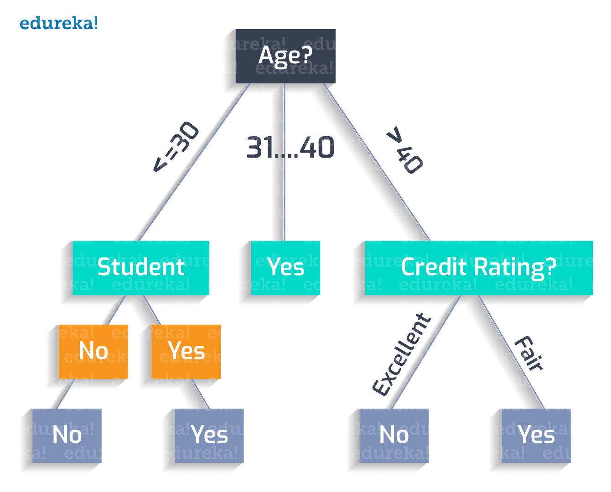

The rise of algorithmic trading has markedly transformed the landscape of financial markets, with decision trees emerging as a crucial component in this evolution. A class of machine learning algorithms, decision trees are employed to predict future price movements by analyzing historical data. These algorithms are structured in a tree-like model, facilitating transparent and clear decision-making within the highly dynamic and fast-paced trading environment. Decision trees stand out for their ability to segment data into branches that lead to decision nodes, thereby providing a visual representation of possible outcomes.

This article investigates the deployment of decision trees in algorithmic trading, examining their functionalities, advantages, and limitations. Understanding how decision trees integrate into algorithmic systems is vital for enhancing trading performance. As these models help in uncovering actionable insights and identifying market trends and patterns, traders and quantitative analysts can leverage them to refine trading strategies and improve the decision-making process.



Decision trees excel in presenting information hierarchically, allowing traders to prioritize decisions based on the likelihood of certain market behaviors. This prescriptive quality helps in systematically exploring the consequence of each decision, enabling traders to anticipate market responses effectively. In essence, decision trees serve as a blueprint for crafting trading algorithms that are both adaptive and robust, essential features in the continually evolving financial markets.

In following sections, we will further explore how decision trees function, their role in algorithmic trading systems, the benefits they offer, and the challenges faced in their implementation. This foundational understanding underscores the importance of integrating decision trees in algorithmic trading to achieve superior trading outcomes.

## Table of Contents

## What Are Decision Trees?

Decision trees are a class of supervised learning algorithms instrumental in tackling classification and regression problems. They operate through a model structured in a tree-like format, akin to a flowchart, where each internal node embodies a 'test' on a particular attribute. This structure allows branches to delineate the outcomes of these tests, ultimately leading to leaf nodes that hold decisive class labels or continuous values. 

The construction of decision trees is a methodological process that entails recursively dividing a dataset into progressively smaller, more homogeneous subsets. This recursive partitioning is guided by criteria such as the Gini impurity or information gain in classification tasks, and variance reduction in regression tasks. The objective is to achieve a final set of subsets, each sufficiently homogeneous with respect to the target variable.

These models are particularly beneficial in the context of [algorithmic trading](/wiki/algorithmic-trading), as they enable real-time decision-making based on historical financial data. By analyzing past price movements, decision trees can facilitate predictions about future price swings. This capability is vital for traders aiming to make binary decisions, which involve choosing between buy, hold, or sell actions, amidst a fast-moving market environment.

In summary, decision trees serve as an effective tool in predicting and classifying data points based on past observations, offering a clear and interpretable structure that supports prompt and informed trading decisions.

## The Role of Decision Trees in Algorithmic Trading

Algorithmic trading relies on sophisticated algorithms to execute trades at speeds and frequencies that are not possible for human traders. Among the different [machine learning](/wiki/machine-learning) models used, decision trees are particularly effective due to their ability to model intricate patterns within trading data. These models deploy a flowchart-like structure where each internal node denotes a test on an attribute, each branch represents the outcome of the test, and each leaf node holds a class label or decision result. This structure is well-suited for handling the myriad of variables in financial data.

One of the key advantages of decision trees in algorithmic trading is their capacity to accommodate various data types, including both numerical and categorical data. This flexibility is crucial, given the complexity and diversity of the datasets involved in trading activities. Decision trees are adept at parsing extensive datasets, which is fundamental for generating actionable trading insights. By sifting through historical data, these models can uncover hidden signals and trends, allowing traders to identify the factors influencing price movements.

The utility of decision trees in pinpointing such signals is complemented by their interpretability. Traders can follow the decision path within the tree to understand why a particular trading decision was recommended. This transparency fosters trust and aids traders, particularly those with less expertise in algorithm development, in understanding the basis for algorithm-generated predictions.

However, while decision trees offer significant power, they must be regularly updated to maintain efficacy in the ever-changing market environment. Continuous market evolution demands adaptive models that can integrate newly available data and insights. Without such updates, there is a risk of the model's predictions becoming outdated, which could lead to suboptimal trading decisions.

The need for continuous updates is compounded by the inherent challenge of overfitting, where a model performs well on historical data but poorly on unseen data. This is particularly pertinent in dynamic environments like financial markets, where conditions change frequently. As a result, decision trees used in trading systems must be re-evaluated and recalibrated regularly to ensure they provide accurate and reliable predictions. This iterative process is essential to harness the full potential of decision trees in algorithmic trading, ensuring they remain a robust tool for financial decision-making.

## Building Decision Trees for Trading

Building decision trees for trading involves several crucial steps that ensure the models are both accurate and generalizable. The process encompasses data collection, feature selection, model training, and monitoring of performance metrics.

### Data Collection

The initial step in building decision trees is data collection. This involves gathering comprehensive historical financial data, which is foundational for training a reliable model. Historical data should include a variety of market variables such as stock prices, trading volumes, interest rates, and economic indicators. The quality and breadth of this data significantly impact the decision tree's ability to make accurate predictions. Sources like Quandl, which provides extensive financial datasets, can be integral to this process.

### Feature Selection

Feature selection is the process of identifying variables most predictive of trading outcomes. Effective feature selection can enhance the model's performance by focusing only on the relevant data attributes. This step often involves technical indicators, such as moving averages, relative strength index (RSI), and Bollinger Bands, which are widely used in trading analysis. By leveraging domain knowledge and statistical tests, one can reduce the dimensionality of the dataset, which aids in simplifying the model and improving computational efficiency.

### Model Training

Model training is a critical stage where the collected data is used to develop the decision tree. This process involves splitting the dataset into training and testing subsets to validate the model's performance. Libraries such as Scikit-learn in Python provide a robust environment for implementing decision trees. For example, a simple implementation might look like this:

```python
from sklearn.model_selection import train_test_split
from sklearn.tree import DecisionTreeClassifier

# Assume data is a DataFrame containing features and target is the label
X_train, X_test, y_train, y_test = train_test_split(data.drop('target', axis=1), data['target'], test_size=0.2, random_state=42)

clf = DecisionTreeClassifier(random_state=42)
clf.fit(X_train, y_train)
```

### Monitoring Performance Metrics

Monitoring performance metrics is essential to ensure the model's effectiveness and avoid overfitting, which occurs when the model captures noise instead of the underlying data pattern. Common metrics include accuracy, precision, recall, and F1 score. Overfitting can be mitigated by techniques such as pruning, which simplifies the tree by removing branches that provide little power in predicting target variables:

```python
clf_pruned = DecisionTreeClassifier(random_state=42, max_depth=5)
clf_pruned.fit(X_train, y_train)
```

Regular evaluation against these metrics, often using cross-validation, helps in refining the model. This iterative process of building, testing, and refining is crucial for optimizing model performance and generalization to unseen data.

By meticulously executing these steps, one can build decision trees that efficiently analyze historical data to generate actionable trading insights.

## Advantages of Using Decision Trees in Trading

Decision trees offer several advantages in algorithmic trading, primarily due to their intuitive structures and ease of interpretability. This makes decision trees particularly appealing to traders who may not have extensive programming expertise, allowing them to construct and understand models without delving deep into complex algorithms.

One of the significant strengths of decision trees is their ability to handle both numerical and categorical data, which is crucial when dealing with diverse financial datasets. Financial data often includes a mix of different data types, such as price values (numerical) and market indicators or categorical events. Decision trees efficiently process these variations and make them particularly useful in creating robust trading models.

Moreover, decision trees are adept at managing datasets with missing values, a common issue in financial data. Unlike other techniques that might require intricate methods to address missing entries, decision trees can accommodate these gaps directly. They do this by deciding splits at internal nodes based on the available data, effectively reducing the need for complex imputation methods and simplifying the data-preprocessing phase.

The straightforward structure of decision trees facilitates their use as powerful tools for algorithmic trading. They decompose the decision-making process into smaller, manageable parts, resembling an easily understandable flowchart. This transparency in the decision-making logic aids traders in aligning the model’s operations with their strategic goals. Additionally, this clear mapping from inputs to predicted outcomes allows users to easily audit and refine the decision-making process without enormous computational overhead.

These features make decision trees not only an effective but also an accessible technology for algorithmic trading, providing key insights and data-driven decisions that can be seamlessly integrated into trading strategies.

## Limitations and Challenges

Decision trees in algorithmic trading face several limitations and challenges. One significant issue is their propensity to overfit training data, particularly in high-frequency trading environments where market conditions can fluctuate rapidly and extensively. Overfitting occurs when a model captures noise rather than the underlying data pattern, which impairs its generalization to new data. To illustrate, if a decision tree model focuses too much on specific historical price movements, it may fail to accurately predict future trends, leading to suboptimal trading decisions.

Adapting to rapidly changing market conditions poses another challenge for decision trees. These models often require frequent re-training to remain effective, given that financial markets are influenced by a myriad of dynamic factors such as geopolitical events, economic indicators, and investor sentiment. The static nature of decision trees can hinder their capacity to accommodate new, unforeseen data patterns, potentially reducing their effectiveness in a volatile trading environment.

To ensure robustness, decision tree models must be validated using unseen datasets. This involves splitting the available data into training and testing sets to evaluate model performance on samples not exposed during training. Validation techniques are crucial to assess the model's ability to generalize across different data sets and market scenarios.

Techniques like pruning and cross-validation are instrumental in addressing these challenges. Pruning involves the removal of parts of the tree that do not provide power to classify instances, thereby simplifying the model and reducing overfitting. Cross-validation, particularly k-fold cross-validation, provides a robust mechanism to evaluate the performance of the decision tree by dividing the dataset into k subsets and iteratively training and testing the model on these partitions. These methodologies aid in maintaining model efficacy and enhancing predictive accuracy by preventing the model from becoming overly complex and sensitive to particular data points.

In summary, while decision trees offer powerful tools for algorithmic trading, their inherent vulnerabilities require careful attention to prevent overfitting and ensure adaptability in fast-changing market conditions. Employing methods such as pruning and cross-validation can significantly bolster their performance, thereby enhancing their utility as a component of sophisticated trading algorithms.

## Enhancing Decision Trees with Ensemble Methods

Ensemble methods are advanced techniques employed to enhance the predictive power of decision trees by combining the strengths of multiple models. These methods address some of the inherent shortcomings of single decision trees, such as overfitting and bias, making them more robust for algorithmic trading.

### Random Forests

Random Forests are an ensemble method that mitigates overfitting by constructing a multitude of independent decision trees and aggregating their predictions. Each tree in a Random Forest is trained on a random subset of the data with a random subset of features, a process known as bootstrapping. This diversity in training reduces correlation between trees, thereby improving the model's generalization ability. The final prediction is typically determined by averaging the predictions for regression tasks or by majority voting for classification tasks.

Mathematically, if $T_1, T_2, \ldots, T_k$ are individual trees in the forest, the Random Forest prediction for a sample $x$ in a regression task is given by:

$$

\hat{y} = \frac{1}{k} \sum_{i=1}^{k} T_i(x) 
$$

In trading, Random Forests are particularly effective due to their ability to capture complex interactions within financial datasets, leading to more reliable predictions.

### Gradient Boosting

Gradient Boosting is a sequential ensemble method that focuses on reducing both bias and variance by building trees iteratively. Each subsequent tree is trained to correct the errors made by its predecessors. This is achieved by optimizing a loss function, usually through gradient descent techniques.

In each iteration, the model focuses on the residual errors of the previous trees, exponentially enhancing its accuracy. The learning process can be described by:

$$
F_{m}(x) = F_{m-1}(x) + \gamma \cdot h_m(x)
$$

where $h_m(x)$ is the new tree added in the $m^{th}$ iteration, and $\gamma$ is the learning rate controlling contributions from each tree.

In trading applications, Gradient Boosting is beneficial for refining predictions over time, as it efficiently handles the intricacies and noise in market data.

### AdaBoost

Adaptive Boosting, or AdaBoost, targets misclassified instances by adjusting their weights throughout the training process. Initially, all instances have equal weights. After each iteration, the weights of misclassified instances are increased so that subsequent weak learners focus more on difficult cases. This leads to an ensemble that is especially sensitive to rare market conditions or anomalies.

The weight update in AdaBoost can be formalized as follows:

$$
w_{i}^{(t+1)} = \frac{w_{i}^{(t)} \cdot e^{-\alpha_t y_i h_t(x_i)}}{Z_t}
$$

where $\alpha_t$ is the weight of the $t^{th}$ hypothesis, $y_i$ is the actual label, $h_t(x_i)$ is the predicted label, and $Z_t$ is a normalization factor.

In financial markets, AdaBoost is particularly adept at identifying pivotal moments such as trend reversals or price spikes, which might be missed by other models.

By leveraging ensemble methods, traders can significantly improve their algorithmic trading strategies, enhancing the reliability, accuracy, and adaptability of predictions derived from decision trees.

## Practical Implementation: Tools and Libraries

Python, a versatile and widely-used programming language, serves as an effective tool for implementing decision trees in algorithmic trading due to its simplicity and a strong ecosystem of libraries. Among the most prominent libraries, Scikit-learn stands out for its robustness and ease of use in constructing decision trees. Scikit-learn offers simple and efficient tools for data mining and analysis, making it ideal for handling the intricacies of financial datasets.

Quandl plays a critical role in algorithmic trading by providing a rich array of financial datasets necessary for model training. These datasets include historical price data, economic indicators, and other relevant financial metrics essential for accurate decision-making and strategy development. By leveraging Quandl, traders can access a broad spectrum of data crucial for building and validating predictive models.

To enhance the interpretability of decision tree models, Graphviz is utilized for visualizing tree structures. It allows for a clear representation of decision paths, which aids in understanding the model's decision-making process. Visualizations generated by Graphviz reveal the sequence of decisions, making it easier to identify the critical variables influencing trading outcomes.

A typical workflow for implementing decision trees in trading begins with data collection, followed by preprocessing using Python libraries to handle missing values and transform categorical data. Once the data is prepared, a decision tree model is constructed using Scikit-learn. The model is trained by defining hyperparameters and optimizing them through techniques like Grid Search or Random Search provided in Scikit-learn. Hyperparameter tuning is crucial as it ensures the model's predictive accuracy and generalization capabilities.

Finally, model evaluation is performed using performance metrics like accuracy, precision, and recall. These metrics help in assessing the model's effectiveness in making profitable trading decisions. Employing a workflow that integrates these tools not only streamlines the process of building decision trees but also enhances the quality and reliability of trading strategies. This structured approach ensures that traders can effectively manage the complexities of financial data and extract actionable insights for successful algorithmic trading.

## Case Study: Decision Tree in Live Trading

In this case study, the application of decision trees in live trading is demonstrated using S&P 500 data. The model was crafted by training on historical data, incorporating technical indicators and macroeconomic factors. This approach aimed to enhance the prediction of future price movements by analyzing past market behaviors.

### Model Training and Data Selection

The data used for training comprised historical prices of S&P 500 stocks, alongside a selection of technical indicators such as moving averages and relative strength index (RSI). Additionally, macroeconomic variables like interest rates and GDP growth rates were integrated to provide a broader context for the model's predictions.

Data preprocessing was an essential step, ensuring consistency and accuracy across the dataset. This included handling missing values and normalizing data to a standard scale. The decision tree model's architecture was set up to classify outcomes based on these inputs, with nodes representing decision points regarding specific market conditions or indicator thresholds.

### Hyperparameter Tuning and Cross-validation

The effectiveness of the decision tree was greatly enhanced through hyperparameter tuning. Parameters such as tree depth, minimum samples per leaf, and criterion for splitting were optimized using grid search methods. This process sought to find the parameter set that maximized the model's generalization ability while minimizing overfitting risks.

Cross-validation was employed to evaluate the model's performance robustly. By partitioning the dataset into multiple subsets, cross-validation ensured that the model was tested on unseen data, enhancing its predictability and accuracy.

```python
from sklearn.model_selection import GridSearchCV, cross_val_score
from sklearn.tree import DecisionTreeClassifier

# Example of hyperparameter tuning
parameters = {'max_depth': range(3, 10), 'min_samples_leaf': range(1, 5), 'criterion': ['gini', 'entropy']}
decision_tree = DecisionTreeClassifier()
clf = GridSearchCV(decision_tree, parameters, cv=5)
clf.fit(training_data, training_labels)

# Cross-validation
cv_scores = cross_val_score(clf, training_data, training_labels, cv=5)
print("Cross-validation scores: ", cv_scores)
```

### Performance Metrics

The model's performance was assessed through metrics such as accuracy, precision, and recall. These metrics provided insights into the decision tree's capacity to generate profitable trading strategies. Specifically, performance analysis focused on the success rate of predicted trades achieving target returns and the model's false positive and negative rates, which indicate the level of risk associated with its predictions.

The results evidenced the efficacy of the decision tree model in live trading contexts, as it consistently identified profitable market opportunities and provided a reliable basis for decision-making.

### Conclusion of Case Study

This case study underscores the utility of decision trees in algorithmic trading by demonstrating their ability to translate complex market data into actionable strategies. By leveraging historical S&P 500 data and optimizing through hyperparameter tuning and cross-validation, the decision tree model effectively contributed to the development of profitable trading strategies.

## Conclusion

Decision trees constitute a vital tool in market analysis and strategy development, primarily due to their interpretability and ease of use. Their straightforward, flowchart-like structure allows traders, even those with limited programming expertise, to visualize decision paths and make informed trading decisions. This inherent clarity makes decision trees particularly suitable for environments where fast decision-making is crucial.

The integration of decision trees with ensemble methods, such as Random Forests and Gradient Boosting, significantly enhances their effectiveness in algorithmic trading. Ensemble techniques improve the model's robustness by mitigating issues like overfitting and increasing the accuracy and reliability of the predictions. By leveraging the strengths of multiple models, ensemble methods can tackle the complexities and nuances present in financial markets more effectively than a single decision tree.

Incorporating decision trees into trading strategies, along with rigorous [backtesting](/wiki/backtesting), ensures that these strategies remain adaptive and resilient. Backtesting involves simulating how a model would have performed in past market conditions, which allows traders to validate the model's effectiveness and refine strategies before applying them in live markets. This process helps in identifying potential pitfalls and optimizing the model's parameters to better capture market dynamics.

As algorithmic trading continues to evolve, the application of decision trees promises substantial financial opportunities. By continuing to refine these models and their integration with advanced techniques, traders can enhance their ability to predict market movements and craft strategies that maximize returns while minimizing risks. The adaptability of decision trees in the face of evolving market conditions ensures their sustained relevance as a tool for traders seeking to harness the full potential of algorithmic trading.

## References & Further Reading

Bergstra, J. et al. (2011). 'Algorithms for Hyper-Parameter Optimization.' Advances in Neural Information Processing Systems 24: This paper discusses methods for optimizing hyperparameters, which are crucial for improving model performance in machine learning, including decision trees and their ensemble variants used in algorithmic trading.

Lopez de Prado, Marcos. 'Advances in Financial Machine Learning': This book provides a comprehensive exploration of machine learning techniques applied to finance, with an emphasis on predictive models and signal processing, which are pertinent for enhancing algorithmic trading systems utilizing decision trees.

Aronson, David. 'Evidence-Based Technical Analysis: Applying the Scientific Method and Statistical Inference to Trading Signals': Aronson's work emphasizes the application of scientific methods in technical analysis, offering insights into how decision trees can be tested and validated to create reliable trading signals.

Jansen, Stefan. 'Machine Learning for Algorithmic Trading': Jansen outlines machine learning strategies for algorithmic trading, including practical implementations using Python. Decision trees feature prominently as tools for building algorithmic models that process financial data.

Chan, Ernest P. 'Quantitative Trading: How to Build Your Own Algorithmic Trading Business': Chan's book provides a guide to creating an algorithmic trading business, covering essential aspects such as model development and implementation. Decision trees are among the techniques discussed for generating trading strategies.

