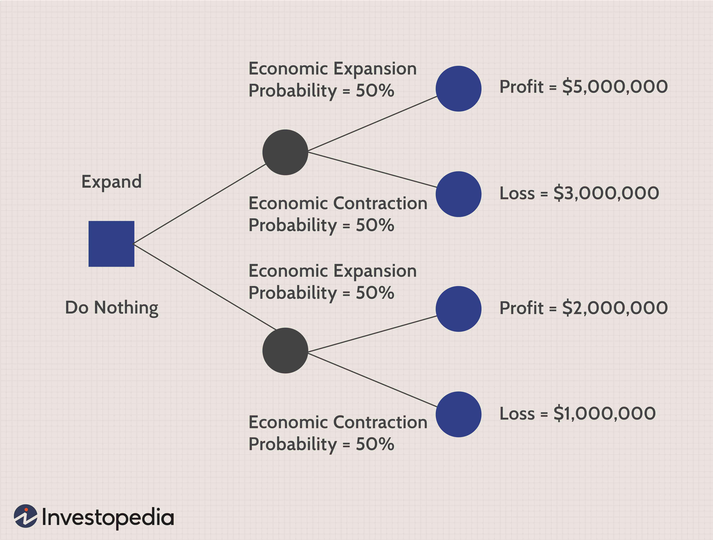

## Table of Contents

## What is a decision tree?

A decision tree is a tool used to help make choices. It looks like a tree turned on its side, with branches that represent different decisions and their possible results. Imagine you're deciding whether to bring an umbrella when you go out. The tree would start with the decision to bring an umbrella or not, and then branch out to show what could happen if it rains or if it stays dry.

Decision trees are useful because they break down complex decisions into smaller, easier parts. They are used in many areas, like business, medicine, and even everyday life. For example, a doctor might use a decision tree to decide on the best treatment for a patient by considering different symptoms and test results. By following the branches of the tree, you can see all the possible outcomes and make a more informed choice.

## How does a decision tree work?

A decision tree works by starting with a big question or decision. Imagine you're deciding whether to go to a movie or stay home. The tree begins with this choice, like a trunk of a tree. From there, it splits into branches, each branch showing a different choice you could make. If you choose to go to the movie, the tree might then ask if you want to see an action movie or a comedy. Each of these choices leads to more branches, showing what could happen next. For example, if you pick an action movie, the tree might show if you'll enjoy it or not, based on what you usually like.

As you follow the branches, you reach the end points, which are like the leaves of the tree. These end points show the final outcomes of all your choices. In our movie example, the end points might show you having a great time at the action movie or feeling bored. By looking at all the possible outcomes, you can see which choice might be best for you. Decision trees help break down big decisions into smaller steps, making it easier to see what might happen and choose the best path.

## What are the main components of a decision tree?

The main parts of a decision tree are the root node, branches, and leaf nodes. The root node is where the tree starts. It's the big question or decision you're trying to make. From the root node, the tree splits into branches. Each branch shows a different choice you can make. Think of it like choosing between going left or right at a fork in the road.

The branches keep splitting into more branches, showing more choices and what might happen next. These smaller branches lead to the leaf nodes, which are at the end of the tree. The leaf nodes are the final outcomes or results of all the choices you made along the way. They're like the end of the road, showing you what could happen if you follow a certain path. By looking at all the leaf nodes, you can see all the possible results and decide which way to go.

## What are the advantages of using decision trees?

Decision trees are easy to understand and use. They break down big decisions into smaller steps, like a map that shows you different paths you can take. This makes it simpler to see all your choices and what might happen with each one. Because they are so clear and easy to follow, decision trees are great for explaining decisions to other people. You can show someone your decision tree and they'll quickly see why you made your choice.

Another advantage of decision trees is that they can handle a lot of different kinds of information. They work well with both numbers and words, so you can use them for all sorts of decisions. Decision trees are also good at finding important patterns in data. This means they can help you figure out which things matter most when making a choice. For example, a doctor might use a decision tree to see which symptoms are most important for deciding on a treatment.

## What are the limitations of decision trees?

Decision trees can sometimes be too simple. They might not capture all the details of a complex situation. Imagine trying to decide what to wear using a decision tree. It might tell you to wear a jacket if it's cold, but it might not consider if it's also raining or if you'll be inside all day. Because of this, decision trees can sometimes lead to choices that don't work well in real life.

Another problem with decision trees is that they can be too sensitive to small changes in the data. If you change just a little bit of the information you put into the tree, it might give you a completely different answer. This can make it hard to trust the decisions the tree makes. Also, decision trees can grow very big and hard to understand if you're dealing with a lot of choices and details. When the tree gets too big, it can be tough to follow and use.

## How do you construct a decision tree?

To build a decision tree, start with the big decision you need to make. This is your root node, like the trunk of a tree. From the root node, think about the first choice you need to make. Draw a line from the root node for each choice, like branches coming off the trunk. Each branch represents a different path you can take. Keep asking questions and making choices, drawing more branches as you go. Each time you make a choice, the tree splits into more branches, showing what could happen next.

Keep going until you reach the end of each path. These ends are called leaf nodes, like the leaves on a tree. Each leaf node shows a final outcome or result of all the choices you made. When you're done, you'll have a whole tree that shows all the different ways your decision could go. To make sure your tree is as good as it can be, you might need to go back and change some branches or add more details. This helps make sure your decision tree is clear and useful for making choices.

## What are the different types of decision tree algorithms?

There are a few main types of decision tree algorithms that people use. One type is called the ID3 algorithm. It works by choosing the best question to ask at each step based on how much information it gives us. Another type is the C4.5 algorithm, which is like ID3 but can handle numbers better and can even fix mistakes in the data. Then there's the CART algorithm, which stands for Classification And Regression Trees. It can be used for both sorting things into groups and for making predictions about numbers.

These algorithms all work a bit differently, but they all help build decision trees. ID3 and C4.5 are often used when you want to sort things into different groups, like deciding if an email is spam or not. CART, on the other hand, is good for both sorting and predicting numbers, like guessing how much a house might cost. Each algorithm has its own way of deciding which questions to ask and how to split the data, but they all aim to make the best decision tree possible for the job at hand.

## How do you evaluate the performance of a decision tree?

To check how well a decision tree is working, you can use something called accuracy. This means you see how often the tree makes the right choice. Imagine you're using a decision tree to guess if it will rain or not. You'd look at how many times it guessed right and how many times it was wrong. If it's right most of the time, the tree is doing a good job. But if it's wrong a lot, you might need to fix the tree or try a different way to make decisions.

Another way to see how good a decision tree is by looking at something called overfitting. Overfitting happens when the tree works really well with the information you used to build it, but not so well with new information. It's like a student who memorized all the answers for a test but can't answer new questions. To check for overfitting, you can use some of your information to build the tree and save the rest to test it. If the tree does well on both the building information and the testing information, it's probably a good tree. If it only does well on the building information, you might need to make the tree simpler so it works better with new information.

## What is overfitting in decision trees and how can it be prevented?

Overfitting in decision trees happens when the tree becomes too complicated and fits too perfectly to the data you used to build it. It's like a student who memorized all the answers for one test but can't answer new questions well. When a decision tree overfits, it might make great predictions for the information it was built with, but it won't work as well with new information. This is a problem because you want your decision tree to be good at making choices not just for the past but also for the future.

To prevent overfitting, you can use something called pruning. Pruning means making the tree simpler by cutting off branches that don't help much. This makes the tree less complicated and better at working with new information. Another way to stop overfitting is by setting a limit on how deep the tree can grow or how many branches it can have. By keeping the tree from getting too big, you help it focus on the most important choices and make better predictions for new situations.

## How can decision trees be used for both classification and regression tasks?

Decision trees can be used for classification tasks, which means sorting things into different groups. Imagine you're sorting fruits into apples and oranges. You start with a big question, like "Is the fruit round?" If yes, you go down one branch, and if no, you go down another. You keep asking questions until you reach the end of the tree, where you find out if the fruit is an apple or an orange. This is how decision trees help classify things by breaking down the decision into smaller, easier steps.

Decision trees can also be used for regression tasks, which means making predictions about numbers. For example, you might want to guess the price of a house. You start with questions like "How many bedrooms does the house have?" Each answer leads you down a different branch of the tree, and at the end, you get a number that's your prediction for the house price. By using decision trees for regression, you can break down the problem into smaller parts and make more accurate guesses about numbers.

## What are ensemble methods like Random Forests and how do they relate to decision trees?

Ensemble methods like Random Forests are ways to make decisions even better by using a bunch of decision trees together. Imagine you're trying to guess what kind of animal you see in the forest. Instead of asking just one friend for help, you ask a whole group of friends. Each friend might have a different way of figuring out the animal, and by putting all their guesses together, you get a better answer. Random Forests work the same way. They use many decision trees, each built a little differently, and then combine their answers to make a final decision. This helps make the decision more accurate and less likely to be wrong.

Random Forests are related to decision trees because they are made up of lots of decision trees. But instead of using just one tree to make a choice, Random Forests use many trees and take a vote. Each tree in the forest gets a slightly different set of information to work with, so they might come up with different answers. By combining all these different answers, Random Forests can make better predictions than a single decision tree. This makes them really useful for things like figuring out if an email is spam or predicting how much a house might cost.

## How can decision trees be optimized for large datasets?

When you have a lot of information to work with, decision trees can get really big and slow. To make them work better with large datasets, you can use something called parallel processing. This means you split the work of building the tree into smaller parts and use many computers at the same time. It's like having a team of people working together instead of just one person. By doing this, you can build the tree much faster and handle more information.

Another way to optimize decision trees for large datasets is by using sampling. Instead of using all the information at once, you take a smaller part of it to build the tree. This makes the tree-building process quicker and easier. Once you have a good tree from the smaller part, you can then use it to make decisions on the whole dataset. By using these methods, you can make decision trees work well even when you have a lot of data to deal with.

## What are decision trees?

Decision trees are a type of supervised learning algorithm commonly utilized in both classification and regression tasks in [machine learning](/wiki/machine-learning). These algorithms function by employing a tree-like model that resembles a flowchart structure, where each internal node denotes a "test" on an attribute, each branch represents the outcome of the test, and each leaf node holds a class label or value. The paths from root to leaf represent classification or regression rules.

The construction of a decision tree involves recursively splitting the dataset into smaller, homogenous subsets. This process utilizes algorithms like ID3 (Iterative Dichotomiser 3), C4.5, CART (Classification and Regression Trees), or CHAID (Chi-squared Automatic Interaction Detection), which select the best attribute to split the data based on criteria like information gain, Gini impurity, or variance reduction. For instance, Gini impurity is calculated as follows:

$$
Gini(D) = 1 - \sum_{i=1}^{n} p_i^2
$$

where $D$ is the dataset and $p_i$ is the probability of a data point belonging to class $i$.

Decision trees are particularly useful in finance for making real-time trading decisions based on historical price data. By systematically analyzing past price movements, they help traders identify patterns and signals that inform buy or sell decisions. They allow financial models to account for discrete decisions, reflecting the often binary nature of trading actions. This straightforward decision-making framework makes them an appealing choice for traders seeking to develop predictive models without requiring extensive programming knowledge.

## What are the limitations and challenges?

Decision trees, while a potent tool for predictive modeling in trading, exhibit notable limitations and challenges that necessitate careful consideration. A primary concern is the propensity for overfitting, particularly in high-frequency trading environments. Overfitting occurs when a model learns the noise in a dataset instead of the underlying pattern, leading to poor generalization to new data. This is a prevalent issue with decision trees as they can create complex branches that fit the training data too closely. Overfitting can be mitigated by techniques such as pruning, which involves trimming branches that have little importance and thus simplify the model.

Additionally, decision trees can struggle with the dynamic nature of financial markets. Market conditions can change rapidly due to various macroeconomic factors, geopolitical events, or shifts in investor sentiment. Decision trees trained on historical data may not adapt well to these changes, potentially leading to a deterioration in their predictive performance. This necessitates frequent retraining of the models using the latest data to maintain their effectiveness.

Moreover, the robustness of decision tree-based trading strategies must be thoroughly validated against unseen data. Failing to do so can result in models that perform well during [backtesting](/wiki/backtesting) but falter when deployed live. Rigorous validation can involve techniques such as k-fold cross-validation, where the data set is divided into k subsets and the model is trained and validated k times, each time using a different subset as the validation data.

In mathematical terms, overfitting can be seen when the training error $E_{train}$ is much lower than the test error $E_{test}$. Practical implementation of decision trees should aim to find a balance that minimizes both errors:

$$
E = E_{train} + E_{test}
$$

Understanding these limitations is crucial for traders and analysts who employ decision trees in their [algorithmic trading](/wiki/algorithmic-trading) strategies. Addressing challenges like overfitting and adaptation to market changes ensures that the models remain reliable and beneficial tools within a trader's arsenal.

## References & Further Reading

[1]: Bergstra, J., Bardenet, R., Bengio, Y., & Kégl, B. (2011). ["Algorithms for Hyper-Parameter Optimization."](https://proceedings.neurips.cc/paper/2011/file/86e8f7ab32cfd12577bc2619bc635690-Paper.pdf) Advances in Neural Information Processing Systems 24.

[2]: ["Advances in Financial Machine Learning"](https://www.amazon.com/Advances-Financial-Machine-Learning-Marcos/dp/1119482089) by Marcos Lopez de Prado

[3]: ["Evidence-Based Technical Analysis: Applying the Scientific Method and Statistical Inference to Trading Signals"](https://www.amazon.com/Evidence-Based-Technical-Analysis-Scientific-Statistical/dp/0470008741) by David Aronson

[4]: ["Machine Learning for Algorithmic Trading"](https://github.com/stefan-jansen/machine-learning-for-trading) by Stefan Jansen

[5]: ["Quantitative Trading: How to Build Your Own Algorithmic Trading Business"](https://books.google.com/books/about/Quantitative_Trading.html?id=j70yEAAAQBAJ) by Ernest P. Chan