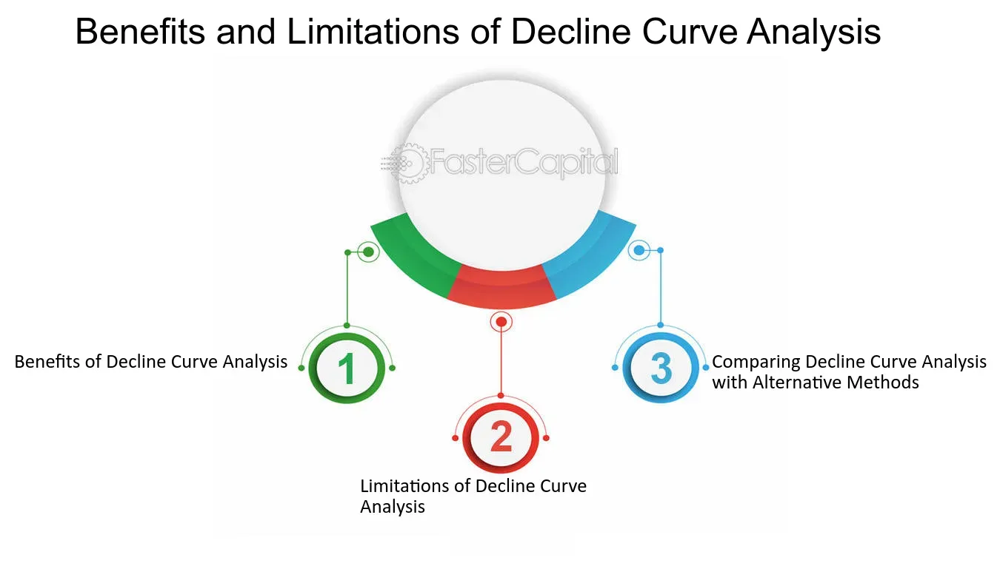

## Table of Contents

## What is a decline curve?

A decline curve is a way to predict how much oil or gas a well will produce over time. It's a graph that shows how the amount of oil or gas coming out of a well goes down as time goes on. People who work in the oil and gas industry use these curves to guess how much more oil or gas they can get from a well and how long it will keep producing.

To make a decline curve, people look at how much oil or gas the well has produced in the past. They use this information to draw a line on a graph that shows how the production is expected to drop in the future. This helps them plan how to manage the well and make decisions about whether to keep it running or to start working on a new well.

## How does a decline curve function in oil and gas production?

A decline curve helps people in the oil and gas industry predict how much oil or gas a well will produce in the future. They look at how much the well has produced in the past and use that information to draw a line on a graph. This line shows how the amount of oil or gas coming out of the well will go down over time. By studying this curve, they can guess how much more oil or gas they can get from the well and for how long it will keep producing.

This information is very important for planning. If a company knows that a well's production will drop a lot soon, they might decide to start working on a new well or to use different methods to get more out of the old well. The decline curve helps them make smart choices about how to manage their wells and spend their money. It's like a roadmap that guides them in running their oil and gas operations efficiently.

## What are the common types of decline curves used in the industry?

In the oil and gas industry, people use different types of decline curves to predict how much oil or gas a well will produce over time. The most common types are the exponential decline curve, the hyperbolic decline curve, and the harmonic decline curve. Each type of curve shows a different way that the amount of oil or gas coming out of a well might go down.

The exponential decline curve is the simplest one. It shows that the amount of oil or gas coming out of a well goes down at a steady rate. This means that the production drops by the same percentage every time period. The hyperbolic decline curve is a bit more complicated. It shows that the production goes down at a rate that changes over time. At first, the production might drop quickly, but then it slows down. The harmonic decline curve is similar to the hyperbolic one, but the rate of decline changes even more slowly over time.

People choose which type of decline curve to use based on what they know about the well and the kind of rock it's in. They look at past production data and decide which curve fits best. Using the right type of decline curve helps them make better guesses about how much oil or gas they can get from the well in the future.

## What are the key parameters needed to construct a decline curve?

To make a decline curve, you need to know some important things about the well. First, you need the production history, which is how much oil or gas the well has produced in the past. This information helps you see how the production has changed over time. You also need to know the initial production rate, which is how much oil or gas the well was producing when it first started. This is important because it sets the starting point for your curve.

Another key piece of information is the decline rate, which tells you how fast the production is going down. This can be a steady rate, like in an exponential decline curve, or it can change over time, like in a hyperbolic or harmonic decline curve. You also need to know the type of decline curve you want to use, whether it's exponential, hyperbolic, or harmonic, because each type will give you a different prediction. By putting all these pieces together, you can draw a line on a graph that shows how the production will likely go down in the future.

These parameters help you make a good guess about how much oil or gas you can still get from the well and for how long it will keep producing. By using the right numbers and the right type of curve, you can plan better and make smart decisions about managing the well.

## How can decline curves be used to predict future production rates?

Decline curves help people in the oil and gas industry guess how much oil or gas a well will produce in the future. They do this by looking at how much the well has produced in the past and using that information to draw a line on a graph. This line shows how the amount of oil or gas coming out of the well will go down over time. By studying this curve, they can predict how much more oil or gas they can get from the well and for how long it will keep producing.

To make a good prediction, people need to know the well's production history, the initial production rate, and the decline rate. The production history tells them how the well has been doing in the past. The initial production rate is how much oil or gas the well was producing when it first started. The decline rate shows how fast the production is going down. By putting all these pieces together, they can draw a line on a graph that shows how the production will likely go down in the future. This helps them plan better and make smart decisions about managing the well.

## What are the benefits of using decline curves for reservoir management?

Using decline curves for reservoir management helps oil and gas companies plan better. They can look at how much oil or gas a well has produced in the past and use that information to guess how much more they can get in the future. This helps them decide if it's worth keeping the well running or if they should start working on a new one. By knowing how fast the production will go down, they can make smart choices about how to spend their money and manage their wells.

Decline curves also help companies see if they need to try different ways to get more oil or gas out of a well. If the curve shows that the production will drop a lot soon, they might decide to use new technology or methods to slow down the decline. This can help them get more out of the well before it runs dry. Overall, using decline curves makes it easier for companies to manage their oil and gas operations and plan for the future.

## What are the limitations and potential inaccuracies of decline curve analysis?

Decline curve analysis can be very helpful, but it has some limitations. One big problem is that it assumes the future will be like the past. If something changes, like the price of oil or new technology, the predictions might not be right. Also, the type of decline curve used can affect the results. If the wrong type is chosen, the predictions can be way off. Sometimes, the data used to make the curve might not be good enough, which can lead to mistakes.

Another issue is that decline curve analysis doesn't always take into account things like changes in the reservoir or problems with the well itself. If the rock around the well changes or if the well gets damaged, the production might not follow the predicted curve. This can make the predictions less accurate. It's important for people using decline curves to know these limits and be ready to change their plans if things don't go as expected.

## How does the choice of decline curve model affect production forecasts?

The choice of decline curve model can really change how we guess future oil or gas production. Different models, like exponential, hyperbolic, or harmonic, show different ways the production might go down. If we pick the wrong model, our guesses about how much oil or gas we'll get in the future might be way off. For example, if we use an exponential model when a hyperbolic one would be better, we might think the production will drop faster than it really will. This can make us make bad decisions about when to stop using a well or start a new one.

It's important to pick the right model based on what we know about the well and the rock it's in. If we have good data from the past and understand the well's behavior, we can choose a model that fits better. But if we don't have enough information or if we pick the wrong model, our predictions can be less accurate. This can lead to problems in planning and managing the well, so it's crucial to think carefully about which model to use.

## Can decline curves be integrated with other reservoir engineering techniques?

Yes, decline curves can be used together with other ways of studying oil and gas wells. One way is to use them with something called reservoir simulation. This is when people make a computer model of the rock underground to see how the oil or gas moves. By combining the decline curve with the simulation, they can get a better idea of how much oil or gas they can get and for how long. They can also see if there are any problems with the well or the rock that might change how much oil or gas comes out.

Another way to use decline curves with other methods is to look at the pressure in the well. This is called pressure transient analysis. By measuring the pressure and seeing how it changes, people can learn more about the rock and the well. When they use this information with the decline curve, they can make better guesses about future production. This helps them plan better and make smarter decisions about how to manage the well.

## What advanced statistical methods can improve the accuracy of decline curve analysis?

To make decline curve analysis more accurate, people can use advanced statistical methods like regression analysis. This method helps them find the best line that fits the past production data. By using regression, they can see if the data follows an exponential, hyperbolic, or harmonic curve more closely. This helps them pick the right type of decline curve and make better guesses about future production. Another helpful method is called time series analysis. This looks at how production changes over time and can help spot patterns or trends that might not be obvious with just a simple decline curve.

Another advanced method is using machine learning. This can help by looking at a lot of data from different wells and finding patterns that humans might miss. Machine learning can also use other information, like the type of rock or the well's history, to make more accurate predictions. By combining these advanced methods with traditional decline curve analysis, people can get a better idea of how much oil or gas they can expect from a well. This helps them plan better and make smarter decisions about managing their wells.

## How do external factors like market conditions influence the application of decline curves?

External factors like market conditions can really change how people use decline curves. If the price of oil or gas goes up a lot, a company might decide to keep a well running even if the decline curve shows that production will drop soon. They might think it's worth it to get as much oil or gas as they can while the price is high. On the other hand, if the price goes down, they might decide to stop using a well earlier than planned because it's not making enough money.

These market changes can also affect how companies plan for the future. If they think the price will go up, they might use a decline curve to guess how much more oil or gas they can get and plan to invest more in their wells. But if they think the price will stay low, they might use the decline curve to decide when to stop using a well and start looking for new ones. So, market conditions can make a big difference in how people use decline curves to manage their oil and gas operations.

## What are the emerging trends and future developments in decline curve analysis?

People are starting to use new technology and methods to make decline curve analysis better. One big trend is using machine learning and artificial intelligence. These tools can look at a lot of data from different wells and find patterns that humans might miss. By using machine learning, people can make more accurate guesses about how much oil or gas a well will produce in the future. Another trend is combining decline curves with other ways of studying wells, like reservoir simulation and pressure analysis. This helps people get a fuller picture of how a well is doing and plan better.

In the future, we might see even more advanced ways of using decline curves. For example, as technology gets better, people might be able to use real-time data to update their decline curves more often. This could help them make quicker decisions about managing their wells. Also, as more wells use new technology like fracking, people might need to change how they use decline curves to fit these new ways of getting oil and gas out of the ground. Overall, the future of decline curve analysis looks like it will be more accurate and helpful for planning in the oil and gas industry.

## What is Understanding Decline Curve Analysis?

Decline curve analysis (DCA) is a fundamental tool in the petroleum industry for estimating hydrocarbon reserves and forecasting future production rates from oil and gas wells. It operates under the premise that production from a well will decrease over time due to reservoir pressure reduction and other operational factors. By analyzing historical production data, DCA generates a model to project this decline, aiding in economic evaluations and reservoir management.

Three primary types of decline curves are used in decline curve analysis: exponential, hyperbolic, and harmonic. Each model is characterized by a distinct mathematical representation of the decline rate, dictating how production reduces over time.

1. **Exponential Decline Curve:** The exponential model assumes a constant percentage decline rate. It is expressed mathematically as:
$$
   q(t) = q_i \times e^{-D \times t}

$$

   where $q(t)$ is the production rate at time $t$, $q_i$ is the initial production rate, and $D$ is the constant decline rate. This model is suitable for wells with stable geological structures and consistent production characteristics.

2. **Hyperbolic Decline Curve:** The hyperbolic model features a variable decline rate, providing a more flexible approach. It is defined by the equation:
$$
   q(t) = \frac{q_i}{(1 + b \times D \times t)^{1/b}}

$$

   In this equation, $b$ is the hyperbolic decline exponent. Unlike the exponential model, the hyperbolic curve can accommodate wells where production decline slows over time, often seen in complex reservoirs.

3. **Harmonic Decline Curve:** The harmonic model presents a special case of the hyperbolic decline with $b = 1$. It is represented as:
$$
   q(t) = \frac{q_i}{1 + D \times t}

$$

   This model is less commonly used but can be applied to particular situations where production decline follows a specific pattern.

The application of J.J. Arps' equations, developed by John J. Arps in the 1940s, is fundamental in modeling these production declines. Arps’ work provided the foundational mathematical framework for DCA, which remains extensively utilized in reservoir engineering.

Despite its utility, decline curve analysis operates under certain assumptions, notably that past production performance is indicative of future outcomes and that production decline follows a smooth, predictable path. These assumptions can limit DCA's applicability, particularly in unconventional reservoirs with complex geology and varying operational conditions. Furthermore, DCA does not account for external factors such as enhanced recovery techniques or significant technological changes that might alter production profiles.

These limitations underscore the importance of integrating DCA with other analytical methods and simulation models to enhance the accuracy and reliability of production forecasts. Recognizing these constraints allows industry professionals to make more informed decisions in reserve estimation and reservoir management.

## What are the Mechanics of Decline Curves?

Decline curve analysis (DCA) is a vital tool for tracking production rates and assessing the performance of oil and gas reservoirs over time. By leveraging historical production data, DCA enables industry professionals to understand and predict production trends, which is crucial for reservoir management and investment decision-making.

At the heart of DCA are three primary decline models: exponential, hyperbolic, and harmonic. Each model provides a different approach to characterizing the rate at which reservoir performance deteriorates.

**Exponential Decline Model**: This model assumes a constant percentage decline rate over time. It is characterized by the equation:

$$
q(t) = q_i \times e^{-D \times t}
$$

where $q(t)$ is the production rate at time $t$, $q_i$ is the initial production rate, and $D$ is the constant decline rate. The exponential model is generally applied when the decline rate stabilizes, making it suitable for mature reservoirs.

**Hyperbolic Decline Model**: Unlike the exponential model, the hyperbolic model accounts for a variable decline rate, allowing for a more flexible representation of production decline. The model is described by the equation:

$$
q(t) = \frac{q_i}{(1 + b \times D \times t)^{1/b}}
$$

where $b$ is the hyperbolic exponent. The hyperbolic model is ideal when reservoirs exhibit decline rates that change over time, often seen in newer wells with complex geological formations.

**Harmonic Decline Model**: This model represents a particular case of the hyperbolic model with a hyperbolic exponent $b = 1$. The equation is given by:

$$
q(t) = \frac{q_i}{1 + D \times t}
$$

Harmonic decline typically applies to situations with prolonged early production phases, resulting in a slower decline as production continues.

The significance of variables such as the initial rate ($q_i$) and decline rate ($D$) is paramount in understanding production trends. The initial rate defines the starting point of production, influenced by reservoir characteristics and initial operating conditions. The decline rate, whether constant or variable, provides insights into the longevity and sustainability of production, influencing decisions related to reservoir development and economic planning.

Employing these models, professionals can predict future production rates and estimate recoverable reserves, thus making informed operational and financial decisions. Although each model has its assumptions and limitations, when applied judiciously, they provide a powerful means of interpreting complex reservoir behaviors.

## References & Further Reading

[1]: Arps, J.J. (1945). "Analysis of Decline Curves," Transactions of the AIME. 

[2]: Lee, W.J. (2019). ["Well Performance Forecasting."](https://www.sciencedirect.com/science/article/pii/S0920410521013152) In: Petroleum Production Systems, 2nd Edition. 

[3]: Lopez de Prado, M. (2018). ["Advances in Financial Machine Learning"](https://www.amazon.com/Advances-Financial-Machine-Learning-Marcos/dp/1119482089).

[4]: Jansen, S. (2020). ["Machine Learning for Algorithmic Trading"](https://github.com/stefan-jansen/machine-learning-for-trading).

[5]: Aggarwal, C.C. (2015). ["Data Mining: The Textbook"](https://link.springer.com/book/10.1007/978-3-319-14142-8). 

[6]: Chan, E.P. (2009). ["Quantitative Trading: How to Build Your Own Algorithmic Trading Business"](https://github.com/ftvision/quant_trading_echan_book).

[7]: Bishop, C.M. (2006). ["Pattern Recognition and Machine Learning"](https://archive.org/details/patternrecogniti0000bish).

[8]: Nguyen, H.T., Das, T.K., Hoang, M.T., & Kim, D. (2019). ["A Hybrid Algorithm for Oil Production Forecasting Using Combination Models."](https://pubmed.ncbi.nlm.nih.gov/33883742/) Journal of Petroleum Science and Engineering.