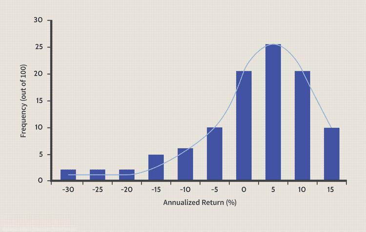

The hedge fund industry is currently experiencing transformative shifts driven by a combination of global financial declines and advancements in algorithmic trading. These changes are prompting stakeholders to reassess traditional investing models, which have long been characterized by their aggressive strategies aimed at achieving high returns. In recent years, particularly following the financial uncertainties exacerbated by events such as the COVID-19 pandemic, there has been a reevaluation of these traditional models. Economic uncertainty, marked by volatile markets and fluctuating asset prices, has compelled many hedge funds to explore innovative approaches to sustain their performance and manage risks effectively.

Algorithmic trading has emerged as a critical component in this strategic evolution, offering hedge funds the ability to process vast amounts of data quickly and execute trades with high precision. This technology-driven method is perceived as a way to enhance decision-making processes and maintain a competitive edge in increasingly complex financial markets. Hedge funds are thus adapting to the ongoing financial declines by integrating algorithmic strategies that align with contemporary market demands and investor expectations.



This article aims to examine how hedge funds are responding to the twin challenges of financial decline and technological transformation. We will explore the mechanisms by which algorithmic trading is employed as a strategic response, offering insights into the future trajectory of hedge fund strategies in a rapidly changing economic landscape.

## Table of Contents

## Understanding Financial Decline in Hedge Funds

Hedge funds have long been an attractive investment vehicle due to their ability to generate high returns through aggressive strategies such as leveraging, short selling, and derivates. These strategies were designed to exploit market inefficiencies and maximize profits, offering an enticing proposition for investors seeking diversification and higher risk-adjusted returns. The flexibility to use a wide range of investment tactics allowed hedge funds to capitalize on various market conditions, maintaining their allure over the decades.

Recently, however, a decline in hedge fund performance has been observed, prompting a shift in investor interest. This decline has multiple contributing factors. Firstly, increased competition in financial markets has eroded the unique advantages that hedge funds once enjoyed. With more participants seeking similar alpha-generating opportunities, the potential for outsized returns has diminished, pressing funds to develop even more sophisticated strategies.

Another pivotal [factor](/wiki/factor-investing) impacting hedge fund performance is the structure of fees traditionally associated with these investment vehicles. The typical "2 and 20" fee structure, involving a 2% management fee and a 20% performance fee, has come under scrutiny. Investors are increasingly questioning this model, especially when returns do not exceed benchmark indices consistently. As a result, pressure has mounted on hedge funds to justify their fees amidst subpar performance, leading some investors to consider lower-cost alternatives.

In addition to competition and fee structure, there has been a notable shift in investor preferences towards passive investments. With the emergence of exchange-traded funds (ETFs) and index funds offering diversified exposure at lower costs, investors are gravitating towards these options seeking steady returns without the associated risks of active management. This trend indicates a growing skepticism about the ability of hedge funds to outperform broader markets net of fees.

These dynamics illustrate the challenges facing hedge funds today, as they strive to adapt to a changing investment landscape characterized by increased transparency and cost-awareness among investors. To navigate this decline, [hedge fund](/wiki/hedge-fund-trading-strategies) managers are being compelled to reevaluate their strategies and embrace innovative approaches to remain competitive in a rapidly evolving financial environment.

## Investment Strategies: A Shift Toward Algorithmic Trading

Algorithmic trading has emerged as a pivotal strategy for hedge funds seeking to sustain competitive returns while effectively managing risks. This approach leverages complex algorithms to analyze large datasets, optimize trade execution speeds, and implement intricate strategies with high precision. The shift from traditional investment strategies to [algorithmic trading](/wiki/algorithmic-trading) is driven by the need to keep pace with rapidly evolving financial markets and exploit technological advancements.

### Types of Algorithms Used in Hedge Funds

1. **Trend Following Algorithms**: These algorithms are designed to identify and capitalize on market trends. By analyzing historical price data, they generate buy or sell signals when assets exhibit consistent upward or downward movements. This method is commonly used in various financial instruments, including equities, futures, and currencies.

2. **Market Making Algorithms**: Market making involves simultaneously quoting both buy and sell prices to capitalize on the bid-ask spread. Algorithms in this category are developed to efficiently manage inventory and reduce trading risk by responding swiftly to market changes.

3. **Arbitrage Algorithms**: These algorithms exploit price discrepancies between different markets or financial instruments. For example, statistical arbitrage strategies use complex mathematical models to identify temporary mispricings between related securities, providing hedge funds with opportunities for profit with minimal risk.

4. **Machine Learning Algorithms**: Incorporating artificial intelligence, these algorithms adapt to new data patterns and refine their trading strategies over time. Machine learning models, particularly those based on supervised learning, unsupervised learning, and reinforcement learning, enhance predictive accuracy and decision-making capabilities.

5. **High-Frequency Trading (HFT) Algorithms**: HFT algorithms execute a large number of orders at extremely high speeds, often within microseconds. These algorithms benefit from small price changes, executing thousands of trades daily to accumulate significant profits.

### Impact on Hedge Fund Performance

Algorithmic trading significantly enhances hedge fund performance by reducing transaction costs, improving execution timing, and minimizing human error. As algorithms can process vast amounts of data per second, they enable funds to make informed decisions rapidly and capitalize on fleeting market opportunities. Additionally, the precision and speed of trade execution afforded by algorithms improve the risk-adjusted returns of hedge funds.

Algorithmic strategies also facilitate better risk management by implementing stop-loss orders and automated rebalancing, which maintain portfolio alignment with predefined investment criteria. As markets become increasingly complex and interconnected, hedge funds employing sophisticated algorithms are better equipped to handle [volatility](/wiki/volatility-trading-strategies) and protect investor capital.

In summary, the integration of algorithmic trading into hedge fund investment strategies marks a significant evolution, allowing funds to harness technological advancements to optimize performance and mitigate risks. This shift underlines the critical role technology plays in the ongoing transformation of investment landscapes.

## Algorithmic Trading: Adapting to Market Stress

The volatile market conditions following the 2020 global events have significantly heightened the role of algorithmic trading in managing hedge fund portfolios. Hedge funds, seeking to mitigate risks and maintain competitiveness, found algorithmic trading to be particularly advantageous during periods of market turbulence. By leveraging complex algorithms, funds can swiftly respond to market fluctuations, manage enormous datasets, and execute trades with precision, thus enhancing their risk management capabilities.

The reliance on algorithmic strategies has increased, as evidenced by survey data showing an upsurge in the use of techniques such as dark [liquidity](/wiki/liquidity-risk-premium) and [volume](/wiki/volume-trading-strategy)-weighted average price (VWAP). Dark liquidity refers to trading volumes that are not openly available to the public, typically facilitated through dark pools, allowing hedge funds to make large trades without significantly impacting market prices. This strategy is especially useful in mitigating market impact and securing more favorable trading conditions.

Volume-weighted average price (VWAP) algorithms are another core component of contemporary risk mitigation strategies. VWAP is calculated as follows:

$$
\text{VWAP} = \frac{\sum{(P_i \times Q_i)}}{\sum{Q_i}}
$$

where $P_i$ is the price and $Q_i$ is the quantity of shares traded at each transaction $i$. The VWAP is used to assess the quality of trade execution, ensuring that trades are conducted at prices close to the average market price over a specific period, thereby safeguarding against unfavorable market swings.

Hedge funds employ these algorithmic strategies to intelligently disperse trades across various markets and periods, optimizing execution and reducing transaction costs, which is crucial during periods of volatility. Additionally, advanced algorithms can automatically adjust to changing market conditions, dynamically altering their parameters to preserve portfolio integrity.

Overall, the adoption of algorithmic trading represents a strategic evolution in hedge fund management, enabling funds to adapt to market stresses with greater resilience and agility. The precision and adaptability offered by these algorithms are proving indispensable in the contemporary financial landscape, allowing hedge funds to effectively navigate through erratic market behaviors.

## How Hedge Funds Are Leveraging Technology for Strategic Advantage

Hedge funds are increasingly harnessing technology to transition from traditional strategies to more innovative algorithmic approaches. This evolution is largely enabled by advancements in computational power, data analytics, and sophisticated trading platforms, which allow hedge funds to enhance their decision-making processes and trading efficiency.

One of the fundamental ways hedge funds leverage technology is through strategic partnerships and the adoption of cutting-edge technology platforms. These partnerships often involve collaborations with fintech companies and technology providers that specialize in market data analytics, execution management systems (EMS), and order management systems (OMS). For instance, partnerships with companies offering advanced analytics and [machine learning](/wiki/machine-learning) tools enable hedge funds to develop proprietary trading algorithms capable of identifying market trends and patterns at an unprecedented scale and speed.

Integration with multi-asset trading platforms is another critical aspect of leveraging technology for strategic advantage. These platforms facilitate the execution of trades across diverse asset classes such as equities, fixed income, currencies, and commodities, all from a single interface. This integration not only streamlines operations but also enhances portfolio diversification and risk management. For example, platforms like Bloomberg Terminal or Eikon provide comprehensive market data, analytics, and execution capabilities that empower hedge funds to make well-informed investment decisions.

The advent of big data analytics has further transformed the hedge fund landscape by enabling predictive modeling and quantitative analysis. Hedge funds are now employing machine learning algorithms to process vast quantities of structured and unstructured data, such as financial statements, news feeds, and social media sentiment, to forecast market movements. Python libraries such as pandas and scikit-learn are often used for data manipulation and building predictive models that inform trading strategies. Here is a simple example of using Python to conduct predictive analysis:

```python
import pandas as pd
from sklearn.model_selection import train_test_split
from sklearn.ensemble import RandomForestRegressor
from sklearn.metrics import mean_squared_error

# Sample data
data = pd.read_csv('market_data.csv')
X = data.drop('target', axis=1)  # Features
y = data['target']  # Target variable

# Split data into training and testing sets
X_train, X_test, y_train, y_test = train_test_split(X, y, test_size=0.2, random_state=42)

# Model training
model = RandomForestRegressor(n_estimators=100, random_state=42)
model.fit(X_train, y_train)

# Model prediction
y_pred = model.predict(X_test)

# Calculate performance
mse = mean_squared_error(y_test, y_pred)
print(f'Mean Squared Error: {mse}')
```

In conclusion, hedge funds are leveraging technology not only to gain a competitive edge but also to adapt to the rapidly evolving financial landscape. Through partnerships, advanced trading platforms, and big data analytics, hedge funds can optimize their strategies, leading to improved performance and resilience against market volatility. This technological shift is essential for maintaining relevance and appeal in an increasingly algorithm-driven investment environment.

## Challenges and Opportunities

Despite the growing integration of algorithmic trading within hedge funds, several challenges persist that could impede their progress and effectiveness. One of the primary challenges is execution consistency. Algorithms must operate seamlessly under diverse market conditions, which remains a hurdle due to the unpredictable nature of financial markets and high-frequency trading. Fluctuations in market liquidity can affect the execution of trades by algorithms, leading to slippage and deviating price points from expected results.

Another significant challenge is the regulatory landscape. As algorithmic strategies become more prevalent, financial regulators have intensified their scrutiny to prevent systemic risks, such as the infamous flash crash of 2010. Hedge funds must comply with regulations such as the Markets in Financial Instruments Directive (MiFID II) in Europe, which imposes strict reporting and transparency requirements. These regulatory constraints require continuous adaptation and enhancement of compliance frameworks, which can be resource-intensive.

Conversely, there are several opportunities for hedge funds to refine and enhance their algorithmic trading strategies. A notable opportunity lies in improving the sophistication and customizability of algorithms. By leveraging advancements in machine learning and [artificial intelligence](/wiki/ai-artificial-intelligence), hedge funds can develop more adaptive algorithms that can process vast amounts of data and identify patterns that traditional models might miss. This refinement allows for more nuanced market predictions and enhances the strategic flexibility of investing.

Additionally, the strategic use of alternative liquidity venues presents another avenue for growth. Hedge funds can tap into dark pools and alternative trading systems to find cost-effective execution methods and mitigate the impact of large trades on public exchanges. This strategy can better manage the execution and impact costs, leading to improved performance metrics.

Looking forward, one of the emerging trends is the increased focus on ethical and sustainable investments, which can be integrated into algorithmic trading models to cater to the growing market demand for Environmental, Social, and Governance ([ESG](/wiki/esg-investing)) considerations. Furthermore, adopting distributed ledger technologies and blockchain could enhance the transparency and security of trades, thus appealing to a broader investor base.

To stay ahead in an increasingly competitive market, hedge funds need to continuously innovate and harness cutting-edge technologies. This entails not only refining existing algorithms but also exploring new paradigms in quantitative analysis. The future well-being of hedge funds will depend significantly on their ability to capture opportunities in [alternative data](/wiki/best-alternative-data) sources, such as social media sentiment and geospatial analysis, and their strategic deployment in trading algorithms. As the market landscape evolves, hedge funds that can adeptly navigate these changes will likely maintain a competitive edge and thrive in the dynamic investment environment.

## Conclusion

The financial decline in traditional hedge funds has necessitated a shift towards algorithmic trading, which offers a resilient and adaptive approach in today's dynamic market environment. The reliance on technology and innovative strategies has become crucial for hedge funds to navigate the complexities of modern financial landscapes. Algorithmic trading, characterized by its ability to process vast datasets and execute trades with precision, presents a formidable alternative to conventional methods that have struggled amidst economic downturns and increased market volatility.

The integration of technology within hedge funds is no longer a mere option but a pivotal requirement. This transformation enables funds to optimize their operational efficiencies and achieve competitive returns. By leveraging machine learning algorithms and data analytics, hedge funds can identify patterns and predict market trends more accurately, enhancing their decision-making process. Moreover, the continuous advancement in computing capabilities and sophisticated trading platforms allows these financial entities to deploy strategies that are not only rapid but also tailored to specific market conditions.

Looking to the future, hedge funds that effectively incorporate algorithmic trading into their operations are poised to retain their relevance and attractiveness to investors. The ability to adapt to and capitalize on technology-driven methodologies will likely determine the success of hedge funds in managing risk and generating returns in an increasingly automated financial marketplace. As the investment landscape continues to evolve, embracing these technological innovations will ensure that hedge funds remain at the forefront of the industry, leveraging enhanced trading capabilities and strategic insights to secure favorable outcomes.

## References & Further Reading

[1]: Bergstra, J., Bardenet, R., Bengio, Y., & Kégl, B. (2011). ["Algorithms for Hyper-Parameter Optimization."](https://dl.acm.org/doi/10.5555/2986459.2986743) Advances in Neural Information Processing Systems 24.

[2]: ["Advances in Financial Machine Learning"](https://www.amazon.com/Advances-Financial-Machine-Learning-Marcos/dp/1119482089) by Marcos Lopez de Prado

[3]: ["Evidence-Based Technical Analysis: Applying the Scientific Method and Statistical Inference to Trading Signals"](https://www.amazon.com/Evidence-Based-Technical-Analysis-Scientific-Statistical/dp/0470008741) by David Aronson

[4]: ["Machine Learning for Algorithmic Trading"](https://github.com/stefan-jansen/machine-learning-for-trading) by Stefan Jansen

[5]: ["Quantitative Trading: How to Build Your Own Algorithmic Trading Business"](https://www.amazon.com/Quantitative-Trading-Build-Algorithmic-Business/dp/1119800064) by Ernest P. Chan