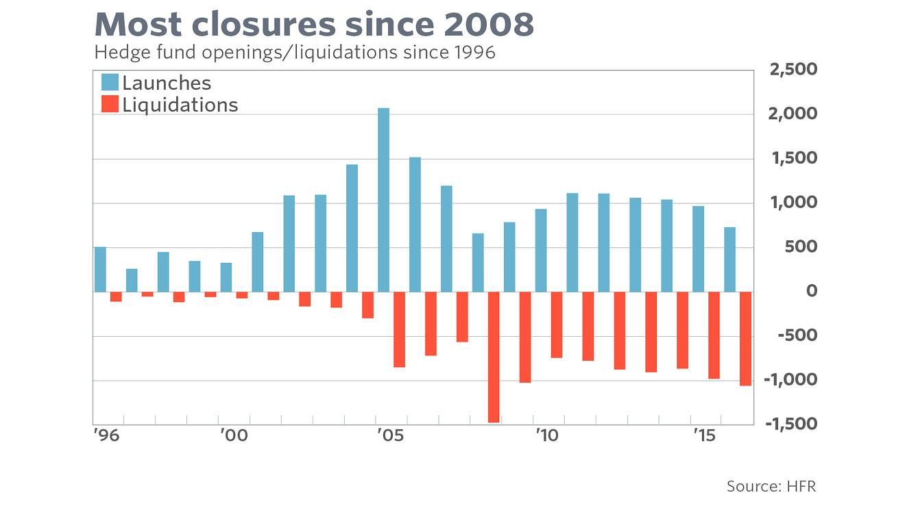

## Table of Contents

## What are hedge funds and how do they operate?

Hedge funds are investment funds that pool money from wealthy individuals and institutions to invest in a wide range of assets. They are managed by professional investment managers who aim to generate high returns for their investors, often by taking more risks than traditional investment funds. Unlike mutual funds, hedge funds are less regulated, which allows them to use different strategies and investment tools, like borrowing money to invest or betting on falling prices.

Hedge funds operate by charging investors a management fee, usually around 2% of the assets they manage, and a performance fee, typically around 20% of the profits they make. They use various strategies to try to make money, such as buying stocks they think will go up in value, short selling stocks they think will go down, or investing in bonds, commodities, and even currencies. The goal is to make money no matter what the market is doing, which is why they are called "hedge" funds—they try to hedge against market risks.

## What are the historical performance trends of hedge funds?

Historically, hedge funds have had ups and downs in their performance. In the early 2000s, many hedge funds did very well, often beating the stock market. They used smart strategies to make money even when the market was not doing great. But then came the 2008 financial crisis, and many hedge funds lost a lot of money. After the crisis, it was harder for hedge funds to do as well as they had before. They still made money, but not as much as people expected, and some years were better than others.

In recent years, hedge funds have had mixed results. Some have done really well, while others have struggled. On average, they have not beaten the stock market as much as they used to. This has made some investors think twice about putting their money in hedge funds. The fees are high, and if the returns are not that great, it can be hard to justify the cost. Still, some hedge funds have found new ways to make money and have had good years, showing that the industry can still be successful if managed well.

## What factors have contributed to the decline of hedge funds in recent years?

In recent years, hedge funds have faced challenges that have led to their decline. One big reason is that they haven't been making as much money as they used to. The stock market has been doing well, and it's hard for hedge funds to beat it. When they can't beat the market, investors start to wonder if it's worth paying the high fees that hedge funds charge. These fees can be 2% of the money invested and 20% of the profits, which is a lot if the returns are not great.

Another [factor](/wiki/factor-investing) is that there are now more options for investors to put their money into. Things like index funds and ETFs are cheaper and easier to invest in. These funds just follow the market and don't charge as much in fees. Also, the way hedge funds work has become more regulated, which makes it harder for them to use the special strategies they used to use to make money. All these things together have made it tougher for hedge funds to attract and keep investors.

## How have changes in market conditions affected hedge fund performance?

Changes in market conditions have had a big impact on how well hedge funds do. When the stock market is doing well, it's harder for hedge funds to make more money than the market. This is because they use different strategies to try to make money no matter what the market is doing. But if the market is going up a lot, it's tough for them to beat it. Also, when the market is calm and not moving much, it can be hard for hedge funds to find good ways to make money. They need some ups and downs to use their special strategies, but if the market is too steady, they can't do as well.

Another thing that affects hedge funds is when the market goes through big changes, like a financial crisis. During these times, hedge funds can lose a lot of money if they're not careful. For example, in the 2008 financial crisis, many hedge funds lost money because they were not ready for how bad things got. After a crisis, it takes time for hedge funds to get back on track. They have to change their strategies and be more careful about the risks they take. All these changes in market conditions make it harder for hedge funds to do well and keep their investors happy.

## What role has increased competition played in the decline of hedge funds?

Increased competition has made it harder for hedge funds to do well. There are now a lot more hedge funds out there than there used to be. This means they all have to fight for the same investors' money. When there are so many hedge funds, it's tough to stand out and show that you can make more money than everyone else. Also, other types of investments, like index funds and ETFs, have become more popular. These funds are cheaper and easier to invest in, so more people are choosing them instead of hedge funds.

This competition has pushed hedge funds to try new things to attract investors. Some hedge funds have started using different strategies or investing in new kinds of assets to try to make more money. But this also means they have to take more risks, and sometimes those risks don't pay off. When hedge funds don't do as well as they hoped, investors might take their money out and put it somewhere else. So, the more competition there is, the harder it is for hedge funds to keep making good returns and keep their investors happy.

## How have regulatory changes impacted the hedge fund industry?

Regulatory changes have made things harder for hedge funds. In the past, hedge funds could use special strategies to make money that were not as closely watched by the government. But now, there are more rules about what hedge funds can and cannot do. These rules are meant to protect investors and make sure the financial system is safe, but they also make it harder for hedge funds to take the risks they used to. For example, they might not be able to borrow as much money to invest, which can limit how much money they can make.

Because of these new rules, hedge funds have had to change how they work. They have to spend more time and money making sure they follow all the new regulations. This can make it harder for them to focus on finding the best investments. Also, some investors might be worried about putting their money in hedge funds if they think the rules are too strict or if they think the funds can't make as much money anymore. So, regulatory changes have made it tougher for hedge funds to do well and keep their investors happy.

## What are the effects of high fees on hedge fund attractiveness to investors?

High fees make hedge funds less attractive to investors. Hedge funds usually charge a management fee of about 2% of the money invested and a performance fee of about 20% of the profits. These fees are a lot higher than what you pay for other types of investments, like index funds or ETFs. When investors see these high fees, they start to think about whether it's worth it. If the [hedge fund](/wiki/hedge-fund-trading-strategies) doesn't make a lot more money than other investments, the high fees can eat into their profits.

Because of these high fees, some investors are choosing to put their money elsewhere. They want to keep more of their money instead of paying a lot in fees. This means hedge funds have to work harder to show that they can make enough money to make up for the high costs. If they can't do that, investors might take their money out and invest it in something cheaper. So, high fees can make it harder for hedge funds to attract and keep investors.

## How has the rise of passive investing influenced the hedge fund industry?

The rise of passive investing has changed things a lot for hedge funds. Passive investing means putting money into funds that just follow the market, like index funds and ETFs. These funds are cheap and easy to invest in, and they don't need a lot of work to manage. Because of this, more and more people are choosing passive investing instead of hedge funds. Hedge funds, on the other hand, are expensive and take more risks to try to make more money than the market. When people see they can get good returns with less cost and risk from passive funds, they start to think twice about hedge funds.

This shift to passive investing has made it harder for hedge funds to attract investors. Hedge funds have to show that they can make a lot more money than the market to justify their high fees. But it's tough to do that all the time, especially when the market is doing well. As more money goes into passive funds, hedge funds have to work harder to stand out and prove that their strategies are worth the extra cost. This has made the hedge fund industry more competitive and has pushed some hedge funds to try new things to keep their investors happy.

## What technological advancements have challenged traditional hedge fund strategies?

Technology has changed a lot of things for hedge funds. One big change is the use of computers and math to make investment decisions. This is called quantitative investing. Hedge funds used to rely a lot on people's ideas and guesses about what would happen in the market. But now, computers can look at a lot of data really fast and find patterns that people might miss. This means that hedge funds that don't use these new tools can have a hard time keeping up with those that do.

Another way technology has challenged hedge funds is through high-frequency trading. This is when computers buy and sell things very quickly, sometimes in just a few seconds. This can make the market move in ways that are hard to predict. Hedge funds that don't use high-frequency trading might find it harder to make money because the market can change so fast. So, hedge funds have to keep up with these new technologies or risk falling behind.

## How have shifts in investor preferences and expectations contributed to the decline?

Shifts in what investors want and expect have made it harder for hedge funds. Investors now care a lot about how much they have to pay in fees. Hedge funds charge high fees, like 2% of the money invested and 20% of the profits. But if the hedge fund doesn't make a lot more money than other investments, these high fees can seem too expensive. So, investors are looking for cheaper ways to invest their money, like index funds and ETFs, which don't charge as much.

Also, investors want to see steady returns and less risk. Hedge funds take big risks to try to make more money, but this can lead to big losses sometimes. Investors are getting tired of these ups and downs and are choosing safer investments that might not make as much money but are more reliable. This change in what investors want has made it harder for hedge funds to keep their investors happy and attract new ones.

## What are some case studies of prominent hedge funds that have struggled or closed?

One example of a hedge fund that struggled is Long-Term Capital Management (LTCM). LTCM was started in the 1990s by some really smart people, including two guys who won the Nobel Prize. They thought they could make a lot of money by betting on small differences in prices. But in 1998, things went wrong. The market changed in ways they didn't expect, and they lost a lot of money. They almost caused a big problem for the whole financial system, so the government had to step in to help fix it. LTCM had to close down, showing that even the smartest people can get it wrong.

Another example is Pershing Square Capital Management, run by Bill Ackman. In 2017, they bet against a company called Herbalife, thinking its stock price would go down. But the stock price went up instead, and Pershing Square lost a lot of money. This made a lot of investors pull their money out of the fund. Even though Pershing Square is still around, this big loss showed how hard it can be for hedge funds to make money when their bets don't pay off. It also made people question whether the high fees they charge are worth it if they can lose so much money.

## What future trends might further influence the trajectory of hedge funds?

In the future, technology will keep changing how hedge funds work. More and more, hedge funds will use computers and math to make their investment choices. This is called [algorithmic trading](/wiki/algorithmic-trading). It can help them make better decisions and find new ways to make money. But it also means they have to keep up with the latest tech or they might fall behind. Also, new rules might come that make it even harder for hedge funds to take big risks. These rules are meant to keep the financial system safe, but they can make it tougher for hedge funds to do well.

Another trend that might affect hedge funds is how people want to invest their money. More and more people are choosing to put their money in things like index funds and ETFs, which are cheaper and less risky. If this keeps happening, hedge funds will have to work even harder to show that they can make enough money to be worth the high fees they charge. They might need to find new ways to make money or change how they work to keep their investors happy. So, the future of hedge funds will depend a lot on how they adapt to these changes.

## How can algorithmic trading adapt to market stress?

The volatile market conditions following the 2020 global events have significantly heightened the role of algorithmic trading in managing hedge fund portfolios. Hedge funds, seeking to mitigate risks and maintain competitiveness, found algorithmic trading to be particularly advantageous during periods of market turbulence. By leveraging complex algorithms, funds can swiftly respond to market fluctuations, manage enormous datasets, and execute trades with precision, thus enhancing their risk management capabilities.

The reliance on algorithmic strategies has increased, as evidenced by survey data showing an upsurge in the use of techniques such as dark [liquidity](/wiki/liquidity-risk-premium) and [volume](/wiki/volume-trading-strategy)-weighted average price (VWAP). Dark liquidity refers to trading volumes that are not openly available to the public, typically facilitated through dark pools, allowing hedge funds to make large trades without significantly impacting market prices. This strategy is especially useful in mitigating market impact and securing more favorable trading conditions.

Volume-weighted average price (VWAP) algorithms are another core component of contemporary risk mitigation strategies. VWAP is calculated as follows:

$$
\text{VWAP} = \frac{\sum{(P_i \times Q_i)}}{\sum{Q_i}}
$$

where $P_i$ is the price and $Q_i$ is the quantity of shares traded at each transaction $i$. The VWAP is used to assess the quality of trade execution, ensuring that trades are conducted at prices close to the average market price over a specific period, thereby safeguarding against unfavorable market swings.

Hedge funds employ these algorithmic strategies to intelligently disperse trades across various markets and periods, optimizing execution and reducing transaction costs, which is crucial during periods of [volatility](/wiki/volatility-trading-strategies). Additionally, advanced algorithms can automatically adjust to changing market conditions, dynamically altering their parameters to preserve portfolio integrity.

Overall, the adoption of algorithmic trading represents a strategic evolution in hedge fund management, enabling funds to adapt to market stresses with greater resilience and agility. The precision and adaptability offered by these algorithms are proving indispensable in the contemporary financial landscape, allowing hedge funds to effectively navigate through erratic market behaviors.

## References & Further Reading

[1]: Bergstra, J., Bardenet, R., Bengio, Y., & Kégl, B. (2011). ["Algorithms for Hyper-Parameter Optimization."](https://dl.acm.org/doi/10.5555/2986459.2986743) Advances in Neural Information Processing Systems 24.

[2]: ["Advances in Financial Machine Learning"](https://www.amazon.com/Advances-Financial-Machine-Learning-Marcos/dp/1119482089) by Marcos Lopez de Prado

[3]: ["Evidence-Based Technical Analysis: Applying the Scientific Method and Statistical Inference to Trading Signals"](https://www.amazon.com/Evidence-Based-Technical-Analysis-Scientific-Statistical/dp/0470008741) by David Aronson

[4]: ["Machine Learning for Algorithmic Trading"](https://github.com/stefan-jansen/machine-learning-for-trading) by Stefan Jansen

[5]: ["Quantitative Trading: How to Build Your Own Algorithmic Trading Business"](https://www.amazon.com/Quantitative-Trading-Build-Algorithmic-Business/dp/1119800064) by Ernest P. Chan