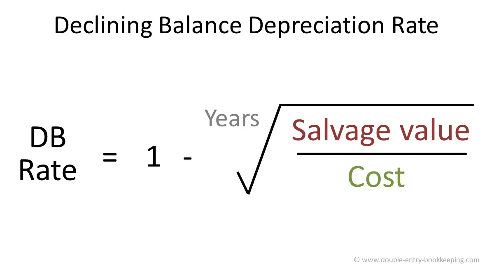

## Table of Contents

## What is depreciation?

Depreciation is the decrease in value of an item over time. It's like when you buy a new car, and as soon as you drive it off the lot, it's worth less than what you paid. This happens because things wear out, get old, or new and better models come out. Businesses use depreciation to spread out the cost of big things they buy, like machines or buildings, over the years they use them.

There are different ways to figure out depreciation. One common way is called straight-line depreciation. This means you take the cost of the item and subtract what you think it will be worth at the end, then divide that by how many years you'll use it. For example, if a machine costs $10,000 and you think it will be worth $2,000 after 4 years, you would say it depreciates by $2,000 each year. This helps businesses keep their financial records accurate and plan for future costs.

## What is the Declining Balance Method of depreciation?

The Declining Balance Method is another way to figure out how much an item loses value over time. Instead of spreading the cost evenly like in straight-line depreciation, this method says that the item loses more value at the start and less as time goes on. It's like how a new car loses a lot of value in the first year but not as much each year after that. To use this method, you start with the item's full value and then take away a bigger chunk each year. The rate you use to figure out the chunk is usually double what you would use for straight-line depreciation, so it's called the Double Declining Balance Method.

Here's how it works: Let's say you have a machine that costs $10,000 and you want to use the Double Declining Balance Method over 5 years. First, you find the straight-line rate, which would be 20% per year (100% divided by 5 years). Then, you double that rate to get 40%. In the first year, you take 40% of $10,000, which is $4,000, so the machine's value drops to $6,000. In the second year, you take 40% of the new value, $6,000, which is $2,400, so the value drops to $3,600. You keep doing this each year, but you stop when the item's value gets to what you think it will be worth at the end, called the salvage value. This method helps show that things often lose value faster when they're new.

## How does the Declining Balance Method differ from the Straight-Line Method?

The Declining Balance Method and the Straight-Line Method are two ways to figure out how much an item loses value over time, but they do it differently. The Straight-Line Method spreads the cost of the item evenly over the years you use it. For example, if a machine costs $10,000 and you use it for 5 years, you would say it loses $2,000 in value each year. This method is simple and easy to understand because the amount of depreciation stays the same every year.

On the other hand, the Declining Balance Method says that the item loses more value at the start and less as time goes on. It's like how a new car loses a lot of value in the first year but not as much each year after that. With this method, you start with the item's full value and take away a bigger chunk each year. Usually, you use a rate that's double what you would use for the Straight-Line Method, so it's called the Double Declining Balance Method. This way, the depreciation is higher in the early years and gets smaller over time, which can be more realistic for some items.

## What is the formula for calculating depreciation using the Declining Balance Method?

The Declining Balance Method uses a simple formula to figure out how much an item loses value each year. First, you need to find the straight-line depreciation rate, which is 1 divided by the number of years you'll use the item. For example, if you use an item for 5 years, the straight-line rate is 1/5 or 20%. Then, you double this rate to get the declining balance rate. So, for a 5-year item, the declining balance rate would be 40%. To find the depreciation for the first year, you multiply the item's starting value by this rate.

In the following years, you keep using the same rate, but you apply it to the item's value at the start of each year, not the original value. So, if a machine starts at $10,000 and you use a 40% rate, the first year's depreciation is $4,000 (40% of $10,000), leaving a value of $6,000. The next year, you take 40% of $6,000, which is $2,400, leaving a value of $3,600. You keep doing this until the item's value reaches its salvage value, which is what you think it will be worth at the end. This method shows that items often lose more value when they're new and less as they get older.

## What is the typical depreciation rate used in the Declining Balance Method?

The typical depreciation rate used in the Declining Balance Method is double the straight-line depreciation rate. If you use an item for 5 years, the straight-line rate would be 20% (100% divided by 5 years). So, the typical rate for the Declining Balance Method would be 40%, because it's double the straight-line rate.

This rate is used to figure out how much value the item loses each year. You start with the item's full value and multiply it by the rate to find the first year's depreciation. For the next years, you keep using the same rate, but you apply it to the item's value at the start of each year. This way, the item loses more value at the beginning and less as time goes on.

## How do you determine the asset's salvage value in the Declining Balance Method?

The salvage value of an asset in the Declining Balance Method is what you think the asset will be worth at the end of its useful life. You decide this value before you start calculating depreciation. It's like guessing how much you could sell the asset for when you're done using it. You need to know the salvage value because you stop using the Declining Balance Method when the asset's value gets to this amount.

When you use the Declining Balance Method, you keep taking away a bigger chunk of the asset's value each year until you reach the salvage value. If the calculations would make the asset's value go below the salvage value, you stop at the salvage value instead. This way, you don't end up saying the asset is worth less than what you think it will be worth at the end.

## Can you explain the concept of 'book value' in the context of the Declining Balance Method?

Book value is what an asset is worth on paper after you've taken away some of its value because of depreciation. In the Declining Balance Method, you start with the full value of the asset and then take away a bigger chunk each year. This chunk is based on a rate that's usually double the straight-line rate. So, the book value goes down more at the start and less as time goes on. You keep doing this until the book value gets to the salvage value, which is what you think the asset will be worth at the end.

The book value is important because it helps businesses keep track of how much their assets are worth over time. It's used in financial reports to show how much value the asset has lost. When you use the Declining Balance Method, the book value shows that the asset loses more value when it's new and less as it gets older. This can be more realistic for some things, like machines or cars, which often lose a lot of value in the first few years.

## How does the Declining Balance Method affect a company's financial statements?

The Declining Balance Method affects a company's financial statements by changing how much depreciation expense they show each year. When a company uses this method, they take a bigger chunk of the asset's value away in the early years. This means the depreciation expense on the income statement is higher at first and gets smaller over time. Because the depreciation expense is higher in the early years, the company's net income, which is what's left after all expenses, will be lower at the start. This can make the company look like it's not doing as well in the beginning, even if it's making the same amount of money.

On the balance sheet, the Declining Balance Method shows a lower book value for the asset in the early years. The book value is what the asset is worth on paper after depreciation. Because the method takes away more value at the start, the asset's book value drops faster in the early years. This can make the company's total assets look smaller at first. But over time, as the depreciation expense gets smaller, the asset's book value doesn't go down as fast. This method can help show that assets often lose more value when they're new, which might be more realistic for some things like machines or cars.

## What are the advantages of using the Declining Balance Method over other methods?

Using the Declining Balance Method can be good because it matches how some things lose value better. Things like machines or cars often lose a lot of their value when they're new. The Declining Balance Method takes away more value at the start and less as time goes on, which can be more realistic. This way, the cost of the item is spread out in a way that makes sense for how it's used. It's like saying, "This machine loses a lot of value right away, so let's account for that in our financial records."

Another advantage is that it can help a company save on taxes in the early years. Because the Declining Balance Method shows a higher depreciation expense at the start, it lowers the company's net income more in the beginning. A lower net income means the company might pay less in taxes during those early years. This can be helpful for a business because it gives them more money to use for other things, like buying new equipment or expanding their business.

## What are the potential disadvantages or limitations of the Declining Balance Method?

One big problem with the Declining Balance Method is that it can make a company's financial records look strange. Because it takes away more value from the asset at the start, the company's net income will be lower in the early years. This might make the company look like it's not doing well, even if it's making the same amount of money. People who look at the company's financial reports might get the wrong idea about how the business is doing.

Another issue is that the Declining Balance Method can be harder to use than other methods, like the Straight-Line Method. You have to keep track of the asset's value each year and use the same rate to figure out how much value to take away. This can be confusing and might make mistakes more likely. If the company doesn't do it right, their financial records could be wrong, which can cause big problems.

## How do tax regulations influence the choice of the Declining Balance Method?

Tax rules can make a big difference in why a company chooses the Declining Balance Method. This method lets a company take away more value from their assets in the early years, which means their net income is lower at the start. A lower net income means the company might pay less in taxes during those early years. This can be a big help for a business because it gives them more money to use for other things, like buying new equipment or growing their business. So, if tax rules allow using the Declining Balance Method, a company might pick it to save money on taxes.

But, tax rules can be tricky and change from place to place. Some countries or states might not let companies use the Declining Balance Method for tax purposes, or they might have special rules about how to use it. This means a company has to check the tax laws where they are to see if they can use this method. If the tax rules don't allow it, or if they make it too hard to use, the company might have to choose a different way to figure out depreciation, even if the Declining Balance Method would be better for their business.

## Can you provide a case study or example where the Declining Balance Method significantly impacted a company's financial strategy?

A small manufacturing company called "TechGear" decided to use the Declining Balance Method for their new machinery. They bought a machine for $50,000 that they planned to use for 5 years. Using the Declining Balance Method, they figured out their depreciation rate was 40% (double the straight-line rate of 20%). In the first year, they took away $20,000 (40% of $50,000) from the machine's value, which made their net income lower. This helped them pay less in taxes that year. They used the money they saved on taxes to buy more machines and grow their business faster.

Over the next few years, the depreciation expense got smaller each year. In the second year, they took away $12,000 (40% of the remaining $30,000), and in the third year, it was $7,200 (40% of the remaining $18,000). By the end of the 5 years, the machine's book value was close to its salvage value of $5,000. Using the Declining Balance Method helped TechGear manage their cash flow better in the early years when they needed it most. It let them reinvest in their business and take advantage of new opportunities without worrying about a big tax bill right away.

## What is the Declining Balance Method of Depreciation and How Does it Work?

The declining balance method is a popular depreciation technique in accounting, primarily due to its accelerated nature of allocating the expense over an asset's useful life. It involves applying a constant depreciation rate to the reducing book value of the asset each period, resulting in larger depreciation expenses in the initial years and progressively smaller charges in subsequent years. This method is especially significant for assets that quickly lose value or become obsolete.

The mathematical formula for calculating depreciation using the declining balance method can be expressed as:

$$

\text{Depreciation Expense} = \text{Book Value at Beginning of Year} \times \text{Depreciation Rate} 
$$

This calculation results in a depreciation amount that decreases over time, reflecting the diminishing utility and revenue-producing capability of the asset. The method significantly differs from the straight-line depreciation, where the expense is equally distributed over the asset's useful life. While the straight-line method might suggest consistent utility throughout an asset's lifecycle, the declining balance method accounts for the rapid decrease in value many assets experience.

The declining balance method is particularly beneficial for assets such as vehicles, machinery, and technology equipment, which tend to lose functionality or become obsolete relatively quickly. For businesses, this method helps match depreciation expense with the revenue generated by the asset, allowing for more accurate financial reporting.

Consider the following example to understand how the declining balance method is applied: Imagine a company purchases a piece of machinery for $10,000, with an estimated useful life of five years and a salvage value of $1,000. Assuming a double-declining balance method, the depreciation rate is calculated as:

$$
\text{Depreciation Rate} = \frac{2}{\text{Useful Life}} = \frac{2}{5} = 40\%
$$

In the first year, the depreciation expense would be:

$$
\$10,000 \times 0.40 = \$4,000
$$

Subtracting the depreciation from the initial book value, the new book value for the second year is $6,000. The depreciation expense for the second year would be:

$$
\$6,000 \times 0.40 = \$2,400
$$

This process continues, reducing the book value each year with progressively smaller depreciation amounts. This pattern ensures that the asset's cost is more heavily amortized early on, aligning expense recognition with the asset's productivity.

By adopting the declining balance method, businesses not only achieve a more realistic depiction of asset deterioration but also benefit from tax advantages in jurisdictions where accelerated depreciation is permitted. As such, the declining balance method remains a crucial tool in the accountant's arsenal, providing a better match between revenues and expenses over an asset's useful life.

## How can the Declining Balance Method be integrated into financial algorithms?

Incorporating the declining balance method into financial models used in [algorithmic trading](/wiki/algorithmic-trading) can enhance the accuracy and relevance of asset valuation over time, thereby providing traders with more reliable data to base their trading decisions on. The declining balance method is a type of accelerated depreciation suitable for assets that lose value quickly, which can be particularly useful for tech-driven markets and fast-evolving sectors.

### Potential Adjustments and Considerations

When integrating the declining balance method into algorithms, several factors need to be considered:

1. **Depreciation Rate Selection**: The choice of a depreciation rate is critical. It should reflect how quickly the asset loses value, which can vary significantly between different asset classes. Typically, the rate might be a multiple of the straight-line depreciation rate, and a common formula used is:
$$
   \text{Depreciation Expense} = \text{Book Value at Beginning of Year} \times \text{Depreciation Rate}

$$

2. **Frequency of Updates**: Unlike financial statements which are updated quarterly or annually, trading algorithms may require depreciation calculations on a much more frequent basis to reflect real-time asset values.

3. **Impact on Financial Ratios**: Changes in asset values can affect financial ratios, impacting decisions regarding portfolio rebalancing, leverage, and liquidity. Algorithm adjustments may be needed to account for these variations.

### Challenges and Benefits

**Challenges**:
- **Complexity in Integration**: Adding depreciation calculations can increase the complexity of algorithms, demanding more processing power and possibly leading to slower execution times.
- **Volatility in Asset Value**: Markets can be volatile, and rapidly changing fair values might not always align with depreciation schedules.

**Benefits**:
- **Accuracy in Asset Valuation**: By accounting for depreciation, algorithms can offer a more accurate reflection of an asset's value at any given time, leading to better-informed trading decisions.
- **Timing and Strategy Alignment**: Accelerated depreciation methods like the declining balance can align closely with the lifecycles of tech stocks or capital-intensive industries, aiding strategy development.

### Case Study

An example of the declining balance method's utility can be seen in a study focusing on a technology-driven algorithmic trading firm. The firm incorporated declining balance depreciation to more accurately reflect the rapid obsolescence of IT equipment and patent values. This integration resulted in improved prediction accuracy, evident in a higher Sharpe ratio compared to models not considering depreciation, signifying enhanced risk-adjusted returns.

### Practical Tips for Traders and Analysts

- **Customization of Depreciation Schedules**: Tailor the depreciation schedule to specific asset classes within a portfolio to avoid generalized assumptions that can lead to inaccuracies.

- **Regular Review and Adjustment**: Periodically review depreciation rates and methods to ensure they remain aligned with current market conditions and asset lifecycles.

- **Utilize Programming Libraries**: Employ libraries such as NumPy in Python to streamline complex calculations, enhance algorithm efficiency, and minimize the potential for human error. An example function for calculating declining balance depreciation could be:

```python
def declining_balance(book_value, rate):
    return book_value * rate

# Example usage:
book_value = 1000  # Initial book value
rate = 0.2  # Depreciation rate (e.g., 20%)
depreciation_expense = declining_balance(book_value, rate)
print(depreciation_expense)  # Output: 200
```

By integrating the declining balance method into their trading algorithms, traders can gain a nuanced understanding of asset depreciation, ensuring their strategies stay attuned to the intrinsic value of the assets they're trading.

## References & Further Reading

[1]: Damodaran, A. (2012). ["Investment Valuation: Tools and Techniques for Determining the Value of Any Asset, University Edition."](https://books.google.com/books/about/Investment_Valuation.html?id=5SRHAAAAQBAJ) Wiley.

[2]: James, G., Witten, D., Hastie, T., & Tibshirani, R. (2013). ["An Introduction to Statistical Learning: with Applications in R."](https://link.springer.com/book/10.1007/978-1-0716-1418-1) Springer.

[3]: Poyane, F., & Kajiji, N. (2014). ["Algorithmic Trading & DMA: An Introduction to Direct Access Trading Strategies."](https://archive.org/details/algorithmictradi0000john) 4Myeloma Press.

[4]: Osborne, M. F. M. (1959). ["Brownian Motion in the Stock Market."](https://pubsonline.informs.org/doi/abs/10.1287/opre.7.2.145) Operations Research, 7(2), 145-173.

[5]: Barth, M. E., & Clinch, G. (1998). ["Revalued Financial, Tangible, and Intangible Assets: Associations with Share Prices and Non-Market-Based Value Estimates."](https://papers.ssrn.com/sol3/papers.cfm?abstract_id=74569) Journal of Accounting Research, 36(Supplement), 199-233.