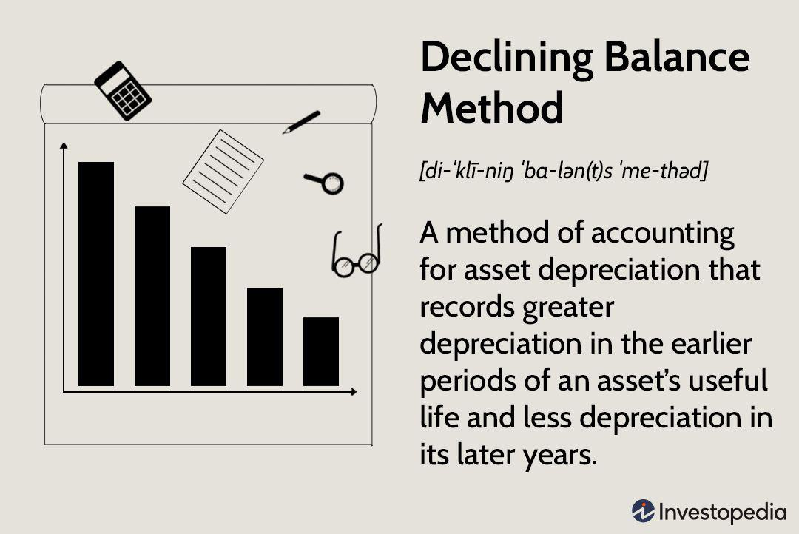

Accounting, the declining balance method, depreciation, and algorithmic trading may initially appear as distinct concepts; however, a closer look reveals a profound connection between them, especially in the context of modern financial markets. Accounting, fundamentally, is the systematic recording, reporting, and analysis of financial transactions, serving as the backbone of business decision-making. Within accounting, the declining balance method is a technique used to calculate depreciation, an essential concept that signifies the reduction in value of tangible assets over time.

Depreciation, specifically, plays a pivotal role for businesses by providing a mechanism to allocate the cost of an asset over its useful life. This method impacts financial statements, influencing both tax liabilities and profitability assessments. The declining balance method, in particular, accelerates depreciation, which can be advantageous for assets that lose value quickly or require frequent upgrades due to technological advancements.



Algorithmic trading, or algo trading, refers to the use of algorithms to execute trading strategies in financial markets. The adoption of this technology-driven approach has reshaped trading by enhancing speed, reducing human error, and enabling the deployment of complex strategies based on mathematical models.

Understanding the interplay between these topics is vital for both businesses and investors. Successful algo trading models rely heavily on accurate financial data and projections. Accounting principles, including the treatment of depreciation, are foundational in this process. The valuation and depreciation of assets can significantly influence algorithmic strategies, affecting trading decisions and outcomes.

The purpose of this article is to explore the critical role accounting plays in algorithmic trading and how the declining balance method of depreciation can be integrated into financial models. By examining these concepts and their interconnections, we aim to provide insights into their synergistic relationship, offering valuable perspectives for businesses and traders looking to leverage accounting insights within their algorithmic strategies. This exploration sets the stage for a deeper understanding of each element and their collective impact on modern financial practices.

## Table of Contents

## Understanding the Declining Balance Method of Depreciation

The declining balance method is a popular depreciation technique in accounting, primarily due to its accelerated nature of allocating the expense over an asset's useful life. It involves applying a constant depreciation rate to the reducing book value of the asset each period, resulting in larger depreciation expenses in the initial years and progressively smaller charges in subsequent years. This method is especially significant for assets that quickly lose value or become obsolete.

The mathematical formula for calculating depreciation using the declining balance method can be expressed as:

$$

\text{Depreciation Expense} = \text{Book Value at Beginning of Year} \times \text{Depreciation Rate} 
$$

This calculation results in a depreciation amount that decreases over time, reflecting the diminishing utility and revenue-producing capability of the asset. The method significantly differs from the straight-line depreciation, where the expense is equally distributed over the asset's useful life. While the straight-line method might suggest consistent utility throughout an asset's lifecycle, the declining balance method accounts for the rapid decrease in value many assets experience.

The declining balance method is particularly beneficial for assets such as vehicles, machinery, and technology equipment, which tend to lose functionality or become obsolete relatively quickly. For businesses, this method helps match depreciation expense with the revenue generated by the asset, allowing for more accurate financial reporting.

Consider the following example to understand how the declining balance method is applied: Imagine a company purchases a piece of machinery for $10,000, with an estimated useful life of five years and a salvage value of $1,000. Assuming a double-declining balance method, the depreciation rate is calculated as:

$$
\text{Depreciation Rate} = \frac{2}{\text{Useful Life}} = \frac{2}{5} = 40\%
$$

In the first year, the depreciation expense would be:

$$
\$10,000 \times 0.40 = \$4,000
$$

Subtracting the depreciation from the initial book value, the new book value for the second year is $6,000. The depreciation expense for the second year would be:

$$
\$6,000 \times 0.40 = \$2,400
$$

This process continues, reducing the book value each year with progressively smaller depreciation amounts. This pattern ensures that the asset's cost is more heavily amortized early on, aligning expense recognition with the asset's productivity.

By adopting the declining balance method, businesses not only achieve a more realistic depiction of asset deterioration but also benefit from tax advantages in jurisdictions where accelerated depreciation is permitted. As such, the declining balance method remains a crucial tool in the accountant's arsenal, providing a better match between revenues and expenses over an asset's useful life.

## Algorithmic Trading: An Overview

Algorithmic trading, often abbreviated as algo trading, refers to the use of computer algorithms to automate trading decisions in financial markets. These algorithms, guided by predefined criteria and mathematical models, execute trades with high efficiency and speed. The growing importance of [algorithmic trading](/wiki/algorithmic-trading) in financial markets is largely driven by its ability to process vast amounts of data and respond to market conditions faster than human traders, offering a competitive edge in execution and profitability. 

The backbone of algorithmic trading lies in sophisticated technology and robust algorithms. These systems are designed to buy and sell assets automatically, minimizing latency and maximizing trade execution efficiency. The integration of real-time data feeds, powerful computing resources, and advanced analytical techniques allows traders to exploit market opportunities that may arise within milliseconds.

There are several predominant strategies utilized in algorithmic trading. Trend following is one common strategy, which relies on algorithms to identify patterns in market data, such as moving averages, and make trades based on the prediction that these trends will continue. Another strategy is [arbitrage](/wiki/arbitrage), which involves exploiting price differentials for the same asset across different markets. An algorithm can quickly identify and act on these discrepancies, capturing profits that might be unattainable for traditional traders due to the time it takes to recognize and execute trades manually.

The development and execution of trading algorithms are guided by core principles, including precise mathematical modeling, risk management, and optimization. These principles ensure that the algorithms are not only profitable but also able to manage risk effectively by setting stop-loss orders and conducting real-time analysis of market conditions.

Algorithmic trading offers several benefits over traditional trading approaches. One of the primary advantages is speed; algorithms can analyze market conditions and execute trades much faster than a human. This enhanced speed can be crucial, especially in markets where asset prices can change rapidly. Additionally, algorithmic trading reduces human errors caused by emotional and psychological influences, ensuring more consistent and objective decision-making. Furthermore, it enables [backtesting](/wiki/backtesting) using historical data to validate trading strategies, optimizing them for future performance.

In conclusion, algorithmic trading has revolutionized the financial markets by leveraging technology to execute trades with unprecedented speed and efficiency. Understanding its strategies and principles can provide significant advantages in the fast-paced world of financial trading.

## The Role of Accounting in Algorithmic Trading

Accounting principles are fundamental to the development and implementation of algorithmic trading models, particularly as they provide a framework for financial analysis and decision-making. One of the key aspects of accounting relevant to algo trading is depreciation, which plays a crucial role in asset valuation and financial modeling. Accurate asset valuation is essential for forming robust trading algorithms since it directly influences financial decision-making and risk assessment. Algorithmic trading relies on precise data inputs, and any discrepancies in asset valuation due to inaccurate accounting can lead to suboptimal trading performance.

Depreciation, the systematic reduction of an asset's value over time, impacts an entity's financial statements, affecting both the income statement and the balance sheet. From an income statement perspective, depreciation is recognized as an expense, thereby reducing taxable income and potentially affecting the company's net profit. This is crucial for algorithmic models that project future revenue flows based on historical data, as underestimated depreciation can lead to an overestimation of profits and faulty expectations.

Incorporating depreciation calculations into algo trading systems ensures that these systems operate with a realistic assessment of asset value over time. For instance, the declining balance method, which accelerates the depreciation expense, might be favorable for assets that become obsolete quickly. By recognizing a larger expense early in an asset’s life, traders can adjust their models to account for diminishing returns from older assets, enhancing their strategies' long-term accuracy.

An example scenario where accounting insights impact algorithmic trading includes the valuation of technology assets, such as servers or high-frequency trading equipment. These assets tend to depreciate quickly, and their value plays a significant role in high-frequency trading operations. If the accounting records reflect an accelerated depreciation method, algorithms can adjust their cost basis calculations, ensuring they optimize trading profitability accordingly.

Furthermore, depreciation can influence the decision-making process regarding asset replacement and investment strategies. Accurate accounting enables algo trading systems to predict when an asset's diminished value no longer justifies its operational cost, prompting an upgrade or replacement. This insight helps maintain a competitive edge by leveraging the latest technology without incurring unnecessary expenditure.

In conclusion, accounting principles, particularly concerning depreciation, are indispensable in constructing and refining algorithmic trading models. They provide the essential data required to perform precise asset valuation, ultimately guiding trading strategies and enhancing decision-making processes. By integrating these insights into their algorithms, traders ensure their operations remain financially sound and responsive to changing market conditions.

## Integrating the Declining Balance Method in Financial Algorithms

Incorporating the declining balance method into financial models used in algorithmic trading can enhance the accuracy and relevance of asset valuation over time, thereby providing traders with more reliable data to base their trading decisions on. The declining balance method is a type of accelerated depreciation suitable for assets that lose value quickly, which can be particularly useful for tech-driven markets and fast-evolving sectors.

### Potential Adjustments and Considerations

When integrating the declining balance method into algorithms, several factors need to be considered:

1. **Depreciation Rate Selection**: The choice of a depreciation rate is critical. It should reflect how quickly the asset loses value, which can vary significantly between different asset classes. Typically, the rate might be a multiple of the straight-line depreciation rate, and a common formula used is:
$$
   \text{Depreciation Expense} = \text{Book Value at Beginning of Year} \times \text{Depreciation Rate}

$$

2. **Frequency of Updates**: Unlike financial statements which are updated quarterly or annually, trading algorithms may require depreciation calculations on a much more frequent basis to reflect real-time asset values.

3. **Impact on Financial Ratios**: Changes in asset values can affect financial ratios, impacting decisions regarding portfolio rebalancing, leverage, and liquidity. Algorithm adjustments may be needed to account for these variations.

### Challenges and Benefits

**Challenges**:
- **Complexity in Integration**: Adding depreciation calculations can increase the complexity of algorithms, demanding more processing power and possibly leading to slower execution times.
- **Volatility in Asset Value**: Markets can be volatile, and rapidly changing fair values might not always align with depreciation schedules.

**Benefits**:
- **Accuracy in Asset Valuation**: By accounting for depreciation, algorithms can offer a more accurate reflection of an asset's value at any given time, leading to better-informed trading decisions.
- **Timing and Strategy Alignment**: Accelerated depreciation methods like the declining balance can align closely with the lifecycles of tech stocks or capital-intensive industries, aiding strategy development.

### Case Study

An example of the declining balance method's utility can be seen in a study focusing on a technology-driven algorithmic trading firm. The firm incorporated declining balance depreciation to more accurately reflect the rapid obsolescence of IT equipment and patent values. This integration resulted in improved prediction accuracy, evident in a higher Sharpe ratio compared to models not considering depreciation, signifying enhanced risk-adjusted returns.

### Practical Tips for Traders and Analysts

- **Customization of Depreciation Schedules**: Tailor the depreciation schedule to specific asset classes within a portfolio to avoid generalized assumptions that can lead to inaccuracies.

- **Regular Review and Adjustment**: Periodically review depreciation rates and methods to ensure they remain aligned with current market conditions and asset lifecycles.

- **Utilize Programming Libraries**: Employ libraries such as NumPy in Python to streamline complex calculations, enhance algorithm efficiency, and minimize the potential for human error. An example function for calculating declining balance depreciation could be:

```python
def declining_balance(book_value, rate):
    return book_value * rate

# Example usage:
book_value = 1000  # Initial book value
rate = 0.2  # Depreciation rate (e.g., 20%)
depreciation_expense = declining_balance(book_value, rate)
print(depreciation_expense)  # Output: 200
```

By integrating the declining balance method into their trading algorithms, traders can gain a nuanced understanding of asset depreciation, ensuring their strategies stay attuned to the intrinsic value of the assets they're trading.

## Conclusion

In this article, we have explored the intricate connections between accounting, depreciation using the declining balance method, and algorithmic trading. These topics, while diverse, are interconnected in modern financial markets, underscoring the relevance of accounting principles in technology-driven trading environments. 

Understanding the declining balance method of depreciation is essential for accurately assessing asset values, which is crucial for developing and fine-tuning trading algorithms. This method allows for a more realistic representation of an asset's consumption and its impact on financial statements over time, thus providing traders and analysts with a clearer picture for decision-making. As financial markets become increasingly reliant on algorithmic strategies, the role of accounting cannot be understated. Accurate financial data, including depreciation calculations, ensure that trading algorithms reflect the true economic value of asset portfolios.

Moreover, integrating accounting insights into trading algorithms offers the potential for enhanced precision and robustness in financial predictions. Traders who incorporate the declining balance method into their algorithms might find themselves better equipped to navigate complexities and capitalize on market opportunities. For example, if a trader uses Python to integrate depreciation into their trading model:

```python
def declining_balance_depreciation(cost, rate, life_years):
    value = cost
    for year in range(1, life_years + 1):
        depreciation = value * rate
        value -= depreciation
        print(f"Year {year}: Depreciation = {depreciation:.2f}, Remaining Value = {value:.2f}")

# Example usage
declining_balance_depreciation(10000, 0.2, 5)
```

Recognizing these synergies between accounting and algorithmic trading represents not only an opportunity but also a necessity for market participants seeking a competitive edge. As we look forward, further developments and integration of accounting methodologies into trading algorithms are anticipated, paving the way for innovations that can substantially improve trading efficacy and financial forecasting.

Therefore, it is crucial for businesses and traders to embrace the insights provided by accounting practices like the declining balance method. By doing so, they can enhance their strategies and optimize their performance in today's digitally driven markets. As a call to action, readers are encouraged to continue exploring these concepts and integrate them into their financial practices, ensuring they remain informed and competitive in ever-evolving financial landscapes.

## References & Further Reading

[1]: Damodaran, A. (2012). ["Investment Valuation: Tools and Techniques for Determining the Value of Any Asset, University Edition."](https://books.google.com/books/about/Investment_Valuation.html?id=5SRHAAAAQBAJ) Wiley.

[2]: James, G., Witten, D., Hastie, T., & Tibshirani, R. (2013). ["An Introduction to Statistical Learning: with Applications in R."](https://link.springer.com/book/10.1007/978-1-0716-1418-1) Springer.

[3]: Poyane, F., & Kajiji, N. (2014). ["Algorithmic Trading & DMA: An Introduction to Direct Access Trading Strategies."](https://archive.org/details/algorithmictradi0000john) 4Myeloma Press.

[4]: Osborne, M. F. M. (1959). ["Brownian Motion in the Stock Market."](https://pubsonline.informs.org/doi/abs/10.1287/opre.7.2.145) Operations Research, 7(2), 145-173.

[5]: Barth, M. E., & Clinch, G. (1998). ["Revalued Financial, Tangible, and Intangible Assets: Associations with Share Prices and Non-Market-Based Value Estimates."](https://papers.ssrn.com/sol3/papers.cfm?abstract_id=74569) Journal of Accounting Research, 36(Supplement), 199-233.