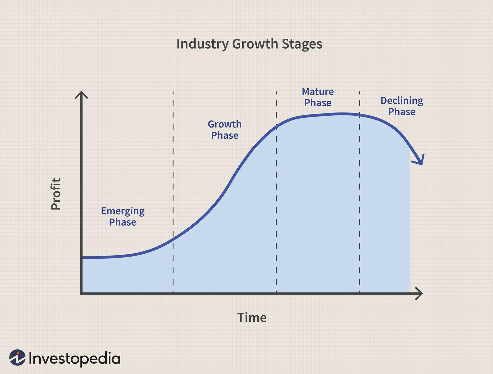

## Table of Contents

## What is a declining industry?

A declining industry is one where the demand for its products or services is going down over time. This can happen for many reasons. For example, new technology might make old products less useful, or people's tastes might change. When an industry starts to decline, companies in that industry often see lower sales and profits. They might have to close factories or lay off workers.

Sometimes, a declining industry can still have some companies that do well. These companies might find new ways to use their products or find new markets. However, most companies in a declining industry face tough times. They need to decide whether to keep going, change what they do, or leave the industry altogether. It's a challenging situation that requires careful planning and decision-making.

## What are the common characteristics of declining industries?

Declining industries often see a drop in demand for their products or services. This can happen because of new technology that makes old products less needed, or because people's wants change over time. For example, fewer people might want to buy CDs now that they can stream music online. When demand goes down, companies in these industries usually make less money. They might have to close stores or factories and let workers go.

Another common characteristic is that these industries often have too many companies fighting for a smaller market. This can lead to price wars, where companies lower their prices to try to keep customers. But this can make it even harder for them to make a profit. Some companies might try to stay in the game by cutting costs or finding new ways to use their products, but many struggle to survive.

In a declining industry, it can be hard to attract new investment. Investors might not want to put their money into a business that is shrinking. This makes it tough for companies to get the money they need to keep going or to try new things. As a result, many companies in declining industries either need to change what they do or eventually leave the industry altogether.

## How can you identify a declining industry?

You can spot a declining industry by looking at how much people want its products or services. If fewer people are buying them, it's a sign that the industry might be shrinking. For example, if you see that sales of video rental stores are going down because more people are using online streaming services, that tells you the video rental industry is declining.

Another way to tell is by watching the companies in the industry. If they are closing stores or factories, laying off workers, or struggling to make profits, these are all signs of a declining industry. Companies might also start cutting prices a lot to try to keep customers, which can lead to price wars. This shows that they are fighting over a smaller piece of the market.

Lastly, look at how much money investors are putting into the industry. If fewer investors are interested, it's a sign that they think the industry's future is not bright. This lack of investment can make it hard for companies to get the money they need to keep going or to try new things. When you see all these signs together, it's a good indication that an industry is on the decline.

## What are the economic impacts of a declining industry on a region?

When an industry starts to decline, it can hurt the economy of a whole region. If a lot of people in that area work for companies in the declining industry, they might lose their jobs. This can lead to more people being out of work and less money being spent in local stores and businesses. As people spend less, other businesses in the area might struggle too. This can make the whole economy of the region weaker.

The government might also lose money because of a declining industry. When companies close down or make less money, they pay less in taxes. This can make it harder for the government to pay for things like schools and roads. Sometimes, the government might have to step in and help by giving money to the people who lost their jobs or by trying to bring new businesses to the area. But it can take a long time for a region to recover from the impact of a declining industry.

## Can you provide examples of industries that have declined over the past decade?

Over the past decade, the coal industry has seen a big decline. This is because more people are using cleaner energy sources like solar and wind power. As a result, many coal mines have closed, and a lot of people who worked in the coal industry have lost their jobs. This has hurt the economies of places where coal mining was a big part of life. Governments in these areas have had to find new ways to help people and bring in new kinds of businesses.

Another industry that has declined is the print newspaper industry. More and more people are getting their news online or from TV, so fewer people are buying newspapers. This has led to many newspapers closing down or moving to online-only versions. The people who used to work at these newspapers, like reporters and editors, have had to find new jobs. This change has also affected other businesses that relied on newspaper ads for money.

The video rental industry is another example of a declining industry over the past decade. With the rise of streaming services like Netflix and Hulu, fewer people are going to video rental stores to rent movies. Big chains like Blockbuster have closed almost all of their stores. This has left many people who worked at these stores without jobs and has changed the way people watch movies at home.

## What are the reasons behind the decline of specific industries?

The coal industry has declined because more people want to use clean energy like solar and wind power. These new energy sources are better for the environment, so governments and people are choosing them over coal. As a result, many coal mines have closed, and a lot of coal workers have lost their jobs. This has hurt the economies of places where coal was a big part of life. Governments in these areas are now trying to find new ways to help people and bring in different kinds of businesses.

The print newspaper industry has also seen a decline because more people are getting their news online or from TV. This means fewer people are buying newspapers, so many have closed down or moved to online-only versions. The people who used to work at these newspapers, like reporters and editors, have had to find new jobs. This change has also affected other businesses that relied on newspaper ads for money. The shift to digital news has changed how people get information and has made the print newspaper industry much smaller.

The video rental industry has declined because of streaming services like Netflix and Hulu. People can now watch movies and TV shows online without leaving their homes, so fewer people go to video rental stores. Big chains like Blockbuster have closed almost all of their stores. This has left many people who worked at these stores without jobs and has changed the way people watch movies at home. The rise of streaming has made the video rental industry much less important than it used to be.

## How do businesses within a declining industry adapt or survive?

When businesses find themselves in a declining industry, they often have to find new ways to keep going. One way they can do this is by changing what they do. For example, a company that used to make video rental stores might start offering online streaming services instead. This way, they can keep their customers and make money even though the old way of doing things is not working anymore. Another way businesses can adapt is by finding new markets for their products. If people in one country are not buying as much, the company might start selling to people in another country where there is still demand.

Sometimes, businesses in a declining industry have to cut costs to survive. They might close some of their stores or factories to save money. They might also lay off workers or find cheaper ways to make their products. This can help them keep making a profit even though they are selling less. But it's not easy, and not all businesses can make it through. Some might have to leave the industry altogether and start doing something different. It's a tough situation, but with smart planning and quick action, some businesses can find a way to keep going.

## What role does technological advancement play in the decline of industries?

Technological advancement often leads to the decline of industries because it brings new and better ways of doing things. For example, when smartphones came out, they made things like flip phones and digital cameras less important. People could do more with one device, so they stopped buying the older ones. This hurt the companies that made flip phones and digital cameras. They had to either find new things to make or go out of business. Technology can change what people want and need, making some industries less useful.

Another way technology causes industries to decline is by making old ways of doing things cheaper and easier. For example, streaming services like Netflix made it easier for people to watch movies at home without going to a video rental store. This led to the decline of the video rental industry. Companies in these industries have to find new ways to use their technology or change what they do to keep up. If they can't, they might not survive. Technology keeps moving forward, and industries have to keep up or they will be left behind.

## How do government policies affect declining industries?

Government policies can help or hurt declining industries. If the government makes rules that support new technology or cleaner energy, it can speed up the decline of old industries. For example, if the government gives money to people who buy electric cars, it can make the car industry change faster. This can hurt companies that make gas cars because fewer people will buy them. Governments can also make rules that make it harder for old industries to keep going, like laws that limit how much pollution a factory can make. This can push companies in declining industries to change or close down.

On the other hand, the government can also try to help declining industries. They might give money to companies to help them stay open or to help workers find new jobs. Sometimes, the government will start programs to bring new businesses to areas where old industries are shrinking. This can help the economy of the region stay strong even if one industry is doing badly. But it's hard for the government to keep an industry going if people don't want its products anymore. In the end, government policies can make a big difference in how fast an industry declines and how well it can adapt to changes.

## What strategies can investors use to manage risks associated with declining industries?

Investors can manage risks in declining industries by spreading their money around. Instead of putting all their money into one industry, they can invest in different kinds of businesses. This way, if one industry goes down, they won't lose all their money. They can also look for companies in declining industries that are trying new things or moving into new markets. These companies might still do well even if the industry as a whole is shrinking.

Another strategy is to keep a close eye on the industry and be ready to move money out if things get worse. Investors can watch for signs like falling sales, companies closing, or fewer people buying the industry's products. If they see these signs, they might decide to sell their investments before they lose too much money. It's also important for investors to stay informed about new technology and government policies that could affect the industry. By being ready to act quickly and having a plan, investors can better handle the risks of investing in declining industries.

## How can a declining industry potentially transform or revive?

A declining industry can transform or revive by finding new ways to use its products or services. For example, a company in the coal industry might start working on clean coal technology or move into renewable energy like solar power. This way, they can keep their business going even though fewer people want to use coal. Another way is by finding new markets. If people in one country are not buying as much, the company might start selling to people in another country where there is still a need for their products. By changing what they do and where they sell, companies in a declining industry can find new life.

Sometimes, a whole industry can come back if something big changes. For example, if a new technology comes out that makes an old product useful again, the industry might start growing. Or if the government makes new rules that help the industry, it could start to do better. For instance, if the government gives money to help old factories switch to making new things, this can help the industry revive. It's not easy, and it takes a lot of work, but with the right changes and a bit of luck, a declining industry can transform and start to grow again.

## What are the long-term global trends that might lead to the decline of certain industries?

One long-term global trend that might lead to the decline of certain industries is the shift towards renewable energy. More and more people and governments want to use clean energy like solar and wind power instead of coal and oil. This is because they want to fight climate change and make the air cleaner. As a result, industries like coal mining and oil drilling might see less demand for their products. These industries will have to change what they do or find new ways to make money if they want to keep going.

Another trend is the growth of technology and automation. As technology gets better, machines and computers can do more things that people used to do. This can hurt industries that rely on people doing work by hand. For example, factories that make cars might use robots instead of workers, which can lead to fewer jobs in the car-making industry. Also, as more people use the internet and smartphones, old ways of doing things like renting videos or buying newspapers can become less important. Industries that don't keep up with technology might struggle to stay in business.

## References & Further Reading

[1]: Porter, M. E. (1980). ["Competitive Strategy: Techniques for Analyzing Industries and Competitors."](https://papers.ssrn.com/sol3/papers.cfm?abstract_id=1496175) The Free Press.

[2]: Christensen, C. M. (1997). ["The Innovator's Dilemma: When New Technologies Cause Great Firms to Fail."](https://www.hbs.edu/faculty/Pages/item.aspx?num=46) Harvard Business Review Press.

[3]: Schumpeter, J. (1942). ["Capitalism, Socialism and Democracy."](https://archive.org/details/j.-schumpeter-capitalism-socialism-and-democracy) Harper Perennial Modern Thought.

[4]: Autor, D. H., Dorn, D., & Hanson, G. H. (2013). ["The China Syndrome: Local Labor Market Effects of Import Competition in the United States."](https://www.aeaweb.org/articles?id=10.1257/aer.103.6.2121) American Economic Review, 103(6), 2121-2168.

[5]: Niguez, M.T. (2011). ["Algorithmic Trading and Market Dynamics."](https://www.jstor.org/stable/pdf/29789770.pdf) Finance and Economics Discussion Series, Federal Reserve Board.

[6]: Baker, S. R., Bloom, N., & Davis, S. J. (2016). ["Measuring Economic Policy Uncertainty."](https://academic.oup.com/qje/article/131/4/1593/2468873) The Quarterly Journal of Economics, 131(4), 1593-1636.

[7]: BBC News. (2021). ["The Decline of the Oil Industry."](https://www.bbc.co.uk/news/business-52642263) Available at: [BBC News](https://www.bbc.co.uk/news/business-52642263)

[8]: Deloitte Insights. (2022). ["The Future of Work: Reimagining Industrious Economies."](https://www.deloitte.com/global/en/issues/work.html) Available at: [Deloitte Insights](https://www.deloitte.com/global/en/issues/work.html)

[9]: Pandey, A. (2020). ["Emergence of Substitute Products: A Barrier for Market Longevity."](https://pubmed.ncbi.nlm.nih.gov/33178237/) Journal of Business Research, 119, 110-122.