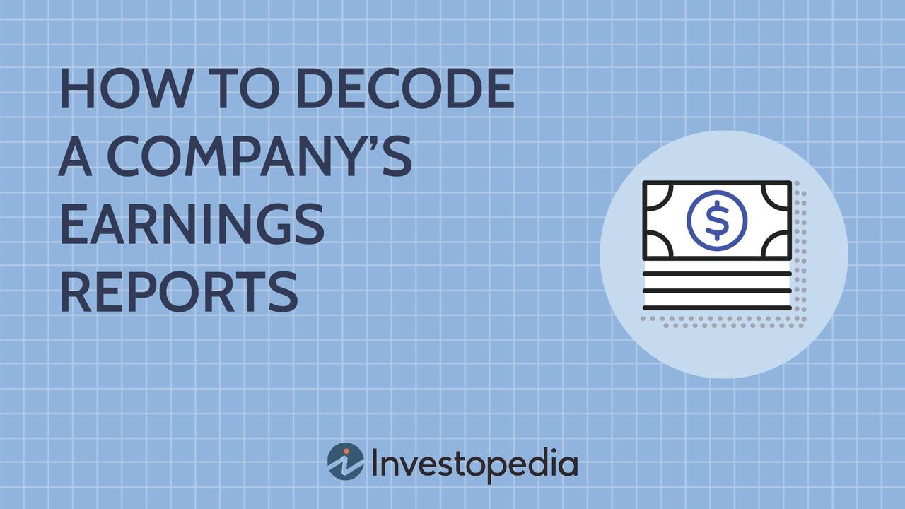

The financial landscape is profoundly shaped by company reports and financial analysis, with earnings reports holding particular significance. Earnings reports provide a snapshot of a company's financial health and significantly influence investment decisions and market movements. Consequently, they shape market perceptions and drive stock price fluctuations. Investors and traders closely monitor earnings reports to derive insights about a company's performance, which, in turn, affects their investment strategies.

With the growing complexity and rapid pace of financial markets, algorithmic trading has emerged as a powerful tool for traders aiming to capitalize on the opportunities presented by these earnings reports. Algorithmic trading employs computer algorithms to automate trading decisions, offering speed and precision that surpass human capabilities. These algorithms can analyze vast amounts of data and execute trades based on predefined criteria faster than manual interventions.



This article examines the intersection of financial analysis, earnings reports, and algorithmic trading strategies. It investigates into how traders can optimize their trading performance by leveraging algorithmic trading during earnings season, a period marked by high volatility and significant price reactions to earnings announcements. This exploration covers the essential components of earnings reports, how to decode them effectively, and the role of algorithmic trading in extracting value from the market. Additionally, it addresses the development of robust trading strategies and the integration of algorithmic systems with real-time data analysis to enhance trading efficacy during earnings season. These insights will guide traders in harnessing technology and data to optimize their engagement with earnings-related trades.

## Table of Contents

## Understanding Company Reports and Earnings Reports

Company reports, particularly earnings reports, are essential tools for assessing a company's financial performance and future prospects. These reports provide a comprehensive overview of various financial metrics that are crucial for investors and traders when evaluating the health and operational success of a firm. 

Earnings reports typically include key financial indicators such as net income, revenue, and earnings per share (EPS). Net income, sometimes referred to as net profit, represents the total profit of a company after all expenses, taxes, and costs have been deducted from total revenue. It is a critical measure as it reflects the company's profitability and efficiency in managing its expenses relative to its income.

Revenue, often called sales or turnover, indicates the total amount of money generated by the firm's business activities, usually over a specific period. It is a primary measure of business growth and is crucial for assessing the company's ability to attract and retain customers.

Earnings per share (EPS) is calculated by dividing the company's net income by the number of outstanding shares of its common stock. EPS is a valuable metric for investors as it provides insight into the profitability on a per-share basis, enabling comparisons across different companies regardless of their size.

These financial metrics are fundamental to understanding a company's performance but also act as catalysts in influencing stock prices and market trends. Investors and traders closely monitor earnings reports since they can lead to substantial stock price movements. For instance, if a company reports earnings that exceed analysts' expectations, its stock price is likely to rise as investors anticipate future growth. Conversely, earnings that fall short of expectations may lead to a decline in stock price as market sentiment turns pessimistic.

In conclusion, company and earnings reports are vital in equipping investors and traders with the data required to make informed decisions. They are not only indicators of past performance but also provide a window into the future potential of a company, thereby having profound implications for stock valuation and market behavior.

## How to Decode a Company's Earnings Reports

Learning to read and interpret earnings reports is essential for making informed investment and trading decisions. These reports are comprehensive documents, typically released quarterly or annually, that provide key insights into a company's financial performance and operational health. Understanding these components allows investors and traders to assess a company's past performance, current state, and potential future prospects.

An earnings report consists of several critical financial statements: the income statement, balance sheet, and cash flow statement. Each serves a distinct purpose:

1. **Income Statement**: This statement, sometimes referred to as the profit and loss statement, summarizes a company’s revenues, expenses, and profits over a specific period. Key metrics from the income statement include:
   - **Net Income**: Calculated as total revenue minus total expenses, it represents the company's profitability.
   - **Revenue**: The total income generated from the sale of goods and services.
   - **Earnings Per Share (EPS)**: A common measure of a company's profitability on a per-share basis, calculated as $\frac{\text{Net Income}}{\text{Number of Outstanding Shares}}$.

2. **Balance Sheet**: This provides a snapshot of a company's financial position at a particular point in time and includes three main components:
   - **Assets**: Resources owned by the company (e.g., cash, inventory, property).
   - **Liabilities**: Obligations the company owes to others (e.g., loans, accounts payable).
   - **Shareholders’ Equity**: The residual interest in the assets of the company after deducting liabilities, calculated as $\text{Assets} - \text{Liabilities}$.

3. **Cash Flow Statement**: This statement tracks the flow of cash in and out of the company, segmented into three areas:
   - **Operating Activities**: Cash generated or expended through regular business operations.
   - **Investing Activities**: Cash spent or received from the company’s investments.
   - **Financing Activities**: Cash flow between the company and its owners and creditors.

In addition to these financial statements, management's commentary within an earnings report is a key aspect of analysis. This narrative section provides context and insights into the numbers, highlighting operational achievements, strategic directions, and management’s perspective on the company’s future. It may also disclose potential financial risks and ongoing challenges, helping traders to gauge the firm’s risk factors and potential impacts on future performance.

Interpreting an earnings report also requires a keen eye for potential red flags or opportunities within the details. For example, a sudden increase in liabilities without a corresponding rise in assets could indicate financial instability, whereas consistent revenue growth accompanied by increased profit margins might suggest robust company health.

For traders utilizing algorithmic strategies, transforming the qualitative aspects of earnings reports into quantitative data suitable for algorithmic analysis can be challenging. However, considering factors such as historical earnings data, management commentary, and disclosed risks alongside technical metrics can enhance decision-making processes. Investors and traders should stay informed of any discrepancies or unusual patterns in these reports, allowing them to anticipate potential market reactions and adjust their strategies accordingly.

## The Role of Algorithmic Trading in Earnings Season

Algorithmic trading has gained notable prominence during earnings seasons due to its ability to process information and execute trades with remarkable speed and precision, surpassing human capabilities. Earnings season is characterized by the periodic release of corporate earnings reports, which introduces [volatility](/wiki/volatility-trading-strategies) and opportunity in financial markets. Algorithmic trading strategies are particularly effective in capitalizing on these short-term fluctuations and the rapid dissemination of information.

Algorithms are essentially computational models that leverage vast datasets to detect patterns, trends, and signals during turbulent market conditions. These models are crafted with predefined rules and guidelines that decide when to buy or sell financial securities across exchanges. In the context of earnings seasons, the volatility can stem from companies either exceeding or falling short of earnings expectations, which often leads to abrupt price movements. By analyzing these datasets in real-time, algorithms identify trading opportunities that arise from market inefficiencies or price discrepancies.

Python, a widely used programming language in finance, allows for the efficient implementation of [algorithmic trading](/wiki/algorithmic-trading) models. These algorithms can analyze various financial metrics such as price movements, [volume](/wiki/volume-trading-strategy) changes, and other market indicators to make informed trading decisions. The following Python snippet illustrates a basic structure for setting up an algorithmic trading strategy:

```python
import numpy as np
import pandas as pd
import matplotlib.pyplot as plt

# Load data (replace with actual data source)
data = pd.read_csv('market_data.csv')

# Define simple moving average (SMA) function
def sma(data, window):
    return data.rolling(window=window).mean()

# Calculate short-term and long-term SMAs
short_term_sma = sma(data['Close'], window=10)
long_term_sma = sma(data['Close'], window=50)

# Generate trading signals
data['signal'] = np.where(short_term_sma > long_term_sma, 1, 0)  # 1 for buy, 0 for sell

# Plot data and SMAs
plt.plot(data['Date'], data['Close'], label='Price')
plt.plot(data['Date'], short_term_sma, label='Short-term SMA')
plt.plot(data['Date'], long_term_sma, label='Long-term SMA')
plt.legend()
plt.show()
```

Here, short-term and long-term simple moving averages (SMAs) are used to generate buy and sell signals, a classic approach within algorithmic trading strategies. While this example is simplified, real-world applications are far more complex and may include integration with [machine learning](/wiki/machine-learning) models, neural networks, and advanced statistical methods.

During earnings seasons, algorithms cater to the short-lived opportunities by processing earnings data, estimated earnings (which analysts forecast), and the variance between expectations and actual results. The algorithm's strength lies in its ability to react almost instantly to changes in financial data, while humans require considerably more time to digest and act upon such information.

Overall, algorithmic trading during earnings seasons represents an advancement in trading efficiency, exploiting the frequent swings in asset prices to execute profitable trades. The strategic use of algorithms helps traders assess and respond to earnings surprises or disappointments — calculating risks and making trades with much more precision and within a fraction of a second compared to manual trading processes.

## Developing an Earnings Report Trading Strategy

Creating a trading strategy based on earnings reports involves a systematic approach to [backtesting](/wiki/backtesting) historical earnings data, which helps in assessing the viability and efficiency of prospective strategies. This entails several key methodologies, each exploiting different aspects of market behavior around earnings announcements.

One fundamental strategy is **[trend following](/wiki/trend-following)**. This approach capitalizes on the market's [momentum](/wiki/momentum) post-earnings announcements. Traders employing trend following strategies assume that the price movement observed after an announcement is indicative of the future direction, often driven by investor sentiment and market reaction to unexpected earnings results. A common implementation involves using moving averages to detect these trends. For instance, a basic Python implementation might include:

```python
import pandas as pd
import numpy as np

def moving_average_trend(prices, short_window=40, long_window=100):
    signals = pd.DataFrame(index=prices.index)
    signals['signal'] = 0.0
    signals['short_mavg'] = prices.rolling(window=short_window, min_periods=1).mean()
    signals['long_mavg'] = prices.rolling(window=long_window, min_periods=1).mean()

    # Generate signals based on moving average crossover
    signals['signal'][short_window:] = np.where(signals['short_mavg'][short_window:] 
                                                > signals['long_mavg'][short_window:], 1.0, 0.0)  

    # Generate trading orders
    signals['position'] = signals['signal'].diff()

    return signals
```

Another widely used strategy is **mean reversion**. This premise is based on the idea that stock prices that excessively deviate from their historical average will eventually revert to their mean. An investor implementing this strategy might sell stocks after a sharp increase in their price following positive earnings—and conversely, buy after a strong downside move following negative earnings—anticipating a reversal to average price levels.

**Volatility-based approaches** utilize the significant price swings often triggered by earnings reports. Such strategies might involve options trading, where the trader profits from the heightened implied volatility that typically occurs around earnings releases. These strategies benefit most when there is an expected increase in volatility, even if the direction of price movement remains uncertain.

For these strategies to remain effective, continuous **customization and refinement** are necessary to accommodate changing market conditions. Markets evolve due to numerous factors, including technological advancements and regulatory changes, requiring periodic strategy review. This can involve reevaluating entry and [exit](/wiki/exit-strategy) conditions, optimizing parameter settings, or integrating new technical indicators. Backtesting, again, plays a crucial role here—it helps assess how variations in strategy parameters would have performed with historical data.

In summary, developing a robust earnings report trading strategy necessitates backtesting leveraging historical data to gauge effectiveness. Employing a combination of trend following, mean reversion, and volatility-based strategies—coupled with continuous refinement—can help traders remain responsive and profitable amidst evolving market dynamics.

## Examples of Algorithmic Trading Strategies

Algorithmic trading strategies have gained prominence due to their ability to process large data volumes and make split-second decisions. Among these, trend following and contra-trend strategies are notable for their distinct approaches to capitalizing on market movements induced by earnings announcements.

**Trend Following Strategy:**
The trend following strategy aims to capture momentum in stock prices following earnings announcements. When a company releases positive earnings results, its stock often experiences upward momentum as market participants react to the news. Conversely, negative earnings announcements might trigger downward momentum. Algorithmic systems utilizing trend following strategies typically employ moving averages to identify and ride these trends. 

For example, a simple moving average (SMA) crossover can be used to generate trading signals:
- When a short-term SMA (e.g., 10-day) crosses above a long-term SMA (e.g., 30-day), a buy signal is generated.
- When a short-term SMA crosses below a long-term SMA, a sell signal is triggered.

Here's a basic Python implementation for a moving average crossover strategy:
```python
import pandas as pd

def moving_average_crossover(data, short_window=10, long_window=30):
    data['Short_SMA'] = data['Close'].rolling(window=short_window).mean()
    data['Long_SMA'] = data['Close'].rolling(window=long_window).mean()

    data['Signal'] = 0
    data['Signal'][short_window:] = \
        np.where(data['Short_SMA'][short_window:] > data['Long_SMA'][short_window:], 1, -1)

    data['Position'] = data['Signal'].diff()
    return data

# Example usage
# df will be a DataFrame with a 'Close' column containing historical price data.
# df = moving_average_crossover(df)
```
This example relies on moving averages to smooth out price data and identify trend direction, making it easier to discern sustained upward or downward movements commonly observed post-earnings announcements.

**Contra-Trend Strategy:**
On the other hand, contra-trend strategies, also known as mean reversion strategies, aim to exploit market overreactions. Following an initial price movement post-earnings announcements, stocks often exhibit a tendency to revert to their mean price levels due to market corrections or overblown expectations. This strategy involves identifying price reversals or retracements after extreme movements.

A common technical tool used in contra-trend strategies is the Bollinger Bands. Bollinger Bands consist of a middle band (SMA) and two outer bands representing standard deviations of price. A stock price moving outside these bands might indicate an overbought or oversold condition, potentially signaling a reversal.

Here's an outline for incorporating Bollinger Bands into trading logic:
1. Calculate the upper and lower Bollinger Bands:
$$
   \text{Upper Band} = \text{SMA}(n) + k \times \text{Standard Deviation}(n)

$$
$$
   \text{Lower Band} = \text{SMA}(n) - k \times \text{Standard Deviation}(n)

$$
   where $n$ is the look-back period and $k$ is typically set to 2.

2. Generate signals based on price crossing these bands:
   - Buy when the price crosses below the lower band
   - Sell when the price crosses above the upper band

Both trend following and contra-trend strategies require fine-tuning and may incorporate additional indicators or rules to enhance performance. Backtesting and iterative adjustments are essential to refine these strategies, ensuring robustness against the variable dynamics of earnings-induced volatility.

## Backtesting and Risk Management in Earnings Algo Trading

Backtesting is a crucial process in developing and optimizing algorithmic trading strategies, particularly in the context of trading on earnings reports. It involves the application of a trading strategy to historical market data to evaluate its potential performance. By simulating trades over past data, traders can gain insights into how a given strategy might perform under current market conditions.

Accurate data is foundational for reliable backtesting. This includes historical pricing data, volume, and corporate earnings announcements. Ensuring that data is free from errors or gaps is essential to avoid skewed results. Traders must also account for transaction costs, such as commissions and spreads, which can significantly impact the strategy's profitability. Market [liquidity](/wiki/liquidity-risk-premium) is another critical consideration, as strategies may perform differently in liquid versus illiquid markets.

Risk management practices are indispensable to mitigate the inherent risks associated with trading around earnings announcements. The increased market volatility during earnings season necessitates strategic risk management tools. Volatility filters can be employed to manage exposure during periods of high volatility. For instance, a trader might only execute trades when the market's volatility index remains below a certain threshold.

Dynamic position sizing is another effective risk management technique, allowing traders to adjust the size of their trades based on the current market volatility or the trader's risk tolerance. A common approach within dynamic position sizing is the Kelly Criterion, a mathematical formula used to determine the optimal size of a series of bets. It is particularly useful in trading to allocate capital in a way that maximizes growth while minimizing risk. The formula can be expressed as:

$$
f^* = \frac{bp - q}{b}
$$

where:
- $f^*$ is the fraction of the capital to bet,
- $b$ is the odds received on the wager (for a 3:1 win, $b = 3$),
- $p$ is the probability of winning,
- $q$ is the probability of losing, $q = 1 - p$.

In practice, implementing dynamic position sizing might involve Python programming to adjust trade sizes based on real-time calculations of volatility metrics or the trader’s risk parameters. Here is a basic example using Python for calculating position size based on the Kelly Criterion:

```python
def calculate_kelly_criterion(probability_of_win, odds):
    probability_of_loss = 1 - probability_of_win
    kelly_fraction = (odds * probability_of_win - probability_of_loss) / odds
    return kelly_fraction

probability_of_win = 0.55
odds = 3  # equivalent to 3:1 odds

position_size = calculate_kelly_criterion(probability_of_win, odds)
print("Optimal position size based on Kelly Criterion:", position_size)
```

Ultimately, the goal is to refine and rigorously test trading strategies before risking capital in live trading environments. By utilizing comprehensive backtesting and robust risk management protocols, traders can better navigate the complexities and opportunities presented by the market movements during earnings reports.

## Conclusion

Integrating algorithmic trading with the detailed insights provided by earnings reports can significantly enhance the effectiveness of trading strategies. This integration leverages the analytical power of algorithms and the rich data from financial reports to make informed trading decisions. The combination of these elements allows traders to harness the volatility and opportunities inherent in earnings reports to achieve optimized trading performance.

To achieve success in this field, it is essential to focus on comprehensive strategy development. This involves creating algorithms that can interpret key components of earnings reports, such as net income, revenue, and EPS, and then translating these metrics into actionable trading signals. For instance, a Python algorithm could be employed to automatically analyze earnings report PDFs, extracting crucial financial metrics to inform trading decisions.

Rigorous backtesting is another critical component of successful trading strategies. By applying trading algorithms to historical data, traders can assess how their strategies would have performed in previous earnings seasons. This process allows traders to refine their algorithms, ensuring they are robust and capable of navigating real-market conditions. Ensuring backtesting includes factors such as transaction costs and market liquidity is vital for creating realistic expectations.

Risk management practices play a pivotal role in complementing strategy development and backtesting. By incorporating tools such as volatility filters and dynamic position sizing, traders can manage the risks associated with the inherent volatility of earnings season trades. For example, a Python script can be designed to adjust trade sizes based on current market volatility, thereby optimizing the risk-return profile.

Incorporating technology and data analysis further enhances the engagement with earnings season trades. As algorithms evolve, they increasingly benefit from advancements in machine learning and [artificial intelligence](/wiki/ai-artificial-intelligence), which offer the capability to analyze large datasets swiftly and accurately. This technological edge allows traders to anticipate market movements faster than traditional methods.

In conclusion, the integration of algorithmic trading with earnings reports offers a formidable approach to optimizing trading strategies. Success requires a balanced approach that encompasses thorough strategy development, vigilant backtesting, and effective risk management practices. By leveraging technology and sophisticated data analysis, traders can navigate the complexities of earnings season with skill and precision, potentially improving their trading outcomes.

## References & Further Reading

[1]: Lopes, A. T., Vianna, O., & Mundim, A. P. F. (2020). ["Event study on volatility: the case of earnings announcements in Brazil."](https://pubmed.ncbi.nlm.nih.gov/29658070/) Journal of Economic Studies.

[2]: Saunders, J. (2018). ["The Complete Guide to Understanding Company Earnings Reports."](https://www.researchgate.net/publication/319752171_Saturation_in_qualitative_research_exploring_its_conceptualization_and_operationalization) Investopedia.

[3]: Aldridge, I. (2013). ["High-Frequency Trading: A Practical Guide to Algorithmic Strategies and Trading Systems."](https://onlinelibrary.wiley.com/doi/pdf/10.1002/9781119203803.fmatter) Wiley.

[4]: Jansen, S. (2020). ["Machine Learning for Algorithmic Trading - Second Edition."](https://github.com/stefan-jansen/machine-learning-for-trading) Packt Publishing.

[5]: Gitman, L. J., & Zutter, C. J. (2019). ["Principles of Managerial Finance."](https://www.pearson.com/en-us/subject-catalog/p/Zutter-Gitman-Principl-Manageri-Finance-15-15th-Edition/P200000005900/9780136879923) Pearson Education.