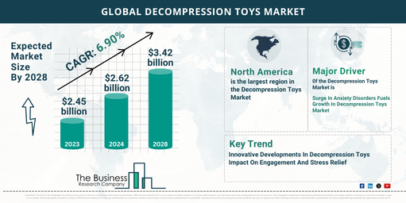

## Table of Contents

## What is a decompressed market?

A decompressed market is when a market that was previously tight or restricted starts to loosen up. This can happen when there are more products available than people wanting to buy them. It's like when there are too many apples at the store, so the price of apples goes down.

In a decompressed market, businesses might have to lower their prices to sell their products. This can be good for customers because they can buy things for less money. But it can be hard for the businesses because they might not make as much profit.

## How does a decompressed market differ from a compressed market?

A compressed market is the opposite of a decompressed market. It happens when there are not enough products for everyone who wants to buy them. Imagine if there were only a few apples at the store, but lots of people wanted to buy them. The store might raise the price of apples because they know people will still buy them. This can be good for businesses because they can make more money, but it can be hard for customers who have to pay more.

On the other hand, a decompressed market happens when there are more products than people who want to buy them. Going back to our apple example, if the store has too many apples, they might lower the price to get people to buy them. This is good for customers because they can buy apples for less money, but it can be tough for businesses because they might not make as much profit.

In summary, a compressed market has high demand and low supply, leading to higher prices, while a decompressed market has low demand and high supply, leading to lower prices. Each situation affects businesses and customers differently.

## What are the key characteristics of a decompressed market?

In a decompressed market, there are more products available than people who want to buy them. This means that businesses have a lot of stock that they need to sell. Because of this, they often lower their prices to encourage people to buy their products. When prices go down, it can be a good thing for customers because they can buy things for less money. However, businesses might not make as much profit because they are selling their products for lower prices.

This situation can lead to a lot of competition among businesses. They might try different ways to attract customers, like offering special deals or improving their products. Sometimes, businesses might even have to close down if they can't sell enough of their products to stay open. Overall, a decompressed market can be tough for businesses, but it can be a good time for customers to find bargains and save money.

## What industries are most affected by decompressed markets?

Decompressed markets can really affect industries like retail and manufacturing. In retail, stores might have too many clothes, electronics, or other goods that people aren't buying. When this happens, they often have to lower their prices a lot to sell their stuff. This can make it hard for them to make money. In manufacturing, companies might make too many cars or machines, and if they can't sell them, they have to cut prices or stop making more until they sell what they have.

Another industry that feels the impact of decompressed markets is real estate. When there are more houses or apartments for sale than people wanting to buy them, the prices of homes can go down. This is good for people looking to buy a home, but it can be bad for people who own homes because their home might be worth less money. Also, builders might have to slow down or stop building new homes until the market gets better.

Overall, decompressed markets can be tough for businesses in these industries. They have to find ways to sell their products or services even when there are more of them available than people want to buy. This can lead to lower profits and sometimes even businesses closing down. But it can be a good time for customers who can find deals and save money.

## How can businesses identify a decompressed market?

Businesses can tell they are in a decompressed market when they see that they have more products than people who want to buy them. This means their inventory, or the stuff they have in stock, is piling up. They might notice that they are not selling as much as before, even if they keep their prices the same. This can make them worried because it means they are not making as much money as they used to.

To confirm they are in a decompressed market, businesses can look at the prices of their products. If they find that they need to lower their prices a lot to sell their stuff, it's a sign that there are too many similar products out there. They might also see that other businesses are doing the same thing, lowering their prices to get rid of their stock. This can lead to a lot of competition, where businesses try different ways to attract customers, like offering special deals or improving their products.

## What strategies should companies use to thrive in a decompressed market?

When companies find themselves in a decompressed market, they need to be smart about how they handle it. One good strategy is to lower their prices a bit to get people to buy their products. This can help them sell more stuff and not have too much left over. Another way is to try new things to attract customers, like offering special deals or making their products even better. They can also focus on selling to new customers or in new places where there might be more people who want to buy what they have.

Another important strategy is to cut costs where they can. This means looking at how they spend money and seeing if there are ways to spend less. Maybe they can find cheaper ways to make their products or use less expensive materials. By saving money, they can still make a profit even if they have to sell their products for less. It's also a good idea for companies to keep a close eye on what's happening in the market and be ready to change their plans if things get better or worse. By being flexible and ready to try new things, companies can do well even when the market is decompressed.

## What are the economic implications of operating in a decompressed market?

When businesses operate in a decompressed market, they face some big challenges. They have more products than people who want to buy them, so they often have to lower their prices to sell their stuff. This can make it hard for them to make money because they are not getting as much for each product they sell. Sometimes, businesses might even have to close down if they can't sell enough to stay open. This can lead to fewer jobs and less money being spent in the economy, which can make things tough for everyone.

On the other hand, a decompressed market can be good for customers. When businesses lower their prices, people can buy things for less money. This means they can save money or buy more stuff with what they have. It can also lead to more competition among businesses, which can make them try harder to offer better products and services. While it can be hard for businesses, a decompressed market can give customers more choices and better deals, which can help the economy in some ways.

## How do consumer behaviors change in a decompressed market?

In a decompressed market, consumers often start to change how they buy things. They see that there are a lot of products out there and prices are going down. So, they might wait to buy things until they see a good deal. They know that if they wait, they might get the same thing for less money later. This can make people more careful with their money and look for the best deals before they buy anything.

Also, when there are a lot of products and prices are low, people might buy more than they need. They might stock up on things because they are cheaper now. This can lead to more spending in some ways, but it's usually on things that are not as expensive as before. People might also try new brands or products because they are willing to take a chance when prices are lower. Overall, consumers become more focused on getting the best value for their money in a decompressed market.

## What role does technology play in managing decompressed markets?

Technology can help businesses a lot when they are in a decompressed market. It can help them keep track of how much stuff they have and how much they are selling. This is called inventory management. With the right technology, businesses can see if they have too much of something and lower the price to sell it faster. They can also use technology to find out what people want to buy and make sure they have those things in stock. This can help them sell more and make more money, even when there are a lot of products out there.

Technology also helps businesses talk to their customers better. They can use the internet and social media to tell people about special deals or new products. This can help them sell more stuff and get rid of extra inventory. Plus, technology can help businesses see what other companies are doing and change their prices or products to stay competitive. By using technology smartly, businesses can do better in a decompressed market and keep their customers happy.

## How can policymakers support the development of decompressed markets?

Policymakers can help businesses in a decompressed market by making rules that encourage fair competition. They can do things like stopping big companies from making prices too low just to push out smaller businesses. This can help keep the market fair for everyone. They can also give businesses money or other help to keep going when times are tough. This can stop businesses from closing down and people from losing their jobs.

Another way policymakers can support decompressed markets is by helping consumers. They can make sure people know about the deals and lower prices that come with a decompressed market. This can help people save money and keep spending, which is good for the economy. Policymakers can also teach people how to shop smart and find the best deals. By doing these things, policymakers can make sure that decompressed markets work well for both businesses and customers.

## What are the long-term trends and predictions for decompressed markets?

In the long run, decompressed markets might happen more often because of how the world is changing. More and more, businesses are making things in big numbers because they can use machines and technology to do it cheaper. But sometimes they make too much, and then there are more products than people who want to buy them. Also, people are always looking for the best deals and might wait to buy things until prices go down. This can make decompressed markets last longer.

Looking ahead, businesses will need to be smart about how they handle decompressed markets. They might use technology more to see what people want and make sure they have the right amount of products. They might also try to sell their products in new places or to new people to keep making money. For customers, decompressed markets can mean more choices and better prices, but they will need to be careful with their money and look for the best deals. Overall, decompressed markets might become a bigger part of how the economy works, and everyone will need to be ready for them.

## How do global economic factors influence decompressed markets?

Global economic factors can really change how decompressed markets work. When the world's economy is doing well, people have more money to spend, and they might buy more stuff. But if the economy is not doing so good, like during a recession, people might not buy as much. This can make it harder for businesses to sell their products, and they might end up with too much stuff, leading to a decompressed market. Also, things like trade deals and tariffs can make it harder or easier for businesses to sell their products in different countries. If it's hard to sell products in other countries, businesses might have to lower their prices at home to sell what they have.

Another way global economic factors affect decompressed markets is through supply chains. If there are problems with getting materials from one country to another, like because of a natural disaster or a war, businesses might not be able to make as many products. But if they can get materials easily and cheaply, they might make too many products, leading to a decompressed market. Also, changes in currency values can make products more or less expensive in different countries. If a country's currency gets weaker, its products might be cheaper in other countries, but if it gets stronger, they might be more expensive. All these things can make decompressed markets happen more often or last longer.

## References & Further Reading

[1]: Bergstra, J., Bardenet, R., Bengio, Y., & Kégl, B. (2011). ["Algorithms for Hyper-Parameter Optimization."](https://papers.nips.cc/paper/4443-algorithms-for-hyper-parameter-optimization) Advances in Neural Information Processing Systems 24.

[2]: ["Advances in Financial Machine Learning"](https://www.amazon.com/Advances-Financial-Machine-Learning-Marcos/dp/1119482089) by Marcos Lopez de Prado

[3]: ["Evidence-Based Technical Analysis: Applying the Scientific Method and Statistical Inference to Trading Signals"](https://www.amazon.com/Evidence-Based-Technical-Analysis-Scientific-Statistical/dp/0470008741) by David Aronson

[4]: ["Machine Learning for Algorithmic Trading"](https://github.com/stefan-jansen/machine-learning-for-trading) by Stefan Jansen

[5]: ["Quantitative Trading: How to Build Your Own Algorithmic Trading Business"](https://books.google.com/books/about/Quantitative_Trading.html?id=j70yEAAAQBAJ) by Ernest P. Chan

[6]: Hendershott, T., Jones, C. M., & Menkveld, A. J. (2011). ["Does Algorithmic Trading Improve Liquidity?"](https://onlinelibrary.wiley.com/doi/full/10.1111/j.1540-6261.2010.01624.x) American Economic Review, 102(1), 1-15.

[7]: Aldridge, I. (2013). ["High-Frequency Trading: A Practical Guide to Algorithmic Strategies and Trading Systems"](https://books.google.com/books/about/High_Frequency_Trading.html?id=8QpIsVUMhmEC). Wiley Trading Series.