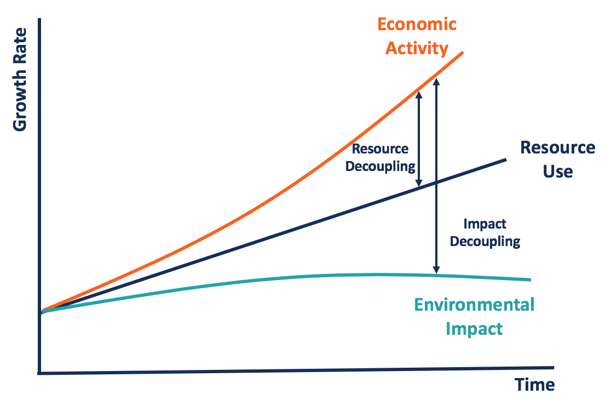

## Table of Contents

## What is decoupling in the context of finance?

Decoupling in finance means when two things that used to move together start moving differently. For example, if the economy of one country usually goes up and down with another country's economy, but then they start to change independently, we say they are decoupling. This can happen between countries, markets, or even different types of investments like stocks and bonds.

This concept is important because it can affect how investors make decisions. If two markets are decoupled, an investor might not want to assume that what happens in one will happen in the same way in the other. For instance, if the U.S. stock market goes down, it might not mean that the Chinese stock market will also go down if they are decoupled. Understanding decoupling helps investors manage risk and look for new opportunities.

## Why is decoupling important in financial markets?

Decoupling is important in financial markets because it helps investors understand how different markets or economies might behave on their own. When markets are closely linked, what happens in one can affect others. But if they decouple, it means they start to move independently. This can change how investors see risk and opportunity. For example, if an investor thinks the U.S. and European markets always move together, they might be surprised if Europe starts to do well while the U.S. struggles. Knowing about decoupling helps investors prepare for these changes.

Understanding decoupling also helps investors make better decisions about where to put their money. If two markets or types of investments that used to move together start to decouple, it might be a sign to look for new opportunities or to adjust their investment strategy. For instance, if stocks and bonds usually move in opposite directions but start to move together, an investor might need to rethink their portfolio. Decoupling can signal shifts in global economic patterns, and staying aware of these changes can lead to smarter investing.

## Can you explain the difference between coupled and decoupled markets?

When markets are coupled, it means they move together. If one market goes up, the other one usually goes up too. If one goes down, the other one tends to go down as well. This can happen between different countries' economies, like the U.S. and Europe, or between different types of investments, like stocks and bonds. Investors who understand that markets are coupled might make decisions based on what they see happening in one market, expecting the same thing to happen in the other.

On the other hand, when markets are decoupled, they start to move on their own. What happens in one market doesn't necessarily affect the other. For example, if the U.S. economy is doing badly, but the Chinese economy is doing well, we say these markets are decoupled. This can be important for investors because it means they need to look at each market separately. If they used to think that what happens in the U.S. would happen in China too, they might be surprised by the changes and need to adjust their investment plans.

## How does decoupling affect investment strategies?

When markets decouple, it changes how investors plan their investments. If you used to think that what happens in one market would happen in another, you might be surprised when they start moving differently. For example, if the U.S. and European markets used to go up and down together but then start moving on their own, you might need to look at each market separately. This means you can't just assume that if the U.S. market goes down, the European market will too. You have to watch both markets and make decisions based on what's happening in each one.

Decoupling can open up new opportunities for investors. If two markets that used to move together start moving differently, you might find good investments in one market while the other is struggling. For example, if the U.S. stock market is doing badly but the Chinese market is doing well, you might decide to put more money into Chinese stocks. It also means you need to be careful about spreading your investments. If you used to think that having investments in different countries would balance out your risk, you might need to rethink that if those countries' markets start moving on their own. Understanding decoupling helps you make smarter choices about where to put your money.

## What are some historical examples of decoupling in financial markets?

One big example of decoupling happened in the early 2000s between the U.S. and emerging markets like China and India. Before that, people thought that what happened in the U.S. economy would happen in other countries too. But around this time, these emerging markets started growing fast even when the U.S. economy was not doing so well. This surprised a lot of investors who used to think that the U.S. and these other countries' economies moved together.

Another example of decoupling was seen during the 2008 financial crisis. At first, many thought that the crisis would affect all countries the same way. But it turned out that some countries, especially in Asia and Latin America, did not suffer as much as the U.S. and Europe. This showed that global markets were not as connected as people used to think. It made investors realize they needed to look at each country's economy separately instead of assuming they would all move the same way.

## What are the potential benefits of decoupling for an economy?

When an economy decouples from another, it can start to grow on its own, even if the other economy is struggling. This can be good because it means the country doesn't have to worry as much about what's happening in other places. For example, if the U.S. economy is doing badly but China's economy is doing well, China can keep growing and creating jobs without being held back by the U.S. This can make the economy stronger and more stable because it's not so dependent on what happens elsewhere.

Decoupling can also create new opportunities for businesses and investors. If one economy is doing well while another is not, companies might decide to invest more in the growing economy. This can lead to more jobs and more money flowing into that economy. For investors, it means they can look for good deals in places that are doing well, even if other places are struggling. This can help spread risk and potentially lead to better returns on their investments.

## What are the risks associated with decoupling in finance?

When economies or markets decouple, it can be risky because it makes things more unpredictable. If you used to think that what happens in one place would happen in another, you might be surprised when they start moving differently. This can make it harder to plan and invest because you have to look at each place separately. For example, if you thought the U.S. and European markets always moved together but then they start doing their own thing, you might lose money if you don't adjust your investments in time.

Another risk is that decoupling can make economies more isolated. If a country's economy is not closely linked to others, it might miss out on the benefits of global trade and investment. For example, if a country's economy starts to grow on its own but then faces a problem, it might not get as much help from other countries. This can make the economy more vulnerable to shocks and downturns because it doesn't have the support of a global network.

## How do global economic policies influence decoupling?

Global economic policies can make economies more or less likely to decouple. When countries work together and make similar policies, like lowering taxes or making trade easier, their economies tend to move together. This is because these policies can make it easier for businesses to operate in different countries, which makes the economies more connected. For example, if many countries join a trade agreement, their economies might grow together because they are all part of the same market.

On the other hand, if countries start making different policies, like putting up trade barriers or changing their currencies, their economies might start to move on their own. This can happen when one country decides to do things differently from others, like raising interest rates while others keep them low. These different policies can make it harder for businesses to operate across borders, which can lead to decoupling. For example, if one country puts tariffs on goods from another country, their economies might not move together as much because trade between them becomes more difficult.

## What role do emerging markets play in the process of decoupling?

Emerging markets can play a big role in decoupling because they often grow faster than developed economies. When countries like China, India, or Brazil start to grow a lot, even if the U.S. or Europe are not doing so well, it shows that their economies are moving on their own. This can surprise investors who used to think that all countries would move the same way. For example, during the early 2000s, China's economy kept growing fast even when the U.S. economy was struggling. This showed that emerging markets could be less connected to the ups and downs of developed economies.

This growth in emerging markets can also change how investors think about risk and opportunity. If an investor sees that a country like India is doing well while the U.S. is not, they might decide to put more money into Indian companies. This can help the emerging market grow even more because it gets more investment. But it also means that investors need to be careful and look at each country's economy separately, instead of assuming they will all move together. Understanding how emerging markets can decouple helps investors make smarter choices about where to put their money.

## How can investors identify signs of decoupling in financial markets?

Investors can spot signs of decoupling by watching how different markets or economies move compared to each other. If markets that used to go up and down together start to move differently, that's a sign of decoupling. For example, if the U.S. stock market goes down but the stock market in Brazil goes up, it might mean these markets are decoupling. Investors should pay attention to economic reports and news from different countries to see if their economies are growing or shrinking at different rates.

Another way to see decoupling is by looking at how different types of investments, like stocks and bonds, are doing. If stocks and bonds usually move in opposite directions but then start moving together, it's a sign that something is changing. Investors can also use tools like correlation analysis to see how closely linked different markets are. If the numbers show that markets are becoming less connected, it might be time to adjust investment strategies to take advantage of new opportunities or manage risks better.

## What advanced metrics or indicators should experts use to analyze decoupling?

Experts can use several advanced metrics to analyze decoupling in financial markets. One important metric is correlation analysis, which measures how closely two markets or assets move together. A high correlation means the markets are coupled, while a low or negative correlation suggests decoupling. Another useful indicator is the beta coefficient, which shows how sensitive an asset is to movements in the broader market. If the beta of an asset changes significantly over time, it might signal that the asset is decoupling from the market it was once closely tied to.

Additionally, experts can look at economic indicators like GDP growth rates, inflation rates, and trade balances to see if different economies are moving in different directions. For example, if one country's GDP is growing while another's is shrinking, it could be a sign of decoupling. Financial analysts also use volatility indexes to understand how stable or unstable different markets are. If the volatility of one market starts to differ greatly from another, it might indicate that these markets are no longer moving in sync. By keeping an eye on these metrics, experts can better understand and predict decoupling trends in financial markets.

## How might future trends in technology and globalization impact financial decoupling?

Future trends in technology and globalization could make financial decoupling more common. As technology improves, it becomes easier for countries to do things on their own. For example, new technologies like AI and automation can help countries grow their economies without relying so much on other countries. This means that if one country's economy is doing badly, another country might keep growing thanks to technology. Also, as more people use the internet and digital tools, businesses can reach customers all over the world without needing to be in the same place. This can make economies less connected because they don't have to depend on each other as much.

On the other hand, globalization could still keep economies connected in some ways. Even with new technology, countries might still want to trade with each other to get things they can't make themselves. Global trade agreements and international cooperation can keep economies linked, even if technology helps them grow on their own. But if countries start to focus more on their own growth and less on working together, we might see more decoupling. It all depends on how countries use technology and how much they want to work together in the future.

## References & Further Reading

[1]: ["World Economic Outlook October 2009: Sustaining the Recovery"](https://www.imf.org/en/Publications/WEO/Issues/2016/12/31/World-Economic-Outlook-October-2009-Sustaining-the-Recovery-22576) by the International Monetary Fund

[2]: Atkinson, A. B., & Morelli, S. (2011). ["Economic Crises and Inequality."](https://oms-www.files.svdcdn.com/production/downloads/academic/AtkinsonHDRP_2011_06.pdf) Oxford University Press.

[3]: ["High-Frequency Trading: A Practical Guide to Algorithmic Strategies and Trading Systems"](https://onlinelibrary.wiley.com/doi/pdf/10.1002/9781119203803.fmatter) by Irene Aldridge

[4]: Hasbrouck, J. (2018). ["High Frequency Trading, Algorithmic Trading, and the Fragmentation of Markets."](https://www.researchgate.net/publication/323782560_High-Frequency_Quoting_Short-Term_Volatility_in_Bids_and_Offers) The Review of Financial Studies.

[5]: Shleifer, A. (2000). ["Inefficient Markets: An Introduction to Behavioral Finance."](https://academic.oup.com/book/27761) Oxford University Press.

[6]: ["Asset Correlations: A Guide for Investors"](https://www.portfoliovisualizer.com/asset-correlations) from Investopedia

[7]: Johnson, B., & McMillan, M. (2005). ["Financial Market Complexity."](https://academic.oup.com/book/9066) Wiley.