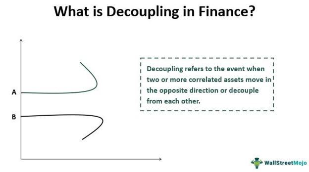

Understanding the dynamics of global financial markets is crucial for both individual and institutional investors. In recent years, the concept of decoupling in financial markets has gained attention as a significant phenomenon. Financial decoupling refers to the situation where the performance of one market or asset class becomes independent from another. Historically, various markets have often moved in sync due to shared influences like economic policies, global events, and investor sentiment. However, decoupling introduces a layer of complexity that challenges traditional assumptions of market convergence.

This article explores the idea of decoupling within financial markets and provides real-world examples to illustrate its significance. For instance, the 2008 financial crisis presented a notable case where emerging markets sustained growth even as developed economies faced recession. Additionally, the divergence of tech stocks from the broader market during economic downturns highlights the adaptability and resilience of certain market segments.



Algorithmic trading, which utilizes automated systems to execute trades based on pre-defined criteria, has emerged as a key player in this evolving landscape. By enhancing market efficiency and enabling quick execution, algorithmic trading contributes to temporary price shifts, which may result in short-term decoupling of asset prices from their fundamental values.

SEO strategies will ensure this article reaches readers seeking insights on finance decoupling and algorithmic trading. The implications of decoupling on investment strategies and portfolio management are profound, offering both challenges and opportunities. Investors must remain vigilant and adapt their strategies to account for potential market shifts, leveraging decoupling to their benefit and enhancing portfolio resilience in an ever-changing global financial environment.

## Table of Contents

## What is Financial Decoupling?

Financial decoupling refers to a phenomenon where the performance of one asset class or market diverges significantly from another. This concept challenges the traditional notion that financial markets generally move in concert, influenced by economic policies, global events, and investor sentiment.

Historically, financial markets have often exhibited a high degree of correlation. For example, during periods of global economic growth, stock markets across different regions tend to rise concurrently. Conversely, during economic downturns, there is usually a synchronized decline. However, financial decoupling disrupts this narrative, allowing certain markets or asset classes to chart independent paths.

One notable instance of financial decoupling is the performance gap between equity markets in developed countries and those in emerging economies. During the 2008 financial crisis, while developed markets entered a deep recession, many emerging markets, driven by robust domestic demand and relatively stable financial systems, continued to grow. This divergence in performance highlighted the potential for markets to decouple under specific conditions.

Decoupling is not limited to geographical distinctions but can also occur between different asset classes, such as stocks and commodities. For example, a rise in oil prices may not necessarily be reflected in the broader equity market, especially if other factors offset it. Such scenarios underscore the complex interdependencies that can exist between different financial instruments.

Understanding the drivers behind financial decoupling can provide crucial insights for investors seeking to make informed decisions. Factors such as disparities in economic growth rates, divergent monetary policies, and geopolitical events can contribute to decoupling. Additionally, structural changes within markets, such as technological advancements or shifts in consumer behavior, may also play a role.

Recognizing these patterns enables investors to better anticipate shifts in market dynamics and adjust their portfolios accordingly. In essence, financial decoupling serves as a reminder of the intricacies involved in global markets, underscoring the importance of flexibility and adaptability in investment strategies.

## Examples of Decoupling in Finance

Financial decoupling refers to situations where certain markets, asset classes, or economic sectors move independently from others. Throughout financial history, several examples illustrate this phenomenon, each highlighting the diverse factors that can influence decoupling dynamics.

One of the most widely observed instances of financial decoupling occurred during the 2008 financial crisis. As major developed economies like the United States and several European countries descended into deep recessions, many emerging markets displayed resilience and continued to grow. This divergence was largely attributed to the stronger fiscal positions, domestic consumption, and structural differences in emerging markets that insulated them from the full brunt of the financial turmoil affecting developed nations. According to the International Monetary Fund (IMF), countries like China and India maintained positive growth rates during this period, underscoring their relative independence from the Western financial crisis (IMF World Economic Outlook, 2009).

Another example of decoupling can be observed in the tech sector, particularly in times of broader economic downturns. For instance, during the COVID-19 pandemic, while traditional industries experienced severe contraction, tech stocks displayed robust performance. Companies such as Amazon, Apple, and Microsoft saw substantial gains as global demand for digital services, remote work solutions, and e-commerce surged. This divergence from the broader market can be attributed to the accelerated digital transformation and the sector's capability to adapt rapidly to changing consumer behaviors.

A further instance of financial decoupling is evident in the energy sector, specifically between renewable energy stocks and traditional fossil fuel sectors. With growing global awareness and policy measures addressing climate change, renewable energy companies have often outperformed traditional energy firms relying on fossil fuels. This shift has been driven by increased investment in green technologies, government incentives for sustainable energy, and changing consumer preferences. The divergence in performance between these two sectors exemplifies how environmental and regulatory factors can lead to decoupling.

These examples underscore the varying factors—ranging from economic conditions, technological advances, to regulatory shifts—that can lead to the decoupling of markets or asset classes. Each instance provides insights into the complex interplay of forces that can influence the autonomous movement of financial entities, necessitating sophisticated understanding and adaptation by investors and policymakers alike.

## Algorithmic Trading: A Catalyst for Decoupling

Algorithmic trading, often known as algo trading, involves the use of computer programs to perform trading operations based on a predefined set of instructions. These instructions can incorporate timing, price, quantity, or any mathematical model, streamlining and accelerating the trading process. This automated approach has become increasingly significant in financial markets, enhancing market [liquidity](/wiki/liquidity-risk-premium) and efficiency by facilitating rapid execution of trades and minimizing human error.

One of the notable impacts of [algorithmic trading](/wiki/algorithmic-trading) is its potential to decouple asset prices from their intrinsic values. Algorithms exploit minute price differences and market inefficiencies that are typically imperceptible to human traders. For instance, an algorithm might be programmed to identify [arbitrage](/wiki/arbitrage) opportunities where the same asset is priced differently across markets. This can result in short-term price adjustments that may not reflect the underlying fundamental value of an asset, a phenomenon referred to as price decoupling. 

High-frequency trading ([HFT](/wiki/high-frequency-trading-strategies)), a subset of algorithmic trading, is particularly influential in this context. HFT systems execute a large number of orders at incredibly high speeds, often within milliseconds, capitalizing on fleeting price discrepancies. While this can enhance market efficiency by aligning prices more closely with fair value over time, it can also cause temporary market disruptions and influence correlations among assets. For example, during periods of market stress, HFT can exacerbate [volatility](/wiki/volatility-trading-strategies) through rapid buying and selling, leading to a condition known as "flash crashes," where asset prices sharply fall and recover within a short span.

The evolution of algorithmic trading raises complex questions about market correlation. As different assets, traditionally correlated due to economic fundamentals, are increasingly influenced by automated trading strategies, the traditional understanding of market dependencies is challenged. This shift necessitates a more nuanced appreciation of market dynamics and the forces driving price movements.

To illustrate an automated trading strategy in action, consider a simple moving average crossover strategy executed in Python:

```python
import numpy as np
import pandas as pd

def moving_average_crossover(prices, short_window, long_window):
    signals = pd.DataFrame(index=prices.index)
    signals['signal'] = 0.0

    # Create short simple moving average
    signals['short_mavg'] = prices.rolling(window=short_window, min_periods=1, center=False).mean()

    # Create long simple moving average
    signals['long_mavg'] = prices.rolling(window=long_window, min_periods=1, center=False).mean()

    # Create signals: 1 when short_mavg > long_mavg, 0 otherwise
    signals['signal'][short_window:] = np.where(signals['short_mavg'][short_window:] 
                                                > signals['long_mavg'][short_window:], 1.0, 0.0)
    # Generate trading orders
    signals['positions'] = signals['signal'].diff()

    return signals

# Simulated price data
price_data = pd.Series(...)  # Price data loading logic

# Define short and long windows
short_window = 40
long_window = 100

# Generate signals
signals = moving_average_crossover(price_data, short_window, long_window)
```

This script demonstrates the logic behind executing trades based on the intersection of short and long moving averages, a common strategy used in algorithmic trading. Automated systems execute these trades given precise conditions, allowing for rapid response to market changes before the opportunities are apparent to traditional traders.

The implications of algorithmic trading on market dynamics remain a subject of ongoing research and debate, as market participants adapt to the challenges and opportunities presented by these rapidly evolving trading mechanisms. The relationship between algorithmic trading and market decoupling continues to be a vital area for investors and regulators to understand and navigate.

## Decoupling vs. Recoupling: Market Realignments

Decoupling and recoupling are phenomena that reflect the dynamic nature of global financial markets. Decoupling occurs when asset classes or markets previously exhibiting a high degree of correlation begin to move independently of one another. By contrast, recoupling refers to the process where these markets or asset classes revert to exhibiting correlated behavior. Understanding these processes is vital for predicting market behavior and making informed investment decisions.

Recoupling can occur due to several factors that alter the economic landscape and restore correlations. Changes in economic fundamentals like GDP growth rates, inflation, or interest rates can significantly influence the interdependence of markets. For instance, if two economies that had previously exhibited decoupling experience simultaneous changes in monetary policies or economic growth trajectories, their financial markets may begin to exhibit recoupling. This is often seen in the form of synchronized policy shifts across central banks, which can bring previously diverging markets back into alignment.

Policy shifts also play a critical role in recoupling. Coordinated financial responses, such as stimulus measures during economic downturns, can bring about recoupling. For example, during the global financial meltdown, a concerted effort by central banks worldwide through quantitative easing measures helped realign financial markets that had previously moved independently.

Additionally, investor sentiment and global macroeconomic events can motivate recoupling. When investors perceive increased systemic risk, they tend to shift back to more stable markets or assets, often leading to recoupling. Understanding these triggers is crucial for investors to predict potential recoupling events and adjust their strategies accordingly. Predicting these shifts involves analyzing a range of indicators, including economic reports, policy announcements, and other macroeconomic news.

Strategizing for recoupling involves continuously monitoring changes in correlations and being ready to adjust portfolios. Software tools and quantitative models can help in identifying early signs of recoupling. Investment strategies need to be flexible to accommodate sudden changes in correlation dynamics, ensuring that portfolios are hedged against risks arising from unexpected market realignments.

In conclusion, both decoupling and recoupling significantly impact financial market operations. Recognizing the factors that drive these phenomena is essential for crafting robust investment strategies and effectively managing portfolios in a complex financial ecosystem.

## Impact of Decoupling on Investment Strategies

Investors must carefully consider the implications of financial decoupling when constructing diversified portfolios. The lack of correlation, or decoupling, between asset classes or markets presents both risks and opportunities for investment strategies. A primary consideration is the potential for decoupled assets to serve as effective hedges against market downturns. By diversifying across assets that do not move in tandem, investors can mitigate the impact of negative events affecting a specific market or asset class.

For instance, if the stock market is experiencing volatility or a downturn, commodities such as gold, traditionally viewed as a safe haven, might not follow the same trajectory. As such, including commodities in a portfolio could reduce overall risk. The correlation coefficient, $\rho$, is a statistical measure that investors can use to determine the relationship between the returns of two assets. A correlation coefficient close to zero between two assets indicates potential decoupling, providing a hedge.

In Python, the correlation coefficient between two sets of returns can be calculated using:

```python
import numpy as np

# Example arrays of returns for two assets
returns_asset_1 = np.array([0.05, 0.02, -0.01, 0.04])
returns_asset_2 = np.array([-0.01, 0.03, 0.05, 0.02])

# Calculating the correlation coefficient
correlation_coefficient = np.corrcoef(returns_asset_1, returns_asset_2)[0, 1]
print("Correlation Coefficient:", correlation_coefficient)
```

Portfolio managers must remain vigilant to changes that could signal decoupling events, which may disrupt traditional market assumptions. Economic events, technology advancements, or geopolitical shifts can trigger such changes. A proactive approach involves constant monitoring and analysis of economic indicators, market signals, and geopolitical developments to anticipate potential decoupling scenarios.

Moreover, asymmetries in market behavior can be exploited by identifying these decoupling instances. For example, while traditional energy sectors might lag due to regulatory changes or shifts towards sustainability, renewable energy stocks may decouple and outperform. Recognizing such patterns can help investors capitalize on emerging trends.

In conclusion, understanding and anticipating financial decoupling can enhance investment strategy effectiveness. By assessing correlations, diversifying wisely, and staying informed about economic and geopolitical developments, investors can not only mitigate risks but also seize opportunities presented by market asymmetries.

## Conclusion

The concept of financial decoupling serves as a reminder of the complex dynamics governing global markets. As the interconnectedness of economies and assets can shift unexpectedly, understanding decoupling becomes crucial. With the rise of algorithmic trading, which leverages advanced algorithms and massive data processing capabilities, market participants must adapt to rapidly changing market conditions. Algorithms can execute trades at speeds and volumes beyond human capability, potentially creating temporary decoupling by exploiting inefficiencies or disparities in market pricing.

Investors should therefore continually evaluate market correlations and adjust their strategies in response to this evolving landscape. The monitoring and analysis of financial data can be supported by technology, helping investors discern emerging patterns of decoupling or recoupling. Portfolio management systems often incorporate statistical models, such as correlation matrices, to gauge the relationships between various assets. Adjustments based on shifts in these correlations can optimize portfolio performance and risk exposure.

Decoupling, while presenting challenges, also offers opportunities for astute investors. These opportunities may arise from mispricing, arbitrage situations, or tactical allocations towards assets that benefit from specific decoupling scenarios. By staying informed and leveraging technological tools, investors can potentially exploit these opportunities to navigate the intricate world of finance effectively, ensuring that their strategies remain resilient amid the complexities of global market dynamics.

## References & Further Reading

[1]: ["World Economic Outlook October 2009: Sustaining the Recovery"](https://www.imf.org/en/Publications/WEO/Issues/2016/12/31/World-Economic-Outlook-October-2009-Sustaining-the-Recovery-22576) by the International Monetary Fund

[2]: Atkinson, A. B., & Morelli, S. (2011). ["Economic Crises and Inequality."](https://oms-www.files.svdcdn.com/production/downloads/academic/AtkinsonHDRP_2011_06.pdf) Oxford University Press.

[3]: ["High-Frequency Trading: A Practical Guide to Algorithmic Strategies and Trading Systems"](https://onlinelibrary.wiley.com/doi/pdf/10.1002/9781119203803.fmatter) by Irene Aldridge

[4]: Hasbrouck, J. (2018). ["High Frequency Trading, Algorithmic Trading, and the Fragmentation of Markets."](https://www.researchgate.net/publication/323782560_High-Frequency_Quoting_Short-Term_Volatility_in_Bids_and_Offers) The Review of Financial Studies.

[5]: Shleifer, A. (2000). ["Inefficient Markets: An Introduction to Behavioral Finance."](https://academic.oup.com/book/27761) Oxford University Press.

[6]: ["Asset Correlations: A Guide for Investors"](https://www.portfoliovisualizer.com/asset-correlations) from Investopedia

[7]: Johnson, B., & McMillan, M. (2005). ["Financial Market Complexity."](https://academic.oup.com/book/9066) Wiley.