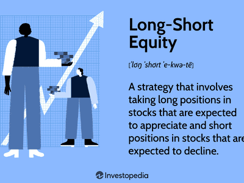

Investment strategies within financial markets have undergone significant evolution, adapting to shifting market conditions and varying investor objectives. Among such strategies, short bias and short selling are particularly noteworthy for targeting profits from falling asset prices. Short bias involves holding a portfolio skewed towards short positions, aiming to capture gains during market downturns. Short selling, on the other hand, entails borrowing assets to sell them with the intent of repurchasing them at a lower price, thus benefitting from the expected decline in value.

The advent of technology has fundamentally transformed these strategies, particularly through the integration of algorithmic trading. Algorithms facilitate automatic trading decisions based on pre-defined criteria, enhancing the speed and accuracy of trade execution. This technological advancement has opened new opportunities for traders, particularly in implementing short selling strategies. The utilization of algorithmic trading has enabled the processing of vast datasets and the identification of overvalued assets, paving the way for more strategic short selling decisions. 



This article explores the intricacies of short bias and short selling within the framework of algorithmic trading. It examines their operational mechanisms, highlights their benefits and limitations, and considers their role within the broader context of financial market strategies. Through this exploration, the article aims to provide a comprehensive understanding of how these methods can be wisely employed in seeking profitable outcomes amidst complex market dynamics.

## Table of Contents

## Understanding Short Bias and Short Selling

Short bias is an investment strategy tailored to profit from declining markets. Unlike traditional investment strategies that seek gains from rising asset prices, short bias strategies are designed to capitalize on downward trends. Dedicated short bias funds typically hold a predominance of short positions over long ones, aligning with their primary objective of deriving profits in bear markets. These funds are structured to outperform when markets decline, and they can serve as a hedge against broader market downturns for diversified portfolios.

At the core of short bias strategies is short selling. This technique involves an investor borrowing shares of a stock from a broker and immediately selling them on the open market. The expectation is that the stock price will decline, allowing the investor to repurchase the shares at a lower price. The borrowed shares are then returned to the lender, with the difference between the sale price and the repurchase price representing the investor's profit.

Despite its potential benefits, short selling carries significant risks, primarily due to the possibility of unlimited losses. Unlike buying stocks, where potential losses are limited to the purchased amount, short selling can result in escalating losses if the stock price rises instead of falls. To mitigate such risks, investors must have a careful grasp of market signals that precede price declines. These signals can be derived from various sources, including technical analysis, economic indicators, and market sentiment.

Both short bias and short selling require a nuanced understanding of these market signals. Investors rely on sophisticated analyses to identify overvalued assets or anticipate economic shifts that may lead to price declines. The strategic deployment of these skills allows investors to exploit opportunities presented by market [volatility](/wiki/volatility-trading-strategies).

In summary, short bias and short selling serve as crucial components of modern investment strategies. They offer avenues for profiting from negative market movements, provided that investors are well-versed in evaluating and responding to market indicators. Ensuring a comprehensive understanding of the mechanics and risks associated with short selling is imperative for those seeking to integrate these strategies effectively into their investment portfolios.

## Algorithmic Trading in Short Selling

Algorithmic trading harnesses the power of computer algorithms to streamline trading decisions through automation based on predefined criteria. This approach is particularly beneficial in the context of short selling, where timing and speed are crucial. By automating these processes, [algorithmic trading](/wiki/algorithmic-trading) minimizes the influence of human emotions and reduces the risk of impulsive decision-making.

One of the primary advantages of algorithmic trading in short selling is its ability to process and analyze large datasets efficiently, identifying potential short selling opportunities. Algorithms scan these datasets to detect overvalued assets that might be poised for price declines. This identification process relies on sophisticated statistical and [machine learning](/wiki/machine-learning) models designed to interpret complex market signals.

Statistical [arbitrage](/wiki/arbitrage) is a key technique utilized in algorithmic short selling. It involves the simultaneous buying and selling of securities to exploit pricing inefficiencies, ensuring minimal market risk. For example, an algorithm might identify two correlated stocks where one is temporarily mispriced relative to the other. By shorting the overvalued asset and going long on the undervalued one, the algorithm can profit from the convergence, assuming the prices eventually align.

Another crucial tool in this context is the Relative Strength Index (RSI), a [momentum](/wiki/momentum) oscillator used by algorithms to assess whether an asset is overbought or oversold. The RSI is calculated using the formula:

$$

\text{RSI} = 100 - \left(\frac{100}{1 + \text{RS}}\right)
$$

Where RS (Relative Strength) is the average of 'n' days' up closes divided by the average of 'n' days' down closes. An RSI value above 70 typically indicates an overbought condition, signaling a potential short selling opportunity. When the RSI crosses back below this threshold, it may suggest that the asset's price is poised for a downturn.

Python libraries such as NumPy and pandas are often used to calculate and analyze RSI values within algorithmic trading systems. Here is a simple Python script to calculate RSI:

```python
import pandas as pd

def calculate_rsi(data, window=14):
    # Compute price changes
    delta = data['Close'].diff()

    # Separate gains and losses
    gain = (delta.where(delta > 0, 0)).rolling(window=window).mean()
    loss = (-delta.where(delta < 0, 0)).rolling(window=window).mean()

    # Calculate the RSI
    rs = gain / loss
    rsi = 100 - (100 / (1 + rs))

    return rsi

# Example usage with a pandas DataFrame 'df'
df['RSI'] = calculate_rsi(df)
```

In summary, algorithmic trading in short selling leverages advanced statistical methods and indicators like RSI to identify and execute trading opportunities with precision. By reducing reliance on human intervention, algorithms can efficiently navigate the complexities of market downturns, enhancing the effectiveness of short selling strategies.

## Key Strategies in Short Bias and Algorithmic Trading

Strategies in short bias and algorithmic trading are critical in exploiting market inefficiencies and optimizing trade execution. Among these strategies, pairs trading, technical analysis, and machine learning stand out for their distinct methodologies and applications.

Pairs trading is an arbitrage strategy that involves identifying two correlated assets, anticipating that the price divergence between them will revert to the mean. This strategy relies on the statistical concept of mean reversion and assumes that market inefficiencies will correct over time. Traders establish a market-neutral position by shorting the overperforming asset while simultaneously going long on the underperforming asset, thus generating profit when the prices move back into alignment.

Technical analysis is integral to timing short sell positions. One prominent tool used is the Relative Strength Index (RSI), an oscillator that measures the speed and change of price movements. RSI values above 70 often indicate an overbought condition, while values below 30 suggest an oversold scenario. These indicators help traders anticipate potential reversal points, allowing for more precise short selling decisions. For example, a trader might employ a Python script to track RSI values and execute trades when specific thresholds are exceeded:

```python
import yfinance as yf
import pandas as pd

def calculate_rsi(data, period=14):
    delta = data['Close'].diff()
    gain = delta.where(delta > 0, 0)
    loss = -delta.where(delta < 0, 0)
    avg_gain = gain.rolling(window=period).mean()
    avg_loss = loss.rolling(window=period).mean()
    rs = avg_gain / avg_loss
    rsi = 100 - (100 / (1 + rs))
    return rsi

data = yf.download('AAPL', period='1y', interval='1d')
data['RSI'] = calculate_rsi(data)

# Identify overbought/oversold signals
overbought = data[data['RSI'] > 70]
oversold = data[data['RSI'] < 30]
```

Machine learning models represent an evolving frontier in short bias trading, offering enhanced predictive capabilities. By training algorithms on historical data, machine learning can identify complex patterns indicative of future downturns. Techniques such as support vector machines (SVM), neural networks, and random forests provide powerful tools for sifting through massive datasets to generate actionable insights. For instance, models can be trained to forecast price movements by analyzing features like historical volatility, trading [volume](/wiki/volume-trading-strategy), and macroeconomic indicators, thus refining entry and [exit](/wiki/exit-strategy) points for trades. These models require careful tuning and validation to ensure robustness and reliability in real-world application.

In conclusion, the combination of pairs trading, technical analysis, and machine learning provides a comprehensive toolkit for traders engaged in short bias strategies. These methodologies allow for the exploitation of market anomalies, optimized trade timing, and predictive precision, ultimately enhancing the potential for profitability in bearish market scenarios.

## Risks and Challenges

Short bias and short selling strategies are fraught with distinct challenges that require careful management to avoid substantial financial fallout. A pivotal risk is that of unlimited potential losses. When a trader shorts a stock, they profit if the stock price declines below the selling price. However, if the stock price rises instead, losses can be theoretically infinite because there is no upward limit to how high a stock price might go. This dynamic necessitates stringent risk management strategies, such as stop-loss orders, to limit potential downsides.

Algorithmic trading, while beneficial for rapid execution and analytical precision, introduces its own set of technological and operational risks. System failures, such as hardware malfunctions, software bugs, or network latency issues, can lead to unintended trades or missed trading opportunities. Poor strategy implementation could amplify risks if algorithms react in unexpected ways to market conditions. Operational risks can be mitigated through robust infrastructure, continuous monitoring, and comprehensive testing of algorithms in varied market scenarios.

Additionally, regulatory constraints inject a layer of complexity into implementing short selling strategies. The uptick rule, for instance, mandates that short sales be conducted at a price higher than the last sale price if the stock's price is declining. This rule aims to prevent excessive short selling, which could further depress the stock's price. Compliance with such regulations requires that algorithms be designed with these rules in mind to avoid legal pitfalls.

In conclusion, while the prospects of short bias and short selling strategies are attractive, they come with inherent risks that demand careful consideration. Balancing these risks with potential rewards is crucial for successful strategy implementation.

## Future Trends and Developments

Continuous advancements in technology are anticipated to enhance the sophistication and efficiency of short selling algorithms. These improvements are largely driven by the integration of complex data analysis techniques and the increasing computational power available to traders. This progress allows for more swift and accurate identification of short selling opportunities within financial markets.

One notable trend is the rising utilization of [artificial intelligence](/wiki/ai-artificial-intelligence) (AI) and machine learning in developing predictive models for bearish strategies. AI technologies facilitate the analysis of vast datasets, recognizing patterns and trends that are not easily identifiable by traditional methods. For example, neural networks and decision trees can be leveraged to predict asset price movements, potentially improving the timing and execution of short selling decisions. Python libraries such as TensorFlow and PyTorch provide traders with robust tools for implementing machine learning models tailored to financial data analysis.

```python
import numpy as np
from sklearn.model_selection import train_test_split
from sklearn.ensemble import RandomForestClassifier

# Sample code to train a machine learning model for predicting market downturns
# Assume 'data' is a DataFrame containing historical market data with features and target

X = data.drop('target', axis=1)
y = data['target']

X_train, X_test, y_train, y_test = train_test_split(X, y, test_size=0.3, random_state=42)

model = RandomForestClassifier(n_estimators=100, random_state=42)
model.fit(X_train, y_train)

# Predicting and evaluating the model
predictions = model.predict(X_test)
```

Moreover, understanding market dynamics remains essential as it influences short selling strategies. Market conditions can be volatile and subject to rapid changes, making continuous market analysis a necessity. This involves monitoring economic indicators, geopolitical events, and investor sentiment, which can all impact asset price directions.

Additionally, keeping abreast of regulatory developments is critical for the effective implementation of short selling strategies. Regulations such as the uptick rule, which regulates the conditions under which a short sale can occur, can significantly affect the feasibility and timing of short selling activities. Thus, traders must remain informed about any legal changes that might influence their strategies.

The convergence of technological innovation and regulatory awareness is shaping the future landscape of short selling. To successfully navigate this environment, investors and traders must harness these advancements while adapting to ever-evolving market dynamics.

## Conclusion

Incorporating short bias and short selling into investment portfolios can offer substantial benefits, especially in volatile markets. These strategies allow investors to hedge against market downturns and capitalize on declining asset prices, thus diversifying their approach to risk management. With market volatility often presenting opportunities for short-term gains, experienced investors can leverage short bias to offset potential losses from long positions and enhance portfolio performance.

However, the complexity of these strategies presents significant challenges. Short bias and short selling require a deep understanding of market conditions, signals, and timing. The potential for unlimited losses if a stock's price rises necessitates rigorous risk management and a disciplined approach. Investors must diligently monitor positions and implement stop-loss measures to mitigate adverse impacts.

Moreover, the integration of technology, particularly algorithmic trading, is crucial for the successful deployment of short selling strategies. Algorithms can efficiently analyze market data, identify overbought conditions, and execute trades swiftly, minimizing emotional biases that might hinder decision-making. Machine learning and artificial intelligence technologies further enhance predictive capabilities, enabling more accurate forecasting of market downturns and optimal entry and exit points.

In summary, while incorporating short bias and short selling strategies requires sophistication and an understanding of both market indicators and technological tools, the potential rewards make them attractive to informed investors. Properly executed, these strategies enhance portfolio resilience against downturns and provide opportunities for significant gains in unpredictable market climates.

## References & Further Reading

For further insights into the topics of financial markets, algorithmic trading, and advanced investment strategies, it is beneficial to explore a variety of resources that offer both theoretical knowledge and practical applications. 

- **Financial Markets:**
  - *Books*: "A Random Walk Down Wall Street" by Burton Malkiel provides an accessible introduction to the workings of the financial markets and investment strategies. "Principles of Corporate Finance" by Richard A. Brealey, Stewart C. Myers, and Franklin Allen covers the theoretical underpinnings of financial decision-making.
  - *Online Courses*: Platforms such as Coursera and edX offer courses like "Financial Markets" by Yale University, which covers the basics of capital markets.
  - *Research Papers*: The Journal of Finance and Financial Analysts Journal publish scholarly articles on market dynamics and investment strategies.

- **Algorithmic Trading:**
  - *Books*: "Algorithmic Trading: Winning Strategies and Their Rationale" by Ernie Chan provides insights into quantitative trading strategies. "Quantitative Trading" by Ernest P. Chan is an excellent resource for practical algorithmic trading strategies.
  - *Software and Libraries*: Explore Python libraries such as Pandas, NumPy, and backtrader to develop and test trading algorithms. The following Python snippet demonstrates a simple moving average crossover strategy:

    ```python
    import pandas as pd

    # Assume `data` is a DataFrame with a 'Close' column
    data['SMA_50'] = data['Close'].rolling(window=50).mean()
    data['SMA_200'] = data['Close'].rolling(window=200).mean()

    data['Signal'] = 0
    data.loc[data['SMA_50'] > data['SMA_200'], 'Signal'] = 1
    data.loc[data['SMA_50'] < data['SMA_200'], 'Signal'] = -1
    ```

  - *Research Papers*: IEEE Xplore and ACM Digital Library contain papers on the latest technological advancements in algorithmic trading.

- **Advanced Investment Strategies:**
  - *Books*: "Dynamic Hedging" by Nassim Nicholas Taleb investigates into risk management and derivative trading strategies. "The Intelligent Investor" by Benjamin Graham provides foundational principles for intelligent investing.
  - *Journals*: The Journal of Portfolio Management and the Journal of Investment Strategies publish comprehensive studies on complex investment approaches.

Engaging with these resources will deepen your understanding of the nuanced landscape of financial strategies, offering both foundational knowledge and insights into cutting-edge techniques.

