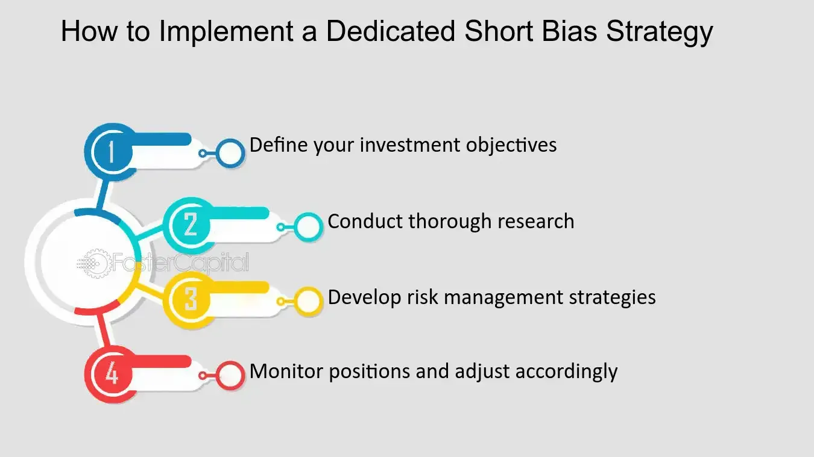

## Table of Contents

## What is a Dedicated Short Bias Strategy?

A Dedicated Short Bias Strategy is a way of investing where the main goal is to make money when the prices of stocks go down. People who use this strategy believe that the stock market or certain stocks will decrease in value. They do this by selling stocks they don't own, which is called short selling. If the stock price drops, they can buy it back at a lower price and make a profit from the difference.

This strategy is different from most investing strategies, where the goal is to buy stocks and make money when their prices go up. A dedicated short bias strategy is considered more risky because there's no limit to how much a stock's price can go up, which means potential losses can be very large. However, if someone is good at predicting when stock prices will fall, this strategy can be very rewarding.

## How does a Dedicated Short Bias Strategy differ from other investment strategies?

A Dedicated Short Bias Strategy is different from most other investment strategies because it focuses on making money when stock prices go down, not up. Most investors buy stocks hoping their prices will increase over time. But with a Dedicated Short Bias Strategy, investors sell stocks they don't own, a process called short selling. If the stock price drops, they buy it back at a lower price and keep the difference as profit. This approach is the opposite of the traditional "buy low, sell high" strategy.

This strategy is considered riskier than many other investment approaches. That's because when you short sell, your potential losses can be unlimited. If the stock price goes up instead of down, you have to buy it back at a higher price, which can lead to big losses. In contrast, other strategies like buying and holding stocks or investing in mutual funds usually have more predictable and limited downside risk. A Dedicated Short Bias Strategy is often used by investors who are very good at predicting when stock prices will fall and want to take advantage of those situations.

## What are the main objectives of using a Dedicated Short Bias Strategy?

The main goal of using a Dedicated Short Bias Strategy is to make money when stock prices go down. People who use this strategy think that certain stocks or the whole market will lose value. They do this by selling stocks they don't own, which is called short selling. If the stock price drops, they can buy it back at a lower price and make a profit from the difference.

This strategy is different because it focuses on making money from falling prices, not rising ones. Most investors buy stocks hoping they will go up in value over time. But with a Dedicated Short Bias Strategy, the aim is to predict when stock prices will fall and take advantage of those situations. It's a riskier approach because if the stock price goes up instead, the losses can be very big.

## Who typically uses a Dedicated Short Bias Strategy?

People who typically use a Dedicated Short Bias Strategy are often experienced investors or [hedge fund](/wiki/hedge-fund-trading-strategies) managers. They believe that certain stocks or the overall market will go down in value. These investors are good at spotting when stock prices might fall. They use short selling to make money from these falling prices. This strategy is not for everyone because it can be risky and requires a deep understanding of the market.

These investors might use this strategy as part of a bigger plan to manage risk or to balance out other investments that go up when the market goes up. They are willing to take on the high risk of short selling because they think the potential rewards are worth it. Not many people use this strategy because it's hard to predict when prices will fall, and the losses can be very big if they get it wrong.

## What are the key components of a Dedicated Short Bias Strategy?

The main part of a Dedicated Short Bias Strategy is short selling. This means selling stocks you don't own, hoping to buy them back later at a lower price. If the stock price drops, you make money from the difference. People who use this strategy think that certain stocks or the whole market will go down in value. They try to predict when this will happen and make money from it.

Another important part is risk management. Because short selling can lead to big losses if the stock price goes up, people using this strategy need to be careful. They might use tools like stop-loss orders to limit their losses. They also need to do a lot of research and analysis to find the right stocks to short sell. This strategy is not for everyone because it's hard to predict when prices will fall, and the risks are high.

## How do you identify stocks to short in a Dedicated Short Bias Strategy?

To identify stocks to short in a Dedicated Short Bias Strategy, investors first look at companies that might be in trouble. They check for signs like falling profits, high debt, or bad news about the company. They also look at the overall market and economy to see if there are reasons why certain stocks might go down. For example, if a whole industry is struggling, stocks in that industry might be good candidates for short selling.

Once they have a list of possible stocks, investors do more research. They look at financial reports, listen to what experts say, and use special tools to analyze the stock's price movements. They want to make sure the stock is likely to go down soon. This takes a lot of time and knowledge because it's hard to predict the future of a stock's price. But if they get it right, they can make money when the stock goes down.

## What are the risks associated with a Dedicated Short Bias Strategy?

Using a Dedicated Short Bias Strategy can be very risky. The biggest risk is that if the stock price goes up instead of down, you can lose a lot of money. When you short sell, you sell a stock you don't own and hope to buy it back cheaper later. But if the price goes up, you have to buy it back at a higher price, which means you lose money. There's no limit to how high a stock price can go, so your losses can be huge.

Another risk is that it's hard to predict when stock prices will fall. Even if you do a lot of research, you might still get it wrong. If you short sell a stock and it goes up, you might have to wait a long time for it to go down, and in the meantime, you're losing money. Also, if a lot of people are short selling the same stock, it can lead to a short squeeze. This happens when the stock price suddenly goes up because everyone is trying to buy back the stock at the same time to cut their losses.

## How can one manage and mitigate the risks of a Dedicated Short Bias Strategy?

To manage and reduce the risks of using a Dedicated Short Bias Strategy, it's important to be careful and do a lot of research. You need to study the companies you want to short sell, looking at their financial health, news about them, and what experts say. This helps you pick stocks that are more likely to go down in value. Also, setting stop-loss orders can help limit your losses. A stop-loss order tells your broker to buy back the stock if it goes up to a certain price, so you don't lose too much money if the stock price goes the wrong way.

Another way to manage risk is to not put all your money into one stock. Instead, spread it out over different stocks. This way, if one stock goes up and you lose money, you might still make money on the others that go down. It's also a good idea to keep an eye on the market and be ready to change your strategy if things don't go as planned. Using these methods can help you handle the risks of short selling, but remember, it's still a risky strategy and not for everyone.

## What historical performance data exists for Dedicated Short Bias Strategies?

Dedicated Short Bias Strategies have had mixed results over the years. During times when the stock market goes down a lot, like during the financial crisis in 2008, these strategies can do really well. Investors who shorted stocks made a lot of money because the market fell so much. But, these strategies don't always do well. In years when the stock market goes up, like in the long bull market from 2009 to 2020, Dedicated Short Bias Strategies often lose money. This is because it's hard to keep finding stocks that will go down when most stocks are going up.

Looking at specific data, the HFRI Short Bias Index, which tracks the performance of hedge funds that use Dedicated Short Bias Strategies, shows how these strategies have done over time. From 2000 to 2009, the index had an average yearly return of about 1.4%. But this number hides big ups and downs. In 2008, the index went up by over 40% because of the financial crisis. But in other years, like 2009, it lost over 20% as the market started to recover. This shows that while Dedicated Short Bias Strategies can be very profitable in the right conditions, they can also lead to big losses when the market goes up.

## How does market volatility affect a Dedicated Short Bias Strategy?

Market [volatility](/wiki/volatility-trading-strategies) can make a Dedicated Short Bias Strategy more risky but also more rewarding. When the market goes up and down a lot, it's harder to predict which way stock prices will go. This means that if you short sell a stock, it might go down like you hoped, but it could also go up suddenly and cause you to lose money. The big swings in price can make it tough to decide when to buy back the stock you shorted, and you might end up losing more than you planned.

On the other hand, high market volatility can also create more chances to make money with a Dedicated Short Bias Strategy. If you're good at spotting when stocks are about to drop, you can make big profits during times when the market is shaky. For example, during a market crash, stocks can fall fast, and if you shorted them at the right time, you could make a lot of money. So, while volatility adds risk, it can also lead to bigger rewards if you get your timing right.

## What advanced techniques can enhance the effectiveness of a Dedicated Short Bias Strategy?

To make a Dedicated Short Bias Strategy work better, you can use something called options. Options let you bet on whether a stock will go up or down without having to buy or sell the actual stock. With options, you can make money if the stock goes down, just like with short selling, but you can also limit how much you might lose. This can be really helpful because short selling can lead to big losses if the stock price goes up. By using options, you can set a limit on how much you're willing to lose, making the strategy safer.

Another way to improve a Dedicated Short Bias Strategy is by using a technique called pairs trading. This means you find two stocks that usually move together but you think one will go down more than the other. You short sell the one you think will go down more and buy the other one. If you're right, you make money from the difference in how much they go down. This can make your strategy less risky because you're not just betting on one stock going down; you're betting on how two stocks will move compared to each other. This can help you make money even if the market as a whole doesn't go down as much as you expected.

## How do regulatory environments impact the implementation of a Dedicated Short Bias Strategy?

Regulatory environments can affect how you use a Dedicated Short Bias Strategy. Different countries have different rules about short selling. Some places might make it hard to short sell by putting strict rules in place. For example, they might say you need to borrow the stock before you can short sell it, or they might ban short selling of certain stocks during times when the market is going down a lot. These rules can make it harder to use this strategy or limit how much money you can make from it.

Also, regulators might step in if they think short selling is causing problems in the market. They might put temporary bans on short selling or make new rules to control it. This can be a big deal for people using a Dedicated Short Bias Strategy because they need to keep up with these changes and adjust their plans. If the rules change a lot, it can make the strategy riskier and harder to use effectively.

## What is Algorithmic Trading in Short Selling?

Algorithmic trading harnesses the power of computer algorithms to streamline trading decisions through automation based on predefined criteria. This approach is particularly beneficial in the context of short selling, where timing and speed are crucial. By automating these processes, [algorithmic trading](/wiki/algorithmic-trading) minimizes the influence of human emotions and reduces the risk of impulsive decision-making.

One of the primary advantages of algorithmic trading in short selling is its ability to process and analyze large datasets efficiently, identifying potential short selling opportunities. Algorithms scan these datasets to detect overvalued assets that might be poised for price declines. This identification process relies on sophisticated statistical and [machine learning](/wiki/machine-learning) models designed to interpret complex market signals.

Statistical [arbitrage](/wiki/arbitrage) is a key technique utilized in algorithmic short selling. It involves the simultaneous buying and selling of securities to exploit pricing inefficiencies, ensuring minimal market risk. For example, an algorithm might identify two correlated stocks where one is temporarily mispriced relative to the other. By shorting the overvalued asset and going long on the undervalued one, the algorithm can profit from the convergence, assuming the prices eventually align.

Another crucial tool in this context is the Relative Strength Index (RSI), a [momentum](/wiki/momentum) oscillator used by algorithms to assess whether an asset is overbought or oversold. The RSI is calculated using the formula:

$$

\text{RSI} = 100 - \left(\frac{100}{1 + \text{RS}}\right)
$$

Where RS (Relative Strength) is the average of 'n' days' up closes divided by the average of 'n' days' down closes. An RSI value above 70 typically indicates an overbought condition, signaling a potential short selling opportunity. When the RSI crosses back below this threshold, it may suggest that the asset's price is poised for a downturn.

Python libraries such as NumPy and pandas are often used to calculate and analyze RSI values within algorithmic trading systems. Here is a simple Python script to calculate RSI:

```python
import pandas as pd

def calculate_rsi(data, window=14):
    # Compute price changes
    delta = data['Close'].diff()

    # Separate gains and losses
    gain = (delta.where(delta > 0, 0)).rolling(window=window).mean()
    loss = (-delta.where(delta < 0, 0)).rolling(window=window).mean()

    # Calculate the RSI
    rs = gain / loss
    rsi = 100 - (100 / (1 + rs))

    return rsi

# Example usage with a pandas DataFrame 'df'
df['RSI'] = calculate_rsi(df)
```

In summary, algorithmic trading in short selling leverages advanced statistical methods and indicators like RSI to identify and execute trading opportunities with precision. By reducing reliance on human intervention, algorithms can efficiently navigate the complexities of market downturns, enhancing the effectiveness of short selling strategies.

## References & Further Reading

For further insights into the topics of financial markets, algorithmic trading, and advanced investment strategies, it is beneficial to explore a variety of resources that offer both theoretical knowledge and practical applications. 

- **Financial Markets:**
  - *Books*: "A Random Walk Down Wall Street" by Burton Malkiel provides an accessible introduction to the workings of the financial markets and investment strategies. "Principles of Corporate Finance" by Richard A. Brealey, Stewart C. Myers, and Franklin Allen covers the theoretical underpinnings of financial decision-making.
  - *Online Courses*: Platforms such as Coursera and edX offer courses like "Financial Markets" by Yale University, which covers the basics of capital markets.
  - *Research Papers*: The Journal of Finance and Financial Analysts Journal publish scholarly articles on market dynamics and investment strategies.

- **Algorithmic Trading:**
  - *Books*: "Algorithmic Trading: Winning Strategies and Their Rationale" by Ernie Chan provides insights into quantitative trading strategies. "Quantitative Trading" by Ernest P. Chan is an excellent resource for practical algorithmic trading strategies.
  - *Software and Libraries*: Explore Python libraries such as Pandas, NumPy, and backtrader to develop and test trading algorithms. The following Python snippet demonstrates a simple moving average crossover strategy:

    ```python
    import pandas as pd

    # Assume `data` is a DataFrame with a 'Close' column
    data['SMA_50'] = data['Close'].rolling(window=50).mean()
    data['SMA_200'] = data['Close'].rolling(window=200).mean()

    data['Signal'] = 0
    data.loc[data['SMA_50'] > data['SMA_200'], 'Signal'] = 1
    data.loc[data['SMA_50'] < data['SMA_200'], 'Signal'] = -1
    ```

  - *Research Papers*: IEEE Xplore and ACM Digital Library contain papers on the latest technological advancements in algorithmic trading.

- **Advanced Investment Strategies:**
  - *Books*: "Dynamic Hedging" by Nassim Nicholas Taleb investigates into risk management and derivative trading strategies. "The Intelligent Investor" by Benjamin Graham provides foundational principles for intelligent investing.
  - *Journals*: The Journal of Portfolio Management and the Journal of Investment Strategies publish comprehensive studies on complex investment approaches.

Engaging with these resources will deepen your understanding of the nuanced landscape of financial strategies, offering both foundational knowledge and insights into cutting-edge techniques.

