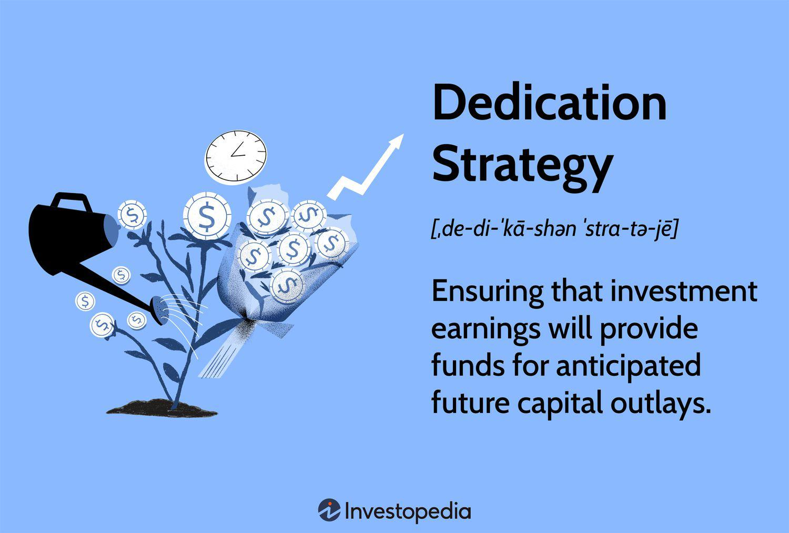

In financial planning and investment, dedication strategies and algorithmic trading represent a combination of structured asset management and advanced technological interventions. Dedication strategies are designed to match investment returns with projected liabilities, ensuring that future financial obligations are fulfilled with precision. They are particularly prevalent in conservative investment settings such as pension funds and insurance portfolios where long-term financial commitments must be matched with predictable cash flows.

Algorithmic trading, on the other hand, employs computer algorithms to execute trades, leveraging speed and data-driven insights to improve trading efficiency. This method minimizes human intervention, allowing trades to be executed based on pre-set criteria, which can dynamically respond to changing market conditions.



Together, these approaches offer a robust mechanism for diversifying investment portfolios. Dedication strategies provide a roadmap for predictable income through low-risk investments, while algorithmic trading enhances efficiency and adaptability. Integrating these methods allows investors to optimize their financial planning, achieving a harmonious balance between meeting current liabilities and maximizing potential investment returns. This article aims to articulate the infrastructural components of dedication strategies, their role in investment planning, and the synergistic role of algorithmic trading in achieving optimal financial outcomes.

## Table of Contents

## Understanding Dedication Strategies

Dedication strategy is an asset management approach that aligns investment returns with anticipated future liabilities. This method is widely used in managing pension funds and insurance portfolios, where the primary objective is to ensure that financial commitments are met as they arise. It is often synonymous with terms such as portfolio dedication and cash flow matching.

The core principle of dedication strategies is to construct a portfolio that reliably generates cash flows aligning with future liabilities. This involves selecting assets that provide a predictable income stream to cover financial obligations. Such investments are typically low-risk, favoring government and corporate bonds, which offer stable and consistent returns.

In practice, a dedication strategy involves identifying the timing and amount of future cash outflows required to meet liabilities. The investment is then structured to align its cash inflows with these future outflows. For example, if a pension fund predicts a need for $10 million five years from now, it would invest in bonds or other fixed-income securities that will mature to meet this amount at the specified time.

One of the critical advantages of this approach is its conservative nature. By aligning investments with specific future financial goals, the risk associated with market uncertainties is minimized. This creates a more predictable outcome for meeting future liabilities, making dedication strategy a preferred method for entities with defined financial commitments.

In summary, dedication strategies provide a structured method for aligning investments with future liabilities. Their focus on predictable income streams and cash flow matching makes them an effective tool for pension funds and insurers seeking to meet future obligations with minimal risk exposure.

## Components of Dedication Strategies

To effectively implement a dedication strategy in financial planning, a comprehensive understanding of future liabilities, whether personal or institutional, is crucial. At its core, this approach aims to align investment returns with anticipated financial obligations, ensuring that resources are available when needed. 

One primary method of achieving this alignment is through the creation of predictable income streams. These streams are generally derived from low-risk investments such as government bonds and high-quality corporate bonds. Such investments are favored due to their relatively stable returns and reliability over time, which are critical for meeting predetermined financial liabilities.

In the context of bonds, a dedication strategy often involves selecting bonds with maturity dates and cash flows that coincide with the financial obligations. For instance, if a fund knows it must make payments in five years, it would select bonds that mature at that time, ensuring the availability of funds without the need to reinvest or face [interest rate](/wiki/interest-rate-trading-strategies) risks.

The components of a dedication strategy also include carefully analyzing and projecting future cash flow needs. This includes evaluating the timing and magnitude of all anticipated outflows. By doing so, one can build a portfolio that specifically matches these cash flows, thereby minimizing the risks associated with market fluctuations or interest rate changes.

Moreover, understanding the components of dedication strategies aids in constructing a comprehensive financial roadmap. This roadmap serves as a guideline for directing investments and other financial activities to meet specific future needs efficiently. Investors or institutions that meticulously align their investment portfolios with their liability schedules can secure a more predictable financial future and avoid the unnecessary [volatility](/wiki/volatility-trading-strategies) that often comes with more aggressive investment strategies.

In conclusion, the components of dedication strategies revolve around matching fixed-income investments with future liabilities, requiring a deep understanding of these liabilities and methodical planning to ensure financial stability and predictability.

## Algorithmic Trading: An Overview

Algorithmic trading is a sophisticated method of executing trades using computer algorithms, which are programmed to follow a defined set of instructions for trading purposes. These algorithms determine various factors such as timing, price, or quantity, as well as follow systematic strategies for managing trading operations without the constant need for human intervention.

One of the primary advantages of [algorithmic trading](/wiki/algorithmic-trading) is its speed. By automating the trading process, algorithms can evaluate multiple market conditions and execute orders at a pace far superior to human capabilities. This enhanced speed facilitates the execution of orders at optimal prices, reducing the impact of market volatility.

Besides speed, algorithmic trading is known for its precision. The execution of trades based on pre-set criteria ensures that strategies are implemented consistently, minimizing human errors. This precision allows traders to execute large volumes of trades across different markets and asset classes simultaneously.

Algorithms also provide the ability to respond swiftly to market changes. As markets fluctuate, algorithms can adjust strategies in real-time, providing traders with a competitive edge. This adaptability enables handling complex market scenarios with greater accuracy, maintaining alignment with the trader's overall investment goals.

The widespread adoption of algorithmic trading is attributed to its capacity to enhance traditional investment strategies. Traders and institutional investors are increasingly integrating algorithmic trading into their portfolios to boost returns while maintaining risk management protocols. This method supports informed decision-making backed by data analytics and computational finance.

Algorithmic trading is powerful enough to manage large-scale investment portfolios, optimally allocating assets according to the defined strategies. Through [machine learning](/wiki/machine-learning) and advanced statistical models, algorithms can continuously improve and adapt to evolving market conditions.

In summary, algorithmic trading offers a model for executing trades that maximize efficiency, accuracy, and speed. Its integration into traditional financial practices transforms how large portfolios are managed, offering a dynamic approach to modern investment management.

## Integrating Dedication Strategy with Algo Trading

The integration of dedication strategies with algorithmic trading leverages algorithm-based approaches to enhance the predictability and efficiency of traditional asset management. This synergy involves utilizing advanced data-driven algorithms to manage and optimize dedication portfolios, particularly focusing on cash flow matching and risk mitigation. By incorporating algorithms, investors can precisely align their portfolios with future financial liabilities, ensuring more effective cash flow management.

Algorithmic trading aids in automating the investment process, thus reducing the manual effort and potential for human error. By constantly analyzing vast amounts of financial data, algorithms can swiftly adjust investment strategies in response to real-time market conditions. This approach not only helps in maintaining the integrity of dedication strategies but also allows for a proactive adaptation to market fluctuations. The regimented nature of algorithmic trading supports the systematic execution of trades, thereby reinforcing the dedication strategy's objective of meeting future financial obligations with certainty.

Moreover, the use of algorithms in dedication strategies provides a structured means of capturing market anomalies and opportunities that may be overlooked through conventional trade practices. These algorithms are programmed to assess risk factors and return prospects under various scenarios, making it feasible to anticipate potential deviations from expected investment paths.

For instance, an algorithm could be designed to execute bond purchases when interest rates fall below a specified threshold, ensuring that the portfolio aligns with liability schedules and provides expected returns. Here's a simplistic Python code snippet demonstrating the concept of executing such an algorithmic trade:

```python
def execute_trade(current_rate, rate_threshold, available_liquidity):
    if current_rate < rate_threshold:
        # Execute bond purchase using available liquidity
        purchase_amount = calculate_purchase(available_liquidity, current_rate)
        print(f"Executing purchase of bonds worth {purchase_amount} currency units.")
    else:
        print("Conditions not met for executing bond purchase.")

def calculate_purchase(liquidity, rate):
    return liquidity * rate

# Example usage
current_interest_rate = 0.02
desired_threshold = 0.025
portfolio_liquidity = 1000000  # Example liquidity

execute_trade(current_interest_rate, desired_threshold, portfolio_liquidity)
```

This integration also underscores the importance of maintaining a balance between technological reliance and strategic financial planning. While algorithmic systems offer significant advantages in terms of speed and accuracy, they require careful oversight to ensure alignment with the broader financial objectives inherent in a dedication strategy. However, when effectively implemented, this amalgamation of dedication strategies and algorithmic trading presents a robust framework for investors aiming to meet future liabilities with precision and adaptability.

## Benefits and Challenges

Combining dedication strategies with algorithmic trading offers several benefits that enhance the precision and efficiency of investment management. At the forefront, the primary advantage is the increased precision in meeting investment goals. This precision is achieved through automated adjustments that align with pre-defined criteria, allowing for timely and efficient responses to market conditions. By utilizing algorithmic trading, investors can execute trading strategies with minimal human intervention, thereby reducing errors and improving [liquidity](/wiki/liquidity-risk-premium) within the portfolio.

One prominent benefit of this integration is the ability to conduct real-time analysis and respond dynamically to market fluctuations. Algorithms can process vast amounts of data quickly and identify patterns or trends that may not be immediately visible to human traders. This capability enhances the decision-making process, leading to more informed investment choices and better alignment with future liabilities.

However, integrating dedication strategies with algorithmic trading also presents several challenges. One of the initial barriers is the need to adapt to new technologies. Investors and financial managers must invest time and resources in understanding complex algorithms and advanced trading systems. This adaptation phase may include training staff or hiring specialists who have expertise in [quantitative trading](/wiki/quantitative-trading) and programming.

Another challenge is the initial investment required to develop or purchase sophisticated algorithms. Developing custom algorithms demands significant financial resources and talented programmers who understand both the financial markets and coding intricacies. Additionally, there may be costs associated with acquiring high-performance computing systems necessary for rapid data processing and trade execution.

Despite these challenges, the potential long-term gains in portfolio performance and financial stability make overcoming these obstacles worthwhile. A well-implemented algorithmic system can lead to better risk management and portfolio optimization. Investors can experience enhanced returns on investment as the system continuously refines the strategy based on new data and insights.

In conclusion, while the initial transition to integrating dedication strategies with algorithmic trading may be demanding, the benefits of precision, efficiency, and improved financial outcomes justify the efforts. As technology and computational finance evolve, investors who embrace these advancements are likely to secure a more robust financial position and achieve their long-term investment objectives.

## Conclusion

Dedication strategies, combined with algorithmic trading, represent a powerful approach for investors aiming to meet future financial obligations with accuracy. This fusion allows investors to utilize the structured predictability of dedication strategies while benefiting from the efficiency and speed of algorithmic trading. By aligning future liabilities with predictable income streams through a calculated mix of low-risk investments, and automating these processes with advanced algorithms, investors can achieve a more robust portfolio management system.

The evolution of technology plays a significant role in this paradigm, presenting opportunities to harness computational finance in sophisticated ways. Algorithms facilitate real-time decision-making, enabling dynamic responses to market movements and enhancing portfolio resilience. This adaptability is essential in a landscape characterized by rapid financial innovations.

To adeptly employ these strategies, investors should focus on developing or acquiring advanced algorithmic tools that can seamlessly integrate with dedication strategies. This integration not only enhances precision in achieving set financial goals but also positions investors to capitalize on improved investment returns over time. Through leveraging technology and financial foresight, investors can create a more aligned and responsive investment framework, ensuring their portfolios are agile and well-prepared to meet future challenges.

## References & Further Reading

[1]: ["Advances in Financial Machine Learning"](https://www.amazon.com/Advances-Financial-Machine-Learning-Marcos/dp/1119482089) by Marcos Lopez de Prado

[2]: ["Evidence-Based Technical Analysis: Applying the Scientific Method and Statistical Inference to Trading Signals"](https://www.amazon.com/Evidence-Based-Technical-Analysis-Scientific-Statistical/dp/0470008741) by David Aronson

[3]: ["Machine Learning for Algorithmic Trading"](https://github.com/stefan-jansen/machine-learning-for-trading) by Stefan Jansen

[4]: ["Quantitative Trading: How to Build Your Own Algorithmic Trading Business"](https://www.amazon.com/Quantitative-Trading-Build-Algorithmic-Business/dp/1119800064) by Ernest P. Chan

[5]: Zakamulin, V. (2017). ["Market Timing with Moving Averages: The Anatomy and Performance of Trading Rules."](https://link.springer.com/book/10.1007/978-3-319-60970-6)