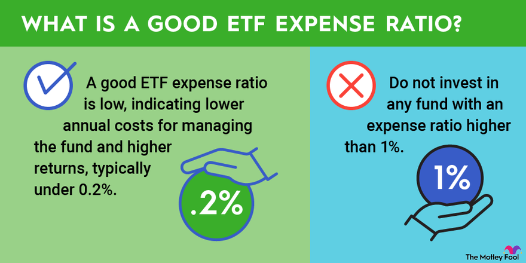

## Table of Contents

## What are ETFs and how do they work?

ETFs, or Exchange-Traded Funds, are a type of investment that tracks a basket of assets, like stocks, bonds, or commodities. They are similar to mutual funds but trade on stock exchanges like individual stocks. This means you can buy and sell ETFs throughout the day at market prices, just like you would with shares of a company.

When you invest in an ETF, you're essentially buying a small piece of many different assets at once. For example, if you buy an ETF that tracks the S&P 500, you're investing in all the companies in that index. This can help spread out your risk because your money isn't tied to the performance of just one company. ETFs are popular because they offer a simple and cost-effective way to diversify your investment portfolio.

## What are ETF fees and why are they important?

ETF fees are costs that you pay for owning an ETF. These fees are usually called the expense ratio, and they are a percentage of the money you have invested in the ETF. For example, if an ETF has an expense ratio of 0.10%, you will pay $10 per year for every $10,000 you have invested in that ETF. These fees are taken out of the ETF's assets, so they can affect how much money you make from your investment over time.

These fees are important because they can make a big difference in your investment returns. Even small differences in fees can add up over many years. If you are choosing between two similar ETFs, the one with the lower fee might help you keep more of your money in the long run. So, it's a good idea to look at the fees when you are deciding which ETFs to invest in.

## How are ETF fees typically structured?

[ETF](/wiki/etf-trading-strategies) fees are usually made up of the expense ratio, which is a yearly fee that's a small part of the money you have in the ETF. This fee covers the costs of running the ETF, like paying the people who manage it and other expenses. The expense ratio is shown as a percentage, so if an ETF has an expense ratio of 0.25%, you'll pay $25 every year for every $10,000 you have invested.

Sometimes, there can be other fees too, like trading fees when you buy or sell the ETF. These fees come from the place where you buy and sell your ETFs, like a brokerage. The trading fees can be different depending on where you trade and how much you're trading. It's good to know about all these fees because they can affect how much money you keep from your investment.

## What is the difference between expense ratios and other types of fees?

The expense ratio is a yearly fee that you pay for owning an ETF. It's a small percentage of the money you have invested in the ETF. This fee covers the costs of running the ETF, like paying the people who manage it and other expenses. For example, if an ETF has an expense ratio of 0.25%, you'll pay $25 every year for every $10,000 you have invested.

Other types of fees are usually related to buying or selling the ETF. These are called trading fees, and they come from the place where you buy and sell your ETFs, like a brokerage. The amount you pay for trading fees can be different depending on where you trade and how much you're trading. Unlike the expense ratio, which is taken out of the ETF's assets, trading fees are paid directly when you make a transaction.

Both types of fees can affect how much money you keep from your investment. The expense ratio is a continuous cost that you pay as long as you own the ETF, while trading fees are one-time costs that you pay each time you buy or sell. It's important to consider both when choosing and managing your investments.

## How can ETF fees impact long-term investment returns?

ETF fees can have a big effect on how much money you make from your investments over a long time. The expense ratio is a fee you pay every year just for owning the ETF. Even if it's small, like 0.10% or 0.25%, it adds up over many years. For example, if you invest $10,000 in an ETF with a 0.25% expense ratio, you'll pay $25 every year. Over 30 years, that's $750 just in fees. That money could have been growing in your investment instead, so lower fees can help you keep more of your money.

Trading fees are another thing to think about. These are costs you pay each time you buy or sell an ETF. If you trade a lot, these fees can add up quickly. For example, if you pay $5 every time you trade and you trade 10 times a year, that's $50 a year. Over 30 years, that's $1,500 in trading fees. Both kinds of fees can eat into your investment returns, so it's good to pick ETFs with low expense ratios and to keep trading fees in mind when you're deciding how often to buy and sell.

## What methods can investors use to find the fee information for an ETF?

Investors can find the fee information for an ETF by looking at the ETF's prospectus. This is a document that gives all the details about the ETF, including the expense ratio and any other fees. You can usually find the prospectus on the website of the company that manages the ETF. Just search for the ETF you're interested in, and there should be a section where you can download or view the prospectus.

Another easy way to find fee information is by using financial websites and apps. Websites like Morningstar, Yahoo Finance, or the website of your brokerage firm often have a section where they list all the important details about an ETF, including its fees. Just type in the name or ticker symbol of the ETF, and you'll see the expense ratio and any other fees right there. This makes it simple to compare different ETFs and pick the ones with the lowest fees.

## How do ETF fees compare to mutual fund fees?

ETF fees are often lower than mutual fund fees. ETFs usually have an expense ratio, which is a yearly fee you pay just for owning the ETF. This fee is often smaller than the expense ratio for mutual funds. For example, an ETF might have an expense ratio of 0.10%, while a similar mutual fund might have an expense ratio of 0.50% or even higher. This difference might seem small, but over many years, it can add up and affect how much money you keep from your investment.

Besides the expense ratio, both ETFs and mutual funds can have other fees like trading fees. With ETFs, you pay trading fees each time you buy or sell them, just like you do with stocks. Mutual funds might also have trading fees, but they can also have other fees like sales loads, which are fees you pay when you buy or sell the fund. These extra fees can make mutual funds more expensive than ETFs, especially if you're trading a lot. So, when you're choosing between ETFs and mutual funds, it's good to look at all the fees and see how they might affect your investment over time.

## Can ETF fees be tax-deductible, and if so, under what conditions?

ETF fees can be tax-deductible, but it depends on your situation. If you have an investment account that's not a retirement account, like a regular brokerage account, you might be able to deduct the expense ratio of your ETFs on your taxes. This is because the expense ratio is considered an investment expense. But, there are rules about how much you can deduct. For example, you can only deduct investment expenses if they add up to more than 2% of your adjusted gross income, and even then, you can only deduct the amount over that 2% limit.

Trading fees for ETFs might also be tax-deductible in some cases. If you're buying and selling ETFs in a regular brokerage account, the fees you pay to trade them could be considered part of your investment expenses. Just like with the expense ratio, these fees need to be more than 2% of your adjusted gross income to be deductible. It's a good idea to talk to a tax professional to make sure you're doing everything right and taking advantage of all the deductions you can.

## What strategies can be used to minimize the impact of ETF fees on investment portfolios?

One way to minimize the impact of ETF fees on your investment portfolio is to choose ETFs with low expense ratios. Since the expense ratio is a yearly fee you pay just for owning the ETF, [picking](/wiki/asset-class-picking) ones with lower fees can help you keep more of your money over time. You can find out the expense ratio by looking at the ETF's prospectus or using financial websites. Comparing different ETFs and picking the ones with the lowest fees can make a big difference in your long-term returns.

Another strategy is to trade less often. Every time you buy or sell an ETF, you might have to pay trading fees. If you trade a lot, these fees can add up quickly and eat into your investment returns. So, it's a good idea to think carefully before you trade and try to keep your trading to a minimum. This can help you save on fees and keep more of your money working for you in the long run.

Lastly, consider using tax-advantaged accounts like IRAs or 401(k)s for your ETF investments. In these accounts, you don't have to worry about paying taxes on your investment gains each year, which can help your money grow faster. Plus, the fees you pay for ETFs in these accounts might not be as important because you can't deduct them on your taxes anyway. By using these accounts, you can focus on growing your investments without worrying as much about the fees.

## How do different trading platforms and brokers handle ETF fee deductions?

Different trading platforms and brokers handle ETF fee deductions in their own ways. Some brokers might take the expense ratio directly out of the ETF's assets. This means you won't see the fee come out of your account, but it will still affect the value of your investment. Other brokers might show the expense ratio as a separate charge on your account statement. It's a good idea to check with your broker to see how they handle these fees so you know what to expect.

Trading fees are another thing to think about. When you buy or sell an ETF, some brokers might charge you a fee for each trade. This fee could be a flat amount, like $5 per trade, or it could be a percentage of the trade's value. Some brokers offer commission-free trading, which means you don't pay any fees when you buy or sell ETFs. Knowing how your broker handles trading fees can help you plan your investment strategy and keep more of your money.

## What are the regulatory requirements regarding the disclosure of ETF fees?

The rules about telling people about ETF fees come from places like the Securities and Exchange Commission (SEC) in the United States. ETFs have to show their fees clearly in a document called a prospectus. This document has to be easy for people to find on the website of the company that runs the ETF. The prospectus will tell you about the expense ratio, which is the yearly fee you pay just for owning the ETF, and any other fees you might have to pay.

Besides the prospectus, ETFs also have to share their fees in something called a summary prospectus. This is a shorter version of the prospectus that's easier to read and understand. It has to show the expense ratio and any other fees in a clear way. This helps people see all the costs before they decide to invest. If an ETF doesn't follow these rules, they could get in trouble with the SEC.

## How can advanced investors use fee analysis to optimize their ETF investment strategies?

Advanced investors can use fee analysis to pick the best ETFs for their portfolios. They look at the expense ratio, which is the yearly fee for owning an ETF, and compare it with other ETFs that track the same thing. If two ETFs are similar but one has a lower expense ratio, the investor might choose the one with lower fees. This is because even small differences in fees can add up over many years and affect how much money they make from their investments. They also pay attention to trading fees, which they pay each time they buy or sell an ETF. By trading less often and choosing ETFs with low trading fees, they can keep more of their money.

Another way advanced investors use fee analysis is by looking at how fees fit into their overall investment strategy. They might decide to put their money in ETFs with higher fees if those ETFs give them something special, like access to a unique market or better performance. But they always weigh the benefits against the costs. They also think about tax-advantaged accounts like IRAs or 401(k)s, where fees might not matter as much because they can't deduct them on their taxes. By understanding all the fees and how they work, advanced investors can make smart choices that help them reach their investment goals.

## What is the Importance of Fee Deduction in Investment Strategies?

Fee deduction is a critical aspect of investment strategies, as it directly impacts the net return on investments. Minimizing unnecessary costs allows investors to retain a larger portion of their returns, which is essential for long-term financial growth. One of the primary means by which investors can manage these fees is through careful selection of low-cost Exchange-Traded Funds (ETFs). By prioritizing investments with lower expense ratios, investors can enhance their returns over time.

Tax considerations are also integral to effective fee management in ETFs. Taxes can significantly erode the profits made from investments if not managed wisely. Tax-efficient investment strategies encompass various approaches, such as investing in tax-deferred accounts like IRAs or 401(k)s, where funds can grow tax-free until withdrawal. Moreover, investors can employ tax-loss harvesting, a method where losses from certain investments are strategically sold to offset gains elsewhere, effectively reducing the taxable income.

The impact of compounding fees over time can be underestimated by many investors. Consider an investment with an annual return of $r \%$ and an annual fee of $f \%$. If the initial investment is $P$, the future value can be calculated as:

$$
FV = P \times (1 + r - f)^t
$$

where $t$ represents the number of years the investment is held. Even a small reduction in fees can lead to significant differences in the future value of the investment, demonstrating why fee deduction warrants diligent attention.

Real-world examples illustrate the importance of effective fee management. For instance, consider two investors, each with an initial investment of $10,000. If Investor A chooses an ETF with a fee of 0.1% and Investor B selects an ETF with a 1% fee, with both receiving a gross annual return of 7% over 30 years, the ending balance for each would be vastly different. Calculating as follows:

- Investor A: 
$$
  FV = 10000 \times (1 + 0.07 - 0.001)^{30} \approx 74,522

$$

- Investor B:
$$
  FV = 10000 \times (1 + 0.07 - 0.01)^{30} \approx 57,434

$$

Investor A ends up with $17,088 more simply by minimizing fees, exemplifying how compounding fees can substantially erode returns if not carefully managed.

Such examples underscore the importance of fee management strategies in long-term wealth accumulation. Staying informed and employing prudent fee management strategies ensures investors can maximize their potential for financial success.

## References & Further Reading

[1]: Investment Company Institute. (2021). "Trends in the Expenses and Fees of Funds, 2020." [Link](https://www.ici.org/news-release/21_news_trends)

[2]: López de Prado, M. (2018). ["Advances in Financial Machine Learning."](https://www.amazon.com/Advances-Financial-Machine-Learning-Marcos/dp/1119482089) Wiley.

[3]: Chan, E. P. (2009). ["Quantitative Trading: How to Build Your Own Algorithmic Trading Business."](https://github.com/ftvision/quant_trading_echan_book) Wiley.

[4]: Jansen, S. (2020). ["Machine Learning for Algorithmic Trading."](https://github.com/stefan-jansen/machine-learning-for-trading) Packt Publishing.

[5]: Bodie, Z., Kane, A., & Marcus, A. J. (2014). ["Investments."](https://www.mheducation.com/highered/product/Investments-Bodie.html) McGraw-Hill Education.

[6]: Poterba, J. M., & Shoven, J. B. (2002). ["Exchange-Traded Funds: A New Investment Option for Taxable Investors."](https://economics.mit.edu/sites/default/files/publications/Exchange-Traded%20Funds%20A%20New%20Investment%20Option.pdf) National Bureau of Economic Research Working Paper Series.