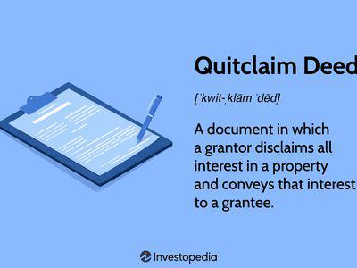

In today's fast-paced world, understanding the key concepts of legal documents, title deeds, and algorithmic trading is crucial for professionals and investors alike. This article aims to dissect these subjects individually and explore their interconnections, offering a comprehensive guide for both beginners and seasoned individuals. In the digital age, possessing concrete knowledge about title deeds in real estate and leveraging algorithms in trading is paramount due to their significant roles in the legal, financial, and technological landscapes.

Legal documents serve as the backbone of any transaction, ensuring that rights and obligations are clearly defined and upheld. Title deeds, in particular, are fundamental in real estate, providing the legal evidence required to assert ownership over a property. Understanding these documents is essential for ensuring compliance with legal standards and preventing disputes.



Algorithmic trading, on the other hand, leverages computer programs to automate trades, offering substantial advantages such as reduced transaction costs and minimized human error. As trading technologies advance, the incorporation of sophisticated algorithms becomes a powerful tool in financial markets. This article will highlight how these areas intersect and the impact of digital platforms on the synergy between legal documentation and algorithmic processes.

Join us to explore the intricacies of these pivotal topics and recognize why expertise in each domain represents a powerful skill set. A deep understanding of legal documents, title deeds, and algorithmic trading can empower individuals to thrive in an increasingly complex world.

## Table of Contents

## Understanding Legal Documents

Legal documents are fundamental in establishing and maintaining both legal and financial transactions. These documents provide clarity on the rights and obligations involved, which is crucial for ensuring that all parties are aligned and to prevent potential misunderstandings or disputes.

### Types of Legal Documents

There is a wide spectrum of legal documents, each serving specific purposes that cater to different aspects of law and commerce. Common types include contracts, wills, power of attorney, non-disclosure agreements (NDAs), and title deeds. Each document is crafted to address specific legal needs and comes with its own set of requirements and implications.

**Contracts** are among the most prevalent legal documents, used to formalize agreements between parties, whether they involve the provision of services, sale of goods, or collaboration on projects. The precision in language and stipulations ensures that all terms are comprehensively understood and enforceable.

**Wills** direct the distribution of an individual’s estate after their death, offering peace of mind that their personal wishes will be respected. The legal requirements for a valid will can vary significantly across different jurisdictions.

**Power of Attorney (PoA)** documents authorize an individual to act on behalf of another in legal or financial matters. This document is particularly useful in situations where the primary party is unable to act due to absence, illness, or incapacity.

**Non-Disclosure Agreements (NDAs)** protect sensitive information shared between parties, ensuring confidentiality and prescribing consequences for unauthorized disclosure.

### Importance of Title Deeds

A title deed is a specialized legal document that serves as evidence of property ownership, integral to the transfer of real estate assets. The title deed not only confirms ownership but also secures the owner's rights to use or modify the property as permitted by law. 

The significance of a title deed cannot be understated, as it includes vital details such as the legal description of the property, the name of the property owner, and any encumbrances, such as mortgages or liens. Ensuring the validity and accuracy of a title deed is essential in real estate transactions, as errors or omissions can lead to legal challenges or financial losses.

### Accuracy and Legalese

The accuracy of information and the use of legalese—specialized legal language—are critical in drafting legal documents. Legalese ensures that the document is both precise and enforces the intended meaning without ambiguity. However, it can often make documents difficult to understand for laypersons, hence the growing trend towards plain language legal documents to improve accessibility, while retaining legal robustness.

The drafting process requires meticulous attention to avoid errors, ambiguities, or omissions that could lead to disputes or render the document unenforceable. Engaging legal professionals in the drafting process is often essential, ensuring compliance with applicable laws and regulations.

### Conclusion

Understanding the various types of legal documents and their implications is paramount for compliance and safeguarding interests. This comprehension is particularly vital in real estate transactions involving title deeds, where the stakes are high and errors can be costly. Accurate documentation and a grasp of legalese are fundamental to the efficacy of legal documents, serving as a bedrock for preventing disputes and ensuring a smooth execution of legal intentions.

## Demystifying Title Deeds

A title deed is a fundamental legal document that confirms ownership of a property and plays a crucial role in real estate transactions. The importance of title deeds cannot be overstated as they establish legal ownership, laying the groundwork for buyers' and sellers' rights and obligations during property transfers.

Title deeds can vary in type, each carrying unique legal implications. The most common types include warranty deeds, quitclaim deeds, and special warranty deeds. A warranty deed offers the highest level of protection to the buyer, ensuring that the grantor holds a clear title to the property and has the right to sell it, free of any encumbrances, with a promise to defend against any future claims. Conversely, a quitclaim deed provides no such guarantees, merely transferring whatever interest the grantor may have in the property. Special warranty deeds, primarily used for commercial transactions, guarantee only against claims arising during the grantor’s ownership.

Transferring a title deed typically involves a legal process called conveyancing, which is crucial for the property's legal ownership to change hands effectively. This transfer process is backed by thorough due diligence, such as title searches and inspections, to ensure there are no outstanding claims or disputes on the property. Furthermore, the deed must be legally recorded in appropriate public records to provide constructive notice of the ownership change, ensuring transparency and safeguarding the interests of all parties involved.

For a title deed to be valid, it must contain specific information. Essential elements include the legal description of the property, identifying its precise geographical location and boundaries; the names of the grantor and grantee; the consideration clause, detailing the payment or value exchanged; and the operative words of conveyance, which explicitly state the intention to transfer ownership. Additionally, it must be signed by the grantor, and in many jurisdictions, it requires notarization and witnesses to be recognized legally.

Understanding the workings of title deeds is instrumental in protecting the interests of both buyers and sellers in real estate transactions. For buyers, a well-drafted deed confirms lawful ownership, facilitating secure property investments by ensuring the absence of hidden legal issues. Conversely, sellers are protected through the clear articulation of transfer conditions and liabilities, minimizing potential future claims or disputes. Proper handling of title deeds is an indispensable practice that not only preserves investment integrity but also fortifies legal trust in property ownership transactions.

In sum, title deeds are not just pieces of paper; they signify legal assurance and security in property ownership. By ensuring their accuracy and legality, individuals can successfully navigate real estate markets, protecting their investments and interests.

 to Algorithmic Trading

Algorithmic trading, often referred to as algo trading, utilizes computer programs to execute trades at speeds and frequencies that are impossible for human traders. Using predefined instructions involving variables such as time, price, and [volume](/wiki/volume-trading-strategy), these algorithms seek to capitalize on market inefficiencies with minimal human intervention.

### Principles of Algorithmic Trading

The core principle of [algorithmic trading](/wiki/algorithmic-trading) is the automation of trading decisions through mathematical and statistical models. Algorithms evaluate market data in real-time and execute trades based on the encoded strategy. Trading strategies can vary from simple executions, like a moving average crossover, to complex high-frequency trading models that exploit minute price discrepancies. 

**Example of a Simple Moving Average Strategy:**

A basic moving average strategy might involve buying a stock when its shorter-term moving average crosses above its longer-term moving average. This buy signal suggests upward [momentum](/wiki/momentum).

```python
# Python code for Moving Average Crossover Strategy

import numpy as np
import pandas as pd

# Assume 'data' is a DataFrame with a 'Close' column for closing prices
short_window = 40
long_window = 100

signals = pd.DataFrame(index=data.index)
signals['signal'] = 0.0

# Create short simple moving average
signals['short_mavg'] = data['Close'].rolling(window=short_window, min_periods=1, center=False).mean()

# Create long simple moving average
signals['long_mavg'] = data['Close'].rolling(window=long_window, min_periods=1, center=False).mean()

# Create signals
signals['signal'][short_window:] = np.where(signals['short_mavg'][short_window:] 
                                          > signals['long_mavg'][short_window:], 1.0, 0.0)   

signals['positions'] = signals['signal'].diff()
```

### Advantages of Algorithmic Trading

Algorithmic trading offers numerous advantages. First, algorithms can process complex datasets rapidly, identifying trading opportunities much faster than human traders could. This speed reduces latency in executing trades, which can lower transaction costs and improve the overall efficiency of the trading process. By automating decision-making, algorithmic trading also reduces human errors arising from emotional and psychological influences.

Moreover, these systems can back-test trading strategies on historical data to optimize and validate them before deployment. This reduces uncertainty and enhances the likelihood of achieving desired results.

### Risks and Challenges

However, algorithmic trading is not without its challenges and inherent risks. The complexity of designing effective algorithms requires a high level of expertise in programming and a deep understanding of financial markets. Poorly designed algorithms can result in significant financial losses, especially in the volatile conditions of financial markets.

Additionally, algorithmic trading can contribute to market instability. Events like the 2010 Flash Crash, where the Dow Jones Industrial Average declined more than 1,000 points within minutes, highlight potential systemic risks.

Regulatory challenges also exist, as financial authorities continue to develop frameworks to oversee algorithms that could manipulate markets or create unfair advantages. Compliance with these evolving regulations is essential for participants in algorithmic trading.

In summary, while algorithmic trading offers significant benefits in terms of speed and efficiency, it is imperative for traders and firms to address its risks and challenges to harness its full potential.

## The Intersection of Legal Documents and Algo Trading

The relationship between legal documents and algorithmic trading has become increasingly significant with the rise of digital trading platforms. Legal agreements are paramount for algorithmic traders as they lay the groundwork for trading terms and protect the interests of the involved parties. These documents typically encompass contracts between traders and brokerages, service agreements with technology providers, and compliance documents with regulatory bodies.

Ensuring legal compliance in algorithmic trading involves adhering to multiple layers of regulatory standards. Regulations such as the European Union's Markets in Financial Instruments Directive II (MiFID II) and the U.S. Securities and Exchange Commission (SEC) rules govern the operational aspects of algorithmic trading. These regulations mandate transparency, risk management, and fair trading practices. Failure to adhere to these legal standards can lead to substantial penalties and reputational damage for traders and firms [1].

The evolving landscape of legal frameworks significantly impacts algorithmic trading practices. For instance, MiFID II requires detailed reporting and increased transparency, influencing how trading algorithms are developed and executed. Similarly, the General Data Protection Regulation (GDPR) has implications for data management within trading systems. Algorithmic traders must navigate these legal frameworks to ensure compliance while optimizing trading strategies [2].

In conclusion, legal documents and regulatory compliance are integral to the effectiveness and integrity of algorithmic trading. Traders must diligently craft and adhere to legal agreements to facilitate smooth operations and safeguard their interests. As legal standards evolve, staying informed and adaptable remains crucial for thriving in this dynamic industry.

---

[1] Financial Conduct Authority. (n.d.). Algorithmic Trading Compliance in the UK. Retrieved from [FCA Website](https://www.fca.org.uk/)

[2] European Securities and Markets Authority. (n.d.). MiFID II Overview. Retrieved from [ESMA Website](https://www.esma.europa.eu/)

## Strategy for Effective Management and Integration

To expertly manage both legal document creation and algorithmic trading strategies, a robust understanding of integration and comprehension is crucial. The synthesis of these domains requires actionable steps to optimize outcomes in both legal documentation processes and the implementation of algorithmic trading.

Firstly, an effective legal documentation process revolves around precision, compliance, and adaptability. It involves detailed drafting, reviewing, and updating of legal documents to reflect current regulations and client needs. Employing specialized software tools, such as document automation platforms, can enhance efficiency by reducing manual errors and standardizing document templates. Such platforms facilitate swift amendments and ensure that documents consistently meet regulatory standards.

Incorporating algorithmic trading into financial strategies demands a sharp understanding of both technical and market-based elements. Algorithmic trading involves the use of automated systems to execute trades at speeds and frequencies unimaginable to a human trader. These systems rely on pre-defined criteria, which can include mathematical models, statistical analyses, or [machine learning](/wiki/machine-learning) algorithms. A key component to successful algorithmic trading is [backtesting](/wiki/backtesting) strategies using historical data to validate the effectiveness of these algorithms before deploying them in live markets. Here is a basic Python example of a simple moving average crossover strategy:

```python
import numpy as np
import pandas as pd

# Sample historical price data
data = pd.read_csv('historical_prices.csv')
data['SMA_50'] = data['Close'].rolling(window=50).mean()
data['SMA_200'] = data['Close'].rolling(window=200).mean()

def trading_signals(data):
    data['Signal'] = 0
    data['Signal'][50:] = np.where(data['SMA_50'][50:] > data['SMA_200'][50:], 1, -1)
    data['Position'] = data['Signal'].diff()
    return data

data = trading_signals(data)
```

Understanding regulatory compliance and technological advancements is pivotal for developing a comprehensive strategy in any digital transaction space. Regulatory compliance ensures that all trading activities and documentation adhere to existing laws and guidelines, safeguarding against legal disputes and potential financial penalties. Staying informed about changes in regulations is essential, which can be achieved through continuous professional education, attending industry conferences, or participating in webinars and workshops.

Moreover, fostering a culture of continuous learning and adaptability is essential given the fast-paced evolution of both legal and trading technologies. Legal professionals and algo traders must actively seek updates through industry publications, online courses, and peer networks to remain competitive and compliant.

In conclusion, expertly managing the integration of legal documentation and algorithmic trading strategies requires a thorough understanding of both domains, supported by actionable processes and continuous education. By embracing technological tools and maintaining regulatory awareness, professionals can optimize operations, ensuring not only compliance but also a strategic advantage in rapidly evolving markets.

## Conclusion

A thorough understanding of legal documents, title deeds, and algorithmic trading is invaluable in today's digitally-driven market. Each of these components serves a vital function within their respective domains—legal, real estate, and financial markets—providing foundational support that ensures reliability and efficiency. The article outlined the basic principles of legal documents including title deeds, establishing how they safeguard property ownership and define rights and responsibilities. It further illuminated the nature of algorithmic trading, emphasizing its capacity to enhance trading efficiency and accuracy through automation.

The interconnected nature of these elements signifies the importance of a multifaceted approach to professional development. Competence in handling legal documentation complements the technological acumen required for algorithmic trading, especially as digital platforms continue to merge these disciplines. Legal agreements in trading contexts ensure compliance and protect interests, illustrating the necessity for integrated knowledge across these sectors.

As the landscape continues to evolve, it is crucial to remain informed about ongoing changes and advancements. Both the legal frameworks governing real estate and the technological innovations within trading are subject to frequent updates. Engaging continuously with these changes will empower individuals to adapt effectively, enhancing their ability to navigate challenges and leverage new opportunities.

Future exploration and mastery of these concepts can lead to substantial professional and personal growth. By deepening expertise in legal and technological domains, individuals can position themselves strategically within ever-changing industries. Such mastery not only enhances marketability but also contributes to informed decision-making and strategic planning, driving success in both career and investments.

## References & Further Reading

[1]: Financial Conduct Authority. (n.d.). ["Algorithmic Trading Compliance in the UK."](https://www.fca.org.uk/publications/multi-firm-reviews/algorithmic-trading-compliance-wholesale-markets)

[2]: European Securities and Markets Authority. (n.d.). ["MiFID II Overview."](https://www.esma.europa.eu/trading/mifid-ii-and-mifir-review)

[3]: Bergstra, J., Bardenet, R., Bengio, Y., & Kégl, B. (2011). ["Algorithms for Hyper-Parameter Optimization."](https://proceedings.neurips.cc/paper/2011/file/86e8f7ab32cfd12577bc2619bc635690-Paper.pdf) Advances in Neural Information Processing Systems 24.

[4]: ["Advances in Financial Machine Learning"](https://www.amazon.com/Advances-Financial-Machine-Learning-Marcos/dp/1119482089) by Marcos Lopez de Prado

[5]: ["Evidence-Based Technical Analysis: Applying the Scientific Method and Statistical Inference to Trading Signals"](https://www.amazon.com/Evidence-Based-Technical-Analysis-Scientific-Statistical/dp/0470008741) by David Aronson

[6]: ["Machine Learning for Algorithmic Trading"](https://github.com/stefan-jansen/machine-learning-for-trading) by Stefan Jansen

[7]: ["Quantitative Trading: How to Build Your Own Algorithmic Trading Business"](https://www.amazon.com/Quantitative-Trading-Build-Algorithmic-Business/dp/1119800064) by Ernest P. Chan