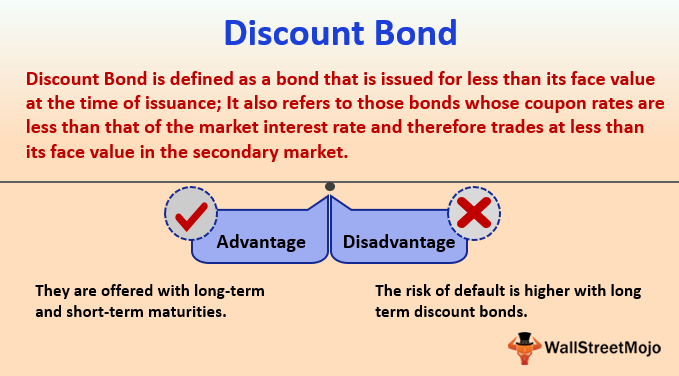

Financial instruments, particularly bonds, have long been foundational components of investment portfolios, offering stability and predictable returns. However, the advent of algorithmic trading has significantly transformed traditional investment strategies, introducing greater efficiency and scope in how fixed income securities are traded. Bonds, including niche types such as deep-discount bonds, offer distinct opportunities and pose specific challenges for investors. 

Deep-discount bonds, typically trading well below their par value, attract investors seeking higher yields, albeit with potentially higher risks due to factors such as issuer credit concerns. This category of bonds underscores the complexities and nuances inherent in fixed income investments. Algorithmic trading, on the other hand, leverages sophisticated computer algorithms to execute trades at speeds and volumes beyond human capability, optimizing the investment process. This technological advancement enhances liquidity in the bond markets, facilitates transparency, and aids in accurate price discovery.



The synthesis of these financial instruments with cutting-edge technology has thus reshaped the landscape of investment strategies. This article will focus on understanding the mechanisms of bonds, particularly deep-discount bonds, and exploring how algorithmic trading is integrated into bond markets to improve trading efficiency and outcomes. Through this examination, investors and firms can gain insights into balancing innovation with risk management in the evolving arena of fixed income securities.

## Table of Contents

## Understanding Financial Instruments: Bonds

Bonds are essential financial instruments that serve as a cornerstone for stable, long-term investment strategies. They are debt securities issued by entities such as governments, corporations, and municipalities to raise capital. By purchasing a bond, an investor essentially lends money to the issuer in exchange for periodic interest payments, and the eventual repayment of the principal amount upon maturity.

### Types of Bonds

1. **Government Bonds**: These are issued by national governments and are generally considered low risk due to the ability of governments to raise taxes or print currency to meet their debt obligations. They offer lower yields compared to other bond types, but provide high security. Examples include U.S. Treasury bonds and U.K. Gilts.

2. **Corporate Bonds**: Issued by corporations, these bonds typically offer higher yields than government bonds as compensation for greater risk. The issuer’s financial health and credit rating significantly influence the bond’s risk and return profile.

3. **Deep-Discount Bonds**: These bonds trade at prices significantly below their par value. Reasons may include issuer credit concerns or the bond's structure as a zero-coupon bond, which pays no periodic interest. Instead, deep-discount bonds appreciate in value over time and pay the par value at maturity.

### Investment Benefits and Risks

Bonds are integral to investment portfolios for several reasons. They provide a predictable income stream through regular interest payments, which can stabilize cash flow for investors. The fixed nature of bond returns makes them an attractive diversification tool, helping to spread risk across asset classes. Furthermore, bonds typically experience lower [volatility](/wiki/volatility-trading-strategies) compared to equities, which can protect portfolio value during stock market downturns.

However, bonds also come with their own sets of risks. Interest rate fluctuations can affect bond prices inversely, leading to capital losses if interest rates rise. Credit risk is another consideration, particularly for corporate and deep-discount bonds, where the issuer's ability to make timely interest and principal payments must be evaluated. Inflation can erode the real value of the fixed interest payments over time, further complicating returns.

In summary, bonds are fundamental securities that cater to the need for stable and predictable returns. Their diverse types, including government, corporate, and deep-discount, offer varying degrees of risk and return, making them a versatile component in diversified investment portfolios.

## Exploring Deep-Discount Bonds

Deep-discount bonds are a specific class of bonds that trade for at least 20% below their face value. This significant discount often results from the perceived high risk associated with the issuer's creditworthiness or the bond's structure as a zero-coupon bond. Zero-coupon bonds do not pay periodic interest and are instead issued at a deep discount, maturing at par value.

Investors are often drawn to deep-discount bonds due to their potential for high returns. The substantial difference between the purchase price and the par value at maturity can offer appealing capital gains, assuming the issuer does not default. Additionally, these bonds can serve as a tool for portfolio diversification. By including deep-discount bonds, investors may balance other, more stable investment types with potentially higher-yield opportunities.

The primary differences between standard bonds and deep-discount bonds revolve around yield expectations and issuer credit ratings. Standard bonds typically offer periodic interest payments and trade closer to their face value, reflecting market interest rates for similar credit risk levels. In contrast, deep-discount bonds usually have higher yield expectations due to the price at which they trade and their inherent risk. Issuer credit ratings tend to be lower for deep-discount bonds, which makes them susceptible to credit risk concerns that might affect their trading price.

Understanding the risks associated with deep-discount bonds is essential for investors. The key risk factors include credit risk—the possibility that the bond issuer may default on its obligations—and [interest rate](/wiki/interest-rate-trading-strategies) risk, which may affect the market price of the bond before maturity. Investors should carefully evaluate whether the potential returns justify these risks and consider their overall portfolio strategy and risk tolerance.

In conclusion, while deep-discount bonds can provide high-yield opportunities and diversification benefits, they come with unique risks that require thorough assessment. Ensuring an informed investment decision involves balancing these risks against potential returns within the context of an investor’s broader financial goals.

## Algorithmic Trading in Bond Markets

Algorithmic trading employs sophisticated computer algorithms to automate and optimize trading activities across various financial markets. Though traditionally dominant in equities, its adoption in bond markets has been increasing due to advancements in data processing and trading efficiency. These advancements facilitate rapid analysis of vast datasets, crucial for making informed trading decisions.

Algorithmic trading enhances [liquidity](/wiki/liquidity-risk-premium) in bond markets by enabling faster execution of trades, thus reducing the bid-ask spread and making it easier for buyers and sellers to find a counterparty. This increase in liquidity contributes to enhanced market transparency, as a larger number of transactions provides more data points for price discovery, leading to more accurate reflections of market conditions.

The success of [algorithmic trading](/wiki/algorithmic-trading) in bond markets heavily relies on technological innovations, such as [artificial intelligence](/wiki/ai-artificial-intelligence) (AI) and cloud computing. AI, through [machine learning](/wiki/machine-learning) algorithms, can identify patterns and trends within bond market data, thereby improving trading strategies and decision-making processes. Cloud computing offers scalable resources that facilitate the processing and analysis of large volumes of data without the need for significant on-premises infrastructure, allowing firms to implement sophisticated algorithms with greater speed and efficiency.

These technologies not only streamline trading operations but also support the development of more complex trading algorithms capable of adjusting in real-time to market fluctuations. As a result, firms can execute a larger [volume](/wiki/volume-trading-strategy) of trades more quickly while maintaining a competitive edge. The integration of these technological advancements into bond trading strategies enhances the overall efficiency and effectiveness of the fixed income markets.

## Challenges and Innovations in Algorithmic Bond Trading

Automating bond trading presents unique challenges, primarily due to data fragmentation and market complexity. Bond markets are typically more opaque than equity markets, with trades often conducted over-the-counter (OTC) rather than on centralized exchanges. This results in dispersed data across various platforms, making it difficult for algorithms to access comprehensive market information. Fragmented data hinders price discovery and reduces trading efficiency, posing significant barriers to effective algorithmic trading.

Despite these challenges, technological advancements are playing a critical role in transforming bond trading. Improved data aggregation technologies help consolidate information from disparate sources, enhancing market transparency and access. Advanced data analytics tools enable traders to synthesize vast amounts of data, facilitating more informed decision-making processes.

Artificial intelligence (AI) and machine learning have become central to crafting innovative trading strategies. These technologies analyze historical and real-time data to identify patterns, predict market movements, and optimize trade execution. Machine learning algorithms can adapt to changing market conditions, continuously refining strategies to capitalize on emerging opportunities.

The integration of AI into bond trading strategies can be illustrated by considering a simple machine learning model that predicts bond price movements. For example, using Python, a logistic regression model might be employed to determine the probability of a bond's price increasing based on historical data:

```python
from sklearn.model_selection import train_test_split
from sklearn.linear_model import LogisticRegression
import pandas as pd

# Sample data frame 'data' with historical bond features and price direction
data = pd.read_csv('bond_data.csv')
X = data[['feature1', 'feature2', 'feature3']]  # Example features
y = data['price_direction']  # Target variable: price up(1) or down(0)

# Splitting the data
X_train, X_test, y_train, y_test = train_test_split(X, y, test_size=0.2, random_state=42)

# Logistic Regression Model
model = LogisticRegression()
model.fit(X_train, y_train)

# Model accuracy
accuracy = model.score(X_test, y_test)
print(f'Model Accuracy: {accuracy:.2f}')
```

Such models exemplify how firms utilize AI to enhance trading strategies, improving accuracy and decision-making speed. The ability to process and analyze extensive datasets rapidly allows firms to implement advanced algorithms capable of outperforming traditional trading methods.

For firms to stay competitive in the evolving bond trading landscape, substantial investments in technology development are necessary. These investments include acquiring sophisticated trading platforms, implementing robust data processing infrastructure, and hiring skilled personnel proficient in AI and data science. As technological innovations continue to reshape financial markets, firms must balance technological adoption with effective risk management strategies to navigate regulatory pressures and market volatility.

Ultimately, while the bond trading sector faces inherent challenges, the adoption of cutting-edge technology offers substantial potential benefits. By leveraging AI and machine learning, firms can transform these challenges into opportunities, optimizing trading efficiency and strategy resilience against market fluctuations.

## The Future of Fixed Income Markets

The integration of algorithmic trading within fixed income markets is expected to bring substantial transformations. These advancements promise several potential benefits, notably in the areas of enhanced efficiency, liquidity, and regulatory compliance. Efficiency gains can be achieved through the reduction of transaction costs and faster trade execution. Algorithmic trading systems are capable of analyzing vast data sets and executing trades at a speed and precision unattainable by human traders. This speed not only improves efficiency but also enhances liquidity, ensuring that buyers and sellers can transact more freely in the market without causing significant price changes.

Liquidity is further increased through enhanced market-making capabilities, where algorithms facilitate continuous buy and sell orders that stabilize market fluctuations. As liquidity improves, the bid-ask spreads typically narrow, resulting in more competitive pricing for market participants. Additionally, algorithms can assist in more effective regulatory compliance by providing detailed audit trails and ensuring trades adhere to regulatory standards, thus minimizing the risks of non-compliance.

To maintain competitiveness, firms and investors must adapt to these technological advancements. This adaptation involves investing in infrastructure, developing new skills, and revising investment strategies to leverage algorithmic systems effectively. As technology evolves, organizations must keep abreast of trends and innovations to identify opportunities and threats. Firms should foster a culture of continuous learning and adaptation, encouraging employees to acquire skills related to data analytics, programming, and risk management.

Balancing technological innovation with risk management is crucial in the dynamically changing landscape of fixed income markets. While algorithmic trading offers numerous advantages, it also poses risks such as system failures, market manipulation, and increased volatility. Effective risk management strategies should be implemented to mitigate these challenges. These strategies include robust testing of trading algorithms, monitoring of trade executions, and setting appropriate risk parameters to prevent unintended consequences.

In conclusion, the future of fixed income markets will be significantly shaped by algorithmic trading and technological advancements. Firms and investors who successfully navigate these changes by optimizing their strategies and managing associated risks responsibly will be well-positioned to maximize the benefits of this integration. As the landscape continues to evolve, ongoing exploration and adaptation are vital for ensuring sustainable success in the fixed income sector.

## Conclusion

Algorithmic trading is reshaping bond markets by offering enhanced efficiency and improved investment outcomes. The automation of trading activities through advanced algorithms optimizes transaction processes, reduces latency, and increases the precision of trades. This shift not only allows for rapid execution but also facilitates comprehensive analysis of vast datasets, supporting better decision-making.

Embracing technology while managing associated risks is crucial for sustainable success. The integration of algorithmic trading involves dealing with challenges such as market volatility and technological glitches. To mitigate these risks, firms must implement robust risk management strategies and maintain high standards of regulatory compliance. Proper oversight ensures that algorithms operate as intended and do not contribute to adverse market behaviors.

The future of fixed income markets lies in leveraging technological innovations responsibly. Innovations such as artificial intelligence and machine learning offer significant potential to enhance the capabilities of algorithmic trading. By incorporating predictive analytics and automated learning systems, firms can further refine their trading strategies and improve market responsiveness. However, it is essential that these technologies are deployed thoughtfully to avoid unintended consequences.

Continued exploration and adaptation are essential for maximizing the benefits of this integration. Financial markets are dynamic, and the continuous evolution of technology presents both opportunities and challenges. To remain competitive, market participants must foster a culture of innovation, investing in new technologies and refining their approaches to algorithmic trading. This ongoing process of adaptation and learning will be key to unlocking the full potential of algorithmic trading in the bond markets, fostering a more efficient and resilient financial ecosystem.

## References & Further Reading

[1]: Fabozzi, F. J. (2021). ["Bond Markets, Analysis, and Strategies"](https://books.google.com/books/about/Bond_Markets_Analysis_and_Strategies_ten.html?id=bQpNEAAAQBAJ) (9th ed.). Pearson.

[2]: Lopez de Prado, M. (2018). ["Advances in Financial Machine Learning"](https://www.amazon.com/Advances-Financial-Machine-Learning-Marcos/dp/1119482089). Wiley.

[3]: Jansen, S. (2018). ["Machine Learning for Algorithmic Trading: Predictive models to extract signals from market and alternative data for systematic trading strategies with Python"](https://www.amazon.com/Machine-Learning-Algorithmic-Trading-alternative-ebook/dp/B08D9SP6MB). Packt Publishing.

[4]: Chan, E. P. (2009). ["Quantitative Trading: How to Build Your Own Algorithmic Trading Business"](https://github.com/ftvision/quant_trading_echan_book). Wiley.

[5]: Aronson, David R. (2007). ["Evidence-Based Technical Analysis: Applying the Scientific Method and Statistical Inference to Trading Signals"](https://www.amazon.com/Evidence-Based-Technical-Analysis-Scientific-Statistical/dp/0470008741). Wiley.

[6]: Haugh, M. (2016). ["Optimization Methods in Finance"](https://assets.cambridge.org/97811070/56749/frontmatter/9781107056749_frontmatter.pdf). Springer. (For understanding the quantitative techniques used in algorithmic trading and financial analysis).

[7]: Koller, T., Goedhart, M. H., & Wessels, D. (2010). ["Valuation: Measuring and Managing the Value of Companies"](https://www.wiley.com/en-us/Valuation%3A+Measuring+and+Managing+the+Value+of+Companies%2C+7th+Edition-p-9781119610885) (5th ed.). Wiley Finance Series. (Covers valuation techniques for various financial instruments, including bonds).