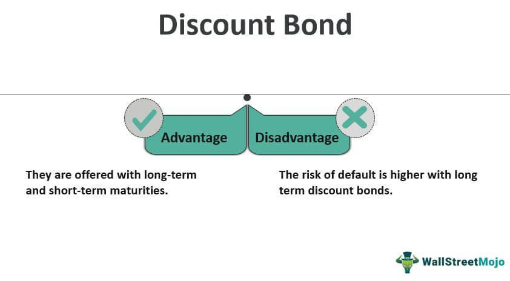

## Table of Contents

## What are deep-discount bonds?

Deep-discount bonds are a type of bond that is sold at a price much lower than its face value. The face value, or the amount the bond will be worth at maturity, is usually much higher than the price you pay when you buy the bond. This means that if you hold onto the bond until it matures, you will get a big return on your investment. These bonds are often issued by governments or big companies and are a way for them to raise money.

Because deep-discount bonds are sold at such a low price, they don't usually pay interest along the way like regular bonds do. Instead, the big profit comes when the bond reaches its maturity date and you get the full face value. This makes them a good choice for people who are willing to wait for a big payoff later, rather than getting smaller payments over time. However, like all investments, they come with risks, so it's important to understand them before buying.

## How do deep-discount bonds differ from regular bonds?

Deep-discount bonds and regular bonds are both ways for people to invest money, but they work a bit differently. A regular bond usually pays you interest every year or every six months until it matures. This means you get some money back regularly while you wait for the bond to reach its full value at the end. On the other hand, a deep-discount bond is sold for much less than its face value, and it doesn't pay you any interest along the way. Instead, the big payoff comes when the bond matures, and you get the full face value, which is much more than what you paid for it.

Because deep-discount bonds don't pay interest, they can be a good choice if you're okay with not getting any money until the bond matures. This can be a long time, sometimes many years. Regular bonds might be better if you need some money coming in regularly. Also, deep-discount bonds are often sold at a bigger discount, which means the potential for a bigger profit at the end, but it also means you need to be comfortable waiting and taking on more risk. Regular bonds might be safer but usually offer smaller returns over time.

## What are the key features of deep-discount bonds?

Deep-discount bonds are sold for a lot less than what they will be worth when they mature. This means you pay a small price upfront, but you get a big payoff at the end. For example, you might buy a bond for $500 that will be worth $1,000 when it matures. Because they are sold at such a big discount, these bonds don't pay you any interest while you wait. The whole idea is to make money from the difference between what you paid and what you get at the end.

These bonds are usually issued by governments or big companies to raise money. They can be a good choice if you're okay with waiting a long time for your money to grow. But, like all investments, they come with risks. If the company or government that issued the bond runs into trouble, you might not get the full amount you were promised. So, it's important to think about how long you can wait and how much risk you're willing to take before buying a deep-discount bond.

## Who typically issues deep-discount bonds?

Deep-discount bonds are usually issued by governments or big companies. Governments might use them to raise money for things like building roads or schools. Companies might issue them to get money for expanding their business or doing other big projects. These bonds help them get the money they need without having to pay interest along the way.

When a government or company decides to issue a deep-discount bond, they sell it for a lot less than what it will be worth at the end. This means people who buy the bond can make a big profit if they hold onto it until it matures. But, it also means they have to wait a long time to get their money back, and there's a risk that the government or company might not be able to pay up at the end.

## What are the advantages of investing in deep-discount bonds?

One big advantage of investing in deep-discount bonds is that you can make a lot of money if you hold onto them until they mature. You buy the bond for a low price, and when it reaches its maturity date, you get back a much higher amount. This can be a good way to grow your savings over time, especially if you don't need the money right away and can wait for the big payoff at the end.

Another advantage is that deep-discount bonds don't pay interest along the way, which means you don't have to worry about taxes on interest payments every year. This can be a big plus if you want to keep your tax bill low. Plus, since these bonds are often issued by governments or big companies, they can be seen as a safe way to invest your money, as long as you trust that the issuer will be able to pay you back when the bond matures.

## What are the risks associated with deep-discount bonds?

One big risk with deep-discount bonds is that the company or government that issued them might not be able to pay you back when the bond matures. If the issuer runs into financial trouble, you could lose your investment. This means you need to think carefully about who you're trusting with your money. It's important to check if the issuer is reliable and likely to be around when your bond matures.

Another risk is that deep-discount bonds don't pay any interest while you wait for them to mature. This means you won't get any money back until the end, which can be a long time. If you need money sooner, these bonds might not be the best choice. Also, because you're not getting regular payments, you miss out on the chance to use that money for other investments or expenses. So, it's important to be sure you can wait for the big payoff at the end.

## How are deep-discount bonds taxed?

When you invest in deep-discount bonds, you don't have to worry about paying taxes on interest every year because these bonds don't pay interest along the way. Instead, you only pay taxes when the bond matures and you get the big payoff. The tax you pay is based on the difference between what you paid for the bond and what you get back at the end. This is called the capital gain, and it's taxed as income.

For example, if you bought a bond for $500 and it's worth $1,000 when it matures, you would pay taxes on the $500 difference. The tax rate depends on your income and the tax laws in your country. It's a good idea to talk to a tax advisor to understand exactly how much you'll need to pay and how to plan for it.

## Can you provide examples of deep-discount bonds?

One example of a deep-discount bond is a U.S. Treasury STRIP. STRIPS stands for Separate Trading of Registered Interest and Principal Securities. These are bonds where the interest payments and the principal are sold separately. You can buy the principal part at a deep discount, like $500 for a bond that will be worth $1,000 when it matures. You don't get any interest payments along the way, but you get the full $1,000 at the end.

Another example is a zero-coupon bond issued by a big company. For instance, a company might issue a bond that you can buy for $800, but it will be worth $1,000 when it matures in 10 years. Like with STRIPS, you don't get any interest payments while you wait. The profit comes from the difference between what you paid and what you get back at the end. These bonds can be a good way to invest if you're okay with waiting for the big payoff and trust that the company will be able to pay you back.

## How do deep-discount bonds perform in different market conditions?

Deep-discount bonds can do well or badly depending on what's happening in the market. When interest rates go down, deep-discount bonds usually go up in value. This is because people are more willing to buy bonds that don't pay interest if they can't get good rates elsewhere. Also, when the economy is stable and people trust that the government or company issuing the bond will be able to pay them back, deep-discount bonds can be a safe way to invest your money and make a good profit at the end.

On the other hand, when interest rates go up, deep-discount bonds can lose value. People might want to buy other types of bonds that pay interest along the way because they can get better returns. If the economy is shaky or the company issuing the bond is having money problems, deep-discount bonds can be risky. If the issuer can't pay back the bond when it matures, you could lose your investment. So, it's important to keep an eye on what's happening in the market and with the issuer to know how your deep-discount bonds might perform.

## What strategies can be used when investing in deep-discount bonds?

One good strategy for investing in deep-discount bonds is to think about how long you can wait for your money to grow. Since these bonds don't pay any interest along the way, you need to be okay with not getting any money back until the bond matures. This can take a long time, sometimes many years. If you can wait, deep-discount bonds can be a good way to make a big profit at the end. But if you need money sooner, these bonds might not be the best choice.

Another strategy is to look at who is issuing the bond. Since you won't get any money back until the end, it's really important that the government or company issuing the bond can pay you back when it matures. Check if they are financially stable and likely to be around in the future. You can do this by looking at their credit rating and reading news about their financial health. If you trust the issuer, deep-discount bonds can be a safe way to invest your money and make a good return at the end.

## How do deep-discount bonds fit into a diversified investment portfolio?

Deep-discount bonds can be a good addition to a diversified investment portfolio because they offer a way to grow your money over time without getting any payments along the way. You buy the bond for less than what it will be worth when it matures, so if you hold onto it until the end, you can make a big profit. This can be helpful if you want to balance out other investments that might give you money more often but smaller amounts. By including deep-discount bonds, you spread out your risk and give yourself a chance for a big payoff later.

When you add deep-discount bonds to your portfolio, it's important to think about how long you can wait for your money to grow. These bonds don't pay interest, so you need to be okay with not getting any money back until they mature. This can be a long time, so make sure you have other investments that can give you money if you need it sooner. Also, check who is issuing the bond to make sure they are likely to pay you back when the bond matures. If you trust the issuer and can wait for the big payoff, deep-discount bonds can help make your portfolio stronger and more balanced.

## What are the regulatory considerations for deep-discount bonds?

When you invest in deep-discount bonds, there are some rules you need to know about. Governments and big companies that issue these bonds have to follow certain rules set by financial regulators. These rules make sure that the bonds are sold fairly and that investors are told all the important information they need to know. For example, the issuer has to tell you how much the bond will be worth when it matures, how long you have to wait, and any risks you might face.

Regulators also keep an eye on the companies and governments that issue deep-discount bonds to make sure they can pay you back when the bond matures. They do this by checking the issuer's financial health and making sure they follow the rules. If you're thinking about buying deep-discount bonds, it's a good idea to look at the issuer's credit rating and read any reports from financial regulators to make sure your investment is safe.

## References & Further Reading

[1]: Fabozzi, F. J. (2021). ["Bond Markets, Analysis, and Strategies"](https://books.google.com/books/about/Bond_Markets_Analysis_and_Strategies_ten.html?id=bQpNEAAAQBAJ) (9th ed.). Pearson.

[2]: Lopez de Prado, M. (2018). ["Advances in Financial Machine Learning"](https://www.amazon.com/Advances-Financial-Machine-Learning-Marcos/dp/1119482089). Wiley.

[3]: Jansen, S. (2018). ["Machine Learning for Algorithmic Trading: Predictive models to extract signals from market and alternative data for systematic trading strategies with Python"](https://www.amazon.com/Machine-Learning-Algorithmic-Trading-alternative-ebook/dp/B08D9SP6MB). Packt Publishing.

[4]: Chan, E. P. (2009). ["Quantitative Trading: How to Build Your Own Algorithmic Trading Business"](https://github.com/ftvision/quant_trading_echan_book). Wiley.

[5]: Aronson, David R. (2007). ["Evidence-Based Technical Analysis: Applying the Scientific Method and Statistical Inference to Trading Signals"](https://www.amazon.com/Evidence-Based-Technical-Analysis-Scientific-Statistical/dp/0470008741). Wiley.

[6]: Haugh, M. (2016). ["Optimization Methods in Finance"](https://assets.cambridge.org/97811070/56749/frontmatter/9781107056749_frontmatter.pdf). Springer. (For understanding the quantitative techniques used in algorithmic trading and financial analysis).

[7]: Koller, T., Goedhart, M. H., & Wessels, D. (2010). ["Valuation: Measuring and Managing the Value of Companies"](https://www.wiley.com/en-us/Valuation%3A+Measuring+and+Managing+the+Value+of+Companies%2C+7th+Edition-p-9781119610885) (5th ed.). Wiley Finance Series. (Covers valuation techniques for various financial instruments, including bonds).