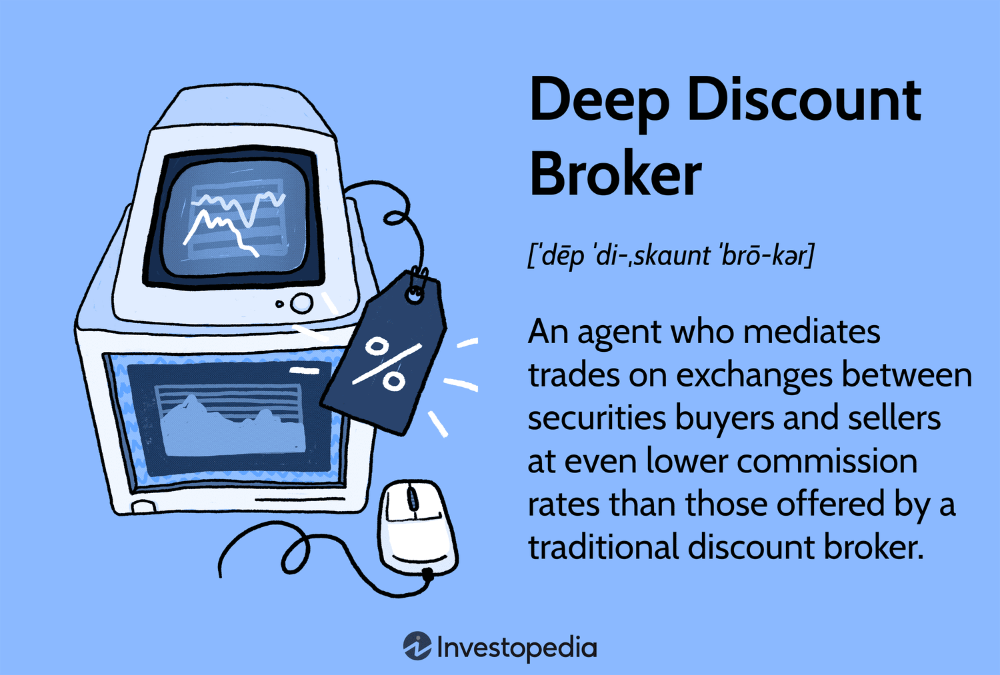

Stock trading has undergone a remarkable transformation driven by technological advancements, providing investors with innovative tools and platforms designed to optimize returns. The interactions between stock trading investments, discount brokers, and algorithmic trading have fostered new opportunities for both novice and experienced traders alike. This article seeks to elucidate how these elements can be integrated to offer a seamless trading experience, thus assisting investors in making more informed financial decisions.

Discount brokers have changed the landscape of trading by providing cost-effective and user-friendly platforms. They enable traders to execute trades efficiently without the significant fees traditionally associated with full-service brokers. The advent of algorithmic trading further complements this by allowing traders to automate strategies through computer algorithms that execute trades based on predefined criteria. This combination not only democratizes access to sophisticated trading mechanisms but also enhances the speed and accuracy of trade execution.



Choosing the right broker and effectively leveraging algorithmic trading are pivotal steps in navigating the modern investment environment. Understanding how to align these elements into a cohesive strategy can empower traders to maximize their investment outcomes while minimizing risks. As we navigate through these modern trading strategies, we aim to provide insights into their benefits and the thoughtful considerations necessary when integrating these approaches in the current investment landscape.

## Table of Contents

## Understanding Stock Trading Investment

Stock trading investment encompasses the activities of purchasing and selling shares of publicly traded companies with the dual objectives of capital appreciation and earning dividends. Engaging in stock investment can serve as a vehicle for wealth accumulation over time, but it requires a profound understanding of market dynamics and the foundational principles of finance.

A multitude of factors influence stock investments, including economic indicators, market trends, and the performance of individual companies. Economic indicators such as inflation rates, interest rates, and GDP growth can profoundly impact stock prices, as they affect the overall economic climate in which companies operate. Market trends, which can be influenced by broader economic cycles, investor sentiment, and technological advancements, also play a pivotal role in shaping the stock investment landscape.

When considering stock investments, understanding the types of stocks is essential for aligning portfolios with specific financial goals. Growth stocks, typically characterized by companies that exhibit above-average earnings growth, are sought after for their potential to deliver high capital appreciation. Value stocks, on the other hand, are perceived to trade at a lower price relative to their fundamentals, such as dividends, earnings, or sales, providing an opportunity for investors seeking assets that are undervalued by the market. Dividend stocks offer regular income through payments, appealing to investors prioritizing steady cash flow over high growth.

Educating oneself about stock trading fundamentals is crucial for investors aiming to minimize risks and maximize potential returns. This involves gaining familiarity with financial statements, understanding ratios such as price-to-earnings (P/E), return on equity (ROE), and debt-to-equity (D/E), and staying informed about industry-specific factors that might affect company performance. Adopting a disciplined approach to research and due diligence can aid investors in navigating the complexities of stock trading, ensuring informed decision-making that aligns with their investment objectives.

## Role of Discount Brokers in Stock Trading

Discount brokers have become pivotal in democratizing stock trading by offering lower commission rates and fees compared to traditional brokerage services. This reduction in cost has significantly increased trading accessibility for a broader audience, enabling more individuals to participate in the financial markets without the need for large initial capital outlays.

The core service offered by discount brokers is their online trading platforms, which empower investors to execute trades independently. These platforms eliminate the need for a full-service broker, thus reducing transaction costs. For instance, platforms allow users to buy and sell equities, options, and ETFs (Exchange-Traded Funds) efficiently. The affordability and accessibility of these services make discount brokers particularly attractive to novice traders and those with smaller portfolios.

Despite offering reduced fees, discount brokers do not compromise on the quality of tools and analytics provided to their clients. They often equip their platforms with a variety of research tools, real-time data, and technical analysis features. These resources are designed to help investors make informed decisions, analyze market trends, and track investment performance. Such tools are integral in developing data-driven trading strategies that can optimize investment outcomes.

One of the main advantages of utilizing a discount broker is the cost efficiency that it provides. Lower transaction costs mean that investors can retain a larger portion of their profits. Additionally, the speed of trade execution on these platforms is typically high, often matching or exceeding that of traditional brokers. The user-friendly interfaces offered by these platforms are engineered to simplify the trading process, allowing users of varying expertise to navigate and execute trades effectively.

When selecting a discount broker, it is essential to evaluate several factors to align with one's trading needs. Key considerations include the trading fees and commission structures, which can vary substantially between brokers. It's also crucial to assess the quality and range of resources available, such as educational materials, research reports, and charting tools. Furthermore, customer support is a critical component, especially for new traders who may require assistance as they acclimate to the trading environment.

In summary, discount brokers serve as a cost-effective and efficient gateway for investors to engage in stock trading. Their online platforms and array of analytical tools provide a robust framework for executing informed trades. Selecting the appropriate discount broker necessitates careful consideration of fees, resources, and support services, ensuring that the chosen platform meets the investor's specific needs and investment strategy.

 to Algorithmic Trading

Algorithmic trading, often referred to as algo trading, is a method of executing trades using complex algorithms that are designed to automatically make trading decisions based on predefined criteria. This type of trading leverages advanced computational techniques to monitor market conditions and execute orders at speeds far beyond human capacity.

Algorithms can process vast amounts of market data in real-time, identifying trading opportunities and capitalizing on small price discrepancies that exist within short time frames. The speed and precision of [algorithmic trading](/wiki/algorithmic-trading) offer several advantages, including enhanced accuracy in trade execution and the ability to achieve diversification across various assets and markets. This form of trading mitigates the impact of human errors and emotions, fostering a more disciplined and systematic investment approach.

An essential component of algorithmic trading is the ability to exploit minute price fluctuations, also known as high-frequency trading ([HFT](/wiki/high-frequency-trading-strategies)). These opportunities arise from imbalances in supply and demand and can be captured more effectively through the rapid execution of trades. The algorithms operate under a set of rules or conditions that dictate when and how trades should be initiated, modified, or closed, often without requiring any human intervention.

For those interested in embarking on algorithmic trading, having a solid understanding of programming and statistical analysis can be extremely beneficial. Languages such as Python or C++ are commonly used due to their robust libraries for financial data analysis and their efficiency in handling large computations. A simple Python example for calculating a moving average, often used in trading algorithms, could look like this:

```python
import pandas as pd

def moving_average(data, window_size):
    return data.rolling(window=window_size).mean()

# Example usage
price_data = pd.Series([100, 101, 102, 103, 104, 105, 106])
window_size = 3
ma = moving_average(price_data, window_size)
print(ma)
```

This example demonstrates a basic moving average calculation, a tool often used to smooth out price data and help identify trends. As traders develop their algorithms, the incorporation of more sophisticated mathematical models and statistical techniques becomes crucial to optimizing performance.

Overall, algorithmic trading represents a synergy of technology and finance, enabling traders to enhance their strategies with precision and efficiency. However, the implementation of these systems requires a careful understanding of both market dynamics and computational techniques to ensure successful deployment.

## Integration of Algo Trading with Discount Brokers

Many discount brokers now provide platforms that facilitate algorithmic trading, offering traders robust tools to refine and optimize their strategies. These platforms generally incorporate API access, which is pivotal for traders interested in developing and testing their trading algorithms in a live market setting. APIs, or Application Programming Interfaces, allow for seamless interaction between the trading software and the broker's services, enabling real-time market data access and trade execution. For example, a Python script utilizing an API to execute trades might look like this:

```python
import requests

# Sample function to place a trade
def place_trade(symbol, quantity, order_type):
    api_url = "https://api.broker.com/trade"
    headers = {"Authorization": "Bearer YOUR_API_TOKEN"}
    data = {
        "symbol": symbol,
        "quantity": quantity,
        "order_type": order_type
    }
    response = requests.post(api_url, headers=headers, json=data)
    return response.json()

# Placing a market order for 10 shares of a stock
result = place_trade("AAPL", 10, "market")
print(result)
```

The integration of algorithmic trading with discount brokers' platforms enables a smooth execution of strategies that can dynamically adjust to market changes, thereby improving investment results. This integration democratizes access to sophisticated trading approaches, which were once the exclusive domain of large financial institutions. Traders of all sizes can now leverage these advanced tools to potentially enhance their trading performance.

Understanding a broker's platform capabilities is crucial for traders before deploying any algorithms. Different platforms offer varying levels of API sophistication, latency, and reliability. These factors can significantly influence the effectiveness of a trading strategy, especially in high-frequency trading scenarios where milliseconds can impact profitability.

Additionally, traders should evaluate the support and educational resources provided by the broker regarding algorithmic trading. Many brokers offer comprehensive documentation and developmental tools, like sandboxes, for [backtesting](/wiki/backtesting) and simulating strategies without financial risk. Ensuring that a broker's platforms are robust and capable of handling technical issues is essential to prevent unintended trades and potential losses.

In conclusion, by aligning algorithmic capabilities with cost-effective and user-friendly discount brokerage services, traders can not only expand their strategic horizons but also enhance their market interactions. However, it's crucial to rigorously understand platform functionalities to fully capitalize on the benefits of this integration.

## Considerations and Risks

While trading innovations offer numerous advantages, investors must be aware of potential risks associated with algorithmic trading. One major [factor](/wiki/factor-investing) affecting algorithmic trading is market [volatility](/wiki/volatility-trading-strategies), which can significantly impact algorithmic performance. Algorithms designed to capitalize on minute price differences may suffer during periods of high volatility due to rapid price changes that exceed predicted ranges. This necessitates continual monitoring and adjustment of strategies to maintain effectiveness. For instance, traders might implement volatility filters, which allow algorithms to execute trades only when market conditions are stable.

Technical issues pose another risk. Platform outages or incorrect algorithm coding can lead to unintended trades and consequently, financial losses. A simple coding error, such as an incorrect order type or a logic flaw in the decision-making process, could result in significant disruptions. To mitigate such risks, rigorous testing, debugging, and continual review of algorithms are crucial for ensuring the reliability and accuracy of automated trade execution. Employing error-handling techniques such as try-except blocks in Python can help manage unexpected errors:

```python
try:
    execute_trade()
except Exception as e:
    log_error(e)
    halt_trading()
```

Understanding regulatory implications is vital when engaging in algorithmic trading through discount brokers. Adherence to regulations such as the European Union’s Markets in Financial Instruments Directive (MiFID II) or the U.S. Security and Exchange Commission's guidelines is essential. Compliance ensures not only legality but also protects investors from potential penalties. Traders should stay informed about the ever-evolving legal landscape, particularly concerning high-frequency trading and market manipulation.

A crucial step for traders is to perform thorough backtesting of strategies. Backtesting involves applying trading algorithms on historical data to evaluate their potential effectiveness. Proper backtesting can reveal strengths and weaknesses in a strategy, guiding necessary adjustments before real-world application. Consider the following Python code for a basic backtesting framework using historical stock data:

```python
import pandas as pd

def backtest_strategy(data, strategy):
    capital = 10000  # Starting capital
    for index, row in data.iterrows():
        decision = strategy(row)
        if decision == "buy":
            capital -= row['Close']
        elif decision == "sell":
            capital += row['Close']
    return capital

# Example strategy function
def simple_strategy(row):
    if row['MA50'] > row['MA200']:
        return "buy"
    else:
        return "sell"

# Historical data with simple moving averages
historical_data = pd.read_csv("historical_stock_data.csv")
final_capital = backtest_strategy(historical_data, simple_strategy)
print(f"Final Capital: ${final_capital}")
```

Lastly, effective use of risk management tools provided by discount brokers is advisable. Stop-loss orders, for example, automatically trigger a sale if a stock's price drops to a particular level, limiting potential losses. Diversity within a portfolio, by incorporating various asset classes or sectors, can further mitigate risks by reducing the impact of poor-performing investments. Overall, while algorithmic trading presents opportunities for enhanced trading strategies, a careful approach to managing the associated risks is essential for successful investment outcomes.

## Conclusion

The synergy between stock trading investments, discount brokers, and algorithmic trading is transforming modern investing into a more accessible, efficient, and strategic endeavor. By carefully selecting discount brokers, investors can benefit from low-cost, high-speed trading platforms equipped with robust analytical tools. These platforms often serve as a foundation for implementing algorithmic trading strategies, which can optimize investment outcomes through automated, data-driven decision-making.

As technological advances continue to reshape the trading landscape, adaptability and ongoing education have become crucial for investors. Staying updated with the latest developments in trading technologies and regulatory changes is essential for effective strategy formulation and risk management. Leveraging algorithmic trading requires a solid understanding of programming and statistical analysis, while also necessitating a cautious approach to mitigate potential risks such as market volatility and technical failures.

Despite the challenges, the integration of algorithms with discount broker platforms provides unprecedented opportunities for both novice and experienced traders. By understanding and navigating these elements, investors can make more informed decisions, potentially leading to improved profitability. The potential for growth in investment strategies is immense, provided that traders maintain a balanced awareness of the opportunities and inherent risks. This comprehensive understanding empowers traders, encouraging smarter and more profitable trading outcomes in this evolving financial landscape.

## References & Further Reading

[1]: Bergstra, J., Bardenet, R., Bengio, Y., & Kégl, B. (2011). ["Algorithms for Hyper-Parameter Optimization."](https://papers.nips.cc/paper/4443-algorithms-for-hyper-parameter-optimization) Advances in Neural Information Processing Systems 24.

[2]: ["Advances in Financial Machine Learning"](https://www.amazon.com/Advances-Financial-Machine-Learning-Marcos/dp/1119482089) by Marcos Lopez de Prado

[3]: ["Evidence-Based Technical Analysis: Applying the Scientific Method and Statistical Inference to Trading Signals"](https://www.amazon.com/Evidence-Based-Technical-Analysis-Scientific-Statistical/dp/0470008741) by David Aronson

[4]: ["Machine Learning for Algorithmic Trading"](https://github.com/stefan-jansen/machine-learning-for-trading) by Stefan Jansen

[5]: ["Quantitative Trading: How to Build Your Own Algorithmic Trading Business"](https://www.amazon.com/Quantitative-Trading-Build-Algorithmic-Business/dp/1119800064) by Ernest P. Chan