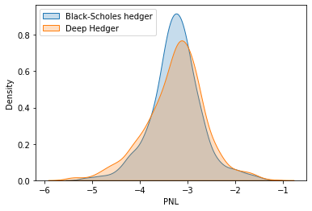

## Table of Contents

## What is deep hedging?

Deep hedging is a new way to manage financial risks using artificial intelligence, specifically a type of AI called deep learning. It's different from traditional methods because it can learn from past data and adapt to new situations. This makes it really useful for handling complex financial products like options, where the value can change a lot based on market conditions.

In traditional hedging, people use set formulas and models to reduce risk. But these models can be too simple and might not work well when the market changes unexpectedly. Deep hedging, on the other hand, uses AI to look at a lot of data and find patterns that humans might miss. This helps it make better decisions about when and how to hedge, which can save money and reduce risk more effectively.

## How does deep hedging differ from traditional hedging methods?

Deep hedging and traditional hedging are two different ways to manage financial risks. Traditional hedging uses set formulas and models to reduce risk. These models are based on assumptions about how markets work, and they don't change much over time. This can be a problem when the market behaves in unexpected ways, because the models might not be able to handle these surprises well.

On the other hand, deep hedging uses [artificial intelligence](/wiki/ai-artificial-intelligence), specifically [deep learning](/wiki/deep-learning), to manage risks. Instead of relying on fixed models, deep hedging can learn from past data and adapt to new situations. This makes it better at handling complex financial products like options, where the value can change a lot based on market conditions. By looking at a lot of data and finding patterns that humans might miss, deep hedging can make better decisions about when and how to hedge, which can save money and reduce risk more effectively.

In summary, the key difference between deep hedging and traditional hedging is their approach to risk management. Traditional hedging sticks to established models, while deep hedging uses AI to learn and adapt, making it more flexible and potentially more effective in today's complex financial markets.

## What are the key components of a deep hedging model?

A deep hedging model is made up of a few important parts that work together to manage financial risks. The first part is the [neural network](/wiki/neural-network), which is a type of AI that can learn from data. The neural network looks at past market data to find patterns and make predictions about future market movements. This helps the model decide when and how to buy or sell assets to reduce risk.

The second part is the training process, where the model learns from historical data. During training, the model tries different strategies and sees which ones work best to minimize risk and maximize returns. This process helps the model get better over time and adapt to new market conditions. The third part is the risk management strategy, which uses the predictions from the neural network to make decisions about hedging. This strategy can change based on what the model learns, making it more flexible than traditional methods.

Together, these components allow a deep hedging model to handle complex financial products and adapt to changing market conditions. By using AI to learn from data, the model can find better ways to manage risk than traditional models, which rely on fixed formulas and assumptions.

## What role does machine learning play in deep hedging?

Machine learning is the heart of deep hedging. It helps the model learn from past market data to make smart decisions about managing risk. By looking at lots of historical information, [machine learning](/wiki/machine-learning) can find patterns that humans might miss. This means the model can predict how the market might move next and decide the best time to buy or sell assets to protect against losses.

In deep hedging, machine learning makes the model flexible and able to adapt to new situations. Traditional hedging methods use fixed formulas that don't change, but machine learning lets the model keep learning and improving. This is really important in today's fast-changing financial markets, where old methods might not work well. By using machine learning, deep hedging can find better ways to manage risk and save money.

## Can you explain the basic architecture of a neural network used in deep hedging?

A neural network used in deep hedging is made up of layers of connected nodes, which are like tiny processors. It starts with an input layer where the model gets information about things like stock prices and other market data. This data then moves through hidden layers, where the neural network does its magic. Each node in these hidden layers looks at the data, does some calculations, and sends the results to the next layer. The more hidden layers there are, the "deeper" the network is, which is why it's called "deep" learning. Finally, the data reaches the output layer, which gives the model's prediction about what to do next, like whether to buy or sell assets.

The connections between the nodes have weights, which are like dials that the neural network adjusts during training. When the model is learning, it looks at past data and tries different strategies to see what works best. It then tweaks these weights to make better predictions in the future. This process of adjusting the weights is called backpropagation. By doing this over and over, the neural network gets better at understanding the patterns in the market data and making smart decisions about how to manage risk.

## What types of financial instruments are typically hedged using deep hedging techniques?

Deep hedging is often used to manage risks for complex financial instruments like options. Options give the buyer the right, but not the obligation, to buy or sell an asset at a certain price before a certain date. Their value can change a lot based on what's happening in the market, so they can be hard to manage with traditional methods. Deep hedging uses artificial intelligence to look at past data and find the best times to buy or sell options to reduce risk. This makes it easier to handle the ups and downs of the options market.

Another type of financial instrument that can be hedged using deep hedging is futures contracts. Futures are agreements to buy or sell an asset at a future date for a price set today. Like options, the value of futures can change a lot, which makes them tricky to manage. Deep hedging helps by using AI to learn from past market movements and make smart decisions about when to enter or [exit](/wiki/exit-strategy) futures contracts. This can help investors reduce their risk and protect their investments better.

## How does deep hedging handle market volatility and risk?

Deep hedging helps handle market [volatility](/wiki/volatility-trading-strategies) and risk by using artificial intelligence to learn from past market data. It looks at how the market has moved in the past and finds patterns that can help predict future movements. When the market is volatile and prices are changing a lot, deep hedging can quickly adapt to these changes. It does this by adjusting its strategies based on what it has learned, which helps reduce the risk of big losses.

For example, if the market is going up and down a lot, deep hedging can decide when to buy or sell assets to protect against these swings. It might choose to sell an asset when it thinks the price will go down, or buy more when it expects the price to go up. By making these smart decisions, deep hedging can help keep losses small and make the most of gains, even when the market is unpredictable.

## What are some common challenges faced when implementing deep hedging strategies?

One common challenge when implementing deep hedging strategies is getting enough good data to train the model. Deep hedging uses artificial intelligence to learn from past market movements, but if the data is not complete or is of low quality, the model might make bad predictions. This can lead to wrong decisions about when to buy or sell assets, which can increase risk instead of reducing it. Also, markets change over time, so the model needs to keep learning from new data to stay accurate.

Another challenge is that deep hedging models can be hard to understand and explain. Traditional hedging methods use clear formulas and models that people can easily follow. But deep hedging uses complex neural networks that work like a "black box," making it tough to see how the model makes its decisions. This can be a problem for financial companies that need to explain their strategies to regulators or investors. They might need to find ways to make the model's decisions more transparent and easier to understand.

## How can deep hedging be integrated into existing risk management systems?

Deep hedging can be added to existing risk management systems by connecting its AI models to the data and tools already in use. First, the deep hedging model needs to get data from the same places as the current system, like stock prices and market trends. Then, the model can use this data to make predictions and suggest actions, like when to buy or sell assets. The risk management team can then use these suggestions to make better decisions, working alongside the traditional methods they already use.

One way to do this smoothly is to set up the deep hedging model to work in the background, giving advice that the team can choose to follow or ignore. This way, the existing system keeps running as usual, but now it has the extra help of AI to handle complex situations better. Over time, as the team sees how well the deep hedging model works, they can trust it more and let it play a bigger role in their risk management strategy.

## What are the latest advancements in deep hedging research?

Recent research in deep hedging has focused on making the models better at handling different kinds of risks and market situations. One big advancement is the use of [reinforcement learning](/wiki/reinforcement-learning), which is a type of AI that learns by trying different actions and seeing what works best. This helps deep hedging models make smarter decisions over time, even when the market changes a lot. Researchers are also working on ways to make these models use less data and still give good results, which is important because good data can be hard to find.

Another area of progress is in making deep hedging models easier to understand. Since these models can be like a "black box," it's hard to see how they make decisions. New methods are being developed to explain the model's choices in a way that people can follow. This is really important for financial companies that need to explain their strategies to regulators or investors. By making the models more transparent, deep hedging can be used more widely and trusted more by those who use it.

## Can you discuss a case study where deep hedging significantly outperformed traditional methods?

A case study where deep hedging significantly outperformed traditional methods was conducted by a team of researchers from the University of Oxford and JP Morgan. They looked at how well deep hedging could manage the risks of trading options in the stock market. In this study, they compared deep hedging to a popular traditional method called Black-Scholes. They found that deep hedging made much better decisions about when to buy or sell options, which led to lower losses and higher profits. This was because deep hedging could learn from past data and adapt to changes in the market, while the Black-Scholes model used fixed formulas that didn't change.

In the study, the deep hedging model was trained on a large amount of historical data from the stock market. It learned to spot patterns and make predictions about future market movements. When the market got volatile and prices started swinging a lot, the deep hedging model quickly adjusted its strategy to protect against losses. On the other hand, the Black-Scholes model stuck to its old formulas and couldn't adapt well to the new market conditions. As a result, the deep hedging model ended up with much better results, showing that it could handle complex financial products like options much more effectively than traditional methods.

## What future trends might influence the development and application of deep hedging?

In the future, deep hedging might become even better because of new technology and more powerful computers. As computers get faster and can handle more data, deep hedging models can learn from bigger and more detailed sets of information. This could help them make even smarter decisions about managing risks. Also, as more people start using artificial intelligence in finance, there will be more research and new ideas that can make deep hedging even more effective. For example, new ways of using reinforcement learning could help deep hedging models adapt to changing markets even faster.

Another trend that could affect deep hedging is the need for more transparency and understanding. Right now, deep hedging models can be hard to explain because they use complex math and AI. But as regulators and investors want to know more about how these models work, researchers are working on ways to make them easier to understand. This could mean that deep hedging becomes more trusted and used more often in the future. Also, as financial markets keep getting more complex, deep hedging could become even more important for managing risks in new and creative ways.

## References & Further Reading

[1]: Ruf, J., & Wang, W. (2019). ["Neural networks for option pricing and hedging: a literature review."](https://arxiv.org/abs/1911.05620) arXiv preprint arXiv:1911.05620.

[2]: Buehler, H., Gonon, L., Teichmann, J., & Wood, B. (2019). ["Deep Hedging."](https://arxiv.org/abs/1802.03042) Quantitative Finance, 19(8), 1271-1291.

[3]: Lopez de Prado, M. (2018). ["Advances in Financial Machine Learning."](https://www.amazon.com/Advances-Financial-Machine-Learning-Marcos/dp/1119482089) John Wiley & Sons.

[4]: Goodfellow, I., Bengio, Y., & Courville, A. (2016). ["Deep Learning."](https://link.springer.com/article/10.1007/s10710-017-9314-z) MIT Press.

[5]: Jansen, S. (2020). ["Machine Learning for Algorithmic Trading: Predictive models to extract signals from market and alternative data for systematic trading strategies with Python."](https://www.amazon.com/Machine-Learning-Algorithmic-Trading-alternative/dp/1839217715) Packt Publishing.

[6]: Zhang, J., Zohren, S., & Roberts, S. J. (2020). ["Deep Reinforcement Learning for Trading."](https://arxiv.org/abs/1911.10107) The Journal of Financial Data Science.

[7]: Heaton, J. B., Polson, N. G., & Witte, J. H. S. (2017). ["Deep Learning for Finance: Deep Portfolios."](https://arxiv.org/abs/1602.06561) Applied Stochastic Models in Business and Industry, 33(1), 3-12.