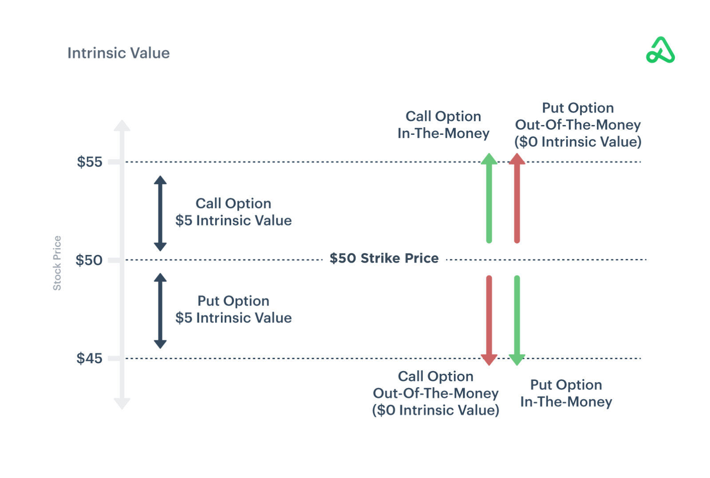

## Table of Contents

## What are deep in-the-money options?

Deep in-the-money options are a type of option contract where the strike price is far away from the current market price of the underlying asset. For a call option, this means the strike price is much lower than the current market price. For a put option, it means the strike price is much higher than the current market price. Because of this large difference, deep in-the-money options have a high intrinsic value and are more likely to be exercised before they expire.

These options are often used by investors who want to gain exposure to the underlying asset at a lower cost than buying the asset outright. Since deep in-the-money options have a high intrinsic value, their time value (the part of the option's price that comes from the possibility of the option increasing in value before it expires) is relatively small. This makes them less sensitive to changes in the underlying asset's price and less affected by time decay, which can be beneficial for certain investment strategies.

## How are deep in-the-money options different from at-the-money or out-of-the-money options?

Deep in-the-money options are different from at-the-money or out-of-the-money options because of how far their strike price is from the current market price of the asset. A deep in-the-money option has a strike price that is much lower than the market price for a call option, or much higher for a put option. This means the option already has a lot of value, even if the market price doesn't change. At-the-money options have a strike price that is very close to the current market price, so they have little to no intrinsic value but more potential to gain value if the market moves in the right direction. Out-of-the-money options have a strike price that is higher than the market price for a call, or lower for a put, so they have no intrinsic value and need the market to move significantly to become profitable.

The main difference in how these options behave is related to their value and sensitivity to market changes. Deep in-the-money options have a high intrinsic value and less time value, meaning they are less affected by the passage of time and small changes in the market price. This makes them more stable but with less potential for big gains if the market moves a lot. At-the-money options have a balance of intrinsic and time value, making them more sensitive to market movements and time decay. Out-of-the-money options have only time value, so they are the most sensitive to both market changes and time decay, offering the highest potential reward but also the highest risk of expiring worthless.

## What are the advantages of trading deep in-the-money options?

Trading deep in-the-money options can be a smart move for investors who want to save money. These options cost less than buying the actual stock because their strike price is far from the current market price. This means you can control the same number of shares for less money. For example, instead of spending $50 per share to buy a stock, you might be able to buy an option that lets you buy the stock at $30 per share, saving you money upfront.

Another advantage is that deep in-the-money options are less affected by time and small changes in the stock price. This is because most of their value comes from the difference between the strike price and the current market price, not from how much time is left until they expire. This makes them a safer choice if you think the stock price will stay the same or move slowly. You won't lose as much value if the stock price doesn't move much, and you can still make money if the stock price goes in the direction you expect.

## What are the risks associated with deep in-the-money options?

Trading deep in-the-money options can be risky. One risk is that even though these options are less sensitive to time and small price changes, they still lose value over time. This is called time decay. If the stock price doesn't move in your favor before the option expires, you could lose money. Also, deep in-the-money options cost more than out-of-the-money options, so you might have more money at risk.

Another risk is that deep in-the-money options might not give you as much profit as you hope. Since these options have a high intrinsic value, they don't gain as much value if the stock price moves a lot. If the stock price jumps up or down quickly, you might make more money by buying at-the-money or out-of-the-money options instead. So, if you're hoping for big profits from big moves in the stock price, deep in-the-money options might not be the best choice.

Lastly, liquidity can be a problem. Deep in-the-money options might not be traded as often as other options. This can make it hard to buy or sell them quickly, which can be a problem if you need to get out of a trade fast. If you can't find someone to buy your option, you might have to sell it for less than you want or wait longer than you planned.

## How can deep in-the-money options be used for hedging?

Deep in-the-money options can be a good way to protect your investments from big price drops. If you own a stock and you're worried it might go down in value, you can buy a deep in-the-money put option. This option gives you the right to sell your stock at a high price, even if the market price falls. Because the option is deep in-the-money, it costs less to buy than the stock itself, so you can protect your investment without spending too much money. If the stock price does drop, the put option will increase in value, helping to offset the loss in your stock.

Another way to use deep in-the-money options for hedging is if you want to keep your stock but are worried about a short-term drop in price. You can sell a deep in-the-money call option against your stock. This means you agree to sell your stock at a higher price if the option is exercised. The money you get from selling the call option can help cover any losses if the stock price goes down. Plus, since the option is deep in-the-money, you get more money upfront than you would from selling an at-the-money or out-of-the-money call option.

## What is the impact of time decay on deep in-the-money options?

Time decay, or theta, is the loss of value in an option as it gets closer to its expiration date. Deep in-the-money options are affected by time decay, but not as much as at-the-money or out-of-the-money options. This is because most of the value of a deep in-the-money option comes from its intrinsic value, which is the difference between the strike price and the current market price of the stock. Since this intrinsic value doesn't change much over time, deep in-the-money options lose less value as time goes by compared to other options.

However, deep in-the-money options still have some time value, which is the part of the option's price that comes from the possibility of the stock price moving in the future. This time value does decrease as the expiration date gets closer. So, even though deep in-the-money options are less affected by time decay than other options, they can still lose some value over time. If you're holding these options, it's important to keep an eye on how much time is left until they expire, because the closer you get to that date, the more impact time decay can have.

## How does the delta of deep in-the-money options affect their use in trading?

The delta of an option tells you how much the option's price will change when the stock price changes. For deep in-the-money options, the delta is close to 1 for call options and close to -1 for put options. This means that if the stock price goes up by $1, the price of a deep in-the-money call option will go up by almost $1 too. If the stock price goes down by $1, the price of a deep in-the-money put option will go up by almost $1. Because of this high delta, deep in-the-money options act a lot like the stock itself, but they cost less to buy.

Because deep in-the-money options have a high delta, they can be a good choice for traders who want to make money from small changes in the stock price. These options move a lot like the stock, so they can be used to make profits from small moves in the stock price without spending as much money as you would to buy the stock outright. However, if you're hoping for big profits from big moves in the stock price, deep in-the-money options might not be the best choice because they don't gain as much value as at-the-money or out-of-the-money options when the stock price moves a lot.

## Can deep in-the-money options be used effectively in a covered call strategy?

Yes, deep in-the-money options can be used effectively in a covered call strategy. In a covered call, you own the stock and sell call options against it. When you sell deep in-the-money call options, you get more money upfront than you would from selling at-the-money or out-of-the-money calls. This extra money can help cover any losses if the stock price goes down. Also, because deep in-the-money options have a high delta, they move a lot like the stock itself, so if the stock price stays the same or goes up a little, you can still make money from the option.

However, there are some things to think about when using deep in-the-money options in a covered call strategy. Since these options are deep in-the-money, they are more likely to be exercised by the buyer. This means you might have to sell your stock at the strike price if the option is exercised. If the stock price goes up a lot, you could miss out on some of the gains because you have to sell at the lower strike price. Also, because deep in-the-money options have less time value, they don't lose as much value over time, but they still can lose some, so you need to keep an eye on how much time is left until they expire.

## What are some advanced strategies involving deep in-the-money options?

One advanced strategy involving deep in-the-money options is called a synthetic stock position. In this strategy, you buy a deep in-the-money call option and sell a deep in-the-money put option with the same expiration date and strike price. This setup acts a lot like owning the stock itself because the high delta of the options makes their value move closely with the stock price. The big advantage here is that you can control the stock with less money upfront than buying the stock outright. This can be a good way to make money from small changes in the stock price without spending as much money.

Another strategy is called a collar. In a collar, you own the stock and want to protect it from big price drops. You buy a deep in-the-money put option to set a floor on how low the stock can go, and you sell a deep in-the-money call option to help pay for the put. The call option limits how much you can make if the stock price goes up a lot, but it gives you money upfront that can help cover any losses if the stock price goes down. This strategy is good if you want to keep your stock but are worried about a big drop in price.

A third strategy is using deep in-the-money options for income generation. You can sell deep in-the-money call options against stocks you own, just like in a covered call strategy, but you get more money upfront because the options are deep in-the-money. This extra money can be used as income or reinvested. However, you need to be ready to sell your stock at the strike price if the option is exercised, so this strategy works best if you're okay with selling your stock at that price.

## How do deep in-the-money options perform in different market conditions?

Deep in-the-money options can do well in a stable market where the stock price doesn't change much. Because these options have a high intrinsic value and a high delta, they move a lot like the stock itself. This means if the stock price stays the same or goes up a little, the option will keep most of its value. Also, since deep in-the-money options have less time value, they don't lose as much value over time as other options. So, if you think the stock price will stay steady, these options can be a good choice because they are less affected by time decay and small price changes.

In a market where the stock price moves a lot, deep in-the-money options might not be the best choice if you're hoping for big profits. These options don't gain as much value as at-the-money or out-of-the-money options when the stock price makes big moves. If the stock price goes up a lot, you might make more money by buying at-the-money or out-of-the-money call options. If the stock price goes down a lot, deep in-the-money put options can still help protect your investment, but they won't gain as much value as out-of-the-money put options. So, in a volatile market, deep in-the-money options can be good for protection but not as good for making big profits from big price moves.

## What are the tax implications of trading deep in-the-money options?

Trading deep in-the-money options can have different tax rules than trading stocks or other options. When you buy a deep in-the-money option and then sell it, any profit you make is usually taxed as a short-term or long-term capital gain, depending on how long you held the option. If you hold the option for less than a year, the profit is taxed at your regular income tax rate. If you hold it for more than a year, the profit is taxed at the lower long-term capital gains rate. But if you exercise a deep in-the-money option and then sell the stock you get, the tax rules can be different. The difference between the strike price and the market price when you exercise the option is taxed as ordinary income, and any profit you make when you sell the stock is taxed as a capital gain.

Another thing to think about is the wash sale rule. If you sell a deep in-the-money option at a loss and then buy the same or a similar option within 30 days, the loss might not be allowed for tax purposes right away. Instead, it gets added to the cost basis of the new option. This rule is meant to stop people from selling at a loss just to get a tax break and then buying the same thing back right away. So, if you're planning to trade deep in-the-money options, it's a good idea to talk to a tax professional to understand all the rules and how they might affect your taxes.

## How can one evaluate the suitability of deep in-the-money options for their investment portfolio?

To figure out if deep in-the-money options are right for your investment portfolio, you need to think about what you want to achieve with your investments. If you're looking to save money and still get a lot of control over a stock, deep in-the-money options can be a good choice. They cost less than buying the stock outright, so you can use less money to make the same kind of investment. Also, if you think the stock price will stay the same or move slowly, these options can be good because they don't lose as much value over time as other options. But if you're hoping to make big profits from big moves in the stock price, deep in-the-money options might not be the best fit because they don't gain as much value when the stock price changes a lot.

Another thing to consider is how much risk you're okay with. Deep in-the-money options can be less risky than other options because they are less affected by time and small price changes. But they still have some risk, like the chance that the stock price won't move in your favor before the option expires. Also, these options might not be traded as often, which can make it hard to buy or sell them quickly. So, if you need to get out of a trade fast, deep in-the-money options might not be the best choice. Talking to a financial advisor can help you understand if deep in-the-money options fit well with your overall investment goals and how much risk you're willing to take.

## What are the strategies for trading deep in-the-money options?

Crafting strategies around deep in-the-money (DITM) options involves capitalizing on their predictable price movements arising from substantial intrinsic value. The intrinsic value of an option is defined as:

$$
\text{Intrinsic Value} = \text{Current Price of Underlying Asset} - \text{Strike Price}
$$

for call options, and as:

$$
\text{Intrinsic Value} = \text{Strike Price} - \text{Current Price of Underlying Asset}
$$

for put options. DITM options typically exhibit high intrinsic value and therefore have a delta close to 1 for calls or -1 for puts. This implies that the option price moves almost in tandem with the price of the underlying asset, making them similar to holding the underlying asset itself.

One prevalent strategy involves using DITM options as a substitute for directly purchasing the underlying asset. This approach allows investors to exert control over a large [volume](/wiki/volume-trading-strategy) of assets with a smaller initial capital outlay. Consequently, the leverage provided by DITM options can magnify potential gains while keeping the investment expenditure manageable.

Another strategic approach incorporates DITM options within a delta-neutral portfolio. This method involves balancing the portfolio's overall delta to zero by combining options, futures, or other derivatives. A delta-neutral strategy allows traders to hedge against market downturns while simultaneously reaping benefits from price escalations in the underlying asset. By maintaining a neutral delta, traders can mitigate the risk associated with directional market movements, focusing instead on capturing profits through options premiums or volatility strategies.

Selling DITM options can also be strategically advantageous, especially in scenarios where traders seek a steady income through premium collection. In contrast to holding volatile assets, writing DITM options reduces exposure to sudden market shifts due to their intrinsic value. This approach is ideal for markets characterized by stable or moderate volatility, as traders can earn premium income while the probability of options being exercised remains low.

Real-world applications of DITM option strategies highlight their efficacy in various market conditions:

1. **Portfolio Leveraging**: An investor looking to gain exposure to a significant asset class, such as equities or commodities, might purchase DITM call options instead of the actual securities. This approach conserves capital while granting the investor leverage over the asset’s future performance.

2. **Market Neutral Hedging**: A trading firm may employ delta-neutral strategies using DITM puts to secure positions against downturns in specific industries. By offsetting the delta of bullish positions, the firm can protect its portfolio without liquidating profitable holdings.

3. **Income Generation**: In a stable equity market, an option trader might systematically write DITM call options on a portfolio of stocks. This practice generates consistent premium income, aiding in achieving target returns while hedging against unexpected price decays.

These strategies demonstrate how the unique characteristics of DITM options can be structurally advantageous when tailored to specific trading objectives. Emphasizing an understanding of intrinsic value and delta dynamics, traders can leverage DITM options to optimize portfolio performance, manage risks, and enhance potential returns.

## References & Further Reading

[1]: Bergstra, J., Bardenet, R., Bengio, Y., & Kégl, B. (2011). ["Algorithms for Hyper-Parameter Optimization."](https://dl.acm.org/doi/10.5555/2986459.2986743) Advances in Neural Information Processing Systems 24.

[2]: ["Advances in Financial Machine Learning"](https://www.amazon.com/Advances-Financial-Machine-Learning-Marcos/dp/1119482089) by Marcos Lopez de Prado

[3]: ["Evidence-Based Technical Analysis: Applying the Scientific Method and Statistical Inference to Trading Signals"](https://www.amazon.com/Evidence-Based-Technical-Analysis-Scientific-Statistical/dp/0470008741) by David Aronson

[4]: ["Machine Learning for Algorithmic Trading"](https://github.com/stefan-jansen/machine-learning-for-trading) by Stefan Jansen

[5]: ["Quantitative Trading: How to Build Your Own Algorithmic Trading Business"](https://www.amazon.com/Quantitative-Trading-Build-Algorithmic-Business/dp/1119800064) by Ernest P. Chan