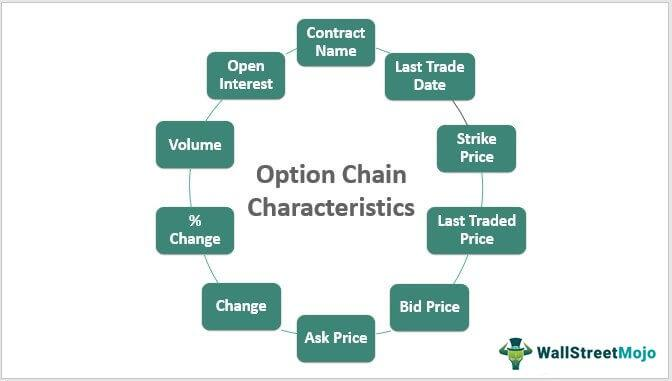

In the complex world of financial markets, derivatives trading offers a unique opportunity for investors to maximize profits and hedge risks. Among derivatives, options are particularly popular due to their flexibility and potential for high returns. Options provide investors with the right, but not the obligation, to buy or sell an underlying asset at a predetermined price before a specified expiration date. This feature grants them a strategic advantage in diverse market conditions, allowing for risk management and profit maximization.

This article explores deep in-the-money options as a subset of financial derivatives trading strategies. Deep in-the-money options have a significant intrinsic value, offering a closer alignment to the price movements of their underlying assets. This characteristic makes them particularly attractive for traders seeking to leverage market conditions while minimizing risk exposure. High intrinsic value means that these options provide nearly full sensitivity, represented by a high delta, to changes in the asset’s price movements.



In conjunction with deep in-the-money options, this article examines how algorithmic trading can enhance the efficiency and effectiveness of these strategies. Algorithmic trading employs computer programs to execute trades at speeds and frequencies beyond human capabilities. By using predefined criteria and monitoring market conditions, algorithmic trading systems optimize order execution and minimize market impact. This integration of technology in trading strategies can generate significant efficiencies, offering traders data-driven insights and the capacity for swift action.

Understanding and implementing derivative strategies require a blend of knowledge, skills, and technology. This article aims to provide insights into how traders can leverage these elements for successful trading. The focus will be on how deep in-the-money options can serve as a cornerstone for various trading strategies underpinned by algorithmic trading systems. This multidisciplinary approach is crucial, as it combines financial acumen, technical skill, and strategic planning to harness the full potential of derivatives trading.

Keyword-rich strategies, insights into automated trading systems, and practical examples will guide you through the intricacies of derivatives trading. With these tools, traders can navigate the complexities of the market more effectively, potentially achieving enhanced returns and optimized risk profiles. As financial markets continue to evolve, mastering the implementation of advanced option strategies and technology remains essential for long-term trading success.

## Table of Contents

## Understanding Financial Derivatives

Financial derivatives are intricate financial instruments that derive their value from an underlying asset or group of assets, such as stocks, bonds, commodities, or currencies. These derivatives play a pivotal role in financial markets as they provide investors with opportunities for both speculation and hedging, often enabling them to manage risk more effectively or increase leverage to maximize returns.

Derivatives come in various forms, with options being among the most prominent. Options are financial contracts that provide the purchaser with the right, but not the obligation, to buy or sell the underlying asset at a specified price, known as the strike price, before or at the contract's expiration date. There are two primary types of options: call options, which give the holder the right to purchase the asset, and put options, which confer the right to sell the asset. This characteristic of options allows investors to take positions based on their market outlook, offering flexibility in trading strategies.

One of the key attributes of financial derivatives is leverage. Leveraged instruments enable investors to gain exposure to substantial positions with a relatively small initial outlay, amplifying both potential gains and losses. For example, by purchasing options rather than the underlying asset itself, traders can control the same amount of the asset for a fraction of the cost, which can lead to significant returns if the market moves in their favor. However, it also means greater risk exposure if the market moves against the position.

The function and role of derivatives in financial markets are crucial for the deployment of effective trading strategies. They serve as vital tools for risk management, allowing investors and institutions to hedge against adverse price movements. For instance, a farmer might use derivatives to lock in a future price for crops to protect against potential decline. Similarly, an investor might use options to hedge against price [volatility](/wiki/volatility-trading-strategies) in a stock portfolio.

Understanding the market mechanisms and regulatory frameworks that govern derivatives trading is essential for effective participation in this market. Derivatives trading is subject to strict regulations designed to protect market participants and maintain market integrity. In the United States, for example, derivatives trading is regulated by entities such as the Commodity Futures Trading Commission (CFTC) and the Securities and Exchange Commission (SEC). These regulations ensure transparent pricing, mitigate systemic risk, and foster market confidence.

In conclusion, financial derivatives, with their ability to derive value from underlying assets, offer significant advantages in terms of leverage and risk management. Their importance in contemporary financial markets cannot be overstated, as they provide sophisticated avenues for both hedging and speculation, allowing market participants to tailor their investment strategies to their specific risk-reward profiles.

## What Are Deep In-The-Money Options?

Deep in-the-money (DITM) options represent a subset of financial derivatives distinguished by their strike prices, which are significantly below the prevailing market price for call options, or above it for put options. The defining feature of DITM options is their high intrinsic value, meaning the market price of the underlying asset greatly exceeds the strike price (for calls) or is significantly below it (for puts).

One of the critical attributes of DITM options is their nearly 100% delta. The delta ($\Delta$) of an option measures the sensitivity of the option's price to a $1 change in the price of the underlying asset. A delta of nearly 1 implies that the option price will move almost in tandem with the underlying asset's price changes. This feature makes DITM options behave similarly to the underlying asset, allowing traders to act on anticipated directional price movements with a high level of precision.

DITM options generally have lower extrinsic value compared to at-the-money or out-of-the-money options. Extrinsic value, also known as time value, represents the portion of an option's price that exceeds its intrinsic value. This is influenced by factors such as time to expiration and implied volatility. With DITM options, the reduced extrinsic value translates to lower sensitivity to time decay—a phenomenon where the option's price erodes as it approaches expiration, making DITM options ideal for long-term positions.

Another significant advantage of DITM options is their ability to minimize risk associated with market volatility. Due to their substantial intrinsic value and high delta, they are less impacted by fluctuations in volatility compared to options with lower intrinsic values. Moreover, the potential to exercise these options can lead to substantial profits if the market remains favorable, encompassing a strategic pathway for meaningful returns on investments.

Ultimately, a thorough understanding of DITM options, from their inherent properties such as intrinsic and extrinsic values to their real-world applications and potential advantages in managing market risks, is essential. Such an understanding offers traders a strategic edge, allowing them to capitalize on market dynamics while effectively managing exposure.

## Algorithmic Trading in Derivatives Markets

Algorithmic trading employs sophisticated computer programs and algorithms to facilitate and automate the trading process, allowing transactions to occur at speeds and volumes unattainable by human traders alone. This mechanical approach is particularly advantageous in the derivatives market, including the trading of deep in-the-money (DITM) options. These algorithms analyze vast amounts of market data, detect price patterns, and execute trades based on predetermined conditions, which can enhance order execution and diminish market impact.

In the context of derivatives trading, algorithms serve multiple functions that enhance trading effectiveness. First, they allow continuous market monitoring to identify price discrepancies and opportunities that align with a trader's strategic goals. For DITM options, this might involve assessing the delta— the sensitivity of an option's price to changes in the price of the underlying asset— and calibrating trades to align with market movements.

Algorithmic trading provides a significant advantage by fostering the creation of data-driven insights. By evaluating extensive market data swiftly, algorithms can exploit small market inefficiencies. In the case of DITM options, where intrinsic value is substantial and signifies a tight correlation with the underlying asset, algorithms can act decisively to capitalize on anticipated price trajectories.

The integration of [algorithmic trading](/wiki/algorithmic-trading) within DITM option strategies results in remarkable efficiencies. For instance, consider a scenario in which a trader uses Python to automate the execution of trades. This implementation may include libraries like `pandas` for data manipulation, `numpy` for numerical calculations, and `ta-lib` for technical analysis:

```python
import pandas as pd
import numpy as np
import talib

# Sample trading algorithm that identifies an entry point for DITM options
def detect_trading_opportunity(prices, threshold):
    # Calculate a simple moving average
    sma = talib.SMA(prices, timeperiod=5)
    # Find conditions where price exceeds a certain threshold over SMA for trade execution
    signals = prices > sma * threshold
    return signals

# Mock price data
price_data = pd.Series([...])  # Load actual price data here

# Identify trading signals
opportunity = detect_trading_opportunity(price_data, 1.02)
```

In this simplified example, the algorithm computes a short-term moving average to determine if the current market price exceeds a predefined threshold, suggesting a possible trade. By [backtesting](/wiki/backtesting) such models, traders can further refine their strategies to improve profitability and minimize risk.

Concurrently, algorithmic systems aid in reducing emotional biases that can impair trading decisions, as the execution is strictly guided by systematic rules. This impartiality is particularly beneficial in reactive markets, where swift decision-making is crucial.

Ultimately, algorithmic trading empowers traders to approach complex trading strategies in competitive environments effectively. By leveraging computational precision and speed, traders are better equipped to navigate the challenges inherent in the derivatives market, optimize execution, and capitalize on DITM options' unique opportunities.

## Strategies for Trading Deep In-The-Money Options

Crafting strategies around deep in-the-money (DITM) options involves capitalizing on their predictable price movements arising from substantial intrinsic value. The intrinsic value of an option is defined as:

$$
\text{Intrinsic Value} = \text{Current Price of Underlying Asset} - \text{Strike Price}
$$

for call options, and as:

$$
\text{Intrinsic Value} = \text{Strike Price} - \text{Current Price of Underlying Asset}
$$

for put options. DITM options typically exhibit high intrinsic value and therefore have a delta close to 1 for calls or -1 for puts. This implies that the option price moves almost in tandem with the price of the underlying asset, making them similar to holding the underlying asset itself.

One prevalent strategy involves using DITM options as a substitute for directly purchasing the underlying asset. This approach allows investors to exert control over a large [volume](/wiki/volume-trading-strategy) of assets with a smaller initial capital outlay. Consequently, the leverage provided by DITM options can magnify potential gains while keeping the investment expenditure manageable.

Another strategic approach incorporates DITM options within a delta-neutral portfolio. This method involves balancing the portfolio's overall delta to zero by combining options, futures, or other derivatives. A delta-neutral strategy allows traders to hedge against market downturns while simultaneously reaping benefits from price escalations in the underlying asset. By maintaining a neutral delta, traders can mitigate the risk associated with directional market movements, focusing instead on capturing profits through options premiums or volatility strategies.

Selling DITM options can also be strategically advantageous, especially in scenarios where traders seek a steady income through premium collection. In contrast to holding volatile assets, writing DITM options reduces exposure to sudden market shifts due to their intrinsic value. This approach is ideal for markets characterized by stable or moderate volatility, as traders can earn premium income while the probability of options being exercised remains low.

Real-world applications of DITM option strategies highlight their efficacy in various market conditions:

1. **Portfolio Leveraging**: An investor looking to gain exposure to a significant asset class, such as equities or commodities, might purchase DITM call options instead of the actual securities. This approach conserves capital while granting the investor leverage over the asset’s future performance.

2. **Market Neutral Hedging**: A trading firm may employ delta-neutral strategies using DITM puts to secure positions against downturns in specific industries. By offsetting the delta of bullish positions, the firm can protect its portfolio without liquidating profitable holdings.

3. **Income Generation**: In a stable equity market, an option trader might systematically write DITM call options on a portfolio of stocks. This practice generates consistent premium income, aiding in achieving target returns while hedging against unexpected price decays.

These strategies demonstrate how the unique characteristics of DITM options can be structurally advantageous when tailored to specific trading objectives. Emphasizing an understanding of intrinsic value and delta dynamics, traders can leverage DITM options to optimize portfolio performance, manage risks, and enhance potential returns.

## Managing Risks and Maximizing Profits

Deep in-the-money (DITM) options, while offering a potentially reduced risk profile compared to other options, still pose certain risks that traders must manage to maximize profitability effectively. One fundamental risk arises from time decay, or theta, which describes the loss of option value as it approaches its expiration date. While DITM options are less sensitive to time decay due to their high intrinsic value, this erosion can still affect profitability, especially if the position is improperly managed over longer durations. Furthermore, changes in implied volatility can impact option pricing and subsequent returns. A comprehensive understanding of the intrinsic and extrinsic components of DITM options is critical for determining optimal exercise or trading times.

Hedging is a vital strategy for managing the risks associated with DITM options. Techniques such as protective puts, where a trader purchases a put option to guard against a decline in the underlying asset's price, or collars, which combine the purchase of a put and the sale of a call, can help mitigate potential losses while capturing upside gains. These strategies are particularly useful in uncertain market conditions, providing a safety net while maintaining the flexibility to benefit from favorable market movements.

Incorporating algorithmic adjustments can further enhance risk management strategies when trading DITM options. Algorithms can swiftly react to market shifts, optimizing trade executions based on pre-set parameters and reducing human error. For example, an algorithm might be programmed to automatically execute a trade if the underlying asset's price reaches a certain threshold or if volatility exceeds a specific level, thereby securing profits or minimizing losses promptly.

To maximize profits sustainably with DITM options, a meticulous balance between risk and reward must be maintained. This involves continuously monitoring market conditions and adjusting strategies accordingly. It also entails understanding the options' delta, which measures the sensitivity of the option's price to changes in the price of the underlying asset. By using a delta-neutral approach, traders can minimize the impact of market fluctuations while potentially amplifying returns.

Balancing these factors is not only essential for risk mitigation but also for identifying the optimal moments to exercise or trade the options. Each decision must be informed by a comprehensive analysis of market trends, option pricing models, and potential future scenarios. By applying these strategies judiciously, traders can harness the benefits of DITM options, securing their position in a competitive and sometimes volatile financial landscape.

## Conclusion

Deep in-the-money (DITM) options offer a significant opportunity within the derivatives market by blending substantial intrinsic value with a favorable risk profile. This combination positions DITM options as particularly beneficial for traders seeking reliable instruments capable of capitalizing on market fluctuations. The high intrinsic value of these options ensures that they closely mimic the price movements of the underlying asset, effectively enhancing predictability and reducing uncertainty. This characteristic makes them appealing to both individual and institutional investors who prioritize risk mitigation.

The integration of algorithmic trading into trading strategies involving DITM options can further amplify trading efficiency and execution precision. Algorithms facilitate rapid decision-making and trade execution, unmatched by manual trading. This aspect provides a competitive advantage by enabling traders to capitalize on minute-by-minute market changes. Algorithmic systems, designed to process extensive datasets and execute orders based on predefined conditions, can efficiently manage the intricacies associated with DITM options, ensuring optimal entry and [exit](/wiki/exit-strategy) points in trades.

A comprehensive understanding of the fundamentals alongside the strategic application of advanced trading techniques with DITM options allows traders to mitigate risks effectively and enhance portfolio returns. By grasping the intrinsic and extrinsic components of DITM options, traders can make informed decisions to deploy strategies such as delta-neutral positioning or protective hedging, aimed at securing profits while minimizing exposure to downturns.

The insights provided in this discussion equip traders with essential information for achieving success in derivatives trading. DITM options, due to their blend of strong intrinsic value and manageable risks, serve as a robust vehicle toward this end. The prudent application of algorithmic trading technology, combined with sound risk management practices, sets the stage for sustainable, long-term success in the financial markets. By carefully navigating these elements, traders can optimize their trading outcomes and secure a favorable position within the competitive landscape of derivatives trading.

## References & Further Reading

[1]: Bergstra, J., Bardenet, R., Bengio, Y., & Kégl, B. (2011). ["Algorithms for Hyper-Parameter Optimization."](https://dl.acm.org/doi/10.5555/2986459.2986743) Advances in Neural Information Processing Systems 24.

[2]: ["Advances in Financial Machine Learning"](https://www.amazon.com/Advances-Financial-Machine-Learning-Marcos/dp/1119482089) by Marcos Lopez de Prado

[3]: ["Evidence-Based Technical Analysis: Applying the Scientific Method and Statistical Inference to Trading Signals"](https://www.amazon.com/Evidence-Based-Technical-Analysis-Scientific-Statistical/dp/0470008741) by David Aronson

[4]: ["Machine Learning for Algorithmic Trading"](https://github.com/stefan-jansen/machine-learning-for-trading) by Stefan Jansen

[5]: ["Quantitative Trading: How to Build Your Own Algorithmic Trading Business"](https://www.amazon.com/Quantitative-Trading-Build-Algorithmic-Business/dp/1119800064) by Ernest P. Chan