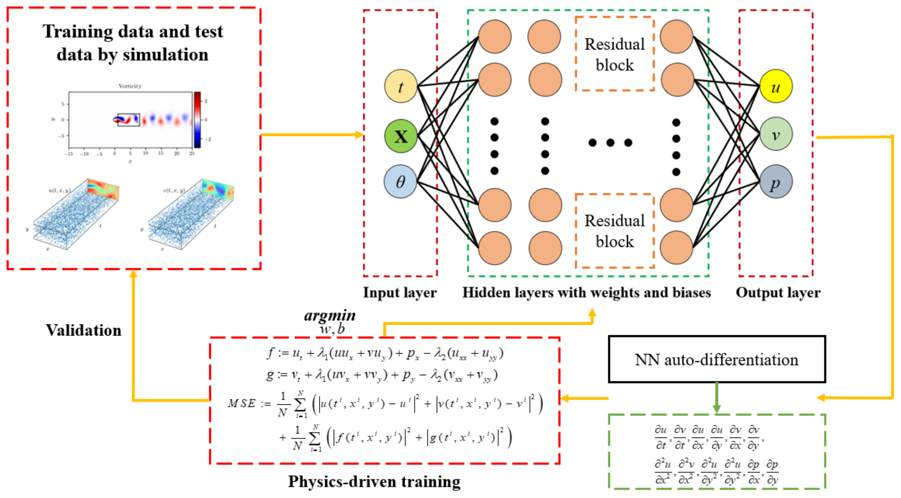

## Table of Contents

## What is deep learning and how does it relate to order flow?

Deep learning is a type of artificial intelligence that uses complex math and computer power to learn from lots of data. It's like how a baby learns to recognize things by seeing them many times. Deep learning can help computers understand pictures, sounds, and even predict what might happen next based on past information.

Order flow is all about tracking how people buy and sell things, like stocks or goods. It shows the number of orders coming in and how they change over time. By using deep learning, we can look at this order flow data and find patterns that are hard for humans to see. This can help businesses make better decisions about when to buy or sell, and how to price their products. So, deep learning helps make sense of the big, messy data from order flows, making it easier to use for smart choices.

## What is order flow and why is it important in financial markets?

Order flow is the record of all the buy and sell orders happening in a market. It shows how many people want to buy something and how many want to sell it, and at what prices. Imagine you're at a market and you see lots of people wanting to buy apples at a certain price, and fewer people wanting to sell them. That's order flow - it's like a snapshot of everyone's actions in the market at a given time.

Order flow is important in financial markets because it helps traders and investors understand what's happening right now and predict what might happen next. If there are more buy orders than sell orders, it might mean the price of a stock or a commodity will go up soon. By watching the order flow, people can make better decisions about when to buy or sell, helping them make money or avoid losses. It's like having a secret tool that lets you peek into the market's next move.

## How can deep learning models be used to analyze order flow data?

Deep learning models can look at big piles of order flow data and find patterns that are hard for people to see. These models are good at figuring out what's important in the data, like how many buy and sell orders there are, and at what prices. They can learn from past order flow to predict what might happen next in the market. For example, if the model sees a lot of buy orders coming in quickly, it might guess that the price of a stock will go up soon.

By using deep learning, traders can make better guesses about the market. The models can help them decide when to buy or sell, and at what price. This can be really helpful in fast-moving markets where things change quickly. Deep learning can also help spot strange patterns or sudden changes in order flow that might mean something big is happening. So, by using these smart models, people in the financial world can make smarter choices and maybe make more money.

## What are the basic components of a deep learning model for order flow analysis?

A deep learning model for order flow analysis has a few important parts that work together to understand and predict market movements. The first part is the input layer, which takes in all the order flow data, like the number of buy and sell orders, and the prices they're at. This data goes through several hidden layers, where the model does its math to find patterns and connections. These hidden layers are like a team of detectives, each looking at different parts of the data to figure out what's going on.

The second part is the output layer, which gives us the model's predictions or decisions based on what it learned from the data. For example, it might tell us if the price of a stock is likely to go up or down. To make sure the model keeps getting better, we use something called a loss function, which checks how wrong the model's predictions are. Then, we use an optimizer to tweak the model's settings, making it learn from its mistakes and get better over time. This whole process helps the model become really good at understanding and predicting order flow in financial markets.

## What types of neural networks are commonly used for order flow prediction?

For order flow prediction, two types of neural networks are often used: Recurrent Neural Networks (RNNs) and Convolutional Neural Networks (CNNs). RNNs are good at understanding sequences of data, which is perfect for order flow because it's all about how orders come in one after another. They can remember what happened before and use that to predict what might happen next. This makes them useful for figuring out trends and patterns in the flow of buy and sell orders.

CNNs, on the other hand, are great at spotting patterns in data, even if it's messy or complex. They're often used in image recognition, but they can also be used for order flow by treating the data like a picture. CNNs can look at different parts of the order flow data at the same time and find important features that might affect prices. Sometimes, people even mix RNNs and CNNs together to get the best of both worlds, making the predictions even better.

## How do you preprocess order flow data for deep learning applications?

Preprocessing order flow data for deep learning is like getting your ingredients ready before cooking. You need to clean the data first, which means getting rid of any mistakes or missing pieces. Imagine you're sorting through a big pile of papers; you'd want to throw away the ones that are torn or have nothing written on them. You also need to make sure all the numbers are in the same format, so the computer can understand them easily. This might mean changing how dates or times are written, or making sure prices are all in the same unit.

After cleaning, you organize the data into a shape that the deep learning model can use. This often means putting the data into a table or a sequence, so the model can see how orders change over time. You might also need to add more information, like what time of day it is or what day of the week, because these things can affect how people buy and sell. Once everything is ready, you split the data into two parts: one part to teach the model, and another part to test if it learned well. This way, you can make sure your model is good at understanding and predicting order flow.

## What are some common challenges in applying deep learning to order flow?

One big challenge in using deep learning for order flow is dealing with a lot of data that changes quickly. In financial markets, orders come in fast, and the data can be messy with errors or missing parts. Deep learning models need a lot of clean data to learn well, so it can be hard to get the data ready in time. Also, the market can change suddenly because of news or other events, which makes it tricky for the model to keep up and predict what will happen next.

Another challenge is making sure the model works well in real life. Sometimes, a model might look good when it's learning, but it doesn't do as well when it's actually used in the market. This is because the market can be different from what the model was taught with. Traders also need to be careful not to rely too much on the model's guesses, because the market can be unpredictable. So, they need to keep watching and adjusting the model to make sure it stays helpful.

## How can deep learning improve the accuracy of order flow predictions?

Deep learning can make order flow predictions more accurate by finding patterns in big piles of data that people might miss. It's like having a super smart friend who can look at lots of information and see what's important. Deep learning models can learn from past order flows to guess what might happen next in the market. For example, if there are a lot of buy orders coming in quickly, the model might predict that the price of a stock will go up soon. By understanding these patterns, deep learning helps traders make better choices about when to buy or sell.

But deep learning isn't perfect. It needs a lot of clean data to work well, and the fast-changing nature of financial markets can make it hard to keep up. Sometimes, a model might seem good when it's learning, but it doesn't do as well in real life because the market can be different from what it was taught. Traders need to keep watching and tweaking the model to make sure it stays helpful. Even with these challenges, deep learning can still make predictions more accurate by spotting trends and patterns that are hard to see otherwise.

## What advanced techniques can be used to enhance deep learning models for order flow?

To make deep learning models better at understanding order flow, we can use a technique called transfer learning. This is like teaching the model on one set of data, and then using what it learned to help it understand a different but related set of data. For example, if the model learns about order flow in the stock market, it can use that knowledge to predict order flow in the bond market. This can save time and make the model smarter because it doesn't have to start from scratch with each new type of data.

Another way to improve deep learning models is by using ensemble methods. This means combining the predictions from several different models to make one final guess. It's like getting advice from a group of experts instead of just one. If one model misses something, another model might catch it, making the overall prediction more accurate. By using these advanced techniques, deep learning can become even better at predicting what will happen next in the market, helping traders make smarter decisions.

## How do you evaluate the performance of a deep learning model in predicting order flow?

To see how well a deep learning model predicts order flow, you need to look at a few things. First, you check how accurate the model's predictions are by comparing them to what really happened in the market. You can use numbers like the mean absolute error (MAE) or root mean square error (RMSE) to see how far off the predictions are. If these numbers are small, it means the model is doing a good job. You also look at how often the model gets the direction of the price movement right, like if it says the price will go up and it does. This is called the directional accuracy, and it's important for traders who want to know if they should buy or sell.

Another way to evaluate the model is by testing it on new data that it hasn't seen before. This is called out-of-sample testing, and it helps you see if the model can still predict well in real life, not just on the data it was trained on. You can also use something called backtesting, where you pretend to trade based on the model's predictions and see how much money you would make or lose. If the model helps you make more money than you lose, it's a good sign. By looking at all these things, you can tell if the deep learning model is really helping you predict order flow better.

## Can you provide examples of successful implementations of deep learning in order flow analysis?

One successful example of deep learning in order flow analysis is used by a big bank. They created a model that looks at lots of order flow data from the stock market. The model can find patterns that are hard for people to see, like when lots of people suddenly want to buy a stock. By using this model, the bank can predict if the price of a stock will go up or down, and they can make better choices about when to buy or sell. This has helped the bank make more money and avoid big losses.

Another example is from a trading company that uses deep learning to look at order flow in the foreign exchange market. They built a model that can understand how orders for different currencies come in and change over time. The model helps them see when the demand for a currency is going up or down, so they can trade at the right time. This has made their trading more accurate and profitable. By using deep learning, the company can make smarter decisions and stay ahead in the fast-moving world of currency trading.

## What future developments can we expect in the field of deep learning applied to order flow?

In the future, we can expect deep learning models to get even better at understanding order flow. One big change might be the use of more advanced types of neural networks, like those that can learn from even bigger piles of data and find more complex patterns. These models could also get better at figuring out what's important in the data and what's not, making their predictions more accurate. Another thing that could happen is the use of more real-time data. This means the models could look at what's happening in the market right now and make quick predictions, helping traders make faster decisions.

We might also see deep learning models being used together with other types of AI, like reinforcement learning. This is a way of teaching machines to make decisions by trying different things and learning from the results. By combining deep learning with reinforcement learning, the models could not only predict what will happen next but also suggest the best actions to take. This could make trading even smarter and more profitable. Overall, as deep learning keeps getting better, it will help traders understand and predict order flow better than ever before.

## References & Further Reading

[1]: Zhang, J., Zohren, S., & Roberts, S. (2019). ["Deep learning for event-driven stock prediction."](https://arxiv.org/abs/1808.03668) arXiv preprint arXiv:1911.09507.

[2]: Dixon, M. F., Halperin, I., & Bilokon, P. (2020). ["Machine Learning in Finance: From Theory to Practice."](https://link.springer.com/book/10.1007/978-3-030-41068-1) Springer.

[3]: Lopez de Prado, M. (2018). ["Advances in Financial Machine Learning."](https://books.google.com/books/about/Advances_in_Financial_Machine_Learning.html?id=oU9KDwAAQBAJ) John Wiley & Sons.

[4]: Goodfellow, I., Bengio, Y., & Courville, A. (2016). ["Deep Learning."](https://link.springer.com/article/10.1007/s10710-017-9314-z) MIT Press.

[5]: Jansen, S. (2020). ["Machine Learning for Algorithmic Trading."](https://github.com/stefan-jansen/machine-learning-for-trading) Packt Publishing.

[6]: Hochreiter, S., & Schmidhuber, J. (1997). ["Long Short-Term Memory."](https://dl.acm.org/doi/10.1162/neco.1997.9.8.1735) Neural Computation, 9(8), 1735-1780.

[7]: Vaswani, A., Shazeer, N., Parmar, N., Uszkoreit, J., Jones, L., Gomez, A. N., ... & Polosukhin, I. (2017). ["Attention is All You Need."](https://arxiv.org/abs/1706.03762) Advances in Neural Information Processing Systems 30.

[8]: Chan, E. (2013). ["Algorithmic Trading: Winning Strategies and Their Rationale."](https://github.com/leoncuhk/awesome-quant-ai) John Wiley & Sons.

[9]: Kingma, D. P., & Ba, J. (2014). ["Adam: A Method for Stochastic Optimization."](https://arxiv.org/abs/1412.6980) arXiv preprint arXiv:1412.6980.